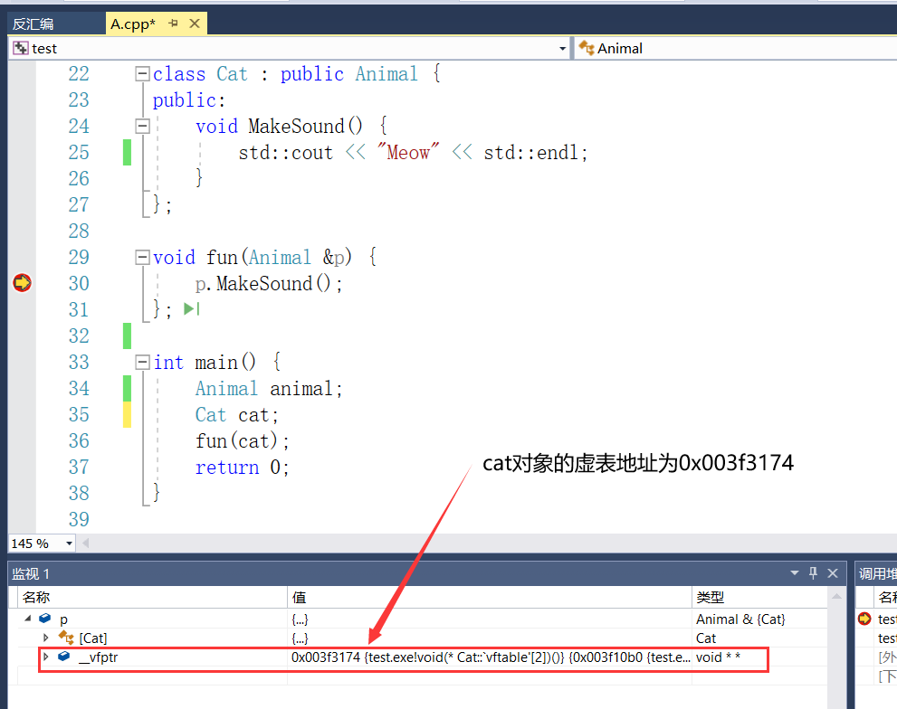
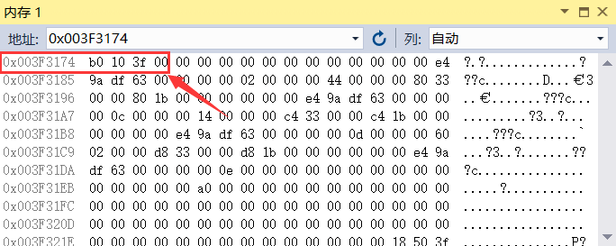
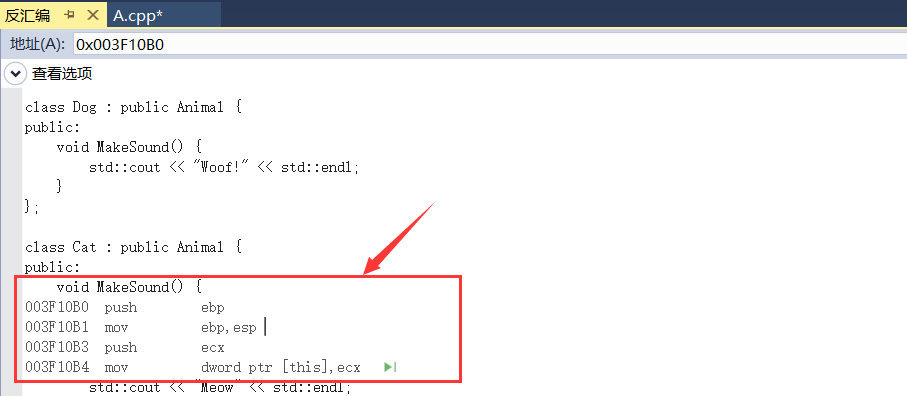
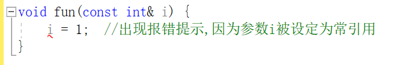

# 前言

## C++和C语言的区别

C++是C语言的超集，它在C语言的基础上新增了许多面向对象编程的特性，如类、对象、继承、多态等。因此，C++语言比C语言更加灵活、强大。另外，C++还支持模板、异常处理、名字空间等功能。总之，C++语言是C语言的增强版，具有更多的高级特性和编程工具


## 堆与栈

### 两者的区别

栈是一种后进先出(LIFO)的内存结构，它分配的内存是连续的，在程序执行的时候自动分配和释放。栈上的内存是临时的，随着函数的结束而释放

堆是一种任意分配内存的方法，可以在程序运行期间随时分配和释放内存。程序员必须手动管理堆上的内存，因为它不会在函数结束时自动释放

一般而言，栈内存用于存储局部变量和函数调用过程，而堆内存用于动态分配内存，即在程序运行时不知道其大小的对象


### 在堆中创建对象

使用 `new` 运算符在堆内存中动态分配内存并创建对象，创建的对象生存期由程序员显式控制, 需要使用`delete`删除对象来释放内存

```c++
#include <stdio.h>

class Object {

public:
	void fun() {
		printf("hello world");
	}
};


int main() {
	Object *obj = new Object;
	obj->fun(); //输出:hello world
	delete obj;
}
```


### 在栈中创建对象

在栈中创建对象, 对象生存周期结束后会自动释放内存, 创建格式为`类名 对象名`

```c++
#include <stdio.h>

class Object {

public:
	void fun() {
		printf("hello world");
	}
};

int main() {
	Object obj;
	obj.fun();
}
```


# 类的定义

类是面向对象编程中一个抽象的概念，表示一组相关的数据和函数

类的定义以关键字 `class` 开头，后面紧跟着类的名称。

类的定义包含两个部分：公共部分和私有部分。公共部分以 `public` 关键字开头，私有部分以 `private` 关键字开头。公共部分包含了类的成员函数，私有部分包含了类的成员变量(若成员变量写在public之外,也会被当成私有部分)

```c++
class ClassName {
   public:
      // 声明成员函数
      return_type function_name(arguments);
      ...

   private:
      // 声明成员变量
      data_type variable_name;
      ...
};

```


# 类的特殊函数

## 构造函数

### 定义

构造函数是C++中特殊的函数，用于在创建对象时初始化对象的成员变量， ==它与类同名，并且不能有返回值==

类可以具有多个构造函数(如有参的和无参的)，因此可以根据需要创建不同形式的对象。


### 使用示例

在下述的例子中，我们定义了两个构造函数：默认构造函数和带参数的构造函数。当使用默认构造函数创建对象时，width和height的值将被初始化为0。当使用带参数的构造函数创建对象时，width和height的值将被初始化为相应的参数值

```c++
class Rectangle {
   int width, height;
public:
   Rectangle() {
      width = 0;
      height = 0;
   }
   Rectangle(int w, int h) {
      width = w;
      height = h;
   }
};
```


## 析构函数

### 定义

析构函数是C++中的一种特殊类型的函数，用于在销毁类对象时进行清理工作。

它具有与类名相同的名称，但是以一个波浪符（ ~ ）作为前缀。

析构函数不需要返回值，也不能带有任何参数


### 使用实例

如下代码所示，当一个矩形对象的生命周期结束时，它的析构函数将被自动调用。这通常是用于释放动态分配的内存或其他资源，以防止内存泄漏

```c++
class Rectangle {
   int width, height;
public:
   ...
   ~Rectangle() {
      // Clean up code
   }
};
```


## 运算符重载

### 定义

运算符重载是指在 C++ 中，可以自定义运算符的行为, 运算符重载可以通过重载运算符的函数实现


### 使用实例

下述代码实现了一个 Object 类的运算符重载，其中重载了 `>` 运算符。

在类中通过定义一个名为 `operator>` 的函数并且返回值为 bool 类型，重载了 `>` 运算符。该函数比较 Object 类的两个对象的属性 a 和 b 的值，如果两个值都大于另一个对象的属性 a 和 b 的值，则返回 true

```c++
#include <iostream>

class Object {
private:
	int a;
	int b;
public:
	Object(int a,int b){
		this->a = a;
		this->b = b;
	}

	bool operator>(Object &obj) {
		return this->a > obj.a && this->b > obj.b;
	}
};

void main() {	
	Object objA(1, 2), objB(3, 4);
	if (objB>objA)
	{
		printf("true");
	}
}
```


## 拷贝构造函数

### 对象拷贝

对象拷贝是指在C++中，把一个对象的内容复制到另一个对象中。

对象拷贝的两种方式为使用拷贝构造函数和使用赋值运算符

它可以使用编译器提供的默认拷贝构造函数或自定义拷贝构造函数来实现


### 深拷贝和浅拷贝

- **深拷贝**：指在复制一个对象时，不仅复制其值，还复制其所引用的对象。因此，新的对象与原始对象具有完全独立的内存空间，不会互相影响。
- **浅拷贝**：指在复制一个对象时，仅复制其值，不复制其所引用的对象。因此，新的对象与原始对象共享内存空间，一个对象的更改会影响到另一个对象

浅拷贝在拷贝数据成员时只复制了指针，并没有创建新的内存空间。当数据成员中有指针时，简单的浅拷贝容易导致两个类指向同一个地址，从而影响到其他类的值。因此，在有指针成员的情况下，需要重载拷贝构造函数以进行深拷贝


### 使用实例

下述是浅拷贝的代码, 此处并没有用到拷贝构造函数, 而是用到赋值运算符`=`来实现对象拷贝, 其效果和拷贝构造函数几乎一样

```c++
#include <iostream>
#include <string>

class Person {
public:
  Person(std::string name, int age) : name(name), age(age) {}
  std::string name;
  int age;
};

int main() {
  Person person1("John", 30);
  Person person2 = person1; // 浅拷贝，person2与person1指向同一内存地址

  person2.name = "Jane";
  person2.age = 32;

  std::cout << "person1: " << person1.name << ", " << person1.age << std::endl;
  std::cout << "person2: " << person2.name << ", " << person2.age << std::endl;
  return 0;
}

/*
输出结果如下所示：
person1: John, 30
person2: Jane, 32
*/
```


下述是深拷贝的代码, 使用了拷贝构造函数

```C++
#include <iostream>
#include <string>

// 定义一个Person类
class Person {

public:
	std::string *name; // 声明一个指向std::string类型的指针变量，用于存储人的名字
	int age; // 声明一个int变量，用于存储人的年龄

	// 构造函数，用于创建一个Person对象
	Person(std::string name, int age) {
		this->age = age; // 将参数age赋值给类的成员变量age
		this->name = new std::string(name); // 为类的成员变量name分配动态内存，并将参数name存储到该内存中
	}

	// 析构函数，用于释放Person对象占用的动态内存
	~Person() { delete name; }

	// 拷贝构造函数，用于复制一个Person对象
	Person(const Person &person) {
		this->name = new std::string(*person.name); // 为类的成员变量name分配动态内存，并将被复制对象的名字复制到该内存中
		this->age = person.age; // 将被复制对象的年龄赋值给类的成员变量age
	}
};

int main() {
	Person person1("John", 30); // 创建一个Person对象person1，名字为John，年龄为30
	Person person2(person1); // 通过拷贝构造函数创建一个与person1相同的Person对象person2，这是一个深拷贝，person2与person1指向不同内存地址

	person2.name = new std::string("Jane"); // 将person2的名字改为Jane
	person2.age = 32; // 将person2的年龄改为32

	std::cout << "person1: " << *person1.name << ", " << person1.age << std::endl;
	std::cout << "person2: " << *person2.name << ", " << person2.age << std::endl;
	return 0;
}
/*
输出结果如下所示：
person1: John, 30
person2: Jane, 32
*/
```


**在上述深拷贝的的代码中, 我思考过一个问题, 为何不能将`this->name = new std::string(name)`替换成`this->name = &name;`?**

这里的问题在于，你将指针指向了一个临时变量(参数 `name`)，当函数执行完成之后，临时变量会被析构，此时你的指针仍然指向了一个不存在的内存地址，这是一种不安全的做法，可能会导致程序奔溃。

另一方面，使用 `new` 分配内存并存储字符串，能够保证 `name` 存储的字符串不会在函数结束后丢失，同时也能确保你的程序更安全


# 类的继承

## 什么是继承

继承是面向对象编程中一个重要的概念，它允许你创建一个新的类，该类继承了另一个现有的类的所有属性和方法，子类可称为派生类, 父类可称为基类

继承的语法如下所示, 其中`derived_class`是子类的名称, `base_class`是父类的名称, `access_specifier` 是访问控制符。

```C++
class derived_class : access_specifier base_class {
   ...
};
```


## 访问控制符

在继承的过程中，还需要了解基类成员的可访问性，即通过 `public`、`private` 或 `protected` 访问控制符来实现

- `public`：公有成员可以在任何地方访问。
- `private`：私有成员仅在类内部可以访问。
- `protected`：受保护的成员在类内部和子类内部可以访问，但在类外部不能访问


## 继承的两种方式

在 C++ 中，默认继承是以 `private` 继承方式进行的， `private` 继承和 `public` 继承是 C++ 中继承主要的两种方式

`private` 继承以 `private` 方式继承父类，父类的 `public` 成员在子类中变成 `private` 成员

`public` 继承以 `public` 方式继承父类，父类的 `public` 成员在子类中仍为 `public` 成员

如下代码所示, 类C继承了类A和类B的所有成员

```c++
class A {

public:
	int var1=1;	
};

class B:public A {

public:
	int var2=2;	
};

class C:public B {

public:
	int var3=3;
};

int main() {
	C c;
	printf("var1=%d,var2=%d,var3=%d", c.var1, c.var2, c.var2);
}
```


## 继承重载

继承重载是C++中面向对象编程的一种常见技巧，可以使用它扩展和修改父类中的函数行为

若你创建了一个子类对象, 子类的方法名和父类的方法名是一样的, 但是你想调用父类的方法, 可以通过`子类对象.父类名字::函数`来调用

```c++
#include <stdio.h>

class A {
public:
	int age;
	void fun() {
		printf("这是父类");
	}
};

class B:public A {
public:
	void fun() {
		printf("这是子类");
	}
};

int main() {
	A a;
	a.fun(); //输出:这是父类

	B b;
	b.fun(); //输出:这是子类
	b.A::fun(); //输出:这是父类
}
```


## 类的多继承

多继承是指一个类可以同时从多个基类继承，也就是说一个类可以具有多个父类的属性和方法,但是多重继承增加了程序的复杂度,一般情况不推荐使用

如下代码所示, 类C同时继承了类A和类B

```C++
#include <stdio.h>

class A {

public:
	int var1=1;	
};

class B {

public:
	int var2=2;	
};

class C :public A,public B {

public:
	int var3=3;
};

int main() {
	C c;
	printf("var1=%d,var2=%d,var3=%d", c.var1, c.var2, c.var2);
}
```


## 调用父类构造函数

若父类有构造函数，那么创建子类对象时会默认调用父类无参的构造函数

若父类没有无参的构造函数, 子类又没有显示调用父类的有参构造函数, 那么程序则会报错, 所以说在父类写无参构造函数是一个好习惯

```c++
#include <stdio.h>

class ObjectA {
	int age;
public:
	ObjectA() {
		printf("无参构造函数");
	}

	ObjectA(int age) {
		this->age = age;
	}
};


class ObjectB:public ObjectA {
	int time;
public:
	ObjectB(int time){
		this->time = time;
	}
	void PrintFun() {
		printf("%d", time);
	}

};

int main() {
	ObjectB objB(1);  //调用父类的无参构造函数
}
```


若想调用父类有参的构造函数, 可通过显示调用父类的有参构造函数, 可在子类构造函数使用冒号 `: `来初始化父类的有参构造函数

```C++
#include <stdio.h>

class ObjectA {
	int age;
public:
	ObjectA() {
		printf("无参构造函数");
	}

	ObjectA(int age) {
		printf("有参构造函数");
		this->age = age;
	}
};


class ObjectB:public ObjectA {
	int time;
public:
	ObjectB(int time,int age):ObjectA(age){
		this->time = time;
	}
	void PrintFun() {
		printf("%d", time);
	}

};

int main() {
	ObjectB objB(1,2);  //调用父类的有参构造函数
}
```


# 多态

## 什么是多态

多态是面向对象编程的重要特性，指一个类的多种形态，即同一种操作作用于不同的对象，可以有不同的解释和不同的结果。它使得程序更具通用性和可维护性。

多态指的是在程序运行时，父类的指针或者引用可以指向子类的对象，因此它可以具有多种形态，在代码实现中，通过使用虚函数可以实现多态，这样在调用函数时，编译器会根据指针或引用所指向的对象的实际类型，来决定调用哪个函数。


## 虚函数和纯虚函数

虚函数的目的是提供一个统一的接口, 用于被继承的子类重载, 以多态的形式被调用, 虚函数的定义方式是在函数的声明前加上关键字 `virtual`

若基类中的函数没有任何的实现意义, 那么可以定义成纯虚函数, 纯虚函数的定义方式为`virtual 返回类型 函数名(参数) = 0;`

含有纯虚函数的类被称为抽象类, 此类不能被创建, 子类若继承了含有纯虚函数的类, 则必须实现纯虚函数, 否则编译器会报错

虚函数是一个有实现的接口，而纯虚函数是一个没有实现的接口，子类必须实现它


## 多态实例

在下述代码中，我们用Animal指针指向了一个Dog对象和一个Cat对象，并调用了`MakeSound`方法。因为这个方法是虚函数，所以程序将调用各自的对象的实现版本，而不是Animal类的版本

```c++
#include <iostream>

class Animal {
public:
    virtual void MakeSound() {
        std::cout << "Animal sound" << std::endl;
    }
};

class Dog : public Animal {
public:
    void MakeSound() {
        std::cout << "Woof!" << std::endl;
    }
};

class Cat : public Animal {
public:
    void MakeSound() {
        std::cout << "Meow" << std::endl;
    }
};

int main() {
    Animal *ptr1 = new Dog;
    Animal *ptr2 = new Cat;
    ptr1->MakeSound(); // Output: Woof!
    ptr2->MakeSound(); // Output: Meow
    return 0;
}
```


# 虚表

## 什么是虚表

虚表，也称虚函数表，是一个指针数组，存储了虚函数的地址。当调用一个虚函数时，实际上是通过对象的虚函数表查找该虚函数的地址，然后再调用该地址处的函数。

这样可以保证，在多态中，根据实际对象的类型调用相应的函数


## 从汇编层面了解虚表

如下代码是一个多态实例, 从多态的层次来了解虚表

```c++
#include <iostream>

class Animal {
public:
	virtual void MakeSound() {
		std::cout << "Animal sound" << std::endl;
	}

	void fun() {
		printf("123");
	
	}
};

class Dog : public Animal {
public:
	void MakeSound() {
		std::cout << "Woof!" << std::endl;
	}
};

class Cat : public Animal {
public:
	void MakeSound() {
		std::cout << "Meow" << std::endl;
	}
};

void fun(Animal &p) {
	p.MakeSound();  //为了方便调试,在此处下个断点
};

int main() {	
	Animal animal;
	Cat cat;
	fun(cat);
	return 0;
}
```


我们将cat对象添加监视, 调试时发现cat对象内有一个成员(vftable), 此成员表示虚表的地址: `0x003f3174`

	


通过内存窗口查询`0x003f3174`(虚表地址)指向的值, 此值即为虚函数的地址, 为`0x003f10b0`

	


在反汇编窗口中, 我们转到虚函数地址的汇编代码处, 可以发现调用的是cat类的`makesound`方法

	


**总结下多态和虚表的关系**: 多态技术允许程序使用一个类的指针或引用来调用它的函数，无论指向的是该类的哪个对象；而虚表则是实现多态的关键技术。虚表是一个动态创建的表，用于存储一个类中所有被标记为“虚函数”的函数的地址；这样，在运行时，一个类的虚表可以根据指向的对象的类型，来决定调用哪一个函数，从而实现多态。因此，可以说虚表是实现多态的重要工具

​		

# 引用类型

## 定义

简单来说, 引用类型就是一个变量的别名, 通常用符号 `&` 来声明

一旦定义了引用类型，你就可以使用该引用名称和原始变量的名称来访问该变量的值, 

引用是指向某个对象的指针，但是没有独立的存储空间，因此不能有NULL引用, 必须对其进行初始化

```c++
int a = 1;
int &ref = a; //正确
```

```c++
int a = 1;
int &ref; //错误
```


## 类的引用

如下代码表示类的引用

```c++
#include <stdio.h>

class Object {

public:
	void fun() {
		printf("hello world");
	}
};

int main() {
	Object obj;
	Object &ref = obj;  //引用Object类
	ref.fun();
}
```


## 数组的引用

如下代码表示数组类型的引用

```c++
int main() {
	int arr[] = { 1,2,3 };
	int(&ref)[3] = arr;  //引用数组类型
	ref[0] = 0;
	printf("%d", arr[0]);  //输出0
}
```


## 引用类型与指针的区别

- 引用必须在定义时初始化，指针可以先声明再初始化。
- 引用类型直接使用变量名，而指针类型需要使用*号进行间接访问。
- 引用的指向对象不能改变，而指针的指向对象是可以改变的(在使用引用时，引用变量始终指向同一个对象，并且不能修改指向的对象，而在使用指针时，指针变量可以指向不同的对象，并且可以随时修改指向的对象)


## 引用类型在函数参数传递中的作用

引用类型在函数参数传递中的作用是提供一种更直接和高效的方式来操作函数参数。

当使用引用类型作为函数参数时，实际上是直接传递了该变量的地址，对引用类型的操作就相当于对原变量的操作。

这样可以避免复制变量的消耗，并且可以直接改变原变量的值。

因此，使用引用类型作为函数参数，可以提高函数的效率和代码的简洁性


在下述例子中，我们定义了一个函数 `addFive` ，它的参数是一个引用类型的整数 `x` 。在主函数中，我们声明了一个整数变量 `a` ，并通过引用传递给了 `addFive` 函数。在函数内部，我们将 `x` 的值加上了 5 ，实际上相当于加上了 `a` 的值。在函数调用完成后，我们看到 `a` 的值已经变为了 15

```c++
#include <iostream>
using namespace std;

void addFive(int &x) {
    x += 5;
}

int main() {
    int a = 10;
    cout << "Before function call, a = " << a << endl;
    addFive(a);
    cout << "After function call, a = " << a << endl;
    return 0;
}
```


## 常引用

常引用是指定义一个引用类型的变量时加上了`const`关键字，从而变成了一个不可修改的引用，其指向的内容在整个程序的执行过程中不可以改变

> `const`是一个修饰符，用于声明常量。它修饰的变量在整个程序中不能被修改，一旦被初始化就不能再被改变


这种方法在函数中传递参数时非常有用，可以防止对参数的意外修改, 例如下图代码所示:

	


# 内部类

内部类是一种将类定义在另一个类内部的类。

内部类允许程序员在类的内部创建类。内部类可以访问外部类的所有成员，并且不能被外部类以外的任何代码访问

内部类可以访问外部类的所有成员(包括私有成员), 通常内部类需要接收外部类对象作为参数, 才能访问外部类对象成员

内部类对象的创建格式为: `OuterClass::InnerClass`

```c++
#include <iostream>
using namespace std;

// 定义外部类OuterClass
class OuterClass {

	int x;  // x为外部类的私有成员变量
public:
	// 外部类的构造函数
	OuterClass(int val) : x(val) {}

	// 外部类的成员函数，用于输出x的值
	void print() { cout << x << endl; }

	// 定义内部类InnerClass
	class InnerClass {
		
		int y;  // y为内部类的私有成员变量
	public:
		// 内部类的构造函数
		InnerClass(int val) : y(val) {}

		// 内部类的成员函数，用于输出外部类的私有成员x
		void PrintOuterclass(OuterClass &out) { cout << out.x << endl; }
	};
};

int main() {
	// 定义外部类对象outer，并初始化x的值为10
	OuterClass outer(10);
	
	// 调用外部类的print函数，输出x的值
	outer.print();

	// 定义内部类对象inner，并初始化y的值为20
	OuterClass::InnerClass inner(20);
	
	// 调用内部类的PrintOuterclass函数,并传递外部类对象作为参数
	inner.PrintOuterclass(outer);

	return 0;
}
```


# 命名空间

## 什么是命名空间	

命名空间是一种在C++中声明标识符的方式，它提供了一种隔离标识符的方法，以避免标识符冲突。通过命名空间，可以将同名的标识符定义在不同的命名空间中，在不同命名空间中的标识符不会冲突

命名空间的语法定义如下：

```c++
namespace name{
    //全局变量
    
    //函数
    
    //类
}
```


## 命名空间的使用

命名空间的实体可以通过作用域限定符访问

```c++
#include <iostream>
#include <string>

namespace name {

	double area(double r) {
		return 3.14 * r * r;
	}

}

int main() {

	std::cout << "圆的面积是：" << name::area(2.0) << std::endl;	
	
	/*
	输出结果如下:
		圆的面积是：12.56
	*/
}
```


还可以使用`using namespace`关键字来简化实体

```c++
#include <iostream>
#include <string>

namespace name {

	double area(double r) {
		return 3.14 * r * r;
	}

}

int main() {
	//简化实体
	using namespace name;

	std::cout << "圆的面积是：" << area(2.0) << std::endl;	
	
	/*
	输出结果如下:
		圆的面积是：12.56
	*/
}
```


若多个命名空间中定义了相同的名字，则可能会导致命名冲突。此时，应该避免使用 using 关键字，并明确指定命名空间的名字

```C++
#include <iostream>
#include <string>
namespace A { int x; }
namespace B { int x; }

int main() {
A::x = 10;
B::x = 20;
cout << A::x << endl;
cout << B::x << endl;

return 0;
}
```


## 写项目时常用创建命名空间的方法

在写项目时，通常我们需要创建一个类文件, 也就说会创建`.h`文件和`.cpp`文件, 例如此处创建了`point.h`和`point.cpp`

我们只需在`point.h`中定义该类, 然后在`point.cpp`中去实现该类的函数就可以了, 例如下述代码所示:

**point.h**

```c++
#pragma once
#include <stdio.h>
namespace x {

	class Cpoint
	{
	public:
		Cpoint();
		void fun();
	};

}
```

**point.cpp**

```c++
#pragma once
#include <stdio.h>
#include "point.h"
namespace x {
	Cpoint::Cpoint() {
	}
	
	void Cpoint::fun() {
		printf("Hello World");
	}
}
```


# static关键字

## 在C中的使用

在C语言中，static定义的变量相当于私有的全局变量，为什么称它为私有的全局变量呢？因为此全局变量只能在函数内部访问

```C++
int fun() {
	static int x = 1;
	return x++;
}

int main() {
	printf("X的值为:%d\n", fun());  
	printf("X的值为:%d", fun());

	/*
	输出结果如下:
		X的值为:1
		X的值为:2
	*/
}
```


若不想本文件的函数被外部文件调用, 可以使用`static`关键字对函数进行声明, 在C语言中, 默认是允许创建的函数被外部文件调用的, 当然你也可以使用`extern`对函数声明, 表示此函数可以被外部文件调用

在下述代码中, 有三个文件, `point.h`用于声明函数, `point.cpp`用于实现函数, `main.cpp`用于执行主函数, 在下述代码中, 我定义了三个函数, 分别是`fun1()`、`fun2()`、`fun3()`,  `fun1`和`fun2`都可以被外部文件`main.cpp`调用, 而`fun3`我使用了关键字`static`进行声明, 所以`main.cpp`无法调用此函数

```C++
//point.h

#pragma once
#include <stdio.h>

void fun1();
void fun2();
void fun3();	
```

```c++
//point.cpp

#include <stdio.h>

void fun1() {
	printf("此函数可以被外部文件调用\n");
}

extern void fun2() {
	printf("此函数可以被外部文件调用\n");
}

static void fun3() {
	printf("此函数不可被外部文件调用\n");
}
```

```c++
//main.cpp

#include <stdio.h>
#include "point.h"

int main() {
	fun1();  //此函数可以被调用
	fun2();  //此函数可以被调用
	fun3();  //此函数不可被调用,会报错
}
```


## 在C++中的使用

在C++中使用关键字`static`, 更多的是在类中定义静态成员, 例如静态函数或静态变量

若在类中定义静态变量, 那么此变量只能在类中使用, 也就说此变量是类的私有全局变量, 而且静态变量必须在类外进行初始化, 否则编译器会报错

```c++
class object {

public:
	static int x;
	int y;

};

int object::x = 1;  //在类外初始化静态成员
```


类的静态变量比普通变量多了一种访问方式, 即可以通过类名而不用创建对象直接访问

```C++
#include <stdio.h>

class object {

public:
	static int x;
	int y;

};

int object::x = 1;


int main() {
	object obj;
	obj.x = 2; //修改静态变量x的值
	printf("object类的静态变量x值:%d\n", obj.x); //第一种访问方式
	printf("object类的静态变量x值:%d\n", object::x);  //第二种访问方式
}
```


静态函数可以在类内部或者外部实现。静态成员之间可以互相访问, 例如静态函数可以访问静态变量, 但是不能访问非静态变量

下述代码分别是在类内部实现静态函数和在类外部实现静态函数

```c++
#include <stdio.h>

class object {

private:
	static int x;

public:
	//类内部实现静态函数
	static int fun() {
		return x;  //返回静态变量
	};
	int y;
};
```

```C++
class object {

private:
	static int x;

public:	
	static int fun();
	int y;
};

//类外部实现静态函数
int object::fun() {
	return x;  //返回静态变量
}
```


## 单件模式

单件模式（Singleton Pattern）是一种常见的软件设计模式，它确保一个类只有一个实例存在，而且该实例易于全局访问。

单件模式通过将类的构造函数设置为私有，确保其他代码不能创建新的实例，通过提供一个静态函数，来获取该实例

```c++
#include <stdio.h>

// 定义单子类
class Singleton {
private:
	// 声明一个静态的单子类指针
	static Singleton* pInstance;
	// 私有构造函数，禁止在外部直接创建单子类的实例
	Singleton() {};

public:
	// 静态函数，返回单子类的实例指针
	static Singleton* CreateInstance() {
		// 判断单子类指针是否为空，如果为空则创建一个单子类实例
		if (pInstance == NULL) {
			pInstance = new Singleton();
		}
		// 返回单子类的实例指针
		return pInstance;
	}
};

// 初始化单子类指针
Singleton* Singleton::pInstance = NULL;

int main(){
	// 通过调用静态函数创建对象, obj1和obj2都为同一个对象
	  Singleton* obj1 = Singleton::CreateInstance();
	  Singleton* obj2 = Singleton::CreateInstance();
}
```


# 宽字符

char类型是以单字节的形式存储字符串中的每个字符, 通常以ASCII码的形式存储

而wchar_t是以双字节进行存储,通常以Unicode(utf-16)编码存储 , 属于宽字符类型


在下述代码中, 若要输出宽字符类型数据, 需要使用wprintf函数并使用"L%s"来指定指定宽字符字符串格式。

使用了 setlocale 函数将当前的区域设置为默认区域，以正确显示宽字符

```cpp
#include <stdio.h>
#include <locale.h>

int main()
{	
    // 设置当前程序的本地化环境为默认的本地化环境，以支持 Unicode 编码
	setlocale(LC_ALL, "");
	
	// 定义一个 char 类型的字符串，存储 ASCII 编码格式的 "中国" 字符串
	char str1[] = "中国";
	
	// 定义一个 wchar_t 类型的字符串，存储 Unicode 编码格式的 "中国" 字符串
	wchar_t str2[] = L"中国";
	
	// 使用宽字符输出函数 wprintf 输出 Unicode 编码格式的 "中国" 字符串
	wprintf(L"%s", str2);
}
```


宽字符的常用函数(对比多字节字符)

| 多字节字符 | 宽字符  | 描述                 |
| ---------- | ------- | -------------------- |
| char       | wchar_t | 类型                 |
| printf     | wprintf | 控制台打印字符串函数 |
| strlen     | wcslen  | 获取字符串长度       |
| strcpy     | wcscpy  | 字符串拷贝函数       |
| strcat     | wcscat  | 字符串拼接函数       |
| strcmp     | wcscmp  | 字符串比较函数       |
| strstr     | wcsstr  | 字符串查找函数       |


