# 第一章:了解C语言

## 什么是C语言

C语言是一种高级编程语言，最早由丹尼斯·里奇在1972年开发。它是一种通用编程语言，提供了高级编程语言的方便和易用性，同时又有较低级别的编程语言的灵活性和效率。C语言在许多操作系统、编译器和应用程序开发中广泛使用，并被许多其他语言影响，如C++和Java等。C语言提供了一种通用的方法来描述计算机程序，并且它是系统编程、应用编程、科学计算和数据处理等多种领域的基础语言


## 计算机语言的分类

**机器语言**：计算机能直接识别和接受的二进制代码称为机器指令。机器指令的集合就是机器语言。

**汇编语言**：机器语言的符号化。用英文字母和数字表示的指令的符号语言。汇编指令需通过汇编程序转换为机器指令才能被计算机执行。

**高级语言**：更接近人们习惯使用的自然语言和数学语言。用高级语言编写的源程序需要通过编译程序转换为机器指令的目标程序


## 程序的执行过程

**源程序**（.c）→**编译**（目标文件.obj）→**链接**（可执行文件.exe）→**运行程序**

- 编写好的程序称为（源程序）扩展名为（.c）
- 对源程序文件进行（编译）操作，编译文件的扩展名为（.obj）
- 对编译文件进行（链接）操作，链接文件的扩展名为（.exe）


## 进制之间的转换

### 各进制的构成

- **十进制：**如0 1 2 3 4 5 6 7 8 9 (逢十进一)
- **二进制：**由0和1表示 (逢二进一)
- **八进制：**由01234567表示 (逢八进一)
- **十六进制：**由0-9和A-F表示 (逢十六进一)


### 各进制之间的转换

如下图表示, 将二进制、八进制、十六进制转换成十进制

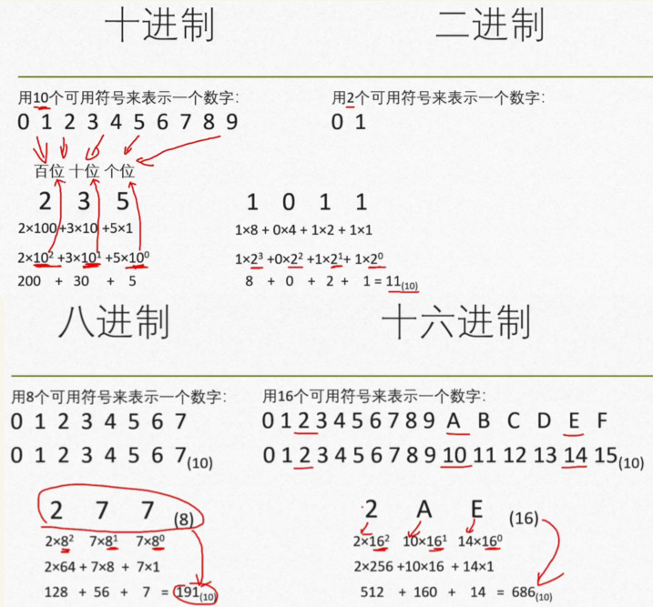	


如下图表示, 将十进制转换成二进制、八进制、十六进制

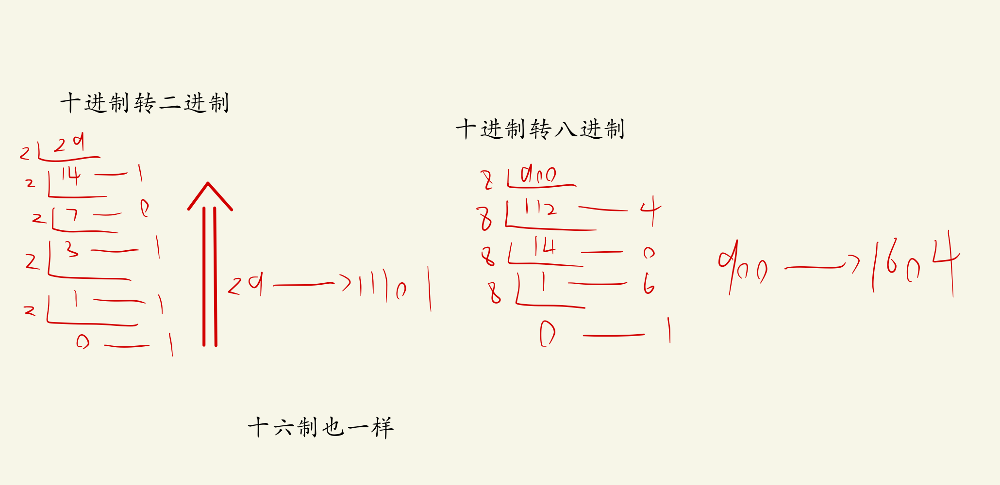	


# 第二章:算法→程序的灵魂

## 算法+数据结构=程序

- **算法：**对操作的描述。即要求计算机进行操作的步骤。
- **数据结构：**相互之间存在一种或多种的特定关系的集合


## 算法的分类

### 数值运算算法

数值运算的目的就是求数值解。

数值运算往往有现成的模型,目前数值运算的研究比较成熟


### 非数值运算算法

在计算机上的应用远超数值运算。

种类繁多,需要使用者参考已有的类似算法,重新设计解决特定问题的专门算法。


## 算法的特性

- **有穷性：**一个算法应包含有限的操作步骤，而不是无限的。
- **确定性(无二义性)：**算法中每个步骤都是确定的，而不是含糊的。

- **可执行性：**算法中每个步骤都应能有效执行

- **有零个或多个输入：**输入指的是执行算法时需要从外界获取的信息

- **有一个或多个输出：**算法目的就是求解，解就是输出


## 算法的流程图

### 普通流程图框

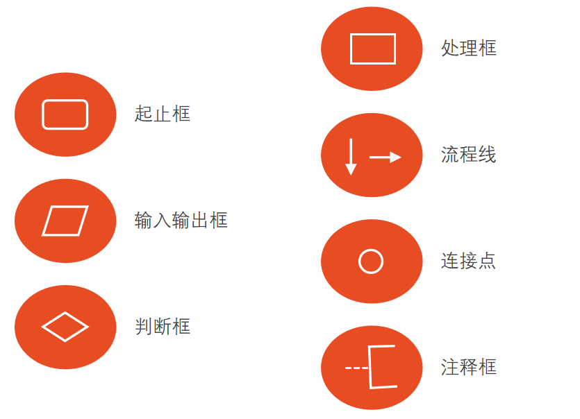	


### NS流程图框

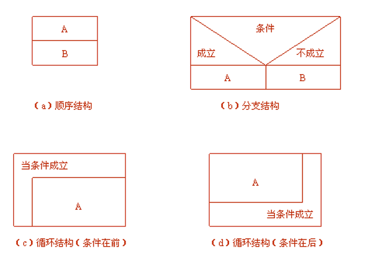	


## 伪代码

伪代码是用介于自然语言和计算机语言之间的文字和符号来描述算法。它如同一篇文章一样，自上而下地写下来


## 结构化程序设计方法

- **自顶而下**
- **模块化设计**
- **逐步细化**
- **结构化编码**


## 简单的算法例题

**例1.**$$\text{求}1-\frac{1}{2}+\frac{1}{3}-\frac{1}{4}+...+\frac{1}{99}-\frac{1}{100}\text{的值用}C\text{语言表示}$$

```
#include <stdio.h>

int main(){
	int num = 1; //num表示分子
	double sum = 1.0, deno = 2.0, value;  //double定义为双精度变量,deno为分母,sum为总值,value为单一值
	while (deno<=100) 
	{
		num = -num;
		value = num / deno;
		sum = sum + value;
		deno = deno +1;	
	}
	printf("该数值是%f", value); //%f表示单双精度小数;%d表示十进制整形数字
	return 0;
}
```


# 第三章:最简单的C程序设计

## 数据的表现形式

### 常量

在C语言中常量有以下几种：

- **整型常量：**0,-1,100
- **实型常量：**小数形式(12.12)；指数形式(12.1e3=$$12.1\times 10^3$$)
- **字符常量：**普通字符(’a’,’Z’,’#’)；转义字符(’\n’,’\012’,’\h1B’)
- **字符串常量：** “123”,”boy”
- **符号常量：**用一个标识符来表示常量 `#define PI 3.14`  


关于常量的使用要注意以下几点：

- 从常量的表示形式即可以判定其类型。
- 不带小数点的数值是整型常量，但应注意其有效范围。
- 在一个整数的末尾加大写字母L或小写字母l，表示它是长整型(long int)。
- 凡以小数形式或指数形式出现的实数均是浮点型常量，在内存中都以指数形式存储。
- C编译系统把浮点型常量都按双精度处理，分配8个字节。


### 转义字符

| 转义字符                 | 字符值                                                       |
| ------------------------ | ------------------------------------------------------------ |
| `\,  \"  \?  \\`         | 输出字符, " ? \                                              |
| `\a`                     | 警告(alert):产生声音或视觉信号                               |
| `\b`                     | 退格:当前光标位置往后退一格                                  |
| `\f`                     | 换页:当前光标位置移到下一页开头                              |
| `\n`                     | 换行:当前光标位置移到下一行开头                              |
| `\r`                     | 回车:当前光标位置移到本行开头                                |
| `\t`                     | 水平制表符:当前光标位置移到下个Tab位置                       |
| `\v`                     | 垂直制表符:当前光标位置移到下个垂直制表符对齐点              |
| `\ooo`  o表示八进制数    | 输出与该八进制对应的字符。如`\012`代表八进制数12(即十进制的10), 对应的ASCII码为换行符 |
| `\xhhh`  h表示十六进制数 | 输出与该十六进制对应的字符                                   |


### 变量

一个变量由变量名、变量值和存储单元组成。变量名是指该变量的唯一标识符，用于在程序中识别该变量。变量值是该变量的实际数据值。存储单元则是存储变量值的内存区域

```c
float a=3.14159;	//3.14159为双精度浮点常量，分配8个字节；a为float变量，分配4个字节,但是编译会发出警告,一般不影响结果的正确性，但会影响结果的精度
float a=3.14159f;		//把此3.14159按单精度浮点常量处理，编译时不出现“警告”
long double a = 1.23L;	//把此1.23作为long double型处理
```


### 常变量

常变量与常量的异同是: 常变量具有变量的基本属性(有类型,存储单元)，只是不允许改变其值。

```c
#define Pi 3.1415926	//定义符号常量
const float pi=3.1415926;	//定义常变量
```


### 标识符

标识符就是一个对象的名字。用于标识变量、符号常量、函数、数组、类型等。

标识符只能由字母、数字和下划线3种字符组成，且第一个字符必须为字母或下划线

关于标识符要注意以下几点：

- 变量名区分大小写


- 不能用关键字作为变量名


- 不合法的标识符：3D64，#33，M.D.


## 数据类型

$$\text{数据类型}\begin{cases}
	\text{基本类型}\begin{cases}
	\text{整型类型}\left\{ \begin{array}{c}
	\begin{array}{l}
	\text{基本整型}\left( int \right) :4\text{字节}\\
	\text{短整型}\left( short\,\,int \right) :2\text{字节}\\
	\text{长整型}\left( long\,\,int \right) :4\text{字节}\\
	\text{双长整型}\left( long\,\,long\,\,int \right) :8\text{字节}\\
\end{array}\\
\end{array} \right.\\
	\text{字符型}\left( char \right) :1\text{字节}\\
	\text{浮点类型}\begin{cases}
	\text{单精度浮点型}\left( float \right) :4\text{字节}\\
	\text{双精度浮点型}\left( double \right) :8\text{字节}\\
	\text{长双精度浮点型}\left( long\,\,double \right) :16\text{字节}\\
\end{cases}\\
\end{cases}\\
	\text{枚举类型}\left( enum \right)\\
	\text{空类型}\left( void \right)\\
	\text{派生类型}\begin{cases}
	\text{指针类型}\left( * \right)\\
	\text{数组类型}\left( \left[  \right] \right)\\
	\text{结构体类型}\left( struct \right)\\
	\text{共用体类型}\left( union \right)\\
	\text{函数类型}\\
\end{cases}\\
\end{cases}$$


### 整形数据

| 整形数据类型                     | 字节数 | 取值范围                                 |
| -------------------------------- | ------ | ---------------------------------------- |
| int(基本整型)                    | 4      | $$-2^{31}\sim \left( 2^{31}-1 \right) $$ |
| unsigned int(无符号基本整型)     | 4      | $$0\sim \left( 2^{32}-1 \right) $$       |
| short(短整型)                    | 2      | $$-2^{15}\sim \left( 2^{15}-1 \right) $$ |
| unsigned short(无符号短整型)     | 2      | $$0\sim \left( 2^{16}-1 \right) $$       |
| long(长整型)                     | 4      | $$-2^{31}\sim \left( 2^{31}-1 \right) $$ |
| unsigned long(无符号长整型)      | 4      | $$0\sim \left( 2^{32}-1 \right) $$       |
| long long(双长度)                | 8      | $$-2^{63}\sim \left( 2^{63}-1 \right) $$ |
| unsigned long long(无符号双长度) | 8      | $$0\sim \left( 2^{64}-1 \right) $$       |


只有整型(包括字符型)数据可以加signed或unsigned修饰符，实型数据不能加。

对无符号整型数据用`%u`格式输出。`%u`表示用无符号十进制数的格式输出。如:

```c
unsigned short price=50;	//定义price为无符号短整型变量
printf("%u\n",price); 		//指定用无符号十进制数的格式输出
```


在将一个变量定义为无符号整型后，不应向它赋予一个负值，否则会得到错误的结果。

```c
unsigned short price = -1;	//不能把一个负整数存储在无符号变量中
printf("%d\n",price);
```

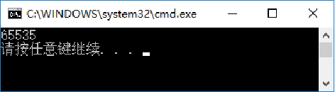		


### 字符型数据

在C语言中，字符型数据通常以ASCII码的形式存储

字符型数据包括如下几点：

- 字母: 大写英文字母A\~Z，小写英文字母a~z
- 数字: 0～9
- 专门符号: 29个,包括：! "  #  &  '  (  )  *  +  ,  -  .  /  :  ;  <  =  >  ?  [  \  ]  ^  _  `  {  |  }  ~
- 空格符: 空格、水平制表符(tab)、垂直制表符、换行、换页(form feed)
- 不能显示的字符：空(null)字符(以'\0'表示)、警告(以'\a'表示)、退格(以'\b'表示)、回车(以'\r'表示)等


在C语言中，字符型数据通常以ASCII码的形式存储

```c++
char c='?';	//定义c为字符型变量并使初值为字符′?′。′?′的ASCII代码是63，系统把整数63赋给变量c。
printf("%d %c\n",c,c);	//用“%d”格式输出十进制整数63，用“%c”格式输出字符′?′
```


### 浮点型数据

浮点数类型包括`float`(单精度浮点型)、`double`(双精度浮点型)、`long double`(长双精度浮点型)。

| 类型        | 字节数 | 小数点后位数 | 数值范围(绝对值)                                |
| ----------- | ------ | ------------ | ----------------------------------------------- |
| float       | 4      | 6            | $$0\text{以及}12*10^{-38}\sim 3.4*10^{38}$$     |
| double      | 8      | 15           | $$0\text{以及}2.3*10^{-308}\sim 1.7*10^{308}$$  |
| long double | 16     | 19           | $$0\text{以及}3.4*10^{-4932}\sim 1.1*10^{308}$$ |


## 运算符与表达式

下图总结了C语言中所有的运算符

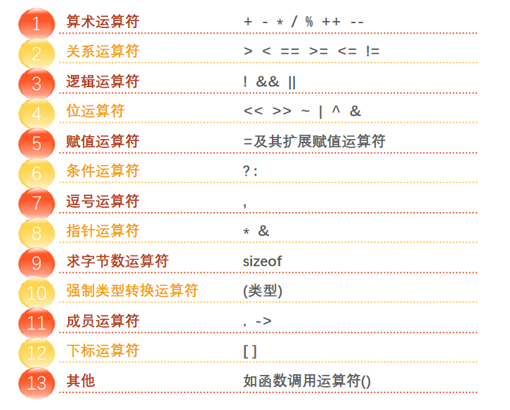		


| 算数运算符 | 含义                         | 举例                           | 结果         |
| -------- | ---------------------------- | ------------------------------ | ------------ |
| + - * /  | 加减乘除                     | 略                             | 略           |
| %        | 求余运算符                   | a%b                            | a除以b的余数 |
| i++  i-- | 在使用ｉ之后，使ｉ的值加/减1 | int i=3;<br/>printf(“%d”,i++); | 输出3        |
| ++i  --i | 在使用ｉ之前，使ｉ的值加/减1 | int i=3;<br/>printf(“%d”,++i); | 输出4        |
|两个实数相除的结果是双精度实数，两个整数相除的结果为整数||||

以下是使用算数运算符要注意的几点:

- `%`运算符要求参加运算的运算对象为整数，结果也是整数，除数可以为0，但是被除数不能为0
- 两个实数相除的结果是双精度实数，两个整数相除的结果为整数


### 不同类型间的混和运算

- +、-、*、/运算的两个数中有一个数为float或double型，结果是double型，因为系统将所有float型数据都先转换为double型，然后进行运算。
- 如果int型与float或double型数据进行运算，先把int型和float型数据转换为double型，然后进行运算，结果是double型。
- 字符(char)型数据与整型数据进行运算，就是把字符的ASCII代码与整型数据进行运算。如果字符型数据与实型数据进行运算，则将字符的ASCII代码转换为double型数据，然后进行运算。


### 强制类型转换

强制类型转换是指在C语言中，显式地把一种数据类型转换为另一种数据类型

```C
(double)a		//将ａ转换成double型
(int)(x+y)		//将x+y的值转换成int型
(float)(5%3)	//将5%3的值转换成float型
(int)x+y		//只将x转换成整型，然后与y相加
```


## C语句

C语句是C语言的基本单位，是C程序的最小可执行单元

常用的C语句包括：控制语句、调用语句、空语句、复合语句、赋值语句


### 控制语句

以下是常用的控制语句：

- `if()…else…`（条件语句）
- `for()…`（循环语句）
- `while()…`（循环语句）
- `do…while ()`（循环语句）
- `continue`（结束本次循环语句）
- `break`（中止执行switch或循环语句）
- `switch`（多分支选择语句）
- `return`（从函数返回语句）
-  `goto`（转向语句，在结构化程序中基本不用goto语句)


### 调用语句

函数调用语句由一个函数调用加一个分号构成。

```c
printf("This is a C statement. "); //其中printf("This is a C statement. ")是一个函数调用，加一个分号成为一个语句
```


### 空语句

只有一个分号的语句即为空语句。

可以用来作为流程的转向点(流程从程序其他地方转到此语句处)；

也可用来作为循环语句中的循环体（循环体是空语句，表示循环体什么也不做）。


### 复合语句

可以用`{}`把一些语句和声明括起来成为复合语句(又称语句块)。

```c
{
	float pi=3.14159, r=2.5, area; //定义变量
	area=pi*r*r;
	printf("area=%f",area);
}
/*注意:复合语句中最后一个语句末尾的分号不能忽略不写。*/
```


### 赋值语句

在赋值符`=`之前加上其他运算符，可以构成==复合运算符==

```c
a+=3	//等价于a=a+3

x*=y+8 	//等价于x=x*(y+8)

x％=3	//等价于x=x％3
```


将一个占字节多的整型数据赋给一个占字节少的整型变量或字符变量时，只将其低字节原封不动地送到被赋值的变量（即发生“截断”）
$$
\begin{cases}
	\text{浮点}\rightarrow \text{整型变量}:\text{浮点取整}\left( \text{去小数} \right) ,\text{再赋值}\\
	\text{整型}\rightarrow \text{单双精度变量}:\text{数值不变},\text{以浮点数形式存储到变量中}\\
	double\rightarrow float\text{变量}:\text{双精度转化为单精度},\text{取}6\sim 7\text{位有效数字}_{\text{注}:\text{双精度数值大小不能超过单精度数值}}\\
	float\rightarrow double\text{变量}:\text{数值不变},\text{在内存中以}8\text{个字节存储},\text{有效位数扩展到}15\text{位}\\
	\text{字符型}\rightarrow \text{整型变量}:\text{字符的}ASCII\text{代码赋值给整型变量}\\
\end{cases}
$$


以下是常见的变量赋值代码：

```c
int a,b,c=5；	//指定a,ｂ,c为整型变量，但只对c初始化，c的初值为５；相当于int a,b,c; c=5;
    
int a=3,b=3,c=3; //对几个变量赋予同一个初值

int a=b=c=3;     //错误。可以先定义，再用赋值语句，即int a,b,c; a=b=c=3;
```


## 数据的输入和输出

数据的输入和输出是指在计算机主机环境中的输入输出操作

C语言本身不提供输入输出语句,输入和输出操作是由C标准函数库中的函数来实现的

要在程序文件的开头用预处理指令`#include`把有关头文件放在本程序中, 如下代码所示

```c
#include "c:\cpp\include\myfile.h"  //按指定路径查找文件
#include "myfile.h"  //源程序文件所在目录
#include <myfile.h>  //C编译系统指定的include目录
```


### printf函数

#### 定义

`printf`函数是C语言中常用的输出函数，它可以将指定格式的字符串和数据通过标准输出（通常是控制台）输出到屏幕或文件

语法格式如下, 其中，`format` 参数是一个字符串，指定了输出的格式。格式字符串可以包含字符、数字、字符串和特殊字符等。后面的参数是根据格式字符串来确定输出内容的数据

```c
printf(const char *format, ...);
```

| 格式字符  | 说明                                                         |
| --------- | ------------------------------------------------------------ |
| `%d`,`%i` | 以带符号的十进制形式输出整数                                 |
| `%o`      | 以八进制无符号形式输出整数                                   |
| `%x`,`%X` | 以十六进制无符号形式输出整数（不输出前导符0x），用x则输出十六进制数的a～f时以小写形式输出，用X时，则以大写字母输出 |
| `%u`      | 以无符号十进制形式输出整数                                   |
| `%c`      | 以字符形式输出，只输出一个字符                               |
| `%s`      | 输出字符串                                                   |
| `%f`      | 以小数形式输出单、双精度数，含输出6位小数                    |
| `%e`,`%E` | 以指数形式输出实数，用e时指数以“e”表示(如1.2e+02)，用E时指数以“E”表示(如1.2E+02) |
| `%g`,`%G` | 选用`%`f或`%e`格式中输出宽度较短的一种格式，不输出无意义的0。用G时，若以指数形式输出，则指数以大写表示 |

| 附加字符 | 说明                                       |
| -------- | ------------------------------------------ |
| I        | 长整型整数，可加在格式符ｄ、ｏ、ｘ、ｕ前面 |
| m        | 数据最小宽度                               |
| n        | 对实数，表示输出ｎ位小数                   |


#### 使用实例

```C
#include <stdio.h>

int main()
{
    int num = 123;
    float pi = 3.14159265;
    char c = 'A';
    char s[] = "Hello World!";
    
    printf("整数: %d\n", num);  //整数:123
    printf("小数: %.2f\n", pi);  //小数:3.14
    printf("字符: %c\n", c);  //字符:A
    printf("字符串: %s\n", s);  //字符串: Hello World!
    
    return 0;
}

```


### scanf函数

#### 定义

`scanf`函数是C语言中的标准输入函数，它可以从键盘读取数据，并把读取到的数据转换成指定的数据类型存储到变量中

下图是`scanf`函数的使用语法

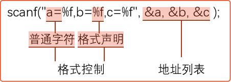	


#### 使用实例

在下述代码中, 由于scanf函数只读入第一个字符串, 所以输出的是"Hello"

```c
int main(){
	char str[100];
	scanf("%s", str);  //控制台输入: Hello World
	printf("%s", str);	//控制台输出: Hello
}
```


若想`scanf`读入一整行字符串, 可以使用如下语句

> 该语句的格式说明符`%[^\n]`的意思是读取以换行符为结尾的所有字符

```C
scanf("%[^\n]", str);
```


### putchar函数

#### 定义

`putchar` 函数是 C 语言中的标准库函数，用于向标准输出（通常是终端）输出一个字符


#### 使用实例

```c
#include <stdio.h>
int main()
{
	char a='B',b='O',c='Y';	//定义3个字符变量并初始化
	putchar(a);				//向显示器输出字符B
	putchar(b);				//向显示器输出字符O
	putchar(c);				//向显示器输出字符Y
	putchar ('\n');			//向显示器输出一个换行符
	return 0;
}                           //运行后输出BOY
```

```c
#include <stdio.h>
int main()
{
	int a=66,b=79,c=89;  
 	putchar(a);	
	putchar(b);	
	putchar(c);
 	putchar ('\n');      //输出整型变量(ASCII码)对应的字符
 	return 0; 
}
```


### getchar函数

#### 定义

`getchar` 函数是 C 语言标准库中的一个输入函数。它用于从标准输入（例如键盘）读取一个字符


#### 使用实例

从键盘输入一个大写字母，在显示屏上显示对应的小写字母

```c
#include <stdio.h>
int main ()
{
	char c1,c2;
	c1=getchar();	//从键盘读入一个大写字母，赋给字符变量c1
	c2=c1+32;	//得到对应的小写字母的ASCII代码，放在字符变量c2中
	printf("大写字母: %c\n小写字母: %c\n",c1,c2);	//输出c1,c2的值
	return 0;
}
```


# 第四章:选择结构程序设计

## if语句

### if(){}

```c
if (a=1){printf("hehe");}  //单独一个if
```


### if(){}else{}

```c
int a = 1, b = 2;
	if (a == b) {
		printf("haha");    //if else
	}
	else
	{
		printf("hehe");
	}
```


### if(){}else if(){}

```c
int a = 1, b = 2;
	if (a == b) {
		printf("haha");
	}
	else if (a != b)  //else if
	{
		printf("hehe");
	}
```


## switch语句

### 定义

`switch`语句是一种选择语句，它允许根据变量的不同值来执行不同的语句

```c
switch(表达式)    //表达式的值应为整数类型(包括字符型)
{
case	常量1 : 语句1;break
case	常量2 : 语句2;break
    ⋮	    ⋮		⋮
case	常量n : 语句n;break
default :	    语句n+1  //可以没有default标号,若没有与switch表达式相匹配的case常量，则不执行任何语句
}
```


### 使用实例

要求按照考试成绩的等级输出百分制分数段，A等为85分以上，B等为70～84分，C等为60～69分，D等为 60分以下。成绩的等级由键盘输入。

```c
#include <stdio.h>
int main()
{
	char grade;
	scanf("%c",&grade);
	printf("Your score:");
	switch(grade)
	{
	case 'A': printf("85～100\n");break;  //break表示使流程转到switch末尾
	case 'B': printf("70～84\n");break;
	case 'C': printf("60～69\n");break;
	case 'D': printf("<60\n");break;    
	default:  printf("enter data error!\n");  //上面语句都不执行,则执行default
	}
	return 0;
}
```


## 关系运算符和表达式

### 关系运算符优先级

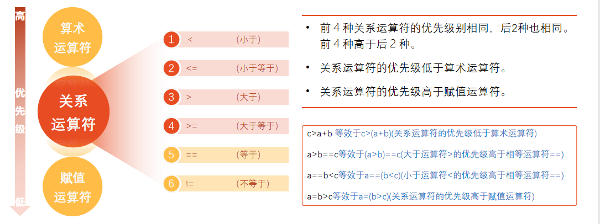	


### 关系表达式

关系表达式是比较两个值的大小关系的表达式

- 关系表达式的值是一个逻辑值，即“真”或“假”
- 在C的逻辑运算中，以“1”代表“真”，以“0”代表“假”

```c
int main(){
	int a = 3, b = 2, c = 1;
	
	//因为“>”运算符是自左至右的结合方向，先执行“a>b”得值为1,再执行关系运算“1>c”，得值0，赋给f，所以f的值为0
	int f = a > b> c ; 
	printf("%d", f);  //输出0
}
```


## 逻辑运算符

| 运算符 | 举例     | 说明                                                       |
| ------ | -------- | ---------------------------------------------------------- |
| `!`    | `!a`     | 如果a为假，则!a为真;如果a为真，则!a为假                    |
| `&&`   | `a && b` | 如果a和b都为真，则结果为真，否则为假                       |
| `||`   | `a || b` | 如果a和b有一个以上为真，则结果为真，二者都为假时，结果为假 |

- “&&”和“‖”是双目运算符，要求有两个运算对象(操作数)； “！”是单目运算符，只要有一个运算对象
- 优先次序：`!`>`＆＆`=`‖`， 即`!`为三者中最高的
- 逻辑运算符两侧的数据类型可以是整型、字符型、浮点型


## 条件运算符

条件运算符由`?`和`:`两个符号组成, 它也被称为三目运算符, 因为要求由三个表达式, 也是C语言中唯一的三目运算符

使用语法如下所示, 若expression1 的值为真（非0），则表达式的结果为 expression2 的值; 如果 expression1 的值为假（0），则表达式的结果为 expression3 的值

```
expression1 ? expression2 : expression3
```


下图突出了条件运算符的使用效果

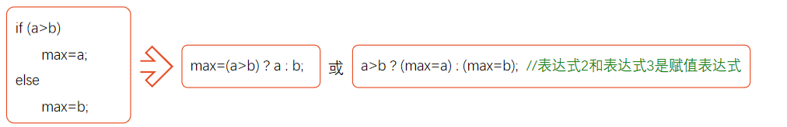


# 第五章:循环结构程序设计

## while语句

### 定义

While语句是C语言中的循环语句，它按条件循环执行语句，直到条件不满足为止

语法格式如下:

```c
while(condition)
{
  //循环体内容;
}
```


### 使用实例

求1+2+3+…+100

```c#
include <stdio.h>
int main(){
	int i = 1, sum = 0;
	while (i<=100)
	{
		sum = i + sum;
		i += 1;  //或者i++
	}
	printf("%d", sum);
```


## do while语句

### 定义

`do while`语句是一种循环语句，它与while语句非常相似，但具有一些显著的不同

在do while语句中，循环体总是先执行一次，然后再检查条件是否满足。因此，如果条件为false，则循环体将仅执行一次

语法结构如下:

```c
do{
   //循环体内容;
}while(condition);
```


### 使用实例

求1+2+3+…+100

```c
#include <stdio.h>
int main()
{
	int i=1,sum=0;
	do                  //do while：先执行后判断
	{
		sum=sum+i;
		i++;
	}while(i<=100);
	printf("sum=%d\n",sum);
	return 0;
}
```


## for 语句

### 定义

For语句是一种循环结构，允许你在特定的循环范围内执行语句。它的语法形式为

```C
for (初始化语句; 条件表达式; 增量/步长语句) {
    // 循环体
}
```


### 使用实例

**例1.**求1+2+3+…+100

```c
#include <stdio.h>
int main(){
	int sum = 0;
	for (int i = 0; i <=100; i++) 
	{
		sum = sum + i;
	}
	printf("%d", sum);
}
```


**例2.**输出以下4×5的矩阵。

```c
#include <stdio.h>
int main(){
	int i, j, n = 0;
	for (i = 1; i <= 4; i++) //i表示行数
		for (j = 1; j <= 5; j++, n++)		//j表示列数,n表示输出数据个数
		{
			if (n % 5 == 0) printf("\n");	//控制在输出5个数据后换行
				
			printf("%d\t", i * j);   //输出每个数据的值外加一个缩进格
		}
	return 0;
    
	/*这是一个for的内嵌循环,外面的循环表示输出4行,每输出一行就执行一次里面的循环*/
}
```


## break语句

### 定义

`break`语句是C语言中的控制语句，用于终止循环。它是一个跳转语句，可以在循环内部使用，以退出循环


### 使用实例

**例1.**在全系1000名学生中举行慈善募捐，当总数达到10万元时就结束，统计此时捐款的人数以及平均每人捐款的数目。

```c
#include <stdio.h>

int main() {
    int i;
    for (i = 0; i < 10; i++) {
        if (i == 5) {
            break;
        }
        printf("%d ", i);
    }
    return 0;
}

/*
输出结果: 0 1 2 3 4

*/
```


## continue语句

### 定义

`continue`语句是C语言中的控制语句，用于结束当前循环中的一次迭代，并立刻进入下一次迭代。continue语句通常在循环内部使用，可以在遇到特定情况时结束当前迭代并立即开始下一次迭代


### 使用实例

要求输出100～200之间的不能被3整除的数。

```c
#include <stdio.h>
int main()
{	int n;
	for (n=100;n<=200;n++)
	{	if (n%3==0)
			continue;  //continue表示结束本次循环,重新回到for循环,就不执行printf了
		printf("%d ",n);
	}
	printf("\n");
	return 0;
}
```


# 第六章:利用数组处理批量数据

## 数组的定义

数组是一组有序数据的集合。数组中各数据的排列是有一定规律的，下标代表数据在数组中的序号。

用数组名和下标即可唯一地确定数组中的元素。

数组中的每一个元素都属于同一个数据类型。


## 一维数组

### 定义与引用

```c
int a[10] = {0,1,2,3,4,5,6,7,8，9}; //定义数组长度为10,数组类型为整型,数组名字为a
printf("%d", a[9]);   //输出数组下标为9的元素, 即输出8
```


### 初始化

```c
int a[10]={0,1,2,3,4,5,6,7,8,9}; //在定义数组时对全部数组元素赋予初值

int a[10]={0,1,2,3,4};  //定义a数组有10个元素，但花括号内只提供5个初值，这表示只给前面5个元素赋初值，系统自动给后5个元素赋初值为0。

int a[10]={0, 0, 0, 0, 0, 0, 0, 0, 0, 0}; // 给数组中全部元素赋初值为0

int a[] = { 0,1,2,3,4,5,6,7,8,9};  //自动设置数组长度为10,
```


## 二维数组

### 定义与引用

```c
float a[3][4], b[5][10]; //定义a为3×4(3行4列)的数组，b为5×10(5行10列)的数组
a[3][4] = 8; //不存在a[3][4]元素,数组a可用的“行下标”的范围为0~2，“列下标”的范围为0~3

/*在引用数组元素时，下标值应在已定义的数组大小的范围内。*/
```

```c
#include <stdio.h>
int main()
{
	int a[3][3] = { 1,2,3,4,5,6,7,8,9 };
	int(*p)[3];  //
	printf("%d\n", (a[0])); //a[0]表示行指针,输出第一行的地址,即第一行首元素的地址
	printf("%d\n", a[1][0]);  //输出4 
	printf("%d\n", a[0]+1); //a[0] + 1表示列指针,输出第一行第二列的地址,即2的地址
	printf("%d\n", *(a[0] + 1)); // 输出2
	printf("%d\n", *(a[0])); //输出第一行第一个元素，即1
	printf("%d\n",*(a+1)); //输出第二行的首地址
	printf("%d\n", a+1);  //输出第二行的首地址
	printf("%d\n", *(*(a + 1))); //输出第二行的首个元素4
	printf("%d\n", *a); //输出第一行的首地址
    printf("%d\n", *(*a+1)); //输出第一行第二列元素,即2
}
```


### 初始化

```c
int a[3][4]={{1,2,3,4},{5,6,7,8},{9,10,11,12}}; //二维数组赋予初值

int a[3][4]={1,2,3,4,5,6,7,8,9,10,11,12};  //按排列顺序对各元素赋初值

int a[3][4]={{1},{5},{9}}; //給每行第一列元素赋值,其他元素值为0
int a[3][4]={{1},{0,6},{0,0,11}};
int a[3][4]={{1},{5,6}};  //给第1,2行部分元素赋值,其余元素值为0
int a[3][4]={{1},{},{9}}; //给第1,3行部分元素赋值,其余元素值为0	
```

```c
/*如果对全部元素都赋初值(即提供全部初始数据)，则定义数组时对第1维的长度可以不指定，但第2维的长度不能省*/
int a[][4]={1,2,3,4,5,6,7,8,9,10,11,12};

int a[][4]={{0,0,3},{},{0,10}}; //在定义时也可以只对部分元素赋初值而省略第1维的长度，但应分行赋初值
```


### 存储方式

C语言中，二维数组中元素排列的顺序是按行存放的。

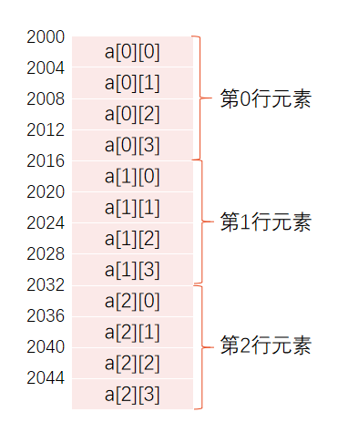	


## 多维数组

### 定义与引用

```c
float a[2, 3, 4];	//定义三维数组a，此处表示2页，3行，4列
a[0,0,1] = 8;  //给第0页，第0行，第一列赋值8
```


### 存储方式

多维数组元素在内存中的排列顺序为: 第1维的下标变化最慢，最右边的下标变化最快。

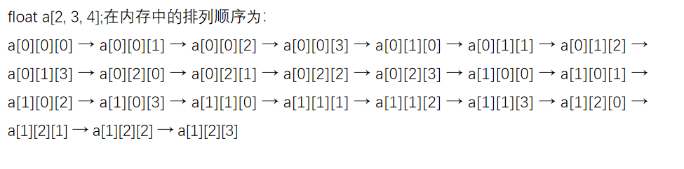

​	

## 字符数组

### 定义和引用

```c
char c[4];
c[0]='I'; c[1]=' ';c[2]='a';c[3]='m';  //用来存放字符数据的数组是字符数组,在字符数组中的一个元素内存放一个字符。

int c[10];  //由于字符型数据是以整数形式(ASCII代码)存放的，因此也可以用整型数组来存放字符数据
c[0]='a'; 	//合法，但浪费存储空间
printf(%c,c[0])  //引用字符数组元素
```


### 初始化

```c
char c[10]={′I′,′ ′ ,′a′,′m′,′ ′,′h′,′a′,′p′,′p′,′y′} //把10个字符依次赋给c[0]～c[9]这10个元素

char c[10]={′c′,′ ′,′p′,′r′,′o′,′g′,′r′,′a′,′m′} //初值个数若大于数组长度则报错,否则只赋予给前面的元素,后面的元素值为'\0'

char c[]={′I′,′ ′,′a′,′m′,′ ′,′h′,′a′,′p′,′p′,′y′}; //数组长度自动设为10

char diamond[2][5]={{′ ′,′ ′,′*′},{′ ′,′*′,′ ′,′*′}};  //字符型二维数组
```


### 字符串结束标志

″C program″  字符串是存放在一维数组中的，占10个字节，字符占9个字节，最后一个字节′\0′是由系统自动加上的。

```c
char c[10]={"China"};  //数组c的前5个元素为: ′C′,′h′,′i′,′n′,′a′,第6个元素为′\0′，后4个元素也自动设定为空字符
```

```c
char c[5]= "China";  //错误,数组长度应该改为6,要多存放一个'\0',但是字符串长度不包括'\0'
char c[6] = "China"; //正确
	printf("%s", c); 
```


可以使用二维字符数组来存储多个字符串

```c
#include <stdio.h>
int main()
{
	char i[3][10] = { "haha","hello" };
	printf("%s\n", i[1]); //输出hello
	printf("%c\n", i[0][0]); //输出h
}
```


### 输入和输出

```c
#include <stdio.h>
int main()
{
	char c[]="China";
	printf("%s\n",c);  //输出China,%s表示对字符串的输出,对应的输出项应是数组名
	return 0;
}
```

```c
char c[6];
scanf("%s",c);   //从键盘输入China,系统会自动在China后面加一个′\0′结束符
/*在C语言中数组名代表该数组第一个元素的地址*/

char str1[5],str2[5],str3[5];
scanf("%s%s%s",str1,str2,str3);  //键盘输入how are you,空格作为间隔符,分别将'how','are','you'赋予给以上三个数组

char str[13];
scanf("%s",str);  //键盘输入how are you,由于空格是字符串间隔符,所以只赋值了'how'
printf("%o",str);	//用八进制形式输出数组str的起始地址
```


## 字符串处理函数

### puts

`puts` 函数是 C 语言中的一个标准库函数，它用于将一个字符串写入到标准输出（通常是屏幕

```c
#include <stdio.h>
int main()
{
	char str[]={"China\nBeijing"};  //puts函数可以输出转义字符
	puts(str);  //在用puts输出时将字符串结束标志′\0′转换成′\n′，即输出完字符串后换行
	return 0;
}
```

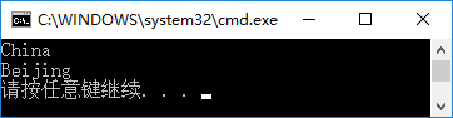	


### gets

gets函数是一种读取字符串的C语言函数。它从标准输入（通常是键盘）读取一行字符串，并将其存储到字符数组中

它以字符串作为参数，并将读取的字符串复制到这个字符数组

```c
int main() {            
	char c[10];
	gets(c);   //若键盘输入hello,则将此字符串送给数组c,共有6个字符,而不是5个
}                //执行后会返回字符数组的起始地址  
```


### strcat

strcat函数是字符串函数，它是用于将源字符串追加到目标字符串的尾部

```c
#include <stdio.h>
#include <string.h>  //导入stract函数
int main() {
	char str1[30] = { "People′s Republic of " };   //str1数组长度要足够大
	char str2[] = { "China" };
	strcat(str1, str2); //将str2的字符串接到str1的字符串后面,再赋值给str1数组
	printf("%s", str1);	 //输出:People′s Republic of China 			
}
```


### strcpy

strcpy函数是 C 语言中的一个字符串函数，是用来把一个字符串复制到另一个字符串的, 它的语法格式如下

```c
strcpy(char *dest, const char *src);
```

其中，参数 dest 是目标字符串，参数 src 是源字符串。strcpy 函数会将 src 字符串的内容复制到 dest 字符串的内存中，并在复制完成后，返回 dest


使用实例如下: 

```c
#include <stdio.h>
#include <string.h>
int main() {
	char str1[15]="1234567", str2[] = "China";
	strcpy(str1, str2);  //将str2的字符串复制到str1里去
	printf("%s", str1);    //输出China,完全覆盖掉原先str1里的字符串
	
}
```


### strncpy

`strncpy`函数与`strcpy`函数不同的是, 它可以将源字符串的前n个字符复制到目标字符串中

```c
#include <stdio.h>
#include <string.h>
int main() {
	char str1[15]="1234567", str2[] = "China";
	strncpy(str1, str2, 2);   //将str2字符串的前两个复制到str1里
	printf("%s", str1);    //输出Ch,完全覆盖
	
}	
```


### strcmp

`strcmp` 函数是一个字符串比较函数，它接收两个参数：两个字符串字符数组，并将它们进行比较

```c
#include <stdio.h>
#include <string.h>
int main() {
	char str1[15]="faker", str2[] = "China";
	int result = strcmp(str1, str2);  //比较str1和str2的字符串,依次按照ASCII码比较
	printf("%d", result);
			/*str1 = str2,则result=0
			  str1 > str2,则result为正整数	
			  str1 < str2,则result为负整数
			*/
}	
```


### strlen

`strlen`函数用来获取字符串长度

```c
#include <stdio.h>
#include <string.h>
int main()
{
	char str[10]="China";
	printf("%d,%d\n",strlen(str),strlen("China1"));	//strlen输出字符串长度,不包括\0,这里输出5,6
    
}
```


# 第七章:用函数实现模块化程序设计

## 函数的定义

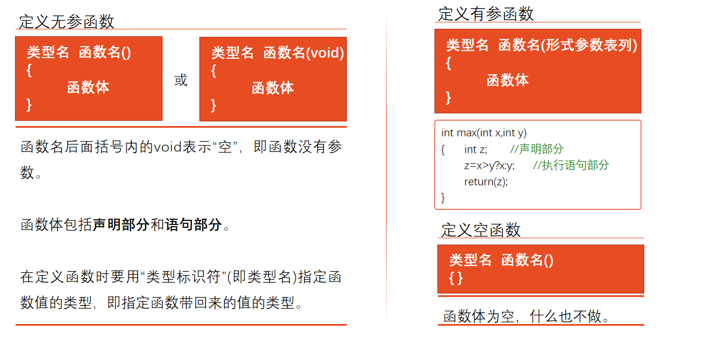		

## 形参和实参

在定义函数时函数名后面括号中的变量名称为“形式参数”（简称“形参”）或“虚拟参数”。

在主调函数中调用一个函数时，函数名后面括号中的参数称为“实际参数”（简称“实参”）。

当函数被调用时,系统为形参分配内存空间。无论形参与实参的名称是否相同,它们都各自占用自己的存储空间。


## 函数的声明

函数声明是在程序中声明函数的名称、参数列表和返回类型的语句。它不包括函数的主体，也就是实际的代码。它的目的是向编译器说明接下来将定义的函数的类型，以便编译器知道如何处理函数调用

在函数声明中的形参名可以省略，只写形参的类型。

```c
float add(float x, float y);
float add(float, float);		//不写参数名，只写参数类型
float add(float a,  float b);	//参数名不用x,y，而用a,b。合法
```


## 函数的递归调用

在调用一个函数的过程中又出现直接或间接地调用该函数本身，称为函数的递归调用。

程序中不应出现无终止的递归调用，而只应出现有限次数的、有终止的递归调用，这可以用if语句来控制，只有在某一条件成立时才继续执行递归调用；否则就不再继续。


例如这个例子，有5个学生坐在一起，问第5个学生多少岁，他说比第4个学生大2岁。问第4个学生岁数，他说比第3个学生大2岁。问第3个学生，又说比第2个学生大2岁。问第2个学生，说比第1个学生大2岁。最后问第1个学生，他说是10岁。请问第5个学生多大1.

```c
#include <stdio.h>
int main()
{	int age(int n);					//对age函数的声明
	printf("NO.5,age:%d\n",age(5)); 	//输出第5个学生的年龄
	return 0;
} 

int age(int n) 						//定义递归函数
{	int c; 						//c用作存放函数的返回值的变量
	if(n==1) 						//如果n等于1
		c=10;					//年龄为10
	else 							//如果n不等于1
		c=age(n-1)+2;			//年龄是前一个学生的年龄加2(如第4个学生年龄是第3个学生年龄加2)
	return(c); 					//返回年龄
}
```


## 数组作为函数参数

数组元素可以用作函数实参，但是不能用作形参。

因为形参是在函数被调用时临时分配存储单元的，不可能为一个数组元素单独分配存储单元(数组是一个整体，在内存中占连续的一段存储单元)。

在用数组元素作函数实参时，把实参的值传给形参，是==“值传递”==方式。数据传递的方向是从实参传到形参，单向传递。

数组可以作为函数实参,通过=="地址传递"==的方式将值传递给形参

```c
int test(int *p) {
	int i = p[0];
	return i;
}

int main()
{
	int a[] = { 1,2,3,4,5 };
	printf("%d", test(a)); //数组作为实参
}
```


### 一维数组作函数参数

例如下述例子，有一个一维数组score，内放10个学生成绩，求其平均成绩。函数的实参是一个数组名，其本质上属于值传递

```c
#include <stdio.h>
int main()
{	float average(float array[],int n);
	float score[10]={67.5,89.5,99,69.5,77,89.5,76.5,54,60,99.5};//定义长度为10的数组

	printf("The average of class B is %6.2f\n",average(score,10)); //用数组名score和10作实参
	return 0;
}

float average(float array[],int n) //定义average函数，未指定形参数组长度
{	int i;
	float aver,sum=array[0];
	for(i=1;i<n;i++)
		sum=sum+array[i];	    //累加n个学生成绩
	aver=sum/n;
	return(aver);
}
```


### 二维数组作函数参数

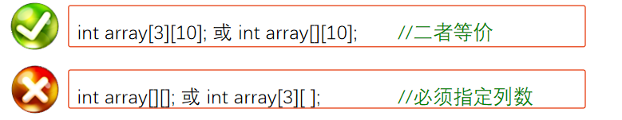	


如下例子所示, 有一个3×4的矩阵，求所有元素中的最大值。可以发现函数的参数是一个二维数组

```c
#include <stdio.h>
int main()
{	int max_value(int array[][4]);		//函数声明
	int a[3][4]={{1,3,5,7},{2,4,6,8},{15,17,34,12}};	 //对数组元素赋初值
	printf("Max value is %d\n",max_value(a));
	//max_value(a)为函数调用
	return 0;
}

int max_value(int array[][4])	//函数定义
{	int i,j,max;
	max=array[0][0];
	for(i=0;i<3;i++)
		for(j=0;j<4;j++)
			if(array[i][j]>max) max=array[i][j];	//把大者放在max中
	return(max);
}
```


## 局部变量和全局变量

### 局部变量

在一个函数内部，可以在复合语句中定义变量，这些变量只在本复合语句中有效，这种复合语句也称为“分程序”或“程序块”。

形式参数也是局部变量。只在定义它的函数中有效。其他函数中不能直接引用形参。


### 全局变量

函数之外定义的变量称为外部变量,外部变量是==全局变量==(也称全程变量)。全局变量可以为本文件中其他函数所共用。它的有效范围为从定义变量的位置开始到本源文件结束。

若函数内的局部变量和全局变量同名，则局部变量会覆盖全局变量。


## 变量的生存期

从变量值存在的时间（即生存期）来观察，有的变量在程序运行的整个过程都是存在的，而有的变量则是在调用其所在的函数时才临时分配存储单元，而在函数调用结束后该存储单元就马上释放了，变量不存在了。


## 变量的存储方式

### 静态存储方式

静态存储的变量通常在程序整个生命周期中存在，不能在运行期间被删除，空间分配静态，因此使用静态存储的变量是程序中最常见的存储方式。静态存储的变量可以用关键字 "static" 声明


### 动态存储方式

动态存储是在程序运行时动态分配空间的存储方式。动态存储的变量可以在运行期间删除，不需要预先分配空间，因此可以根据需要调整内存分配。动态存储的变量用关键字 "malloc" 声明，使用 "free" 释放


## 变量的存储类别

### 自动变量

若局部变量不专门声明为static（静态）存储类别，都是<u>动态地分配</u>存储空间的，数据存储在动态存储区中。函数中的形参和在函数中定义的局部变量（包括在复合语句中定义的局部变量），都属于此类。在调用该函数时，系统会给这些变量分配存储空间，在函数调用结束时就自动释放这些存储空间。因此这类局部变量称为==自动变量==。自动变量用关键字==auto==作存储类别的声明

```c
int f(int a)			//定义f函数，a为形参
{
	auto int b,c=3;	//定义b,c为自动变量，新版本auto不能加在数据类型前面了
	   
}
```


### 静态局部变量

若希望变量调用完后值还留着，即其占用的存储单元不释放，在下一次再调用该函数时，该变量的值就是上次用的值。这时就应该指定该局部变量为==静态局部变量==，用关键字==static==进行声明。

静态局部变量属于静态存储类别，在静态存储区内分配存储单元。在程序整个运行期间都不释放。而自动变量（即动态局部变量）属于动态存储类别，分配在动态存储区空间而不在静态存储区空间，函数调用结束后即释放。


### 寄存器变量

为提高执行效率，允许将局部变量的值放在CPU中的寄存器中，需要用时直接从寄存器取出参加运算，不必再到内存中去存取。这种变量叫做寄存器变量，用关键字register作声明，如`register int  f;`	


### 外部变量

外部变量是在函数的外部定义的全局变量，它的作用域是从变量的定义处开始，到本程序文件的末尾


如下代码所示，在文件内扩展外部变量的作用域

```c
#include <stdio.h>
int main()
{	int max();
	extern int A,B,C;	//把外部变量A,B,C的作用域扩展到从此处开始
	printf("Please enter three integer numbers:");
	scanf("%d %d %d",&A,&B,&C);		//输入3个整数给A,B,C
	printf("max is %d\n",max());
	return 0;
}
int A,B,C;				//定义外部变量A,B,C
int max()
{	int m;
	m=A>B?A:B;		//把A和B中的大者放在m中
	if(C>m) m=C;		//将A,B,C三者中的大者放在m中
	return(m);		//返回m的值
}
```


如下代码所示，将外部变量的作用域扩展到其他文件

```c
#include <stdio.h>
int A;				//定义外部变量
int main()
{	int power(int);		//函数声明
	int b=3,c,d,m;
	printf("enter the number a and its power m:\n");
	scanf("%d,%d",&A,&m);
	c=A*b;
	printf("%d*%d=%d\n",A,b,c);
	d=power(m);
	printf("%d**%d=%d\n",A,m,d);
	return 0;
}
```

```c
extern A;
//把file1中定义的外部变量的作用域扩展到本文件开头
int power(int n)
{	int i,y=1;
	for(i=1;i<=n;i++)
	y*=A;
	return(y);
}
```


若不希望本文件的变量被外部文件引用，可以使用关键字`static`声明变量

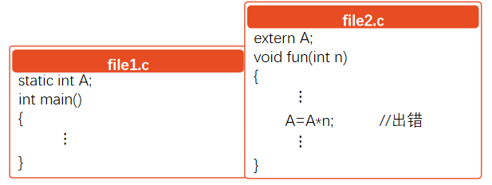	


## 变量的声明

- 定义性声明：像`int a`这种需要建立存储空间的，称为定义性声明
- 引用性声明：像`extern int a`这种不需要建立存储空间的，称为引用性声明


# 第八章:善于利用指针

## 指针变量

指针是一种特殊的变量，它存储的是某个变量的内存地址。指针变量可以存储内存地址，并且通过指针变量可以间接操作内存中的数据

```c
#include <stdio.h>
int main()
{
	int a=1, * p;       //定义指针变量,*是指针运算符
	p = &a;				//把a的地址赋给指针变量p,&是取地址运算符														
	printf("%d\n", *p);	//以整数形式输出指针变量p所指向的变量的值，即a的值							
	*p = 2;				//将整数1赋给p当前所指向的变量，由于p指向变量a，相当于把1赋给a，即a=2	
	printf("a=%d,a的地址是%d",a,p);		//以十进制形式输出指针变量p的值，即输出变量a的地址;a的值变为了2
}
```


## 通过指针引用数组

### 数组元素的指针

一个变量有地址，一个数组包含若干元素，每个数组元素都在内存中占用存储单元，它们都有相应的地址。指针变量既然可以指向变量，当然也可以指向数组元素。

若指针变量直接指向数组变量名，则表示指向数组第一个元素的地址。

```c
int a[10]={1,3,5,7,9,11,13,15,17,19};	//定义a为包含10个整型数据的数组	
int *p = &a[0];		//定义一个整型指针变量,并指向整型数组	
```

```c
int a[10]={1,3,5,7,9,11,13,15,17,19};		
int *p = a;		//等价于int *p = &a[0];	
```


### 数组元素里指针的运算

在指针已指向一个数组元素时,指针可以进行以下运算:

- p+1：表示指向同一数组的下个元素
- p-1：表示指向同一数组的上个元素
- p++,p--：指针的自加自减运算

若p的初值是a(即&a[0]),则p+i和a+i就是数组元素a[i]的地址,它俩指向a[i]

\*(p+i)或*(a+i)是p+i或a+i指向的数组元素值,即a[i]

```c
#include <stdio.h>
int main()
{
	int a[10] = { 0,1,2,3,4,5,6,7,8,9 };
	int *p = a;

	//下述三个输出结果均为2
	printf("%d", *(p + 2));
	printf("%d", *(a + 2));
	printf("%d", a[2]);
}
```


### 通过数组名作函数参数

以**变量名**和**数组名**作为函数参数的比较

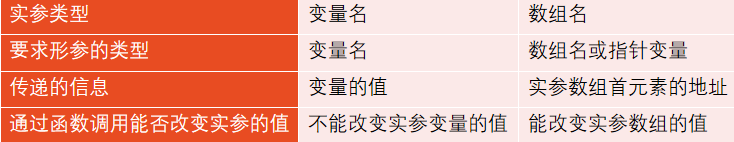	

```c
int main()
{	void fun(int arr[], int n);	//对fun函数的声明
	int array[10];			//定义array数组
	   ⋮
	fun(array,10); 			//array是实参,arr是形参,
	return 0;
} 

void fun (arr[ ],int n)   
{	printf(″%d\n″, *arr);		//输出array[0]的值
	arr=arr+3;			//形参数组名可以被赋值
	printf(″%d\n″, *arr);		//输出array[3]的值
}
```

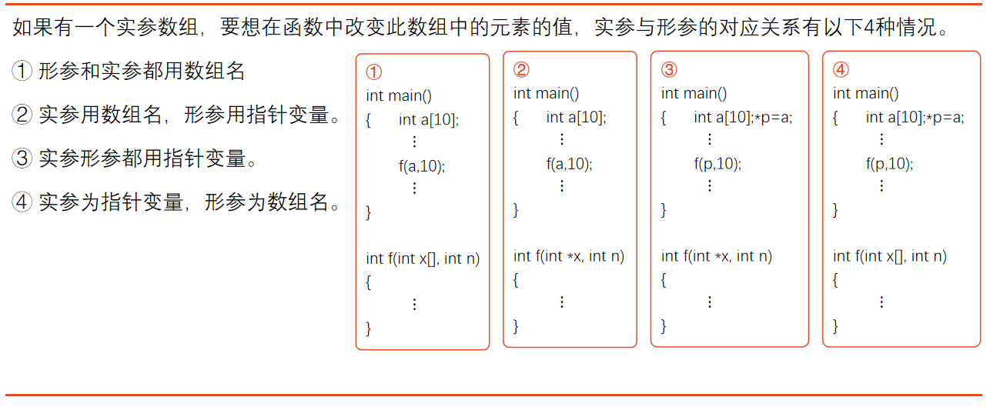	


## 通过指针引用字符串

### 字符串的引用方式

```c
/*通过定义字符串数组*/
#include <stdio.h>
int main()
{	char string[]="I love China!";	//定义字符数组string
	printf("%s\n",string);		//用%s格式声明输出string，可以输出整个字符串
	printf("%c\n",string[7]);		//用%c格式输出一个字符数组元素,输出'C'
	return 0;
}
```


### 字符串指针作函数参数

将字符串指针作为函数参数, 有以下四种传递方式

| **实参**     | **形参**     |
| ------------ | ------------ |
| 字符数组名   | 字符数组名   |
| 字符数组名   | 字符指针变量 |
| 字符指针变量 | 字符指针变量 |
| 字符指针变量 | 字符数组名   |


下述代码用于实现字符串拷贝

```c
#include <stdio.h>
int main()
{	void copy_string(char from[], char to[]);	//函数声明
	char a[]="I am a teacher.";		//定义字符数组a并初始化
	char b[]="You are a student.";	//定义字符数组b并初始化
	char *from=a,*to=b;	//from指向a数组首元素，to指向b数组首元素 
	printf("string a=%s\nstring b=%s\n",a,b);
	printf("copy string a to string b:\n");
	copy_string(from,to);	//实参为字符指针变量
	printf("\nstring a=%s\nstring b=%s\n",a,b);
	return 0;
}

void copy_string(char from[], char to[]) 		//形参为字符数组
{	int i=0;
	while(from[i]!='\0')
	{	to[i]=from[i]; i++;}
	to[i]='\0';
}
```


## 指向函数的指针

### 什么是函数的指针

函数名就是函数的指针，它代表函数的起始地址。


### 函数指针变量调用函数

```c
/*判断两数的大小*/
#include <stdio.h>
int main()
{	int max(int,int);	//函数声明
	int (*p)(int,int);	//定义指向函数的指针变量p,表示指向函数类型为整型且有两个整型参数的函数
	int a,b,c;
	p=max;			//使p指向max函数
	printf("please enter a and b:");
	scanf("%d,%d",&a,&b);
	c=(*p)(a,b);		//通过指针变量调用max函数
	printf("a=%d\nb=%d\nmax=%d\n",a,b,c);
	return 0;
}
int max(int x,int y)		//定义max函数
{	int z;
	if(x>y)z=x;
	else z=y;
	return(z);
}
```


## 指针数组

### 什么是指针数组

一个数组，若其元素均为指针类型数据，称为指针数组，也就是说，指针数组中的每一个元素都存放一个地址，相当于一个指针变量。

如下代码定义了一个指针数组, 用于存放int类型的指针元素

```C
int *p[4]; 
```


### 使用实例

```c
#include <stdio.h>
int main()
{
	int a[5] = { 1,3,5,7,9 };
	int* num[5] = { &a[0],&a[1],&a[2],&a[3],&a[4] };
	int** p, i;				//p是指向指针型数据的指针变量
	p = num;				//使p指向num[0],即p指向&a[0]
	for (i = 0; i < 5; i++)
	{
		printf("%d ", **p);  //*p=&a[0]  **p=a[0]
		p++;
	}
	printf("\n");
	return 0;
}
```


## 动态内存分配

### 定义

全局变量是分配在内存中的静态存储区的，非静态的局部变量(包括形参)是分配在内存中的动态存储区的

除此以外，C语言还允许建立内存动态分配区域，以存放一些临时用的数据，这些数据不必在程序的声明部分定义，也不必等到函数结束时才释放，而是需要时随时开辟，不需要时随时释放。这些数据是临时存放在一个特别的自由存储区，称为==堆==(heap)。可以根据需要，向系统申请所需大小的空间。

由于未在声明部分定义它们为变量或数组，因此不能通过变量名或数组名去引用这些数据，只能通过指针来引用


### 动态分配内存的函数

#### malloc函数

该函数是一个指针型函数，返回的指针指向该分配域的第一个字节

```c
/* void *malloc(unsigned int size); */

int *p = malloc(100);   //开辟100字节的临时分配域，函数值为其第1个字节的地址；若函数执行失败(如内存空间不足),则返回空指针(NULL)
```


#### calloc函数

在内存的动态存储区中分配n个长度为size的连续空间，这个空间一般比较大，足以保存一个数组。

```c
/* void *calloc(unsigned n,unsigned size); */

p=calloc(50,4);		//开辟50×4个字节的临时分配域，把首地址赋给指针变量p;若执行失败返回NULL
```


#### realloc函数

如果已经通过malloc函数或calloc函数获得了动态空间，想改变其大小，可以用realloc函数重新分配。

```c
/* void *realloc(void *p,unsigned int size) */
realloc(p,50);	//将p所指向的已分配的动态空间改为50字节;失败则返回NULL
```


#### free函数

是释放指针变量p所指向的动态空间，使这部分空间能重新被其他变量使用。p应是最近一次调用calloc或malloc函数时得到的函数返回值

```c
free(p); //释放指针变量p所指向的已分配的动态空间,无返回值
```


### 使用实例

建立动态数组，输入5个学生的成绩，另外用一个函放数检查其中有无低于60分的，输出不合格的成绩

```c
#include <stdio.h>
#include <stdlib.h>				//程序中用了malloc函数，应包含stdlib.h
int main()
{
	void check(int*);				//函数声明
	int* p1, i;						//p1是int型指针
	p1 = (int*)(5 * sizeof(int));	//开辟动态内存区，(int *)表示强制指针类型转换
	for (i = 0; i < 5; i++)
		scanf("%d", p1 + i);			//输入5个学生的成绩 
	check(p1);					//调用check函数
	return 0;
}

void check(int* p)					//定义check函数，形参是int*指针
{
	printf("They are fail:");
	for (int i = 0; i < 5; i++)
		if (p[i] < 60) printf("%d \0", p[i]); 	//输出不合格的成绩 
	
}
```


## 指针总结

| **变量定义**  | **含义**                                                     |
| ------------- | ------------------------------------------------------------ |
| `int i`       | 定义整型变量i                                                |
| `int *p`      | 定义p为指向整型数据的指针变量                                |
| `int a[5]`    | 定义整型数组a，它有5个元素                                   |
| `int *p[4]`   | 定义指针数组p，它由4个指向整型数据的指针元素组成             |
| `int (*p)[4]` | p为指向包含4个元素的一维数组的指针变量                       |
| `int *p()`    | p为返回一个指针的函数，该指针指向整型数据                    |
| `int (*p)()`  | p为指向一个返回值为整数的函数的指针                          |
| `int **p`     | p是一个指针变量，它指向一个指向整型数据的指针变量            |
| `void *p`     | p是一种指向任意类型数据的通用指针。它可以指向任意类型的数据，但是不能通过该指针直接访问数据，需要先转换为特定的指针类型再访问 |


# 第九章:用户建立数据类型

## 结构体变量

### 什么是结构体

C语言允许用户自己建立由不同类型数据组成的组合型的数据结构，它称为结构体

结构体的成员可以是任何类型的变量，如整数，字符串，浮点数，其他结构体，指针等

```c
struct Student  //struct表示建立结构体,Student为结构体类型名
{	int num;			//学号为整型 
	char name[20];	//姓名为字符串 
	char sex;			//性别为字符型 
	int age;				//年龄为整型
	float score;			//成绩为实型 
	char addr[30];		//地址为字符串 
};						//注意最后有一个分号 
/*花括号里的子项称为结构体的成员
  每个成员都是结构体的一个域
*/
```


与此同时，结构体的成员还可以是其他结构体里的成员

```c
struct Date				//声明一个结构体类型 struct Date 
{	int month;			//月
	int day;				//日
	int year;				//年
}; 

struct Student			//声明一个结构体类型 struct Student
{ int num;
char name[20];
char sex;
int age;
struct Date birthday;		//成员birthday属于struct Date类型
char addr[30]; 
};
```


### 定义结构体类型变量

有两种定义结构体变量的方式，如下代码所示

```c
/*先定义结构体类型,再定义结构体变量*/
struct Student
{	int num;				//学号为整型 
	char name[20];		//姓名为字符串 
	char sex;			//性别为字符型 
	int age;				//年龄为整型
	float score;			//成绩为实型 
	char addr[30];		//地址为字符串 
};						//注意最后有一个分号
struct Student  student1, student2;  //student1和student2是结构体变量
```

```c
/*同时定义结构体类型和结构体变量*/
struct Student
{	int num;		
	char name[20];
	char sex;	
	int age;
	float score;
	char addr[30];
}student1, student2;
```


### 结构体的初始化

```c
#include <stdio.h>
int main()
{
	struct Student							//声明结构体类型struct Student
	{
		long int num;						//以下4行为结构体的成员
		char name[20];
		char sex;
		char addr[20];
	}a = { 10101,"Li Lin",'M',"123 Beijing Road" };	//定义结构体变量a并初始化
	struct Student* p = &a;
	printf("NO.:%ld\nname:%s\nsex:%c\naddress:%s\n",p->num, a.name, a.sex, a.addr);
	return 0;
}
```


### 结构体的引用

```c
/*对结构体的成员赋值*/
student1.num=10010;	//结构体变量student1中的成员num
student1.birthday.month=6;	//结构体变量student1中的成员birthday中的成员month
```

```c
/*结构体成员可以像普通变量进行各种运算*/
student2.score＝student1.score;	//赋值运算
sum=student1.score+student2.score;	//加法运算
student1.age++;			//自加运算
student1=student2;		//假设student1和student2已定义为同类型的结构体变量
```

```c
/*scanf输入给结构体变量赋值,只能一个一个来*/
scanf(″%d″,&student1.num);	//输入student1.num的值
printf(″%o″,&student1);	//输出结构体变量student1的起始地址

scanf(″%d,%s,%c,%d,%f,%s\n″,&student1); //这种是错误的
```


## 结构体数组

### 结构体数组的定义

```c
/*同时定义结构体类型和结构体数组*/
struct Person
{	char name[20];
	int count;
} leader[3];  //定义结构体数组
```

```c
/*先定义结构体类型,再定义结构体数组*/
struct Person
{	char name[20];
	int count;
}
struct Person leader[3];	//leader是结构体数组名 
```


### 结构体数组的初始化与引用

```c
#include <stdio.h>
//先定义后初始化
struct Person
{
	char name[20];
	int year;
};

int main()
{	
	struct Person leader[3] = { {"Li",11},{"Zhang",12},{"Sun",13} };
	printf("第三位同学的名字叫%s,年龄是%d岁", leader[2].name,leader[2].year);  //输出了13
}
```

```c
#include <stdio.h>
//同时定义与初始化
struct Person
{
	char name[20];
	int year;
}leader[3] = { {"Li",11},{"Zhang",12},{"Sun",13} };

int main()
{
	printf("第三位同学的名字叫%s,年龄是%d岁", leader[2].name, leader[2].year);  //输出了13
}
```


## 结构体指针

### 什么是结构体指针

所谓结构体指针就是指向结构体变量的指针，一个结构体变量的起始地址就是这个结构体变量的指针。如果把一个结构体变量的起始地址存放在一个指针变量中，那么，这个指针变量就指向该结构体变量。


### 指向结构体变量的指针

```c
#include <stdio.h>
#include <string.h>
int main()
{
	struct Student			//声明结构体类型struct Student
	{
		long num;
		char name[20];
		char sex;
		float score;
	};
	struct Student stu_1;	//定义struct Student类型的变量stu_1 
	struct Student* p;		//定义指向struct Student 类型数据的指针变量p 
	p = &stu_1;			//p指向stu_1 
	stu_1.num = 10101;		//对结构体变量的成员赋值 
	strcpy_s(stu_1.name, "Li Lin");	//用字符串复制函数给stu_1.name赋值
	stu_1.sex = 'M';
	stu_1.score = 89.5;
	printf("\nNo.:%ld\nname:%s\nsex:%c\nscore:%5.1f\n", (*p).num, p->name, (*p).sex, (*p).score); //通过结构体指针变量来引用结构体变量:(*p).num或p->num
	return 0;
}

```


### 指向结构体数组的指针

```c
#include <stdio.h>
struct Student				//声明结构体类型struct Student
{
	int num;
	char name[20];
	char sex;
	int age;
};
struct Student stu[3] = { {10101,"Li Lin",'M',18},{10102,"Zhang Fang",'M',19},{10104,"Wang Min",'F',20} };//定义结构体数组并初始化

int main()
{
	struct Student* p = stu;	//定义指向struct Student结构体变量的指针变量
	
	int length = sizeof(stu) / sizeof(Student); // 计算结构体数组的长度

	for (int i = 0; i < length; i++)
	{
		printf("num: %d\n", (*p).num);
		printf("name: %s\n", (*p).name);
		printf("sex: %c\n", (*p).sex);
		printf("age: %d\n", (*p).age);
		p++;
	}

	return 0;
}
```


## 用指针处理链表

### 链表的内涵

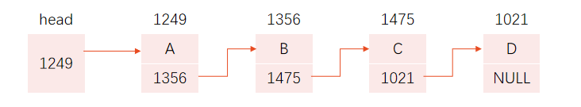	

链表是一种常见的重要的数据结构。它是动态地进行存储分配的一种结构。

head是==头指针==变量，它里面放了个地址,指向下一个元素。

每个元素又称为==结点==，它包含两个部分(实际数据、下个结点的地址)。

当某元素不指向其他元素时，这该元素称为==表尾==，地址放着NULL


### 建立静态链表

```c
#include <stdio.h>
struct Student						//声明结构体类型struct Student
{	int num;
	float score;
	struct Student*next;
};
int main()
{	struct Student a,b,c,*head,*p;	//定义3个结构体变量a,b,c作为链表的结点
	a.num=10101; a.score=89.5;		//对结点a的num和score成员赋值
	b.num=10103; b.score=90;		//对结点b的num和score成员赋值
	c.num=10107; c.score=85;		//对结点c的num和score成员赋值
	head=&a;					//头指针指向结点a
	a.next=&b;					//a.next指向结点b
	b.next=&c;					//b.next指向结点c
	c.next=NULL;				//c结点的next成员不存放其他结点地址
	p=head;						//使头指针p指向头结点a
	do
	{	printf("%ld %5.1f\n",p->num,p->score);	//输出p指向的结点的数据
		p=p->next;				//使p指向下一结点,即指向结点b
	}while(p!=NULL);			//输出完c结点后p的值为NULL，循环终止
	return 0;
}
```


## 共用体类型

### 共用体类型的内涵

使几个不同类型的变量共享同一段内存的结构，称为 “共用体”类型的结构。

结构体变量所占内存长度是各成员占的内存长度之和。每个成员分别占有其自己的内存单元。共用体变量可以作结构体的成员，结构体变量也可以作共用体的成员

而共用体变量所占的内存长度等于最长的成员的长度。

共用体变量若其中某个成员的值被改变,那么其他成员的值也会被改变


### 共用体类型的定义与引用

```c
#include <stdio.h>
struct Student				//声明结构体类型struct Student
{
	int num;
	char name[20];
	char sex;
	int age;
};

union Data
{
	int i;
	//表示不同类型的变量i,ch,f可以存放到同一段存储单元中
	char ch;
}a;			//在声明类型同时定义变量


int main()
{
	
	printf("%d\n", sizeof(Data)); //输出共用体类型的大小:4

	union Data a;	//用共用体类型定义变量
	a.i = 99;   //对共同体变量初始化,只能一个一个来,不能a={1,'A',1.1}这样一次性赋完
	//a.ch = 'd';
	printf("%d,%c", a.i, a.ch);  //输出99,c (字符c的ascii码为99) 

	return 0;
}
```


### 共用体类型数据的特点

同一个内存段可以用来存放几种不同类型的成员，但在每一瞬时只能存放其中一个成员，而不是同时存放几个。

共用体变量的地址和它的各成员的地址都是同一地址。

允许用共用体变量(同类型)作为函数参数


## 枚举类型

枚举类型是一种特殊的整型类型，允许程序员为一组整数赋予可读的名称。在C语言中，枚举类型的定义使用关键字`enum`，并且枚举的每一项都有一个名字和一个对应的整数值

```c
#include <stdio.h>
int main()
{
	enum Color { red, yellow, blue, white, black };  //enum 类型名:定义枚举类型
	enum Color i, j,k;								//定义枚举变量i,j
	i = red; j = blue,k = yellow;   //给枚举变量赋值,只能是上面花括号里的内容
	printf("%d,%d,%d", i,j,k);  //输出的是整数,输出"0,2,1"
}
```

```c
#include <stdio.h>
int main()
{
	enum color { red, yellow = 2, blue };  
	printf("%d", red); //输出0
	printf("%d", yellow); //输出2
	printf("%d", blue); //输出3 
}
```


## typedef声明新类型名

### 定义新的类型名

- 先按定义变量的方法 `int i`，将变量名换成类型名 `int count`
- 在前面加typedef，如`typedef int count`
- 这样就可以定义整型变量 `count i = 1`


### 定义数组变量

- `int a[100]`，`int Num[100]`
- `typedef int Num[100]`
- `Num a` 相当于定义了 `int a[100]`


### 其他类型

```c
/*声明新的字符指针类型*/
typedef char *Sring;
String p;  //相当于char *p
```

```c
/*声明新的类型名表示指向函数的指针类型*/
typedef int (*function)() //声明function为指向函数的指针类型,指向的函数为整型
function p1  //p1为function类型的指针变量
```

```c
typedef struct
{	int month;
	int day;
	int year; 
}Date;				//声明了一个新类型名Date，代表结构体类型
Date birthday;		//定义结构体类型变量birthday，不要写成struct Date birthday; 
Date* p;				//定义结构体指针变量p，指向此结构体类型数据
```


# 第十章:对文件的输入和输出

## C文件的知识

### 什么是文件

操作系统把各种设备都统一作为文件来处理。例如，<u>终端键盘是输入文件</u>，<u>显示屏和打印机是输出文件。</u>

<u>文件一般指存储在外部介质上数据的集合</u>。<u>操作系统是以文件为单位对数据进行管理的</u>

<u>输入输出是数据传送的过程</u>，数据如流水一样从一处流向另一处，因此常将<u>输入输出形象地称为流(stream)，即数据流</u>

c语言把文件看作一个字符(或字节的序列)，一个输入输出流就是一个字符流或字节(内容为二进制数据)流。

<u>C的数据文件由一连串的字符（或字节）组成</u>，对文件的存取是以字符（字节）为单位的。<u>输入输出数据流的开始和结束仅受程序控制而不受物理符号</u>（如回车换行符）控。<u>这种文件称为流式文件</u>。


### 文件的分类

根据数据的组织形式，数据文件可分为==ASCII==文件和==二进制==文件。数据在内存中是以二进制形式存储的，可以认为它就是存储在内存的数据的映像，所以也称之为==映像文件==(image file)。如果要求在外存上以ASCII代码形式存储，则需要在存储前进行转换。ASCII文件又称==文本文件==（text file），每一个字节存放一个字符的ASCII代码。

<u>字符一律以ASCII形式存储</u>，<u>数值型数据既可以用ASCII形式存储，也可以用二进制形式存储</u>。


### 数据的存储方式

- 文本方式：数据以字符方式(ASCII代码)存储到文件中。如整数12，送到文件时占2个字节，而不是4个字节。以文本方式保存的数据便于阅读。
- 二进制方式：数据按在内存的存储状态原封不动地复制到文件。如整数12，送到文件时和在内存中一样占4个字节。


### 文件缓冲区

ANSI C标准采用==缓冲文件系统==处理数据文件，所谓缓冲文件系统是指系统自动地在内存区为程序中每一个正在使用的文件开辟一个文件缓冲区。这样做是为了<u>节省存取时间，提高效率</u>，缓冲区的大小由各个具体的C编译系统确定。

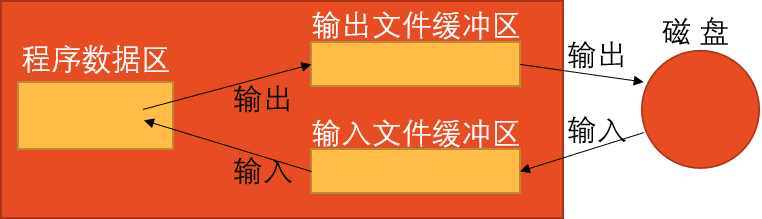	


### 文件类型指针

缓冲文件系统中，关键的概念是==文件类型指针==，简称==文件指针==。每个被使用的文件都在内存中开辟一个相应的文件信息区，用来存放文件的有关信息（如<u>文件的名字、文件状态及文件当前位置</u>等）。这些信息是保存在一个<u>结构体变量</u>中的。该<u>结构体类型是由系统声明的</u>，取名为==FILE==。

```c
typedef struct
{	short level;				//缓冲区“满”或“空”的程度
	unsigned flags;			//文件状态标志
	char fd;					//文件描述符
	unsigned char hold; 		//如缓冲区无内容不读取字符
	short bsize;				//缓冲区的大小
	unsigned char*buffer;	//数据缓冲区的位置
	unsigned char*curp;		//文件位置标记指针当前的指向
	unsigned istemp;		//临时文件指示器
	short token;				//用于有效性检查
}FILE;
FILE *f  //定义一个执行FILE类型数据的指针变量

/*f指向某一个文件信息区(结构体变量),通过文件指针变量能够找到与它有关联的文件,通常把这种指向文件信息区的变量简称为指向文件的指针变量*/
```


## 打开与关闭文件

### fopen(打开文件)

```c
FILE* fp;				//定义一个指向文件的指针变量fp
if ((fp=fopen(″file1″,″r″))==NULL) //若文件不存在.fopen返回一个null值
{	printf(″cannot open this file\n″);
	exit(0);
}
```

| 文件使用方式 | 含义                          | 若文件不存在 |
| ------------ | ----------------------------- | ------------ |
| r(只读)      | 输入数据,打开已存在的文本文件 | 出错         |
| w(只写)      | 输出数据,打开一个文本文件     | 建立         |
| a(追加)      | 向文本文件末尾添加数据        | 出错         |
| rb(只读)     | 输入数据,打开一个二进制文件   | 出错         |
| wb(只写)     | 输出数据,打开一个二进制文件   | 建立         |
| ab(追加)     | 向二进制文件追加数据          | 出错         |
| r+(读写)     | 打开一个文本文件              | 出错         |
| w+(读写)     | ==建立一个新的文件==          | 建立         |
| a+(读写)     | 打开一个文本文件              | 出错         |
| rb+(读写)    | 打开一个二进制文件            | 出错         |
| wb+(读写)    | 建立一个新的二进制文件        | 建立         |
| ab+(读写)    | 打开一个二进制文件            | 出错         |


### fclose(关闭文件)

```
fclose(fp)
```


## 顺序读写文件操作

### 向文件读写一个字符

| 函数           | 功能                                     | 返回值                                                      |
| -------------- | ---------------------------------------- | ----------------------------------------------------------- |
| `fgetc(fp)`    | 从fp指向的文件读入一个字符               | 读成功，带回所读的字符，失败则返回文件结束标志EOF(即-1)     |
| `fputc(ch,fp)` | 把字符ch写到文件指针变量fp所指向的文件中 | 输出成功，返回值就是输出的字符；输出失败，则返回EOF（即-1） |

```c
/*向文件输入字符*/
#include <stdio.h>
#include <stdlib.h>
int main()
{	FILE *fp;                     				//定义文件指针fp
	char ch,filename[10];
	printf("请输入所用的文件名: ");   
	scanf("%s",filename);        			//输入文件名
	getchar();                  		 		//用来消化最后输入的回车符
	if((fp=fopen(filename,"w"))==NULL)	//打开输出文件并使fp指向此文件
	{	printf("cannot open file\n");  	//如果打开出错就输出“打不开”
		exit(0);                       			//终止程序
	}
	printf("请输入一个准备存储到磁盘的字符串(以#结束): ");
	ch=getchar();        					//接收从键盘输入的第一个字符
	while(ch!='#')        					//当输入′#′时结束循环
	{	fputc(ch,fp); 					//向磁盘文件输出一个字符
		putchar(ch);					//将输出的字符显示在屏幕上
		ch=getchar(); 					//再接收从键盘输入的一个字符
	}
	fclose(fp);						//关闭文件
	putchar(10); 						//向屏幕输出一个换行符 
	return 0;
}
```


### 向文件读写一个字符串

| 函数              | 功能                                                         | 返回值                              |
| ----------------- | ------------------------------------------------------------ | ----------------------------------- |
| `fgets(str,n,fp)` | 从fp指向的文件读入一个长度为(n-1)的字符串，存放到字符数组str中 | 读成功，返回地址str，失败则返回NULL |
| `fputs(str,fp)`   | 把str所指向的字符串写到文件指针变量fp所指向的文件中          | 输出成功，返回0；否则返回非0值      |


```c
/*将文件的内容输出到屏幕上*/
#include <stdio.h>
#include <stdlib.h>
int main()
{
	FILE* fp;
	char str[3][10];  
	int i = 0;
	if ((fp = fopen("123.txt", "r")) == NULL)	//打开有内容的文件 
	{
		printf("can′t open file!\n");
		exit(0);
	}
	while (fgets(str[i], 10, fp) != NULL)   //从fp指向的文件读字符,然后存到str数组里
	{
		printf("%s", str[i]);
		i++;
	}
	fclose(fp);
	return 0;
}
```


### 以格式化的方式读写文本文件

| 函数                                   | 功能                                                         | 返回值                                     |
| -------------------------------------- | ------------------------------------------------------------ | ------------------------------------------ |
| `fprintf(fp,"格式化字符串", 输出变量)` | 将格式化的数据写入文件指针指向的文件，可以指定输出格式。     | 返回写入字符的数目，如果失败则返回一个负数 |
| `fscanf(fp,"格式化字符串",输入变量)`   | 从fp所指向的文件读入若干数据，并根据指定的格式读入到指定的内存地址中 | 读入数据的项数，读到末尾返回EOF            |

```c
int i=1;float f = 2.1;
fprintf (fp,″%d,%6.2f″,i,f);	//将变量i与变量f输出到fp指向的文件
```

```c
fscanf (fp,″%d,%f″,&i,&f);
//磁盘文件上如果有字符“3,4.5”，则从中读取整数3送给整型变量i，读取实数4.5送给float型变量f
```


### 用二进制的方式向文件读写数据

| 函数                                   | 功能                                                         | 返回值                                                       |
| -------------------------------------- | ------------------------------------------------------------ | ------------------------------------------------------------ |
| `fread(输入缓冲区, 块大小, 块数, fp)`  | 从文件指针fp指向的文件中读取数据，一共读取块大小 × 块数个字节的数据，并存放到输入缓冲区中。 | 返回实际读取的块数，如果读到文件末尾或读取错误，则返回小于块数的值。 |
| `fwrite(输出缓冲区, 块大小, 块数, fp)` | 将输出缓冲区中的数据写入文件指针fp指向的文件中，一共写入块大小 × 块数个字节的数据。 | 返回实际写入的块数，如果写入失败，则返回小于块数的值。       |

```c
/*fread(buffer, size, count, fp)*/ 
float f[10];   
fread(f,4,10,fp);	//从fp所指向的文件读入10个4个字节的数据，存储到数组f中
```

```c
/*fwrite(buffer, size, count, fp)*/ 
fwrite(f,4,10,fp)   //将f数组里10个4字节数据写到fp文件里
```

```c
#include <stdio.h>
#define SIZE 10  
struct Student_type
{	char name[10];
	int num;
	int age;
	char addr[15];
}stud[SIZE];	//定义全局结构体数组stud，包含10个学生数据

void save()	//定义函数save，向文件输出SIZE个学生的数据
{	FILE *fp;
	int i;
	if((fp=fopen("stu.dat","wb"))==NULL)	//打开输出文件stu.dat
	{	printf("cannot open file\n");
		return;
	}
	for(i=0;i<SIZE;i++)
		if(fwrite(&stud[i],sizeof(struct Student_type),1,fp)!=1)
			printf("file write error\n");
	fclose(fp);
}

int main()
{	int i;
	printf("Please enter data of students:\n");
	for(i=0;i<SIZE;i++) 
	//输入SIZE个学生的数据，存放在数组stud中
	scanf("%s%d%d%s",stud[i].name,&stud[i].num,
		&stud[i].age,stud[i].addr);
	save();
	return 0;
}
```


## 随机读写数据文件

### 什么是随机读写

对文件进行顺序读写比较容易理解，也容易操作，但有时效率不高。而随机访问不是按数据在文件中的物理位置次序进行读写，而是可以对任何位置上的数据进行访问，显然这种方法比顺序访问效率高得多


### 文件位置标记

#### 定义

为了对读写进行控制，系统为每个文件设置了一个==文件读写位置标记==(简称==文件位置标记==或==文件标记==)，用来指示“接下来要读写的下一个字符的位置”。

一般情况下，在对字符文件进行顺序读写时，文件位置标记指向文件开头，这时如果对文件进行读/写的操作，就读/写完第1个字符后，文件位置标记顺序向后移一个位置，依此类推，直到文件末尾。

对<u>流式文件</u>既可以进行顺序读写，也可以进行随机读写，关键在于控制文件的位置标记。如果<u>文件位置标记是按字节位置顺序移动的，就是顺序读写</u>。如果能将<u>文件位置标记按需要移动到任意位置，就可以实现随机读写</u>。


#### 涉及函数

| 函数                      | 功能                                                         | 返回值                          |
| ------------------------- | ------------------------------------------------------------ | ------------------------------- |
| `rewind(fp)`              | 将文件指针fp重新定位到文件的开头                             | 无                              |
| `fseek(fp,offset,origin)` | 将文件指针fp以origin为起始点(0表文件开始位置,1表当前位置,2表文件末尾位置), 然后移动offset个字节 | 0表示成功，非0值表示失败        |
| `ftell(fp)`               | 返回文件指针fp当前所指向的位置，单位是字节                   | 返回当前位置，如果失败则返回-1L |

```c
rewind(fp); //使文件位置标记指向文件开头,参数为文件指针,没有返回值
```

```c
/*fseek(文件类型指针, 位移量, 起始点);该函数一般用于二进制文件
	“位移量”：指以“起始点”为基点，向前移动的字节数(长整型)
	“起始点”：用0，1或2代替，0代表“文件开始位置”，1为“当前位置”，2为“文件末尾位置”
*/
fseek (fp,100L,0);		//将文件位置标记向从文件开头处向前移动100个字节
fseek (fp,50L,1); 		//将文件位置标记向前移到离当前位置50个字节处
fseek (fp,-10L,2);		//将文件位置标记从文件末尾处向后退10个字节
```

```c
/*ftell函数测定文件位置标记的当前位置,若函数出错(如不存在fp指向的文件),返回值为-1L*/
i=ftell(fp);			 //变量i存放文件位置标记
if(i==-1L) printf(″error\n″); 	//如果调用函数时出错，输出″error″
```


#### 使用实例

```c
/*
有一个磁盘文件，内有一些信息。要求第1次将它的内容显示在屏幕上，第2次把它复制到另一文件上。
*/
#include<stdio.h>
int main()
{	char ch;
	FILE *fp1,*fp2;
	fp1=fopen("file1.dat","r");	//打开输入文件
	fp2=fopen("file2.dat","w");	//打开输出文件
	ch=getc(fp1);				//从file1.dat文件读入第一个字符
	while(!feof(fp1))			//当未读取文件尾标志
	{	putchar(ch);			//在屏幕输出一个字符
		ch=getc(fp1);			//再从file1.dat文件读入一个字符
	}
	putchar(10);				//在屏幕执行换行
	rewind(fp1);				//使文件位置标记返回文件开头
	ch=getc(fp1);				//从file1.dat文件读入第一个字符
	while(!feof(fp1))			//当未读取文件尾标志,feof是检测流上的文件结束符,如果文件结束返回非0值,否则返回0
	{	fputc(ch,fp2);			//向file2.dat文件输出一个字符
		ch=fgetc(fp1);			//再从file1.dat文件读入一个字符
	}
	fclose(fp1);fclose(fp2);
	return 0;
}
```


## 文件读写报错检测

### ferror函数

在调用各种输入输出函数（如putc,getc,fread,fwrite等）时，如果出现错误，除了函数返回值有所反映外，还可以用ferror函数检查。

```c
ferror(fp); //如果ferror返回值为0（假），表示未出错；如果返回一个非零值，表示出错。
```


### clearerr函数

假设在调用一个输入输出函数时出现错误，ferror函数值为一个非零值。此时应该立即调用clearerr(fp)，使ferror(fp)的值变成0，以便再进行下一次的检测

```c
clearerr(fp); 
```


