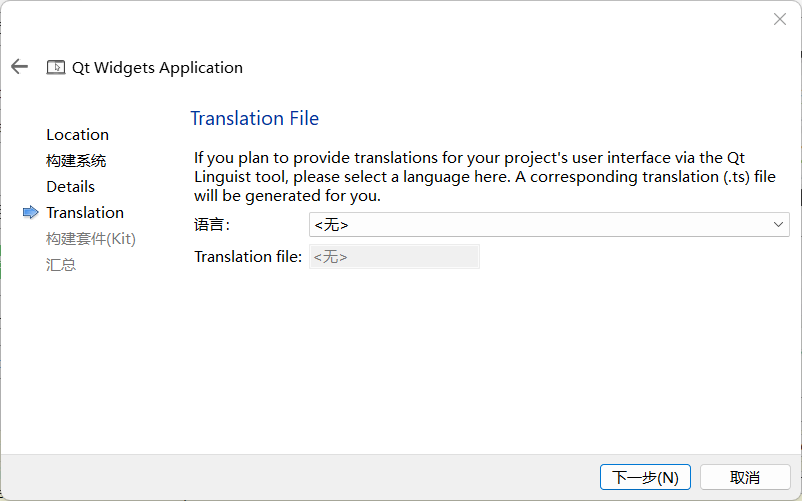
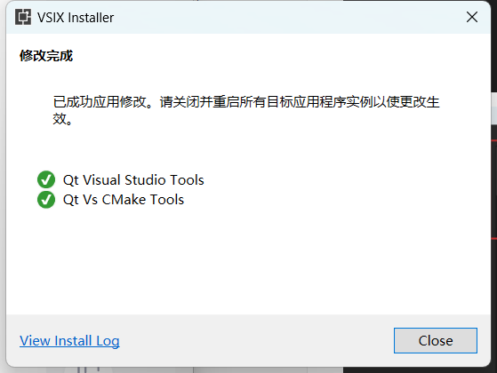

# 疑惑处理

## 1.Qt出现卡死现象

可能是有道词典的问题


# 一、Qt准备工作

## Qt介绍

Qt 是一个跨平台的应用程序框架，广泛用于开发具有图形用户界面（GUI）的软件，同时也可以用来开发非 GUI 程序，如控制台工具和服务器。它最初由挪威的 Trolltech 公司开发，后来经过多次收购和公司变更，目前由 The Qt Company 维护

Qt 支持多种操作系统和平台，包括 Windows、macOS、Linux、iOS、Android 以及各种嵌入式设备

Qt 提供了一套丰富的 GUI 组件（如按钮、文本框、菜单等），方便开发者快速构建直观、吸引人的用户界面


## QT的安装

下载[Qt安装包](https://download.qt.io/official_releases/online_installers/)，这里我选择下载Windows版本

		


注册qt账号(可用邮箱注册)并登录

	

	


选择qt的安装目录

	


安装Qt的组件，你们可以按照我这样勾选

	


开始安装，时间可能会比较久

	

	


安装完成后自动打开QT Creator

	

​	

## Qt项目创建

创建一个新项目，选择`Qt Widgets Application`，表示创建窗口应用程序

	


填写项目的名称和路径

		


选择构建系统，此处我选择`CMake`

		


填写类信息，`Class Name`表示你要创建的新类的名称，通常是你主窗口或主要对话框的类名

`Base Class`表示新创建的类将继承的 Qt 的基类(父类)，通常，对于一个标准的窗口应用程序，你可能会选择 `QMainWindow` 作为基类

`QMainWindow` 提供了一个典型的主窗口的框架，包括菜单栏、工具栏、状态栏等，也就是说，基类定义了您的窗口或对话框的基本功能和行为

		


选择翻译文件，这里我填写无

		


选择编译器，此处选择MingGW的gcc编译器

	


Qt项目创建完成

			


项目里有几个文件，这里我简单解释一下

- `CMakeLists.txt`：若创建的项目是基于CMake构建系统的，项目会生成一个CMakeLists.txt 构建配置文件，它包含了项目的配置和设置，后续若要打开一个项目需通过打开它来实现

- `main.cpp`：应用程序的入口文件，此文件通常创建一个 `QApplication` 对象，并创建您的主窗口类的实例
- `mainwindow.cpp`：主窗口类的实现文件，它通常包含主窗口类的构造函数，以及该窗口的任何特定功能或逻辑，在这个类中，您可以定义窗口的行为、处理用户交互、设置窗口中的控件等
- `mainwindow.ui`：这是一个 XML 格式的文件，用于定义主窗口的用户界面，此文件可以在 Qt Designer 中可视化编辑，允许您拖放控件（如按钮、文本框、菜单等）来设计您的界面

	


单机`mainwindow.ui`自动跳转至设计页面，左侧界面是Qt的窗口控件，按住鼠标左键可将控件拖拽至面板上。例如此处我拖拽过去了一个按钮和文本框，按`ctrl + s`保存，随后点击左下角的绿三角运行窗口程序

	


如下是窗口程序运行后的界面

						


## 可能遇到的问题

### 1.Qt Creator运行卡死

Qt Creator运行时不要打开有道词典，否则容易出现卡死情况			

​				

# 二、Qt控件

## 布局控件(layout)

### 介绍

Qt 提供了多种布局管理器来帮助开发者有效地组织窗口中的小部件（widgets），分别有垂直布局(vertical layout)、水平布局(horizontal layout)、网格布局(grid layout)和表格布局(form layout)

- **水平布局（QHBoxLayout）**：
  - 将小部件水平排列。
  - 小部件按添加的顺序从左到右排列。
- **垂直布局（QVBoxLayout）**：
  - 将小部件垂直排列。
  - 小部件按添加的顺序从上到下排列。
- **网格布局（QGridLayout）**：
  - 将小部件排列在网格中。
  - 开发者可以指定小部件占用网格中的哪一行和哪一列，以及跨越多少行和列。
  - 这种布局非常灵活，适用于复杂的界面布局。
- **表单布局（QFormLayout）**：
  - 专门用于表单类界面，将小部件排列成两列。
  - 通常左列是标签（如 "姓名："），右列是相应的输入字段。
  - 这种布局特别适合需要收集用户输入的界面。


### 操作演示	

首先我们来测试下垂直布局，先将一个垂直布局拖拽至页面，再将四个按钮拖拽至垂直布局里面，随后这四个按钮会以垂直布局的方式进行排列


那么如何将这些按钮从垂直布局中分离出来呢？你可以依次鼠标左键选择这些按钮并拖拽至垂直布局之外的地方


又或者按住`ctrl`键勾选全部按钮，然后一次性拖拽出去


如下是网格布局的演示，当你将一个控件移动至网格布局的左右两侧时(会出现蓝边提示)，它会自动添加一列，移动至上下两侧时会自动添加一行


## 间隔控件(spacer)

### 介绍

在 Qt 中，Spacers（间隔器）是一种特殊的控件，用于在布局中创建额外的空间，帮助控制小部件（widgets）之间的间距和位置。Spacers 不显示任何可视化元素，它们纯粹用于调整布局，主要类型的 Spacers 包括：

- **水平间隔器（Horizontal Spacer）**：用于在水平布局中添加空间。可以使布局中的小部件彼此分开，或者推动小部件靠向布局的一侧
- **垂直间隔器（Vertical Spacer）**：用于在垂直布局中添加空间。似于水平间隔器，但用于在垂直方向上创建间隔


### 操作演示

如下图所示，有四个按钮控件，当我们放大窗口时，按钮之间的间隔并没有随之调整，而是保持之前的间隔。那么如何才能让按钮的位置随着窗口调整而变化呢，这就要依赖间隔控件和总体栅格布局


当我们在上下两个按钮控件之间添加一个垂直间隔控件时，然后勾选它们并布置垂直布局，随后两个按钮控件就会以垂直间隔的距离互相靠拢，这就是间隔控件的作用


再添加两个水平间隔，然后勾选所有控件并布置水平布局，然后点击面板空白处布置栅格布局


运行窗口应用程序后，当你调整窗口大小时，按钮的位置也会随之调整


## 按钮控件

### 介绍

在 Qt 中，按钮控件是一种常用的用户界面元素，用于执行各种交互操作

**1.PushButton**

这是最常见的按钮类型，用于执行命令或触发事件。可以包含文本、图像或两者的组合。可以配置为可点击、不可点击（禁用状态）和默认按钮（在窗体中按回车时触发）


# VisualStuido插件

## 环境准备

- VisualStuido2022或2019
- Qt Creator


## 使用步骤

### 1.下载Qt插件

打开VisualStudio，点击管理扩展


选择`Qt VisualStudio Tools`(Qt开发插件)和`Qt Vs CMake Tools`(CMake插件)


插件下载完成后关闭VisualStuido，然后会弹出一个`VSIX Installer`框，点击`Modify`





### 2.配置插件

重新启动VisualStudio，点击Qt插件的`Qt Versions`，选择你安装好的Qt版本


路径填写`qmake.exe`的路径，例如此处我的是：`E:\Qt\6.4.3\msvc2019_64\bin\qmake.exe`


Qt version配置好后点击确定


### 3.创建Qt项目

打开VisualStudio创建一个`Qt Widgets Application`项目


弹出Qt项目的创建指导框，点击`next`


选择一个Qt配置，推荐选择`Debug`


Qt项目的文件结构，默认即可


例如我们要为窗口添加一个标题，修改`QtWidgetsApplication`文件，添加如下这行代码，然后点击运行

```
setWindowTitle("This is title");
```


## 使用Qt设计

上述使用代码的方式来设置窗口界面是比较麻烦的，我们可使用Qt设计来实现，点击Qt插件的`Launch Qt Designer`				


随后会自动打开Qt Designer，点击打开


选择你之前创建的Qt项目里的ui文件


此时我们就可以在设计界面去布置窗口的控件了


Qt设计完成后记得按`ctrl+s`保存，然后返回VisualStudio界面运行你的窗口应用程序


​								

# END


​	