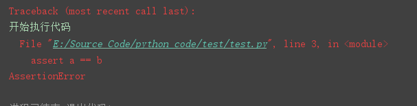
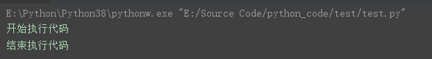

# 变量赋值

## 单变量赋值

python中的变量赋值不需要声明类型, 但是变量使用前必须要先赋值, 用等号`=`来给变量赋值

``` python
counter = 100  
```


## 多变量赋值

在 Python 中，多变量赋值是指同时给多个变量赋值。这是通过将多个变量名列在左侧，并将它们与右侧的值列表一一对应来实现的

```python
a = b = c = 1
```

```python
a = b = c = 1
```

```python
a,b,c = 1,2,"test"
```

```
a, b, c = [1, 2, 3]
```


# 数据类型

**python3中有6个标准的数据类型:**

- `Number`：数字
- `String`：字符串
- `List`：列表
- `Tuple`：元组
- `Set`：集合
- `Dictionary`：字典


## Number类型

### 定义

Python3 支持 `int`、`float`、`bool`、`complex`(复数)

```python
a, b, c, d = 20, 5.5, True, 4+3j
print(type(a), type(b), type(c), type(d)) #输出:<class 'int'> <class 'float'> <class 'bool'> <class 'complex'>

print(isinstance(a, int)) #输出True
```


### 数字类型转换

```python
a = 1.0
b = 3
print(int(a)) #输出1
print(float(b)) #输出3.0
```


### 运算

```python
print(17//3)   #输出5
print(17%3)    #求余,输出2
print(5**2)    #求平方,输出25
print(25**0.5) #开根号，输出5.0
```


### 相关函数

| Number类型函数    | 返回值 ( 描述 )                                              |
| :---------------- | :----------------------------------------------------------- |
| `abs(x)`          | 返回数字的绝对值，如`abs(-10)` 返回 10                       |
| `math.ceil(x)`    | 返回数字的上入整数，如`math.ceil(4.1)` 返回 5                |
| `math.floor(x)`   | 返回数字的下舍整数，如`math.floor(4.9)`返回 4                |
| `math.exp(x)`     | 返回e的x次幂,如`math.exp(1)` 返回2.718281828459045           |
| `math.log10(x)]`  | 返回以10为基数的x的对数，如`math.log10(100)`返回2.0          |
| `max(x1, x2,...)` | 返回给定参数的最大值，参数可以为序列。例如max([1,2,3,4]), 返回4 |
| `min(x1, x2,...)` | 返回给定参数的最小值，参数可以为序列。                       |
| `math.pow(x, y)`  | 返回`x**y`运算后的值。                                       |
| `round(x,n)`      | 返回浮点数 x 的四舍五入值，如给出 n 值，则代表舍入到小数点后的位数。 |
| `math.sqrt(x)`    | 返回数字x的平方根。如`math.sqrt(100)`返回10                  |


## String类型

### 定义

可对字符串进行切片操作

```python
str = 'HelloWorld'
print(str)          # 输出字符串: HelloWorld
print(str[0:-1])    # 输出第一个到倒数第二个的所有字符: HelloWorl
print(str[0])       # 输出字符串第一个字符: H
print(str[2:5])     # 输出从第三个开始到第五个的字符: llo
print(str[2:])      # 输出从第三个开始的后的所有字符: lloWorld
print(str * 2)      # 输出字符串两次: HelloWorldHelloWorld
print(str + "TEST") # 连接字符串: HelloWorldTEST 
```


### 字符串格式化

| 字符串格式符号 | 描述                                      |
| :------------- | :---------------------------------------- |
| `%c`           | 格式化字符及其ASCII码                     |
| `%s`           | 格式化字符串                              |
| `%d`           | 格式化整数                                |
| `%u`           | 格式化无符号整型                          |
| `%o`           | 格式化无符号八进制数                      |
| `%x`           | 格式化无符号十六进制数                    |
| `%X`           | 格式化无符号十六进制数(大写)              |
| `%f`           | 格式化浮点数字，可指定小数点后的精度      |
| `%e`           | 用科学计数法格式化浮点数, 默认保留6位小数 |
| `%E`           | 作用同%e，用科学计数法格式化浮点数        |
| `%g`           | 根据数值的大小采用%f和%e                  |
| `%G`           | 作用同`%g`                                |
| `%p`           | 用十六进制数格式化变量的地址              |

```python
print("%.2f"%(10.556)) #输出10.56
print ("我叫%s今年%d岁" % ('henry', 20))  #输出:我叫henry今年20岁
print("%x" % 16) #输出16的十六进制数: 10
print("%e" % 10000) #输出: 1.000000e+04,
print("%.3e" % 0.001) #输出: 1.000e-03
print("%g" % 1000) #输出: 1000
print("%g" % 1000000000) #输出: 1e+09
```


### 多行字符串

python可以使用三引号`"""`包裹多行字符串

```python
para_str = """这是一个多行字符串的实例
多行字符串可以使用制表符
"""
print(para_str)
```


### `str.format()`

`str.format`的常用语法:

```PY
print("MY NAME IS {},AGE is {}".format('herry','15'))
#输出MY NAME IS herry,AGE is 15
```


可在`format()`使用位置参数

```py
>>> print('{0} 和 {1}'.format('Henry', 'Tom'))
Henry 和 Tom
>>> print('{1} 和 {0}'.format('Henry', 'Tom'))
Tom 和 Henry
```


可在`format()`使用关键字参数, 它们的值会指向使用该名字的参数

```py
print("MY NAME IS {name},AGE is {age}".format(name='herry',age='15'))
#输出MY NAME IS herry,AGE is 15
```


也可以位置参数和关键字参数混合

```py
print('名字列表 {0}, {1}, 和 {other}。'.format('Henry', 'Tom', other='Lee'))
#输出:名字列表 Henry, Tom, 和 Lee。
```


通过`:`和格式符号可以对值更好的格式化, 例如保留小数点后几位

```py
import math
print('常量 PI 的值近似为 {0:.3f}。'.format(math.pi)) #输出:常量 PI 的值近似为 3.142。
```


在 `:` 后传入一个整数, 可以保证该域至少有这么多的宽度。

```python
table = {'Google': 1, 'Runoob': 2, 'Taobao': 3}
for name, number in table.items():
    print('{0:10} ==> {1:10d}'.format(name, number))

#输出内容如下:        
#Google     ==>          1
#Runoob     ==>          2
#Taobao     ==>          3
```


### `f-string`

`f-string`是 python3.6之后版本添加的，称之为字面量格式化字符串，是新的格式化字符串的语法。

格式化字符串以 **`f`** 开头, 后面接着字符串, 字符串中的表达式用大括号**`{}`**包起来，它会将变量或表达式计算后的值替换进去

```python
name = 'Herry'
print(f'Hello {name}') #输出Hello Herry
print(f'{1+2}') #输出3
```

```python
a = {'id':1,'name':'faker'}
print(f'我叫{a["name"]},排名第{a["id"]}') #我叫faker,排名第1
```


### 相关函数

| python函数 | 描述                          |
| ---------- | ----------------------------- |
| `len(str)` | 返回字符串str的长度           |
| `max(str)` | 返回字符串 str 中最大的字母。 |
| `min(str)` | 返回字符串 str 中最小的字母。 |

| String内置函数                                  | 描述                                                         |
| :---------------------------------------------- | :----------------------------------------------------------- |
| `str.capitalize()`                              | 将字符串的第一个字符转换为大写                               |
| `str.center(width,fillchar)`                    | 返回一个宽度为width, str居中的字符串，fillchar为填充的字符, 默认为空格。 |
| `str.count(sub, beg= 0,end=len(string))`        | 返回sub在 str 里面出现的次数，如果 beg 或者 end 指定了, 则返回指定范围内 str 出现的次数 |
| `bytes.decode(encoding="utf-8")`                | Python3 中没有 decode 方法，但我们可以使用 bytes 对象的 decode() 方法来对bytes对象进行解码，这个bytes对象可以由 `str.encode()` 来编码返回。 |
| `str.encode(encoding='UTF-8')`                  | 对字符串str进行encoding 指定的编码格式编码, 返回bytes对象    |
| `str.endswith(suffix, beg=0, end=len(string))`  | 检查str是否以suffix结束，如果beg 或者 end 指定, 则检查指定的范围内是否以suffix结束，如果是，返回 True,否则返回 False. |
| `str.expandtabs(tabsize=8)`                     | 把字符串str中的 tab 符号转为空格，tab 符号默认的空格数是 8 。 |
| `str.find(sub, beg=0, end=len(str))`            | 检测 sub 是否包含在字符串中，如果指定范围 beg 和 end ，则检查是否包含在指定范围内，如果包含返回开始的索引值，否则返回-1 |
| `str.index(sub, beg=0, end=len(string))`        | 跟find()方法一样，只不过如果sub不在字符串中会报一个异常。    |
| `str.isalnum()`                                 | 如果字符串至少有一个字符并且所有字符都是字母或数字则返 回 True，否则返回 False |
| `str.isalpha()`                                 | 如果字符串至少有一个字符并且所有字符都是字母或中文字则返回 True, 否则返回 False |
| `str.isdigit()`                                 | 如果字符串只包含数字则返回 True 否则返回 False..`            |
| `str.islower()`                                 | `如果字符串的字符全是小写字母则返回 True，否则返回 False     |
| `str.isnumberic()`                              | 如果字符串中只包含数字字符，则返回 True，否则返回 False      |
| `str.isspace()`                                 | 如果字符串中只包含空白，则返回 True，否则返回 False.         |
| `str.istitle()`                                 | 如果字符串是标题化的(见 title())则返回 True，否则返回 False  |
| `str.isupper()`                                 | 如果字符串中的字符全是大写，则返回 True，否则返回 False      |
| `str.join(seq)`                                 | 以指定字符串str作为分隔符，将 seq 中所有的元素(的字符串表示)合并为一个新的字符串 |
| `str.ljust(width,fillchar)`                     | 返回一个原字符串左对齐,并使用 fillchar 填充至长度 width 的新字符串，fillchar 默认为空格。 |
| `str.lower()`                                   | 转换字符串中所有大写字符为小写.                              |
| `str.lstrip(chars)`                             | 截掉字符串左边的空格或指定字符chars。                        |
| `str.replace(old,new)`                          | 把将字符串中的 old 替换成 new,如果 max 指定，则替换不超过 max 次。 |
| `str.rjust(width,fillchar)`                     | 返回一个原字符串右对齐,并使用 fillchar 填充至长度 width 的新字符串，fillchar 默认为空格。 |
| `str.rstrip(chars)`                             | 删除字符串末尾的空格或指定字符chars。                        |
| `str.split(chars="")`                           | 以 chars为分隔符对字符串str进行切片来返回列表                |
| `str.splitlines(keepends)`                      | 按照行('\r', '\r\n', \n')分隔，返回一个包含各行作为元素的列表，如果参数 keepends 为 False，不包含换行符，如果为 True，则保留换行符。 |
| `str.startswith(substr, beg=0,end=len(string))` | 检查字符串是否是以指定子字符串 substr 开头，是则返回 True，否则返回 False。如果beg 和 end 指定值，则在指定范围内检查。 |
| `str.strip(chars)`                              | 在字符串上执行 lstrip()和 rstrip()                           |
| `str.swapcase()`                                | 将字符串中大写转换为小写，小写转换为大写                     |
| `str.title()`                                   | 返回"标题化"的字符串,就是说所有单词都是以大写开始，其余字母均为小写 |
| `str.upper()`                                   | 转换字符串中的小写字母为大写                                 |
| `str.isdecimal`                                 | 检查字符串是否只包含十进制字符，如果是返回 true，否则返回 false。 |


## List类型

### 定义

列表可以使用方括号 `[]` 来定义，元素之间使用逗号 `,` 分隔

```python
# 定义一个空列表
lst = []

# 定义一个包含整数的列表
lst = [1, 2, 3, 4, 5]

# 定义一个包含字符串的列表
lst = ['apple', 'banana', 'cherry']

# 定义一个包含多种类型元素的列表
lst = [1, 'apple', 3.14, [1, 2, 3]]
```


### 常用操作

读取列表元素和列表的切片与拼接

```python
list = [ 'abcd', 786 , 2.23, 'runoob', 70.2 ]
tinylist = [123, 'runoob']

print(list)            # 输出完整列表:['abcd', 786, 2.23, 'runoob', 70.2]
print(list[0])         # 输出列表第一个元素:abcd

print(list[1:3])       # 从第二个开始输出到第三个元素:[786, 2.23]
print(list[2:])        # 输出从第三个元素开始的所有元素:[2.23, 'runoob', 70.2]
print(list[-1])        # 输出最后一个元素70.2
print(list[0:-2])      # 输出第一个至倒数第三个元素:['abcd', 786, 2.23]

print(list[1:])        # 输出[786, 2.23, 'runoob', 70.2]
print(list[1::2])      # 输出[786, 'runoob']
print(list[::-1])      # 逆序输出[70.2, 'runoob', 2.23, 786, 'abcd']

print(tinylist * 2)    # 输出两次列表:[123, 'runoob', 123, 'runoob']
print(list + tinylist) # 拼接列表,输出['abcd', 786, 2.23, 'runoob', 70.2, 123, 'runoob']
```


列表与字符串不一样的是, 列表的元素是可以改变的

```python
a = [1,2,3,4,5,6]
a[0] = 9
a[2:5] = [13,14,15]
print(a) #输出[9, 2, 13, 14, 15, 6]

a[2:5] = [] #设置对应的元素为空
print(a) #输出[9, 2, 6]
```


更新列表元素

```python
list = ['Google', 'Runoob', 1997, 2000]
 
print ("第三个元素为 : ", list[2])
list[2] = 2001
print ("更新后的第三个元素为 : ", list[2])
 
list1 = ['Google', 'Runoob', 'Taobao']
list1.append('Baidu')
print ("更新后的列表 : ", list1)
```


删除列表元素

```python
list = ['Google', 'Runoob', 1997, 2000]
print("原始列表 : ", list) #输出: ['Google', 'Runoob', 1997, 2000]
del list[2]
print("删除后的列表: ", list) #输出: ['Google', 'Runoob', 2000]
```


### 相关函数

| python内置函数 | 描述               |
| :------------- | ------------------ |
| `len(list)`    | 返回列表元素个数   |
| `max(list)`    | 返回列表元素最大值 |
| `min(list)`    | 返回列表元素最小值 |

| list函数                 | 描述                                                         |
| ------------------------ | ------------------------------------------------------------ |
| `list(seq)`              | 将元组(序列)转换为列表                                       |
| `list.append(obj)`       | 在列表末尾添加新的对象                                       |
| `list.count(obj)`        | 返回某个元素在列表中出现的次数                               |
| `list.extend(seq)`       | 在列表末尾一次性追加另一个序列中的多个值, 此序列可以是列表,元组,集合 |
| `list.index(obj,start)`  | 返回obj元素在列表匹配的第一个索引位置, start表示查找的起始位置 |
| `list.insert(index,obj)` | 在列表的指定索引插入元素                                     |
| `list.pop(index)`        | 移除列表的指定索引元素, 若index为空则默认移除最后一个元素    |
| `list.remove(obj)`       | 移除列表中某个值的第一个匹配项                               |
| `list.reverse()`         | 逆转列表元素的索引位置                                       |


**`list.sort(key=None,reverse=False)`**  

> key: 将key作标准来进行排序, 可以是表达式或者函数
>
> reverse: False表示升序, True表示降序

如下代码所示, 将列表元素按字符串长度进行排序输出, 以下有两种解决思路:

```python
fruits = ['grape','pear','apple','water melon']

#lambda声明匿名函数,使用格式为lambda arguments : expression,执行表达式并返回结果
fruits.sort(key=lambda x:len(x))  
print(fruits)
```

```python
fruits = ['grape','pear','apple','water melon']
fruits.sort(key=len)
print(fruits)
```


## 元组类型

### 定义

元组与列表类似，但是元组的元素不能修改。

元组使用小括号 **`( )`**，列表使用方括号 **`[ ]`**。

```python
tup1 = ('Google', 'Runoob', 1997, 2000)
tup2 = (1, 2, 3, 4, 5 )
tup3 = "a", "b", "c", "d"
print(type(tup3))  #tup1,tup2,tup3均为元组类型
```


若元组中只包含一个元素，则需要在元素后面添加逗号, 否则`()`会被识别成运算符

```python
tup1 = (60)
print(type(tup1))  #输出<class 'int'>

tup2 = (60,)
print(type(tup2))  #输出<class 'tuple'>
```


### 常用操作

使用下标索引来访问元组中的值, 也可以对元组进行切片操作

```python
tup1 = ('Google', 'Runoob', 1997, 2000)
tup2 = (1, 2, 3, 4, 5, 6, 7)

print(tup1[0])   #输出Google
print(tup2[1:5]) #输出(2, 3, 4, 5)
```


虽然元组中的元素值是不允许修改的，但可以对元组进行拼接组合

```python
tup1 = (12, 34.56)
tup2 = ('abc', 'xyz')
tup3 = tup1 + tup2
print (tup3)  #输出(12, 34.56, 'abc', 'xyz')
```


元组中的元素值是不允许删除的，但我们可以使用`del`语句来删除整个元组

```python
tup = ('Google', 'Runoob', 1997, 2000) 
del tup
print (tup) #输出直接报错,因为元组已被删除
```


### 相关函数

| python内置函数    | 描述                     |
| :---------------- | :----------------------- |
| `len(tuple)`      | 计算元组元素个数         |
| `max(tuple)`      | 返回元组中元素最大值     |
| `min(tuple)`      | 返回元组中元素最小值     |
| `tuple(iterable)` | 将可迭代系列转换为元组。 |


## 字典类型

### 定义

字典用大括号**`{}`**来定义。

键必须是唯一的, 值是可变的。

```python
mydict = {'name': 'runoob', 'likes': 123, 1: 'www.runoob.com'}

print(mydict[1])      #输出www.runoob.com
print(mydict['name']) #输出runoob
```


### 常用操作

使用`dict()`函数创建字典

```python
emptyDict = dict()

print(emptyDict) #输出空字典:{}

print(len(emptyDict)) #输出字典的长度:0
```


访问字典的值

```python
tinydict = {'Name': 'Runoob', 'Age': 7, 'Class': 'First'}
 
print (tinydict['Name']) #输出
print (tinydict['Age'])
```


修改和更新字典的值

```py
tinydict = {'Name': 'Runoob', 'Age': 7, 'Class': 'First'}
 
tinydict['Age'] = 8               # 更新 Age
tinydict['School'] = "北京大学"    # 添加信息
 
 
print (tinydict['Age'])     #输出8
print (tinydict['School'])  #输出'北京大学'
```


删除字典元素

```python
tinydict = {'Name': 'Runoob', 'Age': 7, 'Class': 'First'}
 
del tinydict['Name'] # 删除键 'Name'
tinydict.clear()     # 清空字典
del tinydict         # 删除字典
 
print (tinydict['Age'])  #输出直接报错,因为字典已被删除
```


### 相关函数

| 函数                               | 描述                                                         |
| :--------------------------------- | ------------------------------------------------------------ |
| `len(dict)`                        | 计算字典元素个数, 即键的总数。                               |
| `str(dict)`                        | 用字符串的形式输出字典, 例如输出:`"{'Name': 'Runoob', 'Class': 'First', 'Age': 7}"` |
| `dict.clear()`                     | 删除字典内所有元素                                           |
| `dict.copy()`                      | 返回一个字典的浅复制                                         |
| `dict.fromkeys(seq,values)`        | 用于创建一个新字典，以序列 seq 中元素做字典的键，value 为字典所有键对应的初始值 |
| `dict.get(key,[value])`            | 返回指定键的值，如果键不在字典中返回默认值 None 或者设置的默认值。 |
| `key in dict`                      | 如果键在字典dict里返回true，否则返回false                    |
| `dict.items()`                     | Python 字典 items() 方法以列表返回视图对象，是一个可遍历的`key`/`value` 对 |
| `dict.keys()`<br />`dict.values()` | 返回一个视图对象                                             |
| `dict.pop(key)`                    | 删除字典key键所对应的值，返回被删除的值                      |
| `dict.popitem()`                   | 返回并删除字典中最后一对键和值                               |


**`dict.fromkeys(seq,values)`**

```python
country = ['China','England','America','France']
dict = {}
dict = dict.fromkeys(country,'')
print(dict)
```


使用`dict.items()`同时遍历字典的键与值, 使用`dict.keys()`和`dict.values()`分别遍历字典的键与值

```python
dict = {'China':1,'England':2,'America':3,'France':4}

for key,value in dict.items():
    print(key+"  ===>  "+str(value))
    '''输出如下:
        China  ===>  1
        England  ===>  2
        America  ===>  3
        France  ===>  4
    '''
for key in dict.keys():
    print(key)
    '''输出如下:
        China
        England
        America
        France
    '''

for value in dict.values():
    print(value)
    '''输出如下:
         1
         2
         3
         4   
    '''
```


## 集合类型

### 定义

集合是一个无序的不重复元素序列, 使用大括号**`{ }`**或**`set()`**函数来创建


### 常用操作

以下是两个集合之间的运算

```py
a = set('abacha')
print(a) #输出{'c', 'a', 'h', 'b'}

b = set('jabka')
print(b) #输出{'k', 'a', 'j', 'b'}

print(a|b) #输出a与b的并集:{'a', 'k', 'b', 'h', 'j', 'c'},
print(a&b) #输出a与b的交集:{'b', 'a'}
print(a^b) #输出不同时包含于a和b的元素:{'c', 'j', 'h', 'k'}
```


集合添加元素: `set.add()`、`set.update()`

```python
thisset = set(("Google", "Runoob", "Taobao"))
thisset.add("Facebook")
print(thisset) #输出{'Taobao', 'Runoob', 'Facebook', 'Google'}

thisset.update([1,2])
print(thisset) #输出{1, 2, 'Taobao', 'Runoob', 'Facebook', 'Google'}
```


集合移除元素: `set.remove(element)`、`set.discard(element)`、`set.pop()`

```py
thisset = set(("Google", "Runoob", "Taobao"))
thisset.remove("Taobao") #若元素不存在则会报错
print(thisset) #输出{'Google', 'Runoob'}
```

```py
thisset = set(("Google", "Runoob", "Taobao"))
thisset.discard("Taobao") #若元素不存在不会报错
print(thisset) #输出{'Google', 'Runoob'}
```

```py
thisset = set(("Google", "Runoob", "Taobao"))
x = thisset.pop() #随机删除一个元素
```


求集合元素的个数: `len(set)`

```py
thisset = set(("Google", "Runoob", "Taobao"))
print(len(thisset)) #输出3
```


清空集合元素: `set.clear()`

```py
thisset = set(("Google", "Runoob", "Taobao"))
thisset.clear()
print(thisset) #输出set()
```


## 强制转换

在 Python 中，可以使用一些内置的函数来强制转换数据类型

| 强制转换函数   | 描述                                                |
| :------------- | :-------------------------------------------------- |
| `int(x)`       | 将x转换为一个整数                                   |
| `float(x)`     | 将x转换到一个浮点数                                 |
| `str(x)`       | 将对象 x 转换为字符串                               |
| `repr(x)`      | 将对象 x 转换为表达式字符串                         |
| `eval(str)`    | 用来计算在字符串中的有效Python表达式,并返回一个对象 |
| `tuple(s)`     | 将序列 s 转换为一个元组                             |
| `list(s)`      | 将序列 s 转换为一个列表                             |
| `set(s)`       | 转换为可变集合                                      |
| `dict(d)`      | 创建一个字典。d 必须是一个 (key, value)元组序列。   |
| `frozenset(s)` | 转换为不可变集合                                    |
| `chr(x)`       | 将一个整数转换为一个字符                            |
| `ord(x)`       | 将一个字符转换为ASCII码                             |
| `hex(x)`       | 将一个整数转换为一个十六进制字符串                  |
| `oct(x)`       | 将一个整数转换为一个八进制字符串                    |


# 推导式

## 定义

Python 推导式可实现从一个数据序列构建另一个新的数据序列

Python 支持各种数据结构的推导式

- 列表推导式
- 字典推导式
- 集合推导式
- 元组推导式


## 列表推导式

过滤掉长度小于或等于3的字符串列表，并将剩下的转换成大写字母：

```python
names = ['Bob','Tom','alice','Jerry','Wendy','Smith']
new_names = [name.upper() for name in names if len(name)>3]
print(new_names) #输出:['ALICE', 'JERRY', 'WENDY', 'SMITH']
```


计算 30 以内可以被 3 整除的整数

```python
multiples = [i for i in range(30) if i % 3 == 0]
print(multiples) #输出:[0, 3, 6, 9, 12, 15, 18, 21, 24, 27]
```


## 字典推导式

将列表转换成字典, 其中键为字符串值, 值为字符串长度

```python
listdemo = ['Google','Runoob', 'Taobao']
newdict = {key:len(key) for key in listdemo}
print(newdict)  #输出{'Google': 6, 'Runoob': 6, 'Taobao': 6}
```


## 集合推导式

判断不是abc的字母并输出

```py
a = {x for x in 'abracadabra' if x not in 'abc'}
print(a) #输出{'d', 'r'}
```


## 元组推导式

生成一个包含1~9的元组

```py
a = (x for x in range(1,10))
print(a) #输出生成器对象:<generator object <genexpr> at 0x000001DB1C5EF270>
print(tuple(a))  #(1, 2, 3, 4, 5, 6, 7, 8, 9)
```


# 迭代器与生成器

## 迭代器

### 定义

迭代器对象从集合的第一个元素开始访问，直到所有的元素被访问完结束。迭代器只能往前不会后退

迭代器主要涉及两个函数: `iter()`和`next()`

- `iter()`: 将可迭代对象转换为迭代器
- `next()`: 依次访问迭代器里面的函数


### 常用操作

创建迭代器对象

```py
list=[1,2,3,4]
it = iter(list) #创建迭代器对象
print(next(it))  #输出1
print(next(it))  #输出2
```


for语句遍历迭代器对象

```py
list=[1,2,3,4]
it = iter(list)    # 创建迭代器对象
for x in it:
    print (x, end=" ") #输出1 2 3 4
```


## 生成器

### 定义

在 Python 中，有一种特殊的函数叫做生成器，它使用 `yield` 关键字返回值。生成器能够在循环的过程中不断推算出后续的值，而不必创建完整的列表，从而节省空间。

列表生成式是一种快速创建列表的方式，但当列表中的元素数量很多时，会占用大量的存储空间。使用生成器能够在循环的过程中推算出后续的元素，而不必一次性创建完整的列表。这样就能节省大量的空间


### 常用操作

著名的斐波拉契数列（`Fibonacci`），除第一个和第二个数外，任意一个数都可由前两个数相加得到, 例如:1, 1, 2, 3, 5, 8, 13, 21, 34, ...

```python
def fib(sum):
    a, b, c = 0, 1, 0
    while c < sum:
        yield b        # 代码执行到这里，会跳出这个函数，并将b的值返回到使用next的代码处
        a, b = b, a + b
        c += 1

p = fib(6)
print(next(p)) #输出1
print(next(p)) #输出1
print(next(p)) #输出2
print(next(p)) #输出3
print(next(p)) #输出5
print(next(p)) #输出8
```


在 Python 中，生成器函数使用 `yield` 语句返回值，而不是使用 `return` 语句。如果想要在生成器中使用 `return` 语句,  可通过捕获生成器的 `StopIteration` 异常。当生成器的 `return` 语句被执行时，会抛出 `StopIteration` 异常，并结束生成器的执行, `return`语句的返回值包含在`StopIteration`的`value`中

```py
def fib(sum):
    a, b, c = 0, 1, 0
    while c < sum:
        yield b
        a, b = b, a + b
        c += 1
    return "返回值只能传递给异常"

g = fib(3)
while True:
    try:
        x = next(g)
        print('g:', x)
    except StopIteration as e:
         print('Generator return value:', e.value)
         break
 def fib(sum):
    a, b, c = 0, 1, 0
    while c < sum:
        yield b
        a, b = b, a + b
        c += 1
    return "返回值只能传递给异常"

g = fib(3)
while True:
    try:
        x = next(g)
        print('g:', x)
    except StopIteration as e:
         print('Generator return value:', e.value)
         break
"""
输出如下所示：
g: 1
g: 1
g: 2
Generator return value: 返回值只能传递给异常
"""       
```


# 函数

## 参数

### 1.必须参数

必需参数须以正确的顺序传入函数。调用时的数量必须和声明时的一样，调用 `printme()` 函数，你必须传入一个参数，不然会出现语法错误

```py
def printme(str):
   "打印任何传入的字符串"
   print (str)
   return
 
# 调用printme 函数，不加参数会报错
printme()
```


### 2.关键字参数

关键字参数和函数调用关系紧密，函数调用使用关键字参数来确定传入的参数值

```py
def printme(str):
   "打印任何传入的字符串"
   print (str)
   return
 
#调用printme函数
printme(str="HelloWorld") #输出"HelloWorld"
```


### 3.默认参数

调用函数时，如果没有传递参数，则会使用默认参数。以下实例中如果没有传入 age 参数，则使用默认值

```py
# 可写函数说明
def printinfo(name, age=35):
    "打印任何传入的字符串"
    print("名字: ", name)
    print("年龄: ", age)
    return


# 调用printinfo函数
printinfo(name="Henry", age=22)  #输出:"名字:Henry 年龄:22"
printinfo(name="Tom")            #输出:"名字:Tom   年龄:35"
```


### 4.不定长参数

不定长参数是指函数的参数个数是不确定的。不定长参数可以接受任意数量的参数，并将它们作为一个元组返回

可以使用 `*` 操作符定义不定长参数。例如，下面是一个函数，它使用不定长参数计算传入的所有数字的平均值

```py
def avg(*args):
    total = 0
    for arg in args:
        total += arg
    return total / len(args)

print(avg(1, 2, 3))  # 2.0
print(avg(1, 2, 3, 4, 5))  # 3.0
print(avg())  # 0.0
```


不定长关键字参数可以接受任意数量的关键字参数，并将它们作为一个字典返回

在 Python 中，可以使用 `**` 操作符定义不定长关键字参数。例如下面是一个函数，它使用不定长关键字参数打印传入的所有关键字参数

```python
def my_func(**kwargs):
    for key, value in kwargs.items():
        print(f"{key}: {value}")

my_func(a=1,b=2,c=3)

'''
Output:
a: 1
b: 2
c: 3
'''
```


## 匿名函数

### 定义

Python 使用 `lambda` 来创建匿名函数。所谓匿名，意即不再使用 `def` 语句这样标准的形式定义一个函数

虽然 lambda 函数看起来只能写一行，却不等同于 C 或 C++ 的内联函数，后者的目的是调用小函数时不占用栈内存从而增加运行效率

lambda 函数的使用语法如下：

```
lambda [arg1 [,arg2,.....argn]]:expression
```


### 使用实例

定义一个返回两个参数相加后的结果的匿名函数

```py
sum = lambda arg1, arg2: arg1 + arg2
 
# 调用sum函数
print ("相加后的值为 : ", sum( 10, 20 ))
print ("相加后的值为 : ", sum( 20, 20 ))

#输出结果如下：
#相加后的值为 :  30
#相加后的值为 :  40
```


# 读写文件

## 文件模式

| 模式  | 描述                                                         | 若文件不存在 |
| :---- | :----------------------------------------------------------- | ------------ |
| `r`   | 以只读方式打开文件。文件的指针将会放在文件的开头。这是默认模式。 | 出错         |
| `rb`  | 以二进制格式打开一个文件用于只读。文件指针将会放在文件的开头。 | 出错         |
| `r+`  | 打开一个文件用于读写。文件指针将会放在文件的开头。           | 出错         |
| `rb+` | 以二进制格式打开一个文件用于读写。文件指针将会放在文件的开头。 | 出错         |
| `w`   | 打开一个文件只用于写入。如果该文件已存在则打开文件，并从开头开始编辑，即原有内容会被删除。如果该文件不存在，创建新文件。 | 建立         |
| `wb`  | 以二进制格式打开一个文件只用于写入。如果该文件已存在则打开文件，并从开头开始编辑，即原有内容会被删除。如果该文件不存在，创建新文件。 | 建立         |
| `w+`  | 打开一个文件用于读写。如果该文件已存在则打开文件，并从开头开始编辑，即原有内容会被删除。如果该文件不存在，创建新文件。 | 建立         |
| `wb+` | 以二进制格式打开一个文件用于读写。如果该文件已存在则打开文件，并从开头开始编辑，即原有内容会被删除。如果该文件不存在，创建新文件。 | 建立         |
| `a`   | 打开一个文件用于追加。如果该文件已存在，文件指针将会放在文件的结尾。如果该文件不存在，创建新文件进行写入。 | 建立         |
| `ab`  | 以而二进制格式打开一个文件用于追加。如果该文件已存在，文件指针将会放在文件的结尾。如果该文件不存在，创建新文件进行写入。 | 建立         |
| `a+`  | 打开一个文件用于读写。如果该文件已存在，文件指针将会放在文件的结尾。文件打开时会是追加模式。如果该文件不存在，创建新文件用于读写 | 建立         |
| `ab+` | 以二进制格式打开一个文件用于追加。如果该文件已存在，文件指针将会放在文件的结尾。如果该文件不存在，创建新文件用于读写 | 建立         |


## file对象函数

| file对象函数                 | 描述                                                         |
| ---------------------------- | ------------------------------------------------------------ |
| `file.close()`               | 关闭文件。                                                   |
| `file.flush()`               | 刷新文件内部缓冲，直接把内部缓冲区的数据立刻写入文件, 而不是被动的等待输出缓冲区写入 |
| `file.fileno()`              | 返回一个整型的文件描述符, 可以用在如os模块的read方法等一些底层操作上 |
| `file.isatty()`              | 如果文件连接到一个终端设备返回 True，否则返回 False          |
| `file.read([size])`          | 从文件读取指定的字节数，如果未给定或为负则读取所有           |
| `file.readline([size])`      | 读取整行，包括 "\n" 字符。                                   |
| `file.readlines([sizenint])` | 读取所有行并返回列表                                         |
| `file.seek(offset,[whence])` | 移动文件读取指针到指定位置                                   |
| `file.tell()`                | 返回文件当前位置                                             |
| `file.truncate([size])`      | 从文件的首行首字符开始截断，截断文件为 size 个字符，无 size 表示从当前位置截断；截断之后后面的所有字符被删除 |
| `file.write(str)`            | 将字符串写入文件, 并返回写入字符的长度                       |
| `file.writelines(sequence)`  | 向文件写入一个字符串列表，如果需要换行则要自己加入每行的换行符 |


## 文件操作常用函数

### `file.read()`

```py
file = open('text.txt','r+')

print(file.read())
# 输出文件所有内容:
# www.taobao.com
# www.jd.com
# www.baidu.com

file.close()
```

```py
file = open('text.txt','r+')

print(file.read(10))
#输出10个字节的文件内容:www.taobao

file.close()
```


### `file.readline()`

```py
file = open('text.txt','r+')

print(file.readline())
# 输出文件一行内容:
# www.taobao.com
```


### `file.readlines()`

```py
file = open('text.txt','r+')

print(file.readlines())
#输出含有文件所有内容的列表(包含换行符):
['www.taobao.com\n', 'www.jd.com\n', 'www.baidu.com\n', '\n']
```


### `file.close`

当你处理完一个文件后, 调用 `f.close()` 来关闭文件并释放系统的资源，如果尝试再调用该文件，则会抛出异常。

```python
>>> f.close()
>>> f.read()
Traceback (most recent call last):
  File "<stdin>", line 1, in ?
ValueError: I/O operation on closed file
```


当处理一个文件对象时, 使用 **`with`** 关键字是非常好的方式。在结束后, 它会帮你正确的关闭文件

```py
with open('result.txt','w+') as f:
    f.write("this is testing")

print(f.closed) #判断文件是否关闭，输出True
```


### `file.seek(offset,[whence])`

- offset: 移动偏移的字节数

- whence: 默认值为0; 0表示从文件开头开始, 1表示从当前位置开始, 2表示从文件末尾开始

```py
f = open('workfile', 'rb+')
f.write("0123456789abcdef")
f.seek(5) #移动至第六个字节
print(f.read(1)) #输出5

f.seek(-3,2) #移动到文件倒数第三个字节
print(f.read(1)) #输出'd'
```


### `file.write(str)`

- str: 要写入的字符串

```py
# 打开文件
fo = open("test.txt", "r+")
print ("文件名: ", fo.name)

str = "6:www.test.com"
# 在文件末尾写入一行
fo.seek(0,2)  #移动至文件内容末尾
line = fo.write(str )

# 读取文件所有内容
fo.seek(0,0) #移动至文件内容开头
for index in range(6):
    line = next(fo) 
    print ("文件行号 %d - %s" % (index, line))

# 关闭文件
fo.close()
```


### `file.writelines(seq)`

- seq: 要写入文件的字符串序列

```py
fo = open("test.txt", "w")
print ("文件名为: ", fo.name)
seq = ["Henry", "Tom"]
fo.writelines( seq )

# 关闭文件
fo.close()
```


# 面向对象

## 简介

Python从设计之初就已经是一门面向对象的语言, 面向对象编程三大特性如下:

- 封装: 隐藏实现细节，使代码模块化
- 继承: 扩展已存在的类来实现代码重用，避免重复编写相同的代码

- 多态: 封装和继承的目的都是为了实现代码重用， 而多态是为了实现接口重用，使得类在继承和派生的时候能够保证任何一个类的实例都能正确调用约定好的属性和方法


## 术语

- **类(Class):** 用来描述具有相同的属性和方法的对象的集合。它定义了该集合中每个对象所共有的属性和方法。对象是类的实例。
- **方法：**类中定义的函数。
- **类变量：**类变量在整个实例化的对象中是公用的。类变量定义在类中且在函数体之外。
- **数据成员：**类变量或者实例变量用于处理类及其实例对象的相关的数据。
- **方法重写：**如果从父类继承的方法不能满足子类的需求，可以对其进行改写，这个过程叫方法的覆盖，也称为方法的重写。
- **局部变量：**定义在方法中的变量，只作用于当前实例的类。
- **实例变量：**在类的声明中，属性是用变量来表示的，这种变量就称为实例变量，实例变量就是一个用 self 修饰的变量。
- **继承：**即一个派生类(derived class)继承基类(base class)的字段和方法。继承也允许把一个派生类的对象作为一个基类对象对待。
- **实例化：**创建一个类的实例，类的具体对象。
- **对象：**通过类定义的数据结构实例。对象包括两个数据成员（类变量和实例变量）和方法。


## 对象的属性

在python中, 每个对象都有三个属性：

- **ID**: 对象的地址, ID相同则表示同一对象
- **类型(type)**
- **数值**


## 类的定义

类是一种抽象数据类型，是对现实世界的一类数据及其操作的封装

类实例化后，可以使用其属性，创建一个类后，可以通过类名访问其类属性


如下所示, 定义一个含有三个属性的person类, 分别是ID(身份证号)、name(姓名)、nationality(国籍)

其中所有人的身份证号码都是不一样的，且不允许直接通过类或实例来访问或随意修改

```py
import uuid
 
 
class Person:
    nationality = "China"
 
	#类的初始化
    def __init__(self, name):  
        self.name = name
        self.__id = str(uuid.uuid1())
 
    def hello(self):
        print("Hello, I am %s, I come from %s, My ID is %s" %(self.name, self.nationality, self.__id))
```


### 类的实例化

```py
import uuid

class Person:
    nationality = "China"

    def __init__(self, name):
        self.name = name
        self.__id = str(uuid.uuid1())

    def hello(self):
        print("Hello, I am %s, I come from %s, My ID is %s" % (self.name, self.nationality, self.__id))


user = Person('henry')  #创建一个类实例化对象user
user.hello() #输出Hello, I am henry, I come from China, My ID is cea8b568-4f53-11ed-a7de-00e04c8c73bb
```


### 类成员的可见性

Python中默认所有的成员都是公有成员，但私有成员是以两个下划线开头的名字表示私有成员，私有成员不允许直接访问，只能通过内部方法进行访问，私有成员也不允许被继承

Python中通过在类变量、实例变量、类方法、实例方法前加`__`前缀，可以将其对外进行隐藏，变为类的私有变量或函数

由于Python中内置变量或函数使用`__`作为前后缀，因此不推荐私有的变量或函数在前后缀都用`__`，而是只在前缀用`__`

Python类维护了一个用于保存类的数据的字典，字典内部Python将私有成员改名为`_ClassName__variable`，因此在类外通过访问私有变量新的名称可以访问相应的私有变量, 如下代码所示:

```py
import uuid


class Person(object):
    nationality = "China"

    def __init__(self, name):
        self.name = name
        self.__id = str(uuid.uuid1())

    def hello(self):
        print("Hello, I am %s, I come from %s, My ID is %s" % (self.name, self.nationality, self.__id))


if __name__ == "__main__":
    bauer = Person("Bauer")
    print(bauer.__dict__) #输出存放私有成员的字典
    print(bauer._Person__id) #输出该对象的person类的ID


# 输入如下:
# {'name': 'Bauer', '_Person__id': 'ed496846-94c7-11e9-80c4-5ce0c5e8bcf0'}
# ed496846-94c7-11e9-80c4-5ce0c5e8bcf0
```


## 类的属性

直接定义在class下的属性是叫公有属性或类属性，类属性是类的所有实例对象共同所有的

类属性可以使用`ClassName.VariableName`访问，在实例方法内部也可以使用`self.VariableName`进行访问

```py
import uuid

class Person(object):
    nationality = "China"

    def __init__(self, name):
        self.name = name
        self.__id = str(uuid.uuid1())

    def hello(self):
        print("Hello, I am %s, I come from %s, My ID is %s" % (self.name,self.nationality,self.__id))

    def sayHello(self):
        print("Hello,I come from %s" % self.nationality)


if __name__ == "__main__":
    bauer = Person("Bauer")
    bauer.sayHello() #Hello,I come from China

    jack = Person("Jack")
    print(Person.nationality, bauer.nationality, jack.nationality) #输出China China China

    bauer.nationality = "USA"
    print(Person.nationality, bauer.nationality, jack.nationality) #输出China USA China

    Person.nationality = "Germany"
    print(Person.nationality, bauer.nationality, jack.nationality) #Germany USA Germany
```


在上述代码中, 将类属性 `nationality` 修改为 "Germany" 时，并没有修改实例 `bauer` 的 `nationality` 属性。因此，实例 `bauer` 的 `nationality` 属性的值仍然是 "USA"。

在 Python 中，如果实例有一个与类属性同名的属性，则实例的属性会覆盖类属性。例如，当你在类外面使用 `bauer.nationality = "USA"` 时，你为实例 `bauer` 创建了一个名为 `nationality` 的属性，值为 "USA"。这个属性会覆盖类属性 `nationality`，因此在使用 `bauer.nationality` 访问实例属性时，会返回 "USA" 而不是 "Germany"


### 实例属性

实例属性又称成员属性或成员变量，是类的每个实例对象单独持有的属性, 实例属性必须在类的`__init__`方法中进行声明

```py
import uuid

class Person(object):
    nationality = "China"

    def __init__(self, name):
        self.name = name  #name属于实例属性
        self.__id = str(uuid.uuid1())

    def hello(self):
        print("Hello, I am %s, I come from %s, My ID is %s" % (self.name,self.nationality, self.__id))


if __name__ == "__main__":
    bauer = Person("Bauer")
    jack = Person("Jack")
    print(bauer.name, jack.name) #输出"Bauer Jack"
```


若要访问实例属性, 只能通过实例对象访问, 若通过类访问则会报错, 如下所示

```python
print(Person.name)
```


### 私有属性

私有属性和实例属性必须在`__init__`方法中进行声明，但私有属性的属性名需要以双下划线`__`开头, 例如上述Person中的`__id`属性

私有属性是一种特殊的实例属性，只允许在实例对象的内部访问, 且不能被子类继承

私有属性可以通过成员方法或是`<实例对象._类名__私有变量名>`的方式来访问

```python
import uuid 
 
class Person(object):
    nationality = "China"
 
    def __init__(self, name):
        self.name = name #实例属性
        self.__id = str(uuid.uuid1())  #私有属性
 
    def hello(self):
        print("Hello, I am %s, I come from %s, My ID is %s" %(self.name, 
            self.nationality, self.__id))
 
    def get_id(self):
        return self.__id
 
 
if __name__ == "__main__":
    bauer = Person("Bauer")
    bauer.hello()
    print(bauer._Person__id) #访问bauer成员的私有属性ID
    print(bauer.get_id()) #通过成员方法get_id()访问私有属性ID
```


### 特殊属性

Python的类中有一些内置的、特殊的属性，其名称以双下划线`__`开头且以双下划线`__`结尾。特殊属性不是私有属性，可以在类的外部通过实例对象去直接访问，如下是常见的特殊属性

- `__doc__`：类的描述信息。
- `__module__`：对象定义所在的模块名。
- `__class__`：当前操作的对象对应的类名。

- `__dict__`：一个字典，保存类的所有的成员(包括属性和方法)或实例对象中的所有成员属性


`实例对象.__dict__` 和 `类.__dict__` 的值是不同的，`实例对象.__dict__`的值中只包含成员属性和私有属性，`类.__dict__`的值中包含类的类属性和所有方法


## 类的方法

### 成员方法

成员方法可以通过类的实例或类名调用，但使用类名时需要手动传入一个实例对象作为 self 参数。

```py
import uuid

class Person(object):
    nationality = "China"
 
    def __init__(self, name):
        self.name = name
        self.__id = str(uuid.uuid1())
 
    def hello(self):
        print("Hello, I am %s, I come from %s, My ID is %s" %(self.name, 
            self.nationality, self.__id))
 
 
if __name__ == "__main__":
    bauer = Person("Bauer")
    bauer.hello() #通过类的实例对象调用
    Person.hello(bauer) #通过类名调用

    #两次输出的内容一致:Hello, I am Bauer, I come from China, My ID is 5beff5b1-500e-11ed-b861-00e04c8c73bb
```


### 私有方法

私有方法是以双下划线`__`开头的成员方法

私有方法只能在实例方法内部访问，且不能被子类继承；私有方法的第一个参数也必须是当前实例对象本身，通常写为self

前后加双下划线的命名方式用于Python内置的方法，不推荐自定义方法使用。

如果开发者以前后加双下划线的方式命名成员方法，则相应成员方法是公有的

```py
import uuid

class Person(object):
    nationality = "China"

    def __init__(self, name):
        self.name = name
        self.__id = str(uuid.uuid1())

    def __hello(self):  # 私有方法
        print("Hello, I am %s, I come from %s, My ID is %s" % (self.name,self.nationality, self.__id))

    def say_hello(self):  # 成员方法/实例方法
        self.__hello()


if __name__ == "__main__":
    bauer = Person("Bauer")
    bauer.say_hello() #输出Hello, I am Bauer, I come from China, My ID is 5beff5b1-500e-11ed-b861-00e04c8c73bb
```


### 类方法

类方法是以`@classmethod`来装饰的成员方法，要求第一个参数必须是当前类, 通常写为`cls`

类方法可通过实例对象进行访问，还可以直接通过类名去访问

类方法只能访问类属性，不能访问实例属性，因此第一个参数传递的是代表当前类的`cls`，而不是表示实例对象的`self`

```py
import uuid

class Person(object):
    nationality = "China"

    def __init__(self, name):
        self.name = name
        self.__id = str(uuid.uuid1())

    def __hello(self):  # 私有方法
        print("Hello, I am %s, I come from %s, My ID is %s" % (self.name,
                                                               self.nationality, self.__id))

    def say_hello(self):  # 成员方法/实例方法
        self.__hello()

    @classmethod
    def get_nationality(cls):  # 类方法
        return cls.nationality


if __name__ == "__main__":
    bauer = Person("Bauer")
    print(bauer.get_nationality()) #通过实例对象调用类方法
    print(Person.get_nationality()) #通过类名调用类方法
```


### 静态方法

静态方法是以`@staticmethod`来装饰的成员方法

静态方法通常通过类名进行访问，也可以通过类的实例对象进行访问

静态方法已经与类没有任何关联，因此定义静态方法不要求必须传递实例对象或类参数

静态方法对参数没有要求，因此可以任意给静态方法定义参数，如果给静态方法定义表示当前类的参数(cls)，那么就可以访问类属性；如果给静态方法定义了表示当前类的实例对象的参数(self)，那么就可以访问实例属性；如果没有给静态方法定义当前类参数或当前实例参数，那么就不能访问类或实例对象的任何属性

```py
import uuid

class Person(object):
    sum = 0
    nationality = "China"

    def __init__(self, name):
        self.name = name
        self.__id = str(uuid.uuid1())
        Person.sum += 1

    @staticmethod
    def add(a, b):  # 静态方法
        return a + b

    @staticmethod  # 静态方法，内部使用类变量
    def counter():
        return Person.sum

    @staticmethod
    def get_counter(cls):  # 静态方法，传递当前类
        return cls.sum


if __name__ == "__main__":
    bauer = Person("Bauer")
    print(bauer.add(1, 2)) #通过实例对象调用静态方法
    print(Person.add(1, 2)) #通过类名调用静态方法
    print(Person.counter())
    print(Person.get_counter(Person)) #调用需传递类参数
```


### 属性方法

属性方法是以 `@property` 装饰的成员方法，用来访问实例属性。属性方法的第一个参数必须是当前实例，且必须有返回值

```python
import uuid
 
class Person(object):
    nationality = "China"
 
    def __init__(self, name):
        self.name = name
        self.__id = str(uuid.uuid1())
 
    def __hello(self):  # 私有方法
        print("Hello, I am %s, I come from %s, My ID is %s" %(self.name,
             self.nationality, self.__id))
 
    def say_hello(self):  # 成员方法/实例方法
        self.__hello()
 
    @classmethod
    def get_nationality(cls):  # 类方法
        return cls.nationality
 
    @staticmethod
    def add(a, b):  # 静态方法
        return a + b
 
    @property
    def id(self):
        return self.__id
 
 
if __name__ == "__main__":
    bauer = Person("Bauer")
    print(bauer.id)
```


## 类的特殊方法

Python的类中有一些内置的、特殊的方法，其名称是以双下划线`__`开头且以双下划线`__`结尾。特殊方法不是私有方法，可以在类的外部通过实例对象去直接访问，且都有着各自特殊的意义


### `__init__`构造方法

`__init__`方法是类构造函数，是类的特殊的方法，在创建类对象时自动调用，不能有返回值

`__init__`方法的第一个参数必须是创建的实例本身，通常推荐使用self。类的实例属性、私有属性必须在`__init__`方法进行声明

```python
import uuid
 
 
class Person(object):
    nationality = "China"
 
    def __init__(self, name):
        self.name = name
        self.__id = str(uuid.uuid1())
        print(self.name, "__init__")
 
 
if __name__ == "__main__":
    bauer = Person("Bauer") #输出"Bauer __init__"
```


### `__del__`析构方法

`__del__`是类的析构方法，当对象在内存中被释放，会自动触发执行`__del__`方法，如实例对象的作用域退出时，或者执行 `del` 实例对象操作

```py
import uuid

class Person(object):
    nationality = "China"

    def __init__(self, name):
        self.name = name
        self.__id = str(uuid.uuid1())
        print(self.name, "__init__")

    #定义析构方法
    def __del__(self):
        print(self.name, "__del__")


if __name__ == "__main__":
    bauer = Person("Bauer") #输出"Bauer __init__"
    del bauer  #删除实例对象,触发析构函数,输出"Bauer __del__"
```


### `__str__`

若类中定义了`__str__`方法，那么在打印对象时默认输出`__str__`方法的返回值，否则会打印出实例对象的内存地址

```py
import uuid


class Person(object):
    nationality = "China"

    def __init__(self, name):
        self.name = name
        self.__id = str(uuid.uuid1())
        print(self.name, "__init__")

    def __del__(self):
        print(self.name, "__del__")

    def __str__(self):
        return "name: %s, nationality: %s, id: %s" % (self.name,self.nationality, self.__id)


if __name__ == "__main__":
    bauer = Person("Bauer")   
    print(bauer) 
    
    
#输出内容如下:
# Bauer __init__
# 输出name: Bauer, nationality: China, id: 27c26af1-508a-11ed-899f-00e04c8c73bb
# Bauer __del__
```


### `__new__`

其实在python中, `__init__`并不是真正的构造函数,`__new__`加`__init__`才是真正的构造函数

当我们在对类进行实例化的时候, `__new__`方法会在`__init__`方法前被执行, 会创建并返回一个新的实例对象传给`__init__`


在下面的例子中, 我们把类demo进行实例化对象为a, 那么在这个过程中, 类demo是如何确定它的实例对象会是a的呢?

这是因为`__new__`方法返回了这个值, 而这个值就是a, 最后python解析器将这个返回值告诉给`__init__`方法, 在`__init__`方法中的参数`self`其实就是这个a, 因为self代表的是类的对象

```py
class demo():
    def __init__(self,arg,kwarg): #定义属性并初始化
        self.arg = arg
        self.kwarg = kwarg
    def Output(self):
        print(self.arg)
        print(self.kwarg)
        
a = demo("NMSL","WSND") #实例化
a.Output() #调用类中的Output方法
```


**`__new__`方法常用于单例设计模式, 它是由object基类提供的内置静态方法** 

- 让类创建的对象, 在内存中只有唯一的一个实例
- 每一次实例化生成的对象, 其内存地址是相同的

```python
class demo(object):
    ins = None

    def __new__(cls):
        if cls.ins == None:
            cls.ins = super().__new__(cls)
        return cls.ins

a = demo()
b = demo()
print(a) #0x000001CE34C96FA0>
print(b) #0x000001CE34C96FA0>
```


### `__call__`

类中定义`__call__`方法时，类对象实例可以作为一个函数去调用

```python
import uuid
 
class Person(object):
    nationality = "China"
 
    def __init__(self, name):
        self.name = name
        self.__id = str(uuid.uuid1())
 
    def __call__(self, *args, **kwargs):
        print("name: ", self.name, "args: ", *args)
 
    def hello(self):
        print("Hello, I am %s, I come from %s, My ID is %s" %(self.name, 
            self.nationality, self.__id))
 
 
if __name__ == "__main__":
    bauer = Person("Bauer")
    bauer(26) #将实例对象看成函数来传参进行调用,输出:"name:  Bauer args:  26"
```


### `__reduce___`

在 Python 中，类的 `__reduce__` 方法是一个特殊方法，用于描述对象的可序列化表示。当你使用内置的序列化函数（如 `pickle.dumps`）将对象序列化时，会调用对象的 `__reduce__` 方法

`__reduce__` 方法必须返回一个元组，元组中包含两个元素

- 第一个元素是一个调用对象的构造函数，它用于在反序列化时创建新的对象。
- 第二个元素是一个包含对象参数的元组，它用于在反序列化时传递给对象的构造函数


```python
import pickle
shellcode = "list1 = [1,2,3,4]"

class A(object):
   def __reduce__(self):
       return (exec,(shellcode,))

#当实例对象被序列化后,则会调用特殊方法__reduce__,所以下列代码相当于pickle.dumps((exec,(shellcode,)))
ret = pickle.dumps(A())

print(ret)
#输出:b'\x80\x04\x95-\x00\x00\x00\x00\x00\x00\x00\x8c\x08builtins\x94\x8c\x04exec\x94\x93\x94\x8c\x11list1 = [1,2,3,4]\x94\x85\x94R\x94.'


pickle.loads(ret)
print(list1) 
#输出[1,2,3,4]
```


## 类的继承

### 派生类的定义

Python中类的继承按照父类中的方法是否已实现可分为两种：

- 实现继承: 直接继承父类的属性和已定义并实现的方法
- 接口继承: 仅继承父类类的属性和方法名称, 子类必须自行实现方法的功能

若根据继承父类的个数来分类, 又可分为两种:

- 单继承: 只继承一个父类
- 多继承: 继承多个父类


### 派生类构造函数

派生类的构造函数需要显式调用父类的构造函数，对父类的属性成员进行初始化，调用父类的构造函数时需要显式传递实例对象self

> 什么是显示调用和隐式调用? —— 在python使用`3+2`或`3*2`时，您似乎没有显式地调用任何方法，但实际上您调用了它，因为它们的实现方式是调用`(3).__add__(2)`或`(3).__mul__(2)`。因此，您隐式地调用这些方法

子类需要在自己的`__init__`方法中的第一行位置调用父类的构造方法, 以下有两种方法, 在上述代码的注释中也进行了具体描述

- `super.(子类名, self).__init__(父类构造参数)`
- `父类名.__init__(self,父类构造参数)`


如下代码所示, Teacher类和Student类都继承了Person类, 也就是说Teacher类和Student类是Person类的子类或派生类, 而Person类是Teacher类和Student类的父类、基类或超类

Teacher和Student对Person的继承属于实现继承，且是单继承

Teacher类和Student类都继承了Person类的name和age属性, 以及`talk()`和`walk()`方法, 并扩展了自身的属性和方法

Teacher类和Student类可以在自己的类定义中重新定义父类Person的方法, 这种我们称为方法重写

```python
class Person(object):
    def __init__(self, name, age):
        self.name = name
        self.age = age

    def walk(self):
        print('%s is walking...' % self.name)

    def talk(self):
        print('%s is talking...' % self.name)


class Teacher(Person):
    def __init__(self, name, age, level, salary):
        super(Teacher, self).__init__(name, age)  #派生类调用父类构造函数的第一种方法:super.(子类名, self).__init__(父类构造参数)
        self.level = level
        self.salary = salary

    def teach(self):
        print('%s is teaching...' % self.name)


class Student(Person):
    def __init__(self, name, age):
        Person.__init__(self, name, age)   #派生类调用父类构造函数的第二种方法:父类名.__init__(self,父类构造参数)

    def study(self):
        print('%s is studying...' % self.name)
```


### 判断类的继承

- `isinstance`: 判断一个类对象是否是类的对象或者是类的子类对象
- `issubclass`: 判断一个类是否是某个类的子类

```python
class Person(object):
    def __init__(self, name, age):
        self.name = name
        self.age = age

    def walk(self):
        print('%s is walking...' % self.name)

    def talk(self):
        print('%s is talking...' % self.name)


class Student(Person):
    def __init__(self, name, age):
        Person.__init__(self, name, age)   #派生类调用父类构造函数的第二种方法:父类名.__init__(self,父类构造参数)

    def study(self):
        print('%s is studying...' % self.name)

if __name__ == '__main__':
    Tom = Student('tom',10)
    print(isinstance(Tom,Person))  #判断类对象Tom是否是Person类的子类对象或类对象,返回True
    print(isinstance(Tom,Student)) #判断类对象Tom是否是Student类的子类对象或类对象,返回True
    print(issubclass(Student,Person)) #判断Student类是否是Person类的子类,返回True
```


## 类的多继承

### 多继承简介

Python支持多层父类继承, 子类会继承父类以及父类的父类所有的属性和方法

在多继承时, 使用的`super()`函数只会调用第一个父类的属性方法, 若想调用特定父类的构造函数, 只能使用`父类名.__init__`这种方式调用

若在多个继承的父类中有相同的方法名, 而在子类未使用显示调用父类的方法, Python会根据继承顺序从左至右搜索查找父类中是否包含方法。

```py
class B():
    def __init__(self):
        print("class B")

    def hello(self):
        print('hello, class B')


class C():
    def __init__(self):
        print("class C")

    def hello(self):
        print('hello, class C')


class D(B, C):
    def __init__(self):
        super(D,self).__init__()  #调用第一个父类(B)的构造函数
        print("class D")


if __name__ == "__main__":
    d = D()
    d.hello()  #调用父类B的hello(),而没有调用父类C的hello()

#输出内容:
# class B
# class D
# hello, class B
```


### 多继承查找顺序

类的属性`__mro__`或者方法`mro()`都能打印出类的继承顺序，`super()`在执行时查找MRO列表，到列表当前位置的类中去查找其下一个类，也就是说为了实现继承, python会在MRO列表从左到右开始查找父类, 直到找到第一个匹配属性的类为止

super是MRO中的一个类。MRO全称Method Resolution Order，代表类的继承顺序。对于定义的每一个类，Python会计算出一个方法解析顺序(MRO)列表，MRO列表是一个简单的所有基类的线性顺序列表

- 子类会先于父类被检查
- 多个父类会根据它们在列表的顺序被检查
- 如果对下一个类存在两个合法的选择，选择第一个父类

```py
class B():
    def __init__(self):
        print("class B")

    def hello(self):
        print('hello, class B')


class C():
    def __init__(self):
        print("class C")

    def hello(self):
        print('hello, class C')


class D(B, C):
    def __init__(self):
        super(D,self).__init__()  #调用第一个父类(B)的构造函数
        print("class D")


if __name__ == "__main__":
    print(D.mro())  #输出[<class '__main__.D'>, <class '__main__.B'>, <class '__main__.C'>, <class 'object'>]
```


## 类的多态

### 什么是多态

接口的所有子类必须实现接口中定义的所有方法；接口的各个子类在实现接口中同一个方法时，具体的代码实现各不相同，即为多态


### 多态实例

多态通常是通过继承接口的方式实现的，虽然Python中没有接口这个概念，但Python中可以通过在一个成员方法体中抛出一`NotImplementedError`异常来强制继承接口的子类在调用接口方法前必须先实现接口方法

举个例子，我们定义了一个名为 `Shape` 的类，用于表示形状。这个类中有一个方法 `area` 用于计算形状的面积，但是并没有为这个方法实现具体的代码逻辑。这样，当我们尝试调用 `Shape` 类的 `area` 方法时，就会抛出 `NotImplementedError` 异常，告诉调用者这个方法尚未实现

```python
class Shape:
    def area(self):
        raise NotImplementedError

class Rectangle(Shape):
    def __init__(self, width, height):
        self.width = width
        self.height = height

    def area(self):
        return self.width * self.height

class Circle(Shape):
    def __init__(self, radius):
        self.radius = radius

    def area(self):
        return 3.14 * self.radius **
```


## 反弹机制

Python中反射机制是通过`hasattr`、`getattr`、`setattr`、`delattr`四个内置函数实现的，四个内置函数不仅可以用在类和对象中，也可以用在模块等

- `hasattr(obj,key)`: 返回bool值, 判断某个成员或者属性在不在类或对象中
- `getattr(obj,key,default=xxx)`: 获取类或者对象的成员或属性, 若不存在, 则会抛出AttirbuteError异常; 若定义了default, 那么当没有属性的时候会返回默认值
- `setattr(obj,key,value)`: 用于修改对象的属性值, 若有key属性, 那么更新key属性, 若没有则添加key属性并赋值value
- `delattr(obj,key)`: 删除key属性

```py
import uuid

class Person(object):
    nationality = "China"

    def __init__(self, name):
        self.name = name
        self.__id = str(uuid.uuid1())

    def hello(self):
        print("Hello, I am %s, I come from %s, My ID is %s" % (self.name,self.nationality, self.__id))


if __name__ == "__main__":
    bauer = Person("Bauer")
    setattr(bauer, "sex", "Man")  #设置bauer的成员属性
    print(getattr(bauer, "name")) #获取bauer的name属性值,输出:Bauer
    print(getattr(bauer, "sex"))  #获取bauer的sex属性值,输出:Man

    print(hasattr(bauer,'sex')) #判断bauer是否有名为'sex'的属性或成员,输出:True
    print(hasattr(bauer,'hello')) #判断bauer是否有名为'hello'的属性或成员,输出:True

    delattr(bauer,'sex') #删除bauer的sex属性
    print(getattr(bauer, "sex")) #抛出异常:AttributeError: 'Person' object has no attribute 'sex'
```


# 异常处理

## 异常捕捉

Python中使用`try`、`except`、`finally`组合来捕捉异常，except中的`Exception`是所有异常的父类

```py
try:
    int("12a")  # 抛出可能出现异常的代码
except IndexError as e:  # 捕捉索引异常的子异常
    print("IndexError:",e) #输出:ValueError: invalid literal for int() with base 10: '12a'

except ValueError as e:  # 捕捉value错误的子异常
    print("ValueError:",e)

except Exception as e:  # 使用Exception捕获，Exception能够捕获所有的异常
    print("Exception:",e)

else:  # 如果都没有异常发生，执行else中的代码块
    print("true")

finally:  # 不管是否发生异常，在最后都会执行finally中的代码，假如try里面的代码正常执行，先执行else中的代码，再执行finally中的代码
    print("finally")

#输出内容如下:
# ValueError: invalid literal for int() with base 10: '12a'
# finally
```


## 自定义异常

因为Exception是所有异常的父类，所以可以自定义Exception的子类，实现自定义异常处理

```py
class TypeErrorException(Exception):
    def __init__(self, message):
        self.message = message

    def __str__(self):  # 打印异常的时候会调用对象里面的__str__方法返回一个字符串
        return self.message


if __name__ == "__main__":
    try:
        raise TypeErrorException("Type error")  #抛出TypeErrorException异常
    except TypeErrorException as e:
        print("TypeErrorException:", e)  #输出异常:TypeErrorException: Type error
    except Exception as e:
        print("Exception:", e)
    else:
        print("true")
    finally:
        print("finally")
```


## 断言

断言assert一般用在判断执行环境上, 只要断言的条件不满足, 就会抛出异常且后续代码不会被执行

如下所示为断言条件不满足:

```py
print("开始执行代码")
a,b=1,2
assert a == b
print("结束执行代码")
```

	


如下所示为断言条件满足:

```py
print("开始执行代码")
a,b=1,1
assert a == b
print("结束执行代码")
```

	


# 命名空间和作用域

## 命名空间

命名空间(Namespace)是从名称到对象的映射，大部分的命名空间都是通过 Python字典来实现的

命名空间提供了在项目中避免名字冲突的一种方法。各个命名空间是独立的，没有任何关系的，所以一个命名空间中不能有重名，但不同的命名空间是可以重名而没有任何影响


### 分类

一般有三种命名空间, 其查找顺序为: **局部名称 -> 全局名称 -> 内置名称**

- **内置名称**(built-in names): Python 语言内置的名称，比如函数名 `abs`、`char` 和异常名称 `BaseException`、`Exception` 等等。
- **全局名称**(global names): 模块中定义的名称，记录了模块的变量，包括函数、类、其它导入的模块、模块级的变量和常量。
- **局部名称**(local names): 函数中定义的名称，记录了函数的变量，包括函数的参数和局部定义的变量,类中定义的也是

	


### 生命周期

命名空间的生命周期取决于对象的作用域，如果对象执行完成，则该命名空间的生命周期就结束。因此, 我们无法从外部命名空间访问内部命名空间的对象


## 作用域

作用域就是一个 Python 程序可以直接访问命名空间的正文区域	

在一个 python 程序中，直接访问一个变量，会从内到外依次访问所有的作用域直到找到，否则会报未定义的错误

变量的作用域决定了在哪一部分程序可以访问哪个特定的变量名称。


### 分类

Python 的作用域一共有4种, 其搜索顺序为:**L –> E –> G –> B**

- **L(Local)**：最内层, 包含局部变量，例如一个函数/方法内部。
- **E(Enclosing)**：包含了非局部(non-local)也非全局(non-global)的变量。比如两个嵌套函数，一个函数(或类) A 里面又包含了一个函数 B ，那么对于B中的名称来说 A 中的作用域就为非局部(nonlocal)。
- **G(Global)**：当前脚本的最外层，比如当前模块的全局变量。
- **B(Built-in)**： 包含了内建的变量/关键字等，最后被搜索。


### global和nonlocal

当内部作用域想修改外部作用域的变量时，就要用到 `global` 和 `nonlocal` 关键字了

```python
num = 1
def fun1():
    global num  # 需要使用 global 关键字声明
    print(num) #输出1
    num = 123
    print(num) #输出123
fun1()
print(num) #输出123
```


如果要修改嵌套作用域(enclosing 作用域)中的变量则需要`nonlocal`关键字了

```python
def outer():
    num = 10
    def inner():
        nonlocal num   # nonlocal关键字声明
        num = 100
        print(num)
    inner()
    print(num)
outer()
```

> 上述代码中使用关键字`nonlocal`声明了num变量, 表示此变量非局部变量, 其作用域为`outer`函数


# 正则表达式

## 匹配模式

| 模式&emsp;&emsp;&emsp;&emsp;&emsp; | 描述                                                         |
| :--------------------------------- | :----------------------------------------------------------- |
| `^`                                | 匹配字符串的开头                                             |
| `$`                                | 匹配字符串的末尾。                                           |
| `.`                                | 匹配任意字符，除了换行符，当`re.DOTALL`标记被指定时，则可以匹配包括换行符的任意字符。 |
| [...]                              | 用来表示一组字符, 例如：`[amk]` 匹配 'a'，'m'或'k'           |
| [^...]                             | 不在[]中的字符：`[^abc]` 匹配除了a,b,c之外的字符。           |
| `re*`                              | 匹配0个或多个的表达式。                                      |
| `re+`                              | 匹配1个或多个的表达式。                                      |
| `re?`                              | 匹配0个或1个由前面的正则表达式定义的片段，非贪婪方式         |
| `re{n}`                            | 精确匹配 n 个前面表达式。例如， `o{2}`不能匹配 "Bob" 中的 "o"，但是能匹配 "food" 中的两个o。 |
| `re{n,}`                           | 匹配至少n个前面表达式。例如， `o{2,}` 不能匹配"Bob"中的"o"，但能匹配 "foooood"中的所有 o。 |
| `re{n,m}`                          | 匹配 n 到 m 次由前面的正则表达式定义的片段，贪婪方式         |
| `a|b`                              | 匹配a或b                                                     |
| `(re)`                             | 对正则表达式分组并记住匹配的文本                             |
| `(?: re)`                          | 类似 (...), 但是不表示一个组                                 |
| `(?#...)`                          | 注释.                                                        |
| `(?= re)`                          | 前向肯定界定符。如果所含正则表达式，以 ... 表示，在当前位置成功匹配时成功，否则失败。但一旦所含表达式已经尝试，匹配引擎根本没有提高；模式的剩余部分还要尝试界定符的右边。 |
| `(?! re)`                          | 前向否定界定符。与肯定界定符相反；当所含表达式不能在字符串当前位置匹配时成功 |
| `(?> re)`                          | 匹配的独立模式，省去回溯。                                   |
| `\w`                               | 匹配字母数字及下划线                                         |
| `\W`                               | 匹配非字母数字及下划线                                       |
| `\s`                               | 匹配任意空白字符，等价于 **[ \t\n\r\f]**。                   |
| `\S`                               | 匹配任意非空字符                                             |
| `\d`                               | 匹配任意数字，等价于 [0-9].                                  |
| `\D`                               | 匹配任意非数字                                               |
| `\A`                               | 匹配字符串开始                                               |
| `\Z`                               | 匹配字符串结束，如果是存在换行，只匹配到换行前的结束字符串。 |
| `\z`                               | 匹配字符串结束                                               |
| `\G`                               | 匹配最后匹配完成的位置。                                     |
| `\b`                               | 匹配一个单词边界，也就是指单词和空格间的位置。例如， 'er\b' 可以匹配"never" 中的 'er'，但不能匹配 "verb" 中的 'er'。 |
| `\B`                               | 匹配非单词边界。'er\B' 能匹配 "verb" 中的 'er'，但不能匹配 "never" 中的 'er'。 |
| `\n`, `\t`, 等.                    | 匹配一个换行符。匹配一个制表符。等                           |
| `\1...\9`                          | 匹配第n个分组的内容。                                        |
| `\10`                              | 匹配第n个分组的内容，如果它经匹配。否则指的是八进制字符码的表达式。 |


## 修饰符

正则表达式可以包含一些可选标志修饰符来控制匹配的模式, 修饰符被指定为一个可选的标志。

多个标志可以通过按位 OR(|) 它们来指定。如 `re.I | re.M` 被设置成 I 和 M 标志

| 修饰符 | 描述                                                         |
| :----- | :----------------------------------------------------------- |
| re.I   | 使匹配对大小写不敏感                                         |
| re.L   | 做本地化识别（locale-aware）匹配                             |
| re.M   | 多行匹配，影响 ^ 和 $                                        |
| re.S   | 使 `.` 匹配包括换行在内的所有字符                            |
| re.U   | 根据Unicode字符集解析字符。这个标志影响 \w, \W, \b, \B.      |
| re.X   | 该标志通过给予你更灵活的格式以便你将正则表达式写得更易于理解。 |


## re模块匹配方法

re 模块使 Python 语言拥有全部的正则表达式功能

它的作用就是创建一个"规则表达式"，用于验证和查找符合规则的文本，广泛用于各种搜索引擎、账户密码的验证等


### `re.match`

`re.match`从字符串的起始位置开始匹配，匹配成功返回一个对象，匹配失败返回None


#### 语法参数

```
re.match(pattern,string,flags)
```

- pattern: 正则表达式
- string: 需匹配的字符串
- flags: 标志位,用于控制匹配方式, 如:是否区分大小写,多行匹配等等


#### 使用实例

```py
import re
print(re.match('test','test.com')) #输出: <re.Match object; span=(0, 4), match='test'>
print(re.match('test','www.test.com')) #输出: None
```

```
import re
print(re.match('test','test.com')) #输出: <re.Match object; span=(0, 4), match='test'>
print(re.match('test','www.test.com')) #输出: None
```


### `re.search`

`re.search`扫描整个字符串并返回第一个成功的匹配

#### 语法参数

```
re.search(pattern, string, flags=0)
```

- pattern: 正则表达式
- string: 需匹配的字符串
- flags: 标志位,用于控制匹配方式

#### 使用实例

```python
import re
String = 'www.test.com'
print(re.search('test',String))  #输出<re.Match object; span=(4, 8), match='test'>
print(re.search("(.*?).test.(.*)",String).group(1))
print(re.search("(.*?).test.(.*)",String).group(2))
```


### `re.compile`

`re.compile()`用于编译正则表达式, 生成一个正则表达式(pattern)对象, 供其他正则匹配函数使用

#### 语法参数

- pattern: 正则表达式
- flags: 标志位,用于控制匹配方式

#### 使用实例

```python
import re
String = 'www.test.com'
pattern = re.compile('(.*?).test.(.*)',re.I | re.M)
print(re.search(pattern,String).group()) #输出: www.test.com
print(pattern.search(String).span()) #输出(0, 12)
```


### `re.findall`

在字符串中找到正则表达式所匹配的所有子串, 并返回一个列表; 若匹配失败则返回空列表

#### 语法参数

```
re.findall(pattern, string, flags=0)
```

- pattern: 正则表达式
- string: 需匹配的字符串
- flags: 标志位,用于控制匹配方式

#### 使用实例

```python
import re
String = '777www4396www'
print(re.findall('\d+',String)) #输出:['777', '4396']
```


### `re.finditer`

`re.finditer`与`re.findall`类似, 只不过它是返回一个迭代器

#### 语法参数

```python
re.findall(pattern, string, flags=0)
```

- pattern: 正则表达式
- string: 需匹配的字符串
- flags: 标志位,用于控制匹配方式

#### 使用实例

```py
import re
String = '777www4396www'
items = re.finditer('\d+',String)
for item in items:
    print(item.group())
```


### `re.split`

`re.split`方法按照能够匹配的子串将字符串分割后返回列表

#### 语法参数

```python
re.split(pattern, string, maxsplit=0, flags=0)
```

- pattern: 正则表达式
- string: 需匹配的字符串
- maxsplit: 分割次数，maxsplit=1表示分割一次，默认为 0，不限制次数
- flags: 标志位,用于控制匹配方式

#### 使用实例

```python
import re
String = '777www4396www'

print(re.split('\d+',String))
#输出:['', 'www', 'www']


print(re.split('(\d+)',String))
#给\d+添加括号表示将分隔符也放到返回的列表中
#输出:['', '777', 'www', '4396', 'www']
```


### `re.sub`

#### 语法参数

```
re.sub(pattern, repl, string, count=0, flags=0)
```

- pattern: 正则表达式
- repl: 替换的字符串, 也可以为一个函数
- string: 要被查找替换的原始字符串
- count: 替换的最大次数，默认0表示替换所有的匹配
- flags: 标志位,用于控制匹配方式


#### 使用实例

```python
#!/usr/bin/python3
import re

phone = "2020-666-555 # This is Phone Number"

# 删除注释的内容
num = re.sub(r'#.*$', "", phone)
print(num)

# 移除非数字的内容
num = re.sub(r'\D', "", phone)
print(num)
```

```python
import re
# 将匹配的数字乘以 2
def double(matched):
    value = int(matched.group('value'))
    return str(value * 2)

s = '121AAA121AAA'
print(re.sub('(?P<value>\d)', double, s))
```


## 正则表达式断言

### 断言的四种形式

- **零宽正向先行断言`(?=pattern)`:** 字符串中的一个位置，紧接该位置之后的字符序列能够匹配pattern
- **零宽负向先行断言`(?!pattern)`:** 代表字符串中的一个位置，紧接该位置之后的字符序列不能匹配pattern
- **零宽正向后行断言`(?<=pattern)`:**代表字符串中的一个位置，紧接该位置之前的字符序列能够匹配pattern
- **零宽负向后行断言`(?!pattern)`:**代表字符串中的一个位置，紧接该位置之前的字符序列不能匹配pattern


### 使用实例

```python
import re
str1 = "红鲤鱼与绿鲤鱼与驴"
print(re.findall(r".鲤鱼(?=与驴)", str1)) #输出['绿鲤鱼']
print(re.findall(r".鲤鱼(?!与驴)", str1)) #输出['红鲤鱼']
print(re.findall(r"(?<=红)鲤鱼..", str1)) #输出['鲤鱼与绿']
print(re.findall(r"(?<!红)鲤鱼..", str1)) #输出['鲤鱼与驴']
```


## 贪婪与非贪婪模式

- **贪婪模式(.*):** 尽可能匹配多的字符串
- **非贪婪模式(.*?):** 尽可能匹配少的字符串, 加个?即表示贪婪模式

```python
import re
String = "asdasdasd"
print(re.findall("a.*?d",String)) #输出: ['asd', 'asd', 'asd']
print(re.findall("a.*d",String)) #输出: ['asdasdasd']
```


## 正则分组

当使用分组时, 除了可以获得整个匹配，还能通过使用`()`获取每个单独组

### 简单分组

`group(n=0)`, 参数n默认为0, 表示输出整个匹配字符串; 参数n>0时, 表示输出第n个组的匹配字符串

```python
import re
Number = "444-555-6666"
pattern = re.compile("(\d+)-(\d+)-(\d+)")
print(re.search(pattern, Number).group()) #输出: 444-555-6666
print(re.search(pattern, Number).group(1)) #输出: 444
print(re.search(pattern, Number).group(2)) #输出: 555
print(re.search(pattern, Number).group(3)) #输出: 6666
```


### 捕获分组与非捕获分组

- **捕获分组: **直接使用括号`()`进行分组, 分组后匹配到的数据会放在内存里,并给定一个从1开始的索引
- **非捕获分组: **使用`(?:表达式)`进行分组, 分组后匹配到的数据不放在内存里, 也就是说

```python
import re
Number = "tel:666-4396-4396"
ret = re.search(r'(?:\d{3})-(\d{4})-\1', Number)
print(ret.group()) #输出:666-4396-4396
print(ret.group(1)) #输出:4396

ret = re.findall(r'(?:\d{3})-(\d{4})-\1', Number)
print(ret) #输出:['4396']
```


### 命名分组

使用`?P<名字>正则表达式`, 进行命名分组

```python
import re
Number = "tel:666-4396-4396"
ret = re.search(r'(?P<first>\d+)-(\d+)-\2', Number)
print(ret.group()) #输出:666-4396-4396
print(ret.group("first")) #输出:4396
```


# 编程题目

**例1.实现一个Python3函数，使用列表推导语法生成m行n列的矩阵（二维列表），每个元素的值等于行号+列号。**

```python
def generateMatrix(m,n):
    Matrix = []
    for i in range(m):
        l = []
        for j in range(n):
            l.append(i + j)
        Matrix.append(l)
    return Matrix

list = generateMatrix(2,3)
print(list) 
```


**例2.数字121从左往右读与从右往左读是一样的，这种数称为回文数。请使用for循环以及切片方法设计一个程序**

```python
x = int(input())
for i in range(x+1):
    num = str(i)   #将数字转换为字符串
    if num==num[::-1]:   # 使用切片
        print(num)
```


**例3.输入一个整数列表，找出整数列表中最大元素的下标，如果最大元素的个数超过1，那么请打印输出所有的下标。**

```py
list1 = list(map(int,input('').split(",")))  #将输入的字符串以逗号为分隔符生成int型列表
max1 = max(list1)
j = 0
for i in list1:
    if(i == max1):
        index = list1.index(i,j)
        print(index)
        j = index+1
```


**例4.判断数字是否为素数**

```py
def is_prime(n):
    if n==1:
        return False
    for i in range(2, n):
        if n % i == 0:
            return False
            break
    return True

print(is_prime(2)) #输出True
```


**例5.打印九九乘法表**

```python
for row in range(1,10):
    for column in range(1,row+1):
        print(str(row)+"*"+str(column)+"="+str(row*column),end=" ")
    print("\n")
```


现在一台计算机A要通过串口把下述列表中的数据发送到另一台计算机B。发送前，计算机A需要把数据打包成bytearray，然后再通过串口发送；计算机B收到bytearray的原始数据后，需要将原始数据解包成跟发送端一样的列表。请编写两个函数pack及unpack，其中，pack负责将一个列表转换成bytearray或bytes，unpack负责将bytearray或bytes还原成列表。

def pack(d):

  d=str(d)

  d=d.encode()

  return d

def unpack(d):

  d=d.decode()

  d=eval(d)

return d
