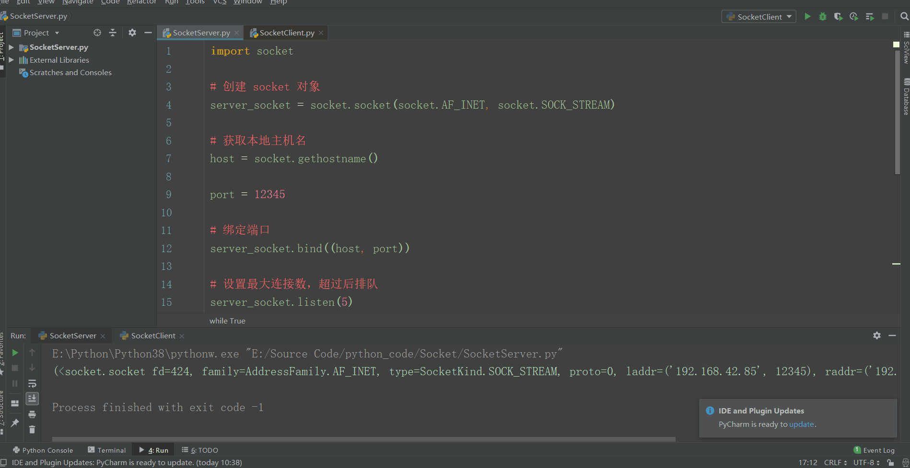

# 前言

## 什么是Socket?

Python 的 Socket 模块提供了一个标准的接口，可以让你使用网络连接来通信。

Socket 是一种网络通信技术，它提供了一个通用的接口来连接不同类型的网络，例如互联网、局域网和本地环回地址。你可以使用 Python 的 Socket 模块来创建客户端和服务器程序，以便在它们之间进行通信

<br>

## 什么是套接字?

套接字是用于在两台计算机之间进行网络通信的抽象层。它可以被看作是一个端口，可以用来连接不同计算机上的程序

套接字可以用于两台计算机之间的网络通信，也可以用于在同一台计算机上的程序之间进行通信。它们由两个部分组成：一个是地址，另一个是端口号。地址用来标识主机的网络位置，端口号用来标识运行在主机上的特定服务

常见的网络协议，如 TCP 和 UDP，都使用套接字来进行通信。套接字可以使用不同的协议来进行通信，比如 TCP 套接字和 UDP 套接字

套接字在多种编程语言中都有支持，例如 C，C++，Java 和 Python

<br>

## Socket的类型

Socket 可以分为两种类型：流式 Socket 和数据报式 Socket。

- 流式 Socket 是为了传输字节流而设计的，适用于传输大量数据，例如文件传输。
- 数据报式 Socket 是为了传输数据包而设计的，适用于传输少量数据，例如 DNS 查询

<br>

## Socket的通讯流程

Socket 通信包括服务端和客户端两个角色。

服务端通过调用 `socket` 函数创建 Socket，并调用 `bind`、`listen` 和 `accept` 函数监听连接请求。客户端通过调用 `socket` 函数创建 Socket，并调用 `connect` 函数连接服务端

当连接建立后，服务端和客户端就可以通过 `send` 和 `recv` 函数进行通信了。

同时, Socket 还支持设置选项，例如设置超时时间、关闭延迟等

<br>

## Socket异常处理

在 Python 中使用 socket 模块时，如果发生异常，会抛出一个异常对象。常见的 socket 异常包括如下:

- `ConnectionRefusedError`：连接被服务器拒绝。
- `ConnectionResetError`：连接被服务器重置。
- `timeout`：操作超时。
- `OSError`：操作系统错误。

如下代码所示, 为了处理 socket 异常，需要使用 `try`-`except` 语句

```python
import socket

try:
    # 创建 socket 对象
    s = socket.socket(socket.AF_INET, socket.SOCK_STREAM)
    # 连接服务器
    s.connect(('www.example.com', 80))
except ConnectionRefusedError:
    # 处理连接被拒绝的情况
    print("Connection refused by the server")
except timeout:
    # 处理超时的情况
    print("Timed out")
except OSError:
    # 处理操作系统错误的情况
    print("OS error")
```

在上面的代码中，我们尝试连接到给定的服务器，如果连接被拒绝，则会抛出 `ConnectionRefusedError` 异常；如果操作超时，则会抛出 `timeout` 异常；如果发生操作系统错误，则会抛出 `OSError` 异常。

<br>

# Socket模块函数

## 创建Socket对象

在 Python 中，你可以使用 `socket` 模块中的 `socket()` 函数来创建一个 Socket 对象。

例如，下面是一段代码，用于创建一个 Socket 对象

```python
import socket

# 创建 Socket 对象
sock = socket.socket()

# 这里可以做一些其他操作，例如绑定地址和端口，设置选项等
# ...
```

<br>

例如下面的代码, Socket.socket() 函数调用创建了一个 socket 对象，该对象使用两个参数初始化：

- socket.AF_INET：这表示使用 IPv4 协议。
- socket.SOCK_STREAM：这表示使用 TCP 协议

因此，这段代码创建的套接字是一个使用 IPv4 协议和 TCP 协议的网络套接字

```python
import socket

#使用Python的socket模块来创建套接字
client_socket = socket.socket(socket.AF_INET, socket.SOCK_STREAM)
```

<br>

## Socket对象常用方法

| Socket模块方法   | 描述                                 |
| ---------------- | ------------------------------------ |
| `sock.bind()`    | 绑定一个地址和端口号到 Socket 对象上 |
| `sock.listen()`  | 监听来自客户端的连接                 |
| `sock.accept()`  | 接收客户端的连接                     |
| `sock.connect()` | 连接到服务器                         |
| `sock.send()`    | 发送数据到服务器                     |
| `sock.recv()`    | 从服务器接收数据                     |
| `sock.close()`   | 关闭Socket对象                       |

<br>

## 关闭Socket对象

关闭Socket对象除了使用`sock.close()`, 还有一种常见的方法是使用 Python 的上下文管理器，这样就不用手动关闭 socket 对象

在下面的代码中，当执行完 `with` 语句块中的代码时，socket 对象会自动关闭。这种方法通常比手动关闭 socket 对象更方便。

另外，还有一点需要注意：在处理 socket 异常时，通常需要考虑关闭 socket 对象。否则可能会导致资源泄露

```python
import socket

with socket.socket(socket.AF_INET, socket.SOCK_STREAM) as s:
    # 连接服务器
    s.connect(('www.example.com', 80))
    # 在这里使用 socket 对象

# 在这里 socket 对象已经自动关闭
```

<br>

# 一个简单的Socket实例

## 客户端代码

```py
import socket

# 创建 socket 对象
client_socket = socket.socket(socket.AF_INET, socket.SOCK_STREAM)

# 获取本地主机名
host = socket.gethostname()

port = 12345

# 连接服务，指定主机和端口
client_socket.connect((host, port))

# 接收小于 1024 字节的数据
msg = client_socket.recv(1024)

# 关闭Socket对象
client_socket.close()

# 输出:对服务端发来的消息进行utf-8解码后的内容
print(msg.decode('utf-8'))
```

<br>

## 服务端代码

```python
import socket

# 创建 socket 对象
server_socket = socket.socket(socket.AF_INET, socket.SOCK_STREAM)

# 获取本地主机名
host = socket.gethostname()

port = 12345

# 绑定端口
server_socket.bind((host, port))

# 设置最大连接数，超过后排队
server_socket.listen(5)

while True:
    # 建立客户端连接
    client_socket, addr = server_socket.accept()
    print("连接地址: %s" % str(addr))
    
    # 对发送数据进行utf-8编码
    msg = "Hello World"
    client_socket.send(msg.encode('utf-8'))
    
    # 关闭Socket对象
    client_socket.close()
```

<br>

## 运行测试

先运行服务端代码, 再运行客户端代码, 随后在客户端界面接受到服务端发来的"Hello World"

	
