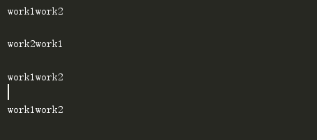
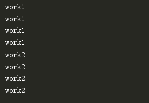

# 前言

## 什么是多线程

多线程是指在一个程序中同时创建和使用多个执行流(thread)来执行不同的任务。这样多个任务就可以同时进行，从而提高程序的执行效率。

<br>

## 在python使用多线程的方法

在 Python 中有两种方法可以使用多线程：使用 Python 自带的 `threading` 模块，或使用第三方库 `multiprocessing`。


## 多线程的优势

多线程的好处在于可以利用多核 CPU 的优势，让程序在等待 `I/O` 操作时使用其他 CPU 核心，从而提高程序的效率。不过由于 Python 的全局解释器锁(Global Interpreter Lock, 简称GIL)的存在，在 Python 中创建的线程并不能真正并行执行。如果你需要在 Python 中创建多个真正并行的线程，可以使用 `multiprocessing` 库。

<br>

## 线程的安全问题

在使用多线程时，需要注意线程安全问题。如果多个线程同时访问同一个变量，可能会导致数据不一致的问题。为了解决这个问题，可以使用 `threading` 模块中的锁(Lock)和条件变量(Condition)来控制线程同步

使用锁的方式可以保证线程安全，但是会导致线程的执行效率降低。因此在使用多线程时，需要谨慎考虑是否真的需要使用多线程

<br>

## 什么是阻塞

在多线程编程中，阻塞指的是一个线程被暂停执行，直到某个特定的条件被满足才能继续执行

例如在Python中，Queue类的`get()`方法会阻塞当前线程，直到有数据可以取出。这意味着，如果你在一个线程中调用get()方法，该线程会被暂停，直到有数据可以取出才能继续执行

同样，Queue类的`put()`方法也会阻塞当前线程，如果队列已满的话。这意味着，如果你在一个线程中调用`put()`方法，该线程会被暂停，直到有空位可以插入新的数据项才能继续执行


# threading模块常用方法

| threading模块函数                                        | 描述                                  |
| -------------------------------------------------------- | ------------------------------------- |
| `threading.Thread(target=func, args=tuple, kwargs=dict)` | 使用给定的参数创建一个新的 Thread对象 |
| `threading.active_count()`                               | 返回当前活动的线程数                  |
| `threading.current_thread()`                             | 返回当前所使用的线程                  |
| `threading.main_thread()`                                | 返回主线程                            |
| `threading.get_ident()`                                  | 返回线程标识符                        |
| `threading.enumerate()`                                  | 返回当前活动的所有线程的列表          |
| `threading.BoundedSemaphore(num)`                        | 控制线程同时执行的数量                |

| Thread对象函数    | 描述                                             |
| ----------------- | ------------------------------------------------ |
| `start()`         | 启动线程                                         |
| `join([timeout])` | 等待线程结束，如果提供了超时参数，则在超时后退出 |
| `is_alive()`      | 判断线程是否运行                                 |
| `setName(name)`   | 设置线程的名称                                   |
| `getName()`       | 获取线程名称                                     |

<br>

# threading模块常用操作

## 1.创建线程

首先，我们需要创建一个 `Thread` 类的实例，并将要执行的函数作为参数传递给该实例。例如：

```python
import threading

def my_function():
    print("Hello from a new thread!")

thread = threading.Thread(target=my_function)
```

<br>

可以使用 `Thread` 类的 `daemon` 属性来设置线程为守护线程。守护线程是一种特殊的线程，它在主线程结束时会自动结束

要将线程设置为守护线程，只需将其 `daemon` 属性设置为 `True`

```py
import threading

def my_function():
    print("Hello from a new thread!")

thread = threading.Thread(target=my_function, name="MyThread", daemon=True)
```

<br>

## 2.启动线程

接下来，可以使用 `thread.start()` 方法来启动新线程，运行 `my_function` 函数。

```python
import threading

def my_function():
    print("Hello from a new thread!")

thread = threading.Thread(target=my_function)
thread.start()
```

<br>

## 3.等待线程结束

如果要等待所有线程完成，可以使用 `thread.join()` 方法。例如：

```python
import threading

def my_function():
    print("Hello from a new thread!")

thread = threading.Thread(target=my_function)
thread.start()
thread.join()
```

<br>

## 4.判断线程是否运行

使用 `is_alive()` 方法可以检查线程是否在运行

在下面例子中，我们调用了线程的 `is_alive()` 方法来检查它是否在运行。如果线程仍在运行，则会输出 "Thread is still running."，否则会输出 "Thread is not running."

```python
import threading

def my_function():
    print("Hello from a new thread!")

thread = threading.Thread(target=my_function)
thread.start()
if thread.is_alive():
    print("Thread is still running.")
else:
    print("Thread is not running.")
```

<br>

## 5.设置和获取线程名称

可以使用 `Thread` 类的 `setName()` 和 `getName()` 方法来设置和获取线程的名称

```python
import threading

def my_function():
    print("Hello from a new thread!")

thread = threading.Thread(target=my_function)
thread.setName("MyThread")
print(thread.getName())
```

<br>

## 6.查看当前活动线程数

使用 Python 的内置函数 `threading.active_count()` 来查看当前活动的线程数

```python
import threading

def my_function():
    print("Hello from a new thread!")

thread1 = threading.Thread(target=my_function)
thread2 = threading.Thread(target=my_function)

thread1.start()
thread2.start()

print(threading.active_count())  #输出2
```

<br>

## 7.枚举当前活动线程

使用 `threading.enumerate()` 函数来枚举所有当前活动的线程

```python
import threading

def my_function():
    print("Hello from a new thread!")

thread1 = threading.Thread(target=my_function)
thread2 = threading.Thread(target=my_function)

thread1.start()
thread2.start()

threads = threading.enumerate()
for thread in threads:
    print(thread.getName())
```

<br>

# 多线程实现共享资源访问

## 设置线程执行的先后顺序

### 1.使用`join()`

首先举个没有使用`join()`函数的线程例子, 在下述代码的输出可知, 线程的执行是并发的(一起执行的), 并没有明确要求先执行完work1线程后再执行work2线程

```python
import threading
import time
def work1():
    for i in range(4):
        time.sleep(0.5)
        print("work1")

def work2():
    for i in range(4):
        time.sleep(0.5)
        print("work2")

def main():
    thread_add1 = threading.Thread(target=work1)
    thread_add1.start()
    thread_add2 = threading.Thread(target=work2)
    thread_add2.start()
main()
```

	

<br>

下面是使用了`join()`方法的代码, 从输出结果上看, 可以发现程序先等work1线程执行完后才能执行work2线程

```python
import threading
import time
def work1():
    for i in range(4):
        time.sleep(0.5)
        print("work1")

def work2():
    for i in range(4):
        time.sleep(0.5)
        print("work2")

def main():
    thread_add1 = threading.Thread(target=work1,name="work1") #name参数：给线程命名
    thread_add1.start()
    thread_add1.join()
    thread_add2 = threading.Thread(target=work2,name="work2")
    thread_add2.start()
main()
```

	

<br>

### 2.使用`threading.Lock()`

当多个线程试图访问同一个资源时，可能会发生资源竞争。为了避免这种情况，您可以使用 `lock()` 方法来锁定资源，并在访问完成后解锁

在下面的代码中, 我们使用 `lock.acquire()` 方法锁定资源，然后使用 `lock.release()` 方法在访问完成后解锁。这样只有一个线程可以访问资源，其他线程必须等待

```python
import threading
import time
lock = threading.Lock()
def work1():
    lock.acquire()
    for i in range(4):
        time.sleep(0.5)
        print("work1")
    lock.release()

def work2():
    lock.acquire()
    for i in range(4):
        time.sleep(0.5)
        print("work2")
    lock.release()

def main():
    thread_add1 = threading.Thread(target=work1,name="work1") #name参数：给线程命名
    thread_add1.start()
    thread_add2 = threading.Thread(target=work2,name="work2")
    thread_add2.start()


main()
```

	

<br>

### 3.使用`with`函数

利用with函数你就可以不写上锁解锁这两行代码了，和文件打开和关闭差不多

```python
import threading
import time
lock = threading.Lock()
def work1():
    with lock:
        for i in range(4):
            time.sleep(0.5)
            print("work1")


def work2():
    with lock:
        for i in range(4):
            time.sleep(0.5)
            print("work2")


def main():
    thread_add1 = threading.Thread(target=work1,name="work1") #name参数：给线程命名
    thread_add1.start()
    thread_add2 = threading.Thread(target=work2,name="work2")
    thread_add2.start()

main()
```

	

<br>

## 控制线程同时执行的数量

使用`threading.BoundedSemaphore()`方法来控制线程同时执行的数量

```python
import threading
import os
import time
semaphore = threading.BoundedSemaphore(5) #设置只能允许5个线程同时进行

def work1(se):
    se.acquire()
    print("test")
    se.release()

def main():
    for i in range(1,15):
        thread = threading.Thread(target=work1,args=(semaphore,)) #这里要注意,args参数需传递一个元组
        thread.start()
main()
```

<br>

# 创建自定义线程类

在 Python 中，线程的工作是通过实现一个名为 `run` 的方法来进行的。这个方法是在线程启动时自动运行的，并且是线程中执行的主要任务

你可以通过继承 `Thread` 类并实现 `run` 方法来创建自定义线程类。例如下面的代码:

```python
import threading

class MyThread(threading.Thread):
    def __init__(self, name):
        super().__init__()
        self.name = name

    def run(self):
        print(f"{self.name} starting")
        print(f"{self.name} finishing")
```

<br>

然后你可以使用这个类来创建线程

```python
thread = MyThread("MyThread")
thread.start()
```

在这种情况下，当调用 `thread.start()` 时，将会自动调用 `MyThread` 类的 `run` 方法

需要注意的是，你不应该直接调用 `run` 方法，而应该使用 `start` 方法来启动线程。如果你直接调用 `run` 方法，那么它将在主线程中运行，而不是在单独的线程中运行

还有一点需要注意的是，线程的 `run` 方法是可以被重写的

<br>

# 线程优先级队列

## 什么是Queue类

Queue是Python中的一个线程安全的队列类, 它支持在队列的两端执行高效的插入和删除操作, 还支持阻塞和超时功能

Queue类位于Python标准库中的queue模块中。你可以使用如下代码导入Queue类

```python
from queue import Queue
```

<br>

## Queue类常用方法

| Queue类方法                                 | 描述                                                         |
| ------------------------------------------- | ------------------------------------------------------------ |
| `Queue.qsize()`                             | 返回队列的大小                                               |
| `Queue.empty()`                             | 若队列为空，返回True,反之False                               |
| `Queue.full()`                              | 若队列满了，返回True,反之False                               |
| `Queue.put(item, block=True, timeout=None)` | 将item放入队列中。如果block为True，当队列满时会阻塞直到队列不满为止。如果block为False，当队列满时会立即抛出QueueFull异常。timeout参数可以用来设置阻塞的最长时间 |
| `Queue.get(block=True, timeout=None)`       | 从队列中取出一个元素。若block为True，当队列为空时会阻塞直到队列不为空为止。如果block为False，当队列为空时会立即抛出QueueEmpty异常。timeout参数可以用来设置阻塞的最长时间 |
| `Queue.task_done()`                         | 当一个任务从队列中取出并完成时，调用此方法。此方法用于通知队列已完成一个任务 |

<br>

## Queue类的简单使用

创建一个Queue对象，并选择是否指定队列的最大容量

```python
q = Queue()          # 创建一个无限容量的队列
q = Queue(maxsize=5) # 创建一个最大容量为5的队列
```

<br>

然后你就可以使用`put()`和`get()`方法来存取数据项了, 可以使用以下代码将数据项放入队列中

```python
q.put(1)
q.put(2)
q.put(3)
```

<br>

要从队列中取出数据项，可以使用get()方法

```python
print(q.get()) # 1
print(q.get()) # 2
print(q.get()) # 3
```

<br>

可以使用以下代码检查队列是否为空

```python
if q.empty():
    print('Queue is empty')
else:
    print('Queue is not empty')
```

<br>

可以使用以下代码检查队列是否已满

```python
if q.full():
    print('Queue is full')
else:
    print('Queue is not full')
```

<br>

## 线程池实现

假设我们想要实现一个线程池，其中有若干个工作线程来执行任务，并且有一个任务队列来存储待执行的任务。

我们可以使用Queue类来实现这个任务队列, 下面是一个使用Queue类实现线程池的例子

```python
import threading
from queue import Queue

# 定义一个工作线程类
class Worker(threading.Thread):
    def __init__(self, queue):
        super().__init__()
        self.queue = queue

    def run(self):
        while True:
            # 从队列中取出一个任务
            task = self.queue.get()
            # 执行任务
            print(f'{threading.current_thread().name} is executing task: {task}')
            # 通知队列任务已经完成
            self.queue.task_done()

# 创建一个任务队列
queue = Queue()

# 创建3个工作线程
for i in range(3):
    worker = Worker(queue)
    worker.start()

# 将任务放入队列
for i in range(10):
    queue.put(i)

# 阻塞直到队列中的所有任务都完成
queue.join()

print('All tasks are done!')

'''
输出结果如下:
Thread-1 is executing task: 0
Thread-1 is executing task: 1
Thread-1 is executing task: 2
Thread-1 is executing task: 3
Thread-1 is executing task: 4
Thread-1 is executing task: 5
Thread-1 is executing task: 6
Thread-3 is executing task: 7
Thread-3 is executing task: 8
Thread-2 is executing task: 9
All tasks are done!
'''
```

<br>

在上面的例子中，我们只是创建了3个工作线程，但这不一定是最优的做法。如果任务队列中的任务数量很多，3个工作线程可能不够。同时，如果任务数量很少，3个工作线程可能过于浪费资源。

因此，我们可以在线程池中动态地增加或减少工作线程的数量。这样，我们就可以根据实际需求来动态调整工作线程的数量，从而提高线程池的效率。

下面是一个动态调整工作线程数量的例子:

```python
import threading
from queue import Queue

# 定义一个工作线程类
class Worker(threading.Thread):
    def __init__(self, queue):
        super().__init__()
        self.queue = queue

    def run(self):
        while True:
            # 从队列中取出一个任务
            task = self.queue.get()
            # 执行任务
            print(f'{threading.current_thread().name} is executing task: {task}')
            # 通知队列任务已经完成
            self.queue.task_done()

# 创建一个任务队列
queue = Queue()

# 初始时，创建3个工作线程
for i in range(3):
    worker = Worker(queue)
    worker.start()

# 将任务放入队列
for i in range(10):
    queue.put(i)

# 当任务队列中的任务数量大于5时，增加工作线程的数量
while queue.unfinished_tasks > 5:
    worker = Worker(queue)
    worker.start()

# 等待所有任务完成
queue.join()
print("All tasks complete")
```


# 注意

- 使用threading模块的python文件名称不能取"threading", 否则导入threading模块时会报错, 例如: `module 'threading' has no attribute '_shutdown'`

- 一旦线程启动，就不能重新启动。如果需要重新启动线程，则必须创建一个新的线程
- 在使用线程时，需要注意资源竞争。在多线程环境中，各个线程可能会竞争共享资源，因此需要使用适当的同步机制来避免冲突
- 线程是不能被强制终止的，因此您必须在线程中提供一个退出机制
- 守护线程在后台运行，不会阻止程序的退出。如果您希望在线程中的任务执行完成后再退出程序，则不应使用守护线程


# 总结

总结一下，在 Python 中使用多线程的方法如下：

1. 导入 `threading` 模块。
2. 创建一个 `Thread` 类的实例，并将要执行的函数作为参数传递给该实例。
3. 调用 `thread.start()` 方法启动新线程。
4. 调用 `thread.join()` 方法等待所有线程完成。


