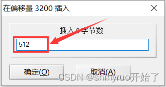

# 认识PE文件

## 什么是PE文件

PE（Portable Executable）文件是Windows操作系统上的一种可执行文件格式。它包含了可执行代码、数据、资源和元数据，以及其他必要的信息，例如程序入口点、导入表、导出表和重定位表等等。PE文件是Windows操作系统中所有可执行文件的标准格式，包括应用程序、动态链接库（DLL）、驱动程序等等

可执行文件在不同的操作系统平台有不同的结构

- Windows平台：PE(Portable Executable)
- Linux平台：ELF(Executable and Linking Format)

常见的PE文件后缀名有EXE, DLL,SYS等


## PE指纹

可以通过PE指纹来识别该文件是否为PE文件，首先用notepad打开此文件并查看其16进制格式，可以发现开头的ASCII码是"MZ"，然后观察偏移量为`3C`的位置,其硬编码为`F8`,对应的ASCII码为`?`


​	

然后再找到偏移量为`F8`的位置,发现一个`50`和`45`,其对应的ASCII码为`PE`


以下是通过识别PE指纹来判断PE文件的python代码

```python
import os

def is_pe_file(file_path):
    with open(file_path, 'rb') as f:
        # 读取DOS头的前两个字节，判断是否为MZ
        if f.read(2) != b'MZ':
            return False
        # 读取PE头的偏移量
        f.seek(0x3C)
        pe_offset = int.from_bytes(f.read(4), byteorder='little')  #int.from_bytes(bytes, byteorder)是一个Python内置函数，它将给定字节序列转换为一个整数。bytes参数是待转换的字节序列，byteorder参数指定了字节序，它可以是'little'或'big'，分别表示小端序和大端序。在Windows平台上，PE文件的字节序是小端序，因此我们使用'little'作为byteorder参数
      
        # 定位到PE头的位置
        f.seek(pe_offset)
        # 判断PE头的前两个字节是否为PE
        if f.read(2) != b'PE':
            return False
        return True

# 示例用法
file_path = 'test.exe'
if is_pe_file(file_path):
    print(f"{file_path}是一个PE文件")
else:
    print(f"{file_path}不是一个PE文件")
```

​	

## PE结构大体图


# PE结构

## PE结构概述图

由下图可得，PE结构主要分为四部分，分别有DOS部分、PE文件头、节表以及节数据


## DOS部分

### DOS MZ文件头	

PE文件的DOS头包含了一个DOS MZ头，用于兼容早期的MS-DOS操作系统。DOS头还包含了一个指向PE头的偏移量，通过该偏移量可以找到PE文件头

在以下结构体代码中的成员只需记住两个,最开始的和最末尾的成员,  `e_magic`和`e_lfanew`是构成PE指纹的重要成员,不能被修改

```c
typedef struct _IMAGE_DOS_HEADER {      
    WORD   e_magic;                     //通常为"MZ"
    WORD   e_cblp;                      
    WORD   e_cp;                        
    WORD   e_crlc;                      
    WORD   e_cparhdr;                   
    WORD   e_minalloc;                  
    WORD   e_maxalloc;                  
    WORD   e_ss;                        
    WORD   e_sp;                        
    WORD   e_csum;                      
    WORD   e_ip;                        
    WORD   e_cs;                        
    WORD   e_lfarlc;                    
    WORD   e_ovno;                      
    WORD   e_res[4];                    
    WORD   e_oemid;                     
    WORD   e_oeminfo;                   
    WORD   e_res2[10];                  
    LONG   e_lfanew;                    // 指向PE头的指针
  } IMAGE_DOS_HEADER, *PIMAGE_DOS_HEADER;
```


​	

### DOS块

DOS块则是DOS部分的一部分，它是DOS MZ头之后的一段数据，包括了DOS程序的执行代码和数据。DOS块通常由一些启动代码、程序入口点、代码段和数据段等组成，用来实现DOS程序的初始化和执行。

需要注意的是，虽然PE文件包含了DOS部分，但在Windows操作系统中，PE文件不需要执行DOS块中的代码。当Windows打开一个PE文件时，它会直接定位到PE头的位置，然后将PE头和节表加载到内存中，并执行PE头中指定的程序入口点，从而启动PE文件的执行


## PE文件头(NT头)

PE头又分为标识PE头、标准PE头、扩展PE头

PE文件一些重要信息通常存储在标准PE头和扩展PE头中

如下是PE文件头的结构体代码,分别有32位和64位的

```c
typedef struct _IMAGE_NT_HEADERS64 {
    DWORD Signature;  //标识PE头,占2字节
    IMAGE_FILE_HEADER FileHeader;  //标准PE头,占20字节
    IMAGE_OPTIONAL_HEADER64 OptionalHeader;  //扩展PE头,占224字节
} IMAGE_NT_HEADERS64, *PIMAGE_NT_HEADERS64;
```

```c
typedef struct _IMAGE_NT_HEADERS {
    DWORD Signature;
    IMAGE_FILE_HEADER FileHeader;
    IMAGE_OPTIONAL_HEADER32 OptionalHeader;
} IMAGE_NT_HEADERS32, *PIMAGE_NT_HEADERS32;
```


### 标识PE头

标识PE头通常占2个字节,用来标识该文件为PE文件


​	

### 标准PE头

标准PE头通常占20个字节，包括了PE文件的基本属性和信息，例如文件类型、机器架构、入口点、标志、段信息等等。其结构体代码如下所示：

```C
typedef struct _IMAGE_FILE_HEADER {
  	WORD    Machine;  //决定能运行在什么样的cpu上,若值为0则表示能任意cpu运行;值为14C表示能在intel386及后续版本;值为8664能运行在x64cpu上。因此可以用来判断程序是32位还是64位的
    
    WORD    NumberOfSections;  //表示当前节的数量
    
    DWORD   TimeDateStamp;  //编译器填写的时间戳,与文件创建或修改时间无关
    
    DWORD   PointerToSymbolTable;  //与调试相关
    
    DWORD   NumberOfSymbols;  //与调试相关
    
    WORD    SizeOfOptionalHeader; //扩展PE头的大小,一般32位为E0,64位为F0
    
    WORD    Characteristics;  //文件属性
} IMAGE_FILE_HEADER, *PIMAGE_FILE_HEADER;
```


### 扩展PE头

扩展PE头通常占224个字节，以下结构体成员中有几个成员要重点注意

如果一个可执行文件它的dos部分+pe头+节表的共同大小为332,其`FileAlignment`(文件对齐)的值为200, 那么`SizeOfHeaders`的值应该为文件对齐的整数倍,所以`SizeOfHeaders`的值为400

```C
#define IMAGE_NUMBEROF_DIRECTORY_ENTRIES 16
typedef struct _IMAGE_OPTIONAL_HEADER {
    WORD    Magic;  // PE文件的类型, 32位为0x10b, 64位为0x20b
    BYTE    MajorLinkerVersion;  //链接程序的主版本号
    BYTE    MinorLinkerVersion;  //链接程序的次版本号
    DWORD   SizeOfCode;   //所有代码节的总和
    DWORD   SizeOfInitializedData;  //初始化数据节的大小
    DWORD   SizeOfUninitializedData;  //未初始化节的大小
    DWORD   AddressOfEntryPoint;  //程序入口点
    DWORD   BaseOfCode;  //代码节的基地址
    DWORD   BaseOfData;  //数据节的基地址，仅在32位PE文件中有效
    DWORD   ImageBase;  //内存镜像基址
    DWORD   SectionAlignment;  //内存对齐
    DWORD   FileAlignment;  //文件对齐 
    WORD    MajorOperatingSystemVersion; //操作系统主版本号
    WORD    MinorOperatingSystemVersion;  //操作系统次版本号
    WORD    MajorImageVersion;  // PE文件的主版本号
    WORD    MinorImageVersion;  //PE文件的次版本号
    WORD    MajorSubsystemVersion;  //子系统主版本号
    WORD    MinorSubsystemVersion;  //子系统次版本号
    DWORD   Win32VersionValue;  //Win32版本值，通常为0
    DWORD   SizeOfImage;  //内存中整个PE文件映射的尺寸,可比实际值大,必须是内存对齐的整数倍
    DWORD   SizeOfHeaders;   //所有头+节表按照文件对齐后的大小,否则加载会出错
    DWORD   CheckSum;  //校验和,用来判断文件是否被修改
    WORD    Subsystem;  //子系统 驱动程序(1) 图形界面(2) 控制台或dll(3)
    WORD    DllCharacteristics;  // DLL文件特性，与Subsystem的值有关 
    DWORD   SizeOfStackReserve;  //初始化时保留栈的大小
    DWORD   SizeOfStackCommit;  //初始化时实际提交的大小
    DWORD   SizeOfHeapReserve;  //初始化时保留堆的大小
    DWORD   SizeOfHeapCommit;  //初始化时实际提交的大小
    DWORD   LoaderFlags;  //调试相关
    DWORD   NumberOfRvaAndSizes;  //目录项数目
    IMAGE_DATA_DIRECTORY DataDirectory[IMAGE_NUMBEROF_DIRECTORY_ENTRIES];
} IMAGE_OPTIONAL_HEADER32, *PIMAGE_OPTIONAL_HEADER32;
```


## 节表

节表包含了PE文件中所有的节信息，每个节都包括了一个段的名称、大小、属性和数据等信息

节表是由一系列`IMAGE_SECTION_HEADER`结构的元素组成的结构体数组, 每个元素占40个字节

以下是`IMAGE_SECTION_HEADER`结构体的代码

```c
#define IMAGE_SIZEOF_SHORT_NAME  8
typedef struct _IMAGE_SECTION_HEADER {
    BYTE    Name[IMAGE_SIZEOF_SHORT_NAME]; //ASCII字符串，当前节的名字
    union {
            DWORD   PhysicalAddress;  
            DWORD   VirtualSize;
    } Misc; //当前节实际的大小(内存未对齐)
    DWORD   VirtualAddress;  //节在内存中的偏移地址(真正的地址需加上Imagebase)
    DWORD   SizeOfRawData;  //节在文件对齐后的大小
    DWORD   PointerToRawData;  //节在文件中的偏移地址
    DWORD   PointerToRelocations;
    DWORD   PointerToLinenumbers;
    WORD    NumberOfRelocations;
    WORD    NumberOfLinenumbers;
    DWORD   Characteristics;  //节的属性,涉及到此节是否可读可写可执行
} IMAGE_SECTION_HEADER, *PIMAGE_SECTION_HEADER;
```


## 节数据

节数据是PE文件中实际的二进制数据，它包含了PE文件中所有的代码、数据和资源等信息。每个节的数据都位于PE文件中的一个连续的段中

PE文件中，不同的节用于存储不同类型的数据，通常包括以下几个节：

- .data节：用于存储PE文件中的静态数据，它是可读写的，通常包含全局变量、静态变量、已初始化的数据等等。
- .rdata节：用于存储PE文件中的只读数据，它是只读的，通常包含字符串、常量、只读数据等等。
- .text节：用于存储PE文件中的可执行代码，它是可执行的，通常包含程序的主要代码，例如函数、指令等等

- .rsrc节：用于存储PE文件中的资源，包括图标、位图、字符串、菜单等等，通常是只读的。
- .reloc节：reloc节用于存储PE文件中的重定位信息，它包含了需要被修改的地址和偏移量等信息，通常是只读写的。
- .tls节：用于存储PE文件中的线程本地存储(Thread Local Storage，TLS)相关信息，包括TLS索引、初始化回调函数等等, 通常是可读写的。


# RVA转FOA

## 什么是RVA和FOA

PE文件有两种状态, 一种是在文件中的状态,另外一种是在内存中展开的状态

若我们运行了一个PE文件且知道了某个全局变量在内存中的地址, 那么该如何通过这个地址来算出此全局变量在文件状态下的地址是多少呢？

- **RVA**(relative Virtual Address), 又称为相对虚拟偏移,简单来说就是在内存状态下的偏移地址
- **FOA**(File Ofseet Address), 又称为文件偏移地址, 就是在文件状态下的偏移地址

下图是PE文件在文件对齐和内存对齐状态下的映像结构图。这里文件对齐值是200，内存对齐的值是1000。内存对齐后的映像分布有个明显的拉伸

	


## 计算方法

**1.求RVA的值**

RVA = 全局变量在内存中的地址 - ImageBase(基址)


**2.判断RVA是否位于PE头中或者内存对齐是否等于文件对齐**

- 如果RVA位于PE头中,则RVA = FOA

- 如果文件对齐 = 内存对齐,则 RVA = FOA

- 如果不在则进行下述操作


**3.判断RVA位于哪个节**

假设rva位于X节中，也就是说X节.VirtualAddress <= RVA <= X节.VirtualAddress+X节内存对齐后的大小

差值 = RVA - X节.VirtualAddress


**4.得出FOA**

FOA = X节.PointerToRawData(X节在文件中的地址) + 差值


## C++代码

**代码出处：**https://www.52pojie.cn/thread-1408576-1-1.html

```c++
// PE.cpp : Defines the entry point for the console application.
//
#include <stdio.h>
#include <malloc.h>
#include <windows.h>
#include <winnt.h>
#include <math.h>
//在VC6这个比较旧的环境里，没有定义64位的这个宏，需要自己定义，在VS2019中无需自己定义
#define IMAGE_FILE_MACHINE_AMD64  0x8664

//VA转FOA 32位
//第一个参数为要转换的在内存中的地址：VA
//第二个参数为指向dos头的指针
//第三个参数为指向nt头的指针
//第四个参数为存储指向节指针的数组
UINT VaToFoa32(UINT va, _IMAGE_DOS_HEADER *dos,_IMAGE_NT_HEADERS* nt, _IMAGE_SECTION_HEADER** sectionArr) {
    //得到RVA的值：RVA = VA - ImageBase
    UINT rva = va - nt->OptionalHeader.ImageBase;
    //输出rva
    printf("rva:%X\n", rva);
    //找到PE文件头后的地址 = PE文件头首地址+PE文件头大小
    UINT PeEnd = (UINT)dos->e_lfanew+sizeof(_IMAGE_NT_HEADERS);
    //输出PeEnd
    printf("PeEnd:%X\n", PeEnd);
    //判断rva是否位于PE文件头中
    if (rva < PeEnd) {
        //如果rva位于PE文件头中，则foa==rva，直接返回rva即可
        printf("foa:%X\n", rva);        
        return rva;
    }
    else {
        //如果rva在PE文件头外
        //判断rva属于哪个节
        int i;
        for (i = 0; i < nt->FileHeader.NumberOfSections; i++) {
            //计算内存对齐后节的大小
            UINT SizeInMemory = ceil((double)max((UINT)sectionArr[i]->Misc.VirtualSize ,(UINT)sectionArr[i]->SizeOfRawData ) / (double)nt->OptionalHeader.SectionAlignment)* nt->OptionalHeader.SectionAlignment;

            if (rva >= sectionArr[i]->VirtualAddress && rva < (sectionArr[i]->VirtualAddress + SizeInMemory)) {
                //找到所属的节
                //输出内存对齐后的节的大小
                printf("SizeInMemory:%X\n", SizeInMemory);
                break;
            }
        }
        if (i >= nt->FileHeader.NumberOfSections) {
            //未找到
            printf("没有找到匹配的节\n");
            return -1;
        }
        else {
            //计算差值= RVA - 节.VirtualAddress
            int offset = rva - sectionArr[i]->VirtualAddress;
            //FOA = 节.PointerToRawData + 差值
            int foa = sectionArr[i]->PointerToRawData + offset;
            printf("foa:%X\n", foa);
            return foa;
        }

    }

}

//VA转FOA 64位
//第一个参数为要转换的在内存中的地址：VA
//第二个参数为指向dos头的指针
//第三个参数为指向nt头的指针
//第四个参数为存储指向节指针的数组
UINT VaToFoa64(UINT va, _IMAGE_DOS_HEADER* dos, _IMAGE_NT_HEADERS64* nt, _IMAGE_SECTION_HEADER** sectionArr) {
    //得到RVA的值：RVA = VA - ImageBase
    UINT rva = va - nt->OptionalHeader.ImageBase;
    //输出rva
    printf("rva:%X\n", rva);
    //找到PE文件头后的地址 = PE文件头首地址+PE文件头大小
    UINT PeEnd = (UINT)dos->e_lfanew + sizeof(_IMAGE_NT_HEADERS64);
    //输出PeEnd
    printf("PeEnd:%X\n", PeEnd);
    //判断rva是否位于PE文件头中
    if (rva < PeEnd) {
        //如果rva位于PE文件头中，则foa==rva，直接返回rva即可
        printf("foa:%X\n", rva);
        return rva;
    }
    else {
        //如果rva在PE文件头外
        //判断rva属于哪个节
        int i;
        for (i = 0; i < nt->FileHeader.NumberOfSections; i++) {
            //计算内存对齐后节的大小
            UINT SizeInMemory = ceil((double)max((UINT)sectionArr[i]->Misc.VirtualSize ,(UINT)sectionArr[i]->SizeOfRawData ) / (double)nt->OptionalHeader.SectionAlignment)* nt->OptionalHeader.SectionAlignment;

            if (rva >= sectionArr[i]->VirtualAddress && rva < (sectionArr[i]->VirtualAddress + SizeInMemory)) {
                //找到所属的节
                //输出内存对齐后的节的大小
                printf("SizeInMemory:%X\n", SizeInMemory);
                break;
            }
        }
        if (i >= nt->FileHeader.NumberOfSections) {
            //未找到
            printf("没有找到匹配的节\n");
            return -1;
        }
        else {
            //计算差值= RVA - 节.VirtualAddress
            int offset = rva - sectionArr[i]->VirtualAddress;
            //FOA = 节.PointerToRawData + 差值
            int foa = sectionArr[i]->PointerToRawData + offset;
            printf("foa:%X\n", foa);
            return foa;
        }

    }

}
int main(int argc, char* argv[])
{
    //创建DOS对应的结构体指针
    _IMAGE_DOS_HEADER* dos;
    //读取文件，返回文件句柄
    HANDLE hFile = CreateFileA("C:\\Users\\lyl610abc\\Desktop\\GlobalVariety.exe", GENERIC_READ, FILE_SHARE_READ, NULL, OPEN_EXISTING, 0, 0);
    //根据文件句柄创建映射
    HANDLE hMap = CreateFileMappingA(hFile, NULL, PAGE_READONLY, 0, 0, 0);
    //映射内容
    LPVOID pFile = MapViewOfFile(hMap, FILE_MAP_READ, 0, 0, 0);
    //类型转换，用结构体的方式来读取
    dos = (_IMAGE_DOS_HEADER*)pFile;
    //输出dos->e_magic，以十六进制输出
    printf("dos->e_magic:%X\n", dos->e_magic);

    //创建指向PE文件头标志的指针
    DWORD* peId;
    //让PE文件头标志指针指向其对应的地址=DOS首地址+偏移
    peId = (DWORD*)((UINT)dos + dos->e_lfanew);
    //输出PE文件头标志，其值应为4550，否则不是PE文件
    printf("peId:%X\n", *peId);

    //创建指向可选PE头的第一个成员magic的指针
    WORD* magic;
    //让magic指针指向其对应的地址=PE文件头标志地址+PE文件头标志大小+标准PE头大小
    magic = (WORD*)((UINT)peId + sizeof(DWORD) + sizeof(_IMAGE_FILE_HEADER));
    //输出magic，其值为0x10b代表32位程序，其值为0x20b代表64位程序
    printf("magic:%X\n", *magic);
    //根据magic判断为32位程序还是64位程序
    switch (*magic) {
    case IMAGE_NT_OPTIONAL_HDR32_MAGIC:
    {
        printf("32位程序\n");
        //确定为32位程序后，就可以使用_IMAGE_NT_HEADERS来接收数据了
        //创建指向PE文件头的指针
        _IMAGE_NT_HEADERS* nt;
        //让PE文件头指针指向其对应的地址
        nt = (_IMAGE_NT_HEADERS*)peId;
        printf("Machine:%X\n", nt->FileHeader.Machine);
        printf("Magic:%X\n", nt->OptionalHeader.Magic);

        //创建一个指针数组，该指针数组用来存储所有的节表指针
        //这里相当于_IMAGE_SECTION_HEADER* sectionArr[nt->FileHeader.NumberOfSections],声明了一个动态数组
        _IMAGE_SECTION_HEADER** sectionArr = (_IMAGE_SECTION_HEADER**) malloc(sizeof(_IMAGE_SECTION_HEADER*) * nt->FileHeader.NumberOfSections);

        //创建指向块表的指针
        _IMAGE_SECTION_HEADER* sectionHeader;
        //让块表的指针指向其对应的地址
        sectionHeader = (_IMAGE_SECTION_HEADER*)((UINT)nt + sizeof(_IMAGE_NT_HEADERS));
        //计数，用来计算块表地址
        int cnt = 0;
        //比较 计数 和 块表的个数，即遍历所有块表
        while(cnt< nt->FileHeader.NumberOfSections){
            //创建指向块表的指针
            _IMAGE_SECTION_HEADER* section;
            //让块表的指针指向其对应的地址=第一个块表地址+计数*块表的大小
            section = (_IMAGE_SECTION_HEADER*)((UINT)sectionHeader + sizeof(_IMAGE_SECTION_HEADER)*cnt);
            //将得到的块表指针存入数组
            sectionArr[cnt++] = section;
            //输出块表名称
            printf("%s\n", section->Name);
        }

        VaToFoa32(0x4198B0,dos, nt, sectionArr);

        break;
    }

    case IMAGE_NT_OPTIONAL_HDR64_MAGIC:
    {
        printf("64位程序\n");
        //确定为64位程序后，就可以使用_IMAGE_NT_HEADERS64来接收数据了
        //创建指向PE文件头的指针
        _IMAGE_NT_HEADERS64* nt;
        nt = (_IMAGE_NT_HEADERS64*)peId;
        printf("Machine:%X\n", nt->FileHeader.Machine);
        printf("Magic:%X\n", nt->OptionalHeader.Magic);

        //创建一个指针数组，该指针数组用来存储所有的节表指针
        //这里相当于_IMAGE_SECTION_HEADER* sectionArr[nt->FileHeader.NumberOfSections],声明了一个动态数组
        _IMAGE_SECTION_HEADER** sectionArr = (_IMAGE_SECTION_HEADER**)malloc(sizeof(_IMAGE_SECTION_HEADER*) * nt->FileHeader.NumberOfSections);

        //创建指向块表的指针
        _IMAGE_SECTION_HEADER* sectionHeader;
        //让块表的指针指向其对应的地址，区别在于这里加上的偏移为_IMAGE_NT_HEADERS64
        sectionHeader = (_IMAGE_SECTION_HEADER*)((UINT)nt + sizeof(_IMAGE_NT_HEADERS64));
        //计数，用来计算块表地址
        int cnt = 0;
        //比较 计数 和 块表的个数，即遍历所有块表
        while (cnt < nt->FileHeader.NumberOfSections) {
            //创建指向块表的指针
            _IMAGE_SECTION_HEADER* section;
            //让块表的指针指向其对应的地址=第一个块表地址+计数*块表的大小
            section = (_IMAGE_SECTION_HEADER*)((UINT)sectionHeader + sizeof(_IMAGE_SECTION_HEADER) * cnt);
            //将得到的块表指针存入数组
            sectionArr[cnt++] = section;
            //输出块表名称
            printf("%s\n", section->Name);
        }
        break;
    }

    default:
    {
        printf("error!\n");
        break;
    }

    }
    return 0;
}
```


# 节的操作

若要对PE文件填充自己的代码，然后发现字节空间不足，这时候就需要对节表进行操作

此处主要讲节的三种操作，分别为**扩大节**、**新增节**、**合并节**


## 扩大节

对文件的节表进行扩大,为了方便操作，只需对最后一个节进行扩大OK了

此处演示扩大1000(16进制)个字节的操作


### 所需工具

- Winhex
- CFF Explorer


### 实例演示

首先将可执行文件拖入到CFF Explorer工具，查看其PE属性，例如文件对齐与内存对齐的值，此处内存对齐的值是1000，文件对齐的值是200


再查看最后一个节(rsrc)的`Virtual Size`(节的实际大小)和`Raw Size`(节文件对齐后的大小)，此处rsrc节的`Virtual Size`值为1E0, `Raw Size`的值为200, 两者取最大值200

再取200与1000(内存对齐)的最小公倍数,结果为1000

1000再加上1000(需扩大的字节数), 结果为2000

随后将`Virtual Size`和`Raw Size`的值都修改为2000

节内存对齐所增加的字节 = 节内存对齐后的大小(1000) - 节文件对齐后的大小(200), 计算结果为E00, 这个值在后面用winhex工具添加字节的操作中要用到


​		

转到PE扩展头查看`SizeOfimage`(整个PE文件内存对齐后的大小),此处值为9000

将其修改成9000+1000(扩大的字节数), 即修改成10000

	


将文件保存后拖入到winhex中打开,将光标移动至最后一个字节,执行如下图操作

	

		


要插入的字节数 = E00(节内存对齐增加的字节) + 1000(需扩大的字节) = 1E00, 此处需换算成10进制,即为7680

	


然后winhex保存文件, 执行文件,若程序成功运行则说明扩大节操作成功


## 新增节

扩大节扩出来的空白区还需要考虑节的权限问题，若扩大出来的节没有执行代码的权限，那么还要修改整个节的权限属性，节的权限属性由节表结构体的最后一个成员Characteristics决定，但是新增的节可以自己设置权限，所以相比扩大节而言还是方便挺多的


### 所需工具

- winhex
- CFE Explorer


### 实例演示

将可执行文件拖入CFE Explorer中，找到段头部(节表属性)


在最后一个节的后面新增节, 以此方便后续的操作。对着最后一个节鼠标右键，为了研究原理，这里选择add section(Header Only), 意思为仅添加节表头，若不想自己添加节数据，可以选择add section(File data) 


对节表进行修改, 如下表格所示：

| 节的成员        | 含义                 | 修改后的值                                                |
| --------------- | -------------------- | --------------------------------------------------------- |
| Name            | 节的名字             | .fuck                                                     |
| Virtual Size    | 节的实际大小         | 1000(要新增节的大小)                                      |
| Virtual Address | 节在内存中的偏移地址 | 9000(上一个节.Virtual Address + 上一个节内存对齐后的大小) |
| Raw Size        | 节文件对齐后的大小   | 1000(新增节的大小)                                        |
| Raw Address     | 节在文件中的偏移地址 | 4E00(上一个节.RawAdress + 上一个节.Raw Size)              |
| Characteristics | 节的属性             | 0(即可读可写可执行)                                       |


切换到PE扩展头,修改SizeOfimage的值为10000(原先值9000+新增的字节1000)	

	


文件保存后拖入到Winhex,新增4096个字节(16进制的1000),这里就不演示了,上面扩大节的操作已经演示过了


## 合并节

新增节有一个前提条件，最后一个节后面至少要有40个字节的空白区

若前提条件不满足, 那只能合并节，即将多个节合并成一个节，多余的空间就可以用于新增节


### 所需工具

- Winhex
- CFE Explorer


### 内存对齐

为了进行后面的合并节，需要先将所有的节进行内存对齐

内存对齐的意思是令节文件对齐后的大小和内存对齐后的大小相等

这里我们要将所有的节合并，所以全部节表都要进行内存对齐

只需修改节表三个成员值，分别是Virtual Size、Raw Size、Raw Address

此处演示的PE文件内存对齐值为1000


首先是第一个text节，将Virtual Size与Raw Size的值修改成内存对齐后的大小, 即修改成3000

==注意:== 由于是第一个节, 所以Raw Address的值就不用修改

	


第二个是rdata节，同样将Virtual Size与Raw Size的值修改成内存对齐后的大小

Raw Address = text节.Raw Address(400) + text节.Raw Size(3000)


​	

后面节的操作依次按上述操作来进行，下图是所有节内存对齐前和内存对齐后的对比


计算出每个节的末尾地址, 随后在每个节的末尾地址填充字节

首先计算text节的内存对齐所增加的大小，称之为差值

差值 =  节内存对齐后的大小(3000) - 节文件对齐后的大小(2E00) = 200

text节的末尾地址 = 下一个节.RawAddress(3400) - 差值(200) = 3200


将程序拖入winhex, 点击工具栏的转到偏移量,输入text节的末尾地址, 随后光标会跳转到text节的末尾地址处

	

		


右键编辑插入0字节,插入512(十六进制的200,即差值)个字节

			


根据以上的步骤来完成对后面节的内存对齐, 此处要注意最后一个节的内存对齐

例如这里最后一个节的差值为E00, 不用计算它的节末尾地址, 直接将光标拖到文件末尾, 插入3584(E00的十进制)个字节即可


### 合并演示

内存对齐后再将可执行文件拖入CFE Explorer, 只需修改第一个节的属性

将`Vitrual Size`和`Raw Size`的值修改成所有节内存对齐后大小的总和(3000+2000+1000+1000+1000=8000), 即修改成8000

将`characteristics`(节权限)的值修改成所有节的`characteristics`值相互异或运算后的结果, 即修改为E0000060, 这样修改的目的是令第一个节拥有所有节表的权限属性

	


​		

再将其他的节表头删掉,只留下一个text节表


将PE头里的`NumberOfSections`(节表个数)的值修改成1


后面程序执行成功则代表节合并成功

​		

# 导出表与导入表

通常来讲exe文件只有导入表而没有导出表，而dll文件既有导入表也有导出表


## 导出表

### 什么是导出表

代码重用机制提供了重用代码的动态链接库, 它会向调用者说明库里的哪些函数是可以被别人使用的, 而这些说明的信息便组成了**导出表**

简单来说,PE文件提供一些函数给其他PE文件调用，这些函数都记录在**导出表**里面


### 导出表结构体代码

```c
typedef struct _IMAGE_EXPORT_DIRECTORY {
    DWORD   Characteristics;
    DWORD   TimeDateStamp;  //时间戳
    WORD    MajorVersion;
    WORD    MinorVersion;
    DWORD   Name;   //指向导出表文件名字符串
    DWORD   Base;   //导出函数起始序号
    DWORD   NumberOfFunctions;  //所有导出函数的个数
    DWORD   NumberOfNames;  //以函数名字导出的函数的个数
    DWORD   AddressOfFunctions;     // 导出函数地址表的RVA
    DWORD   AddressOfNames;         // 导出函数名称表的RVA
    DWORD   AddressOfNameOrdinals;  // 导出函数序号表的RVA
} IMAGE_EXPORT_DIRECTORY, *PIMAGE_EXPORT_DIRECTORY;
```


### 定位导出表的地址

导出表的地址和大小是由PE扩展头的最后一个成员`NumberOfRvaAndSizes`所决定的，这个成员是个结构体数组，对应结构体类型为`_IMAGE_DATA_DIRECTORY`

```c
typedef struct _IMAGE_DATA_DIRECTORY {
    DWORD   VirtualAddress;  //导出表的起始地址
    DWORD   Size;  //导出表的大小
} IMAGE_DATA_DIRECTORY, *PIMAGE_DATA_DIRECTORY;	
```


将可执行程序拖入CFFE工具查看，特别要注意的是这个导出表的地址是RVA(即表示在内存状态下的偏移地址)，若想知道其在文件状态下的起始地址, 需将RVA转换成FOA

	


这里就不转换成FOA了，毕竟工具已经为我们转换好了。切换至输出目录, 即导出表，Characteristics成员的偏移值就是导出表的FOA, 此处导出表的起始地址为`1BD20`

	


### 导出表里的三张表

导出表里有三张表,分别是==导出函数地址表==、==导出函数名称表==、==导出函数序号表==

这三张表有着紧密的联系，如下图所示，导出表有三个导出函数，分别是Add、Sub、Div

若某个PE文件想调用这个导出表的Add函数，会通过查询名称表找到对应的下标；随后通过下标在序号表中找到对应的序号；再通过序号来对应地址表里的下标，便可查询到函数的地址

		


将可执行程序拖入CFFE工具里查看，可以发现，这三张表之间的对应关系工具已经为我们排列好了

	


## 导入表

### 什么是导入表

任何PE文件还会调用哪些PE文件都会记录在导入表里。

因为PE文件可能要依赖多个模块，所以通常一个PE文件会有多张导入表。


### 什么是INT表和IAT表

INT表的全称是Import Name Table，中文翻译为“导入名称表”。在PE文件中，导入名称表是导入表（Import Table）的一个子部分，用于存储PE文件中导入函数的名称。导入名称表通常包含了一个函数名称的列表，每个名称对应着一个被导入的函数。当PE文件被加载到内存中时，Windows操作系统会使用导入名称表中的名称来查找相应的函数，并将函数的地址存储到IAT(Import Address Table)表, IAT表的全称为“导入地址表”


### 导入表的结构体代码

```C
//导入表的结构体代码
typedef struct _IMAGE_IMPORT_DESCRIPTOR {
    union {
        DWORD   Characteristics;            
        DWORD   OriginalFirstThunk;         
    } DUMMYUNIONNAME;  //RVA,指向INT表(导入名称表),是个IMAGE_THUNK_DATA结构体数组
    DWORD   TimeDateStamp;   //时间戳                                                        
    DWORD   ForwarderChain;                 
    DWORD   Name;    //RVA,指向所依赖的dll(模块)的名字
    DWORD   FirstThunk;  //指向IAT(导入地址表)的指针,也是个IMAGE_THUNK_DATA结构体数组           
} IMAGE_IMPORT_DESCRIPTOR;
```

```c
typedef struct _IMAGE_THUNK_DATA32 {
    union {
        DWORD ForwarderString;      // PBYTE 
        DWORD Function;             // PDWORD
        DWORD Ordinal;
        DWORD AddressOfData;        // RVA,指向IMAGE_IMPORT_BY_NAME
    } u1;
} IMAGE_THUNK_DATA32;
```

```c
typedef struct _IMAGE_IMPORT_BY_NAME {
    WORD    Hint;   //可为空,若不为空则为函数在导出表的索引
    CHAR   Name[1];  //函数名称
} IMAGE_IMPORT_BY_NAME, *PIMAGE_IMPORT_BY_NAME;
```


### 确定导入表的函数名称

结合上述导入表的结构体成员,下图我只列举三个重要的成员,分别是`OriginalFirstThunk`、`Name`、`FirstThunk`

`OriginalFirstThunk`指向了INT(`Import Name Table`)表, 里面存放着`IMAGE_THUNK_DATA`结构的成员

`IMAGE_THUNK_DATA`结构里的最后一个成员`AddressOfData`指向`IMAGE_IMPORT_BY_NAME`，而`IMAGE_IMPORT_BY_NAME`结构存放导入函数的名称，由此可确定导入表里函数的名称

在PE加载前，IAT表跟INT表是一样的，都可以找到导入函数的名称，但是PE加载后就变得不一样了

		


### 确定导入表的函数地址

下图是PE加载后的导入表结构图, PE文件加载后IAT表不再存放IMAGE_THUNK_DATA, 而是存放函数的地址

		


若程序的导入地址表被加壳工具给加密了从而导致函数地址表损坏，则可以通过INT表查询到函数的名称，随后调用GetProcessAddress获取到函数地址，随后再将函数地址写入IAT表，这种技术常用于加壳与脱壳	


### 用PE工具查看

使用CFEE工具打开dll文件，切换到导入目录，这里记录着所有导入表以及其属性


​	

单击其中一个模块, 即可查询此模块提供的函数名以及地址	

	


# 重定位表	

## 什么是重定位表

重定位表是PE文件结构中的一个部分，主要负责在PE文件（如可执行文件或DLL）加载到非预定的基址时对其中的地址引用进行修正。

当我们说PE文件在内存中有一个“基址”时，我们是指它预期在内存中的起始地址。但是，由于各种原因（例如其他模块已经占用了该地址），PE文件可能无法加载到其预定的基址。在这种情况下，操作系统的加载器需要将其加载到一个不同的地址，然后修正PE文件内部所有的地址引用，使它们指向正确的位置。重定位表提供了这些地址修正所需的信息


## 重定位表的定位

重定位表，与导出表和导入表相似，都是存储在扩展PE头中的`DataDirectory`数组内。具体来说，`DataDirectory`数组中的每个成员都对应一张表。其中，`DataDirectory[5]`正是指向重定位表的。


## 重定位表的结构

### 结构定义代码

```c
typedef struct _IMAGE_BASE_RELOCATION {
  DWORD   VirtualAddress;// 重定位块的RVA
  DWORD   SizeOfBlock; // 重定位块的大小
//WORD    TypeOffset[1]; 
} IMAGE_BASE_RELOCATION;
typedef IMAGE_BASE_RELOCATION UNALIGNED * PIMAGE_BASE_RELOCATION;
```


### 结构解释

- **重定位块**：重定位表实际上由一系列重定位块组成。每个重定位块都对应于PE文件中的一个特定内存页面(4KB)
- **每个块的结构**：
  - `IMAGE_BASE_RELOCATION`结构标志着每个重定位块的开始。该结构主要包含了块的大小和起始地址。
  - 随后是一个数组，其中的每个条目都表示需要进行重定位的偏移量。
- **条目的类型和偏移**：每个条目都是16位，其中高4位描述了重定位的类型，低12位描述了在当前块中的偏移。


### 重定位表数据项

重定位表块中最后一个是一个数组，数组的每一项数据的大小均为2字节，其中高4位描述了重定位的类型，低12位描述了在当前块中的偏移

以下表格表示高四位的作用：

| 值   | 常量符号                       | 含义                                               |
| ---- | ------------------------------ | -------------------------------------------------- |
| 0    | IMAGE_REL_BASED_ABSOLUTE       | 无意义，仅作对齐作用                               |
| 1    | IMAGE_REL_BASED_HIGH           | 需要修正的是地址的高16位                           |
| 2    | IMAGE_REL_BASED_LOW            | 需要修正的是地址的低16位                           |
| 3    | IMAGE_REL_BASED_HIGHLOW        | 使用完整的32位修正地址                             |
| 4    | IMAGE_REL_BASED_HIGHADJ        | 修正一个带有高16位的地址，并将下一个条目用于低16位 |
| 5    | IMAGE_REL_BASED_MIPS_JMPADDR   | 用于某些特定的MIPS处理器                           |
| 6    | RESERVED                       | 未使用                                             |
| 7    | RESERVED                       | 未使用                                             |
| 8    | IMAGE_REL_BASED_MIPS_JMPADDR16 | 用于某些特定的MIPS处理器                           |
| 9    | IMAGE_REL_BASED_IA64_IMM64     | 用于IA64处理器的特定场景                           |
| 10   | IMAGE_REL_BASED_DIR64          | 对于64位系统，使用完整的64位修正地址               |

然而在实际的PE文件中，通常我们只能看到0和3这两种情况(对应二进制为0000和0011), 也就是说这一项要么对齐要么修正


假设`IMAGE_BASE_RELOCATION`的`VirtualAddress`值为`0x1000`，一个重定位条目的低12位为`0x10`。那么在此块中需要修正的偏移量为`0x10`，于是需要修正的虚拟地址偏移就是`0x1010`（`0x1000` + `0x10`）

如果在处理文件内容时(文件状态下)，需要将`VirtualAddress`转换为文件偏移量(FOA)。例如此处FOA值为0x400, 那么需要修正的文件地址偏移是`0x410`（`0x400` + `0x10`）


			


