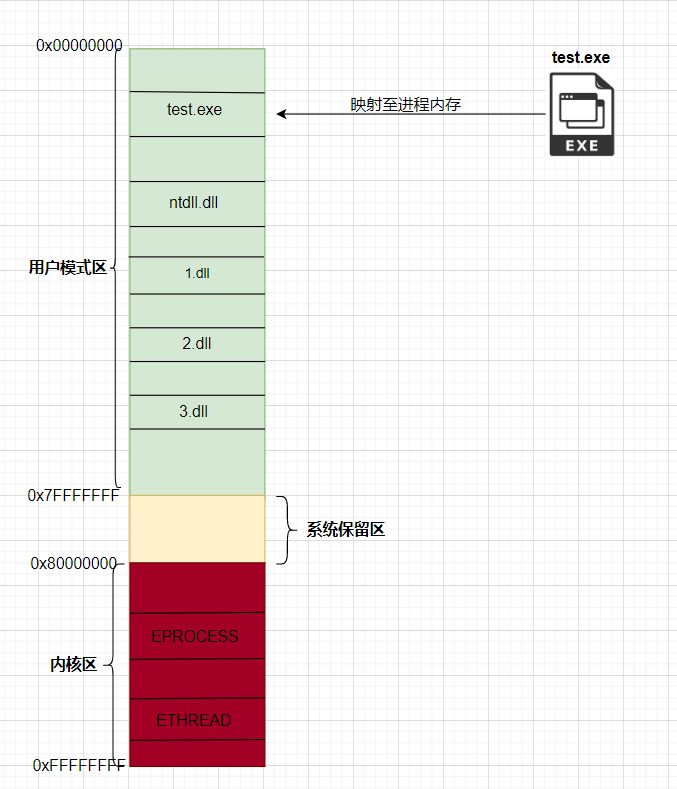
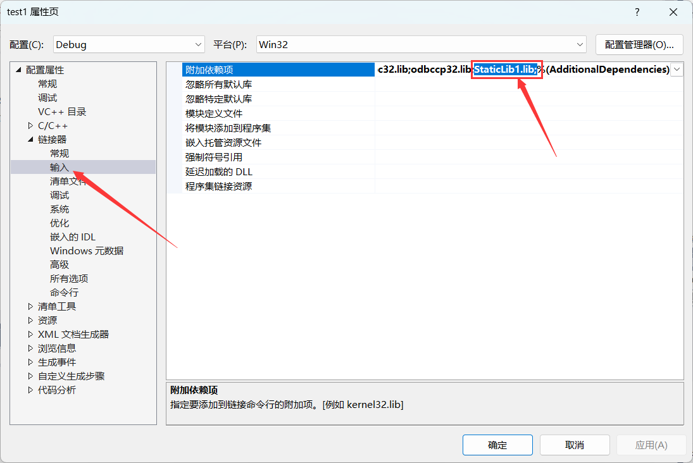

# 前言

## 什么是WIN32 API

Win32 API是Windows平台上的一组应用程序接口，可以在C/C++等编程语言中使用，用于访问Windows操作系统的各种功能和资源，如文件、窗口、消息等。Win32 API提供了一系列的函数和数据结构，开发人员可以利用这些API实现Windows应用程序的各种功能，如窗口创建、消息处理、文件操作、进程管理等


## API存放在哪里

Win32 API函数是通过DLL（动态链接库）实现的。这些DLL文件通常位于Windows系统目录的System32子目录下，例如`C:\Windows\System32`。每个DLL文件包含一个或多个函数的实现，这些函数可以被其他应用程序或者系统程序调用

通常来讲, `C:\Windows\System32`中存放的是64位DLL文件，而`C:\Windows\SysWOW64`中存放的是32位DLL文件


## 几个重要的DLL

### 1.kernel32.dll

kernel32.dll是Windows操作系统的核心动态链接库之一，它包含了大量的系统级函数，用于操作系统管理、内存管理、文件I/O、多线程、进程管理等方面。这些函数为开发人员提供了对底层系统资源的访问，使得开发者可以编写高效、可靠的应用程序。一些常见的函数包括CreateFile、ReadFile、WriteFile、GetModuleHandle、GetLastError等等


### 2.user32.dll

user32.dll是Windows操作系统的用户界面动态链接库，它包含了一系列用于窗口、消息、菜单、对话框、剪贴板等用户界面组件的函数。这些函数可以帮助开发人员实现各种视觉元素、控件、交互效果等等，提高了应用程序的交互性和易用性。一些常见的函数包括CreateWindowEx、SendMessage、SetWindowText、GetWindowRect等等


### 3.gdi32.dll

gdi32.dll是Windows操作系统的图形设备接口动态链接库，它包含了一系列用于绘图和图像处理的函数


## 什么是快照

在Win32系统编程中，快照是指一个静态的系统信息副本。在某些情况下，我们需要获取系统某个时刻的状态信息，如当前运行的进程和线程，这时候就可以使用快照来获取。通过获取快照，我们可以得到系统的静态信息，这样就可以对这些信息进行遍历和查询。同时，快照也可以在某些情况下提高系统资源的利用率，因为它不需要实时地获取系统信息。而且，快照在一定程度上也可以减少对系统的干扰，因为获取快照不需要打断正在执行的进程和线程


## 什么是回调函数

回调函数是一种函数指针，它作为参数传递给另一个函数，并在该函数执行过程中被调用。

例如，假设有一个函数`doSomething()`，该函数需要在某个事件发生时执行一些特定的操作。可以将一个回调函数作为参数传递给`doSomething()`函数，以便在事件发生时调用该回调函数

具体来说，假设回调函数的名称为`callback()`，那么可以定义一个函数指针类型，用于存储指向`callback()`函数的指针，如下所示：

```cpp
typedef void (*CallbackFunction)(int arg);
```


然后，在`doSomething()`函数中，可以将一个指向`callback()`函数的指针作为参数传递进去，如下代码所示：

```cpp
void doSomething(CallbackFunction callback, int arg) {
    // 在某个事件发生时调用回调函数
    if (/* 事件发生 */) {
        callback(arg);
    }
}
```


## 什么是同步读取和异步读取

同步读取是指调用线程会等待读取操作完成后才能继续执行，即读取操作是同步阻塞的。在同步读取中，读取操作完成后，数据被复制到缓冲区，并立即返回给调用线程。这种读取方式简单易用，但是它会阻塞调用线程，降低应用程序的并发性和响应性。

异步读取是指调用线程不会阻塞等待读取操作的完成，而是立即返回，并允许调用线程继续执行其他任务。在异步读取中，读取操作不会立即返回，而是在后台执行，并在完成后通知调用线程。这种读取方式可以提高应用程序的并发性和响应性，但是它需要更复杂的编程模型和更高的系统资源消耗


# 字符串编码

## ASCII编码

ASCII编码是一种最早出现的字符编码方案，它是由美国标准化协会（ASA）于1963年制定的标准，用于在计算机系统中表示英语文本字符集。ASCII编码仅使用7位二进制数（共128个），用于表示英文字母、数字、标点符号以及一些控制字符，例如换行、回车、制表符等。这个编码方案中，每个字符都被分配一个唯一的编号，称为ASCII码值。

由于ASCII编码仅支持128个字符，因此它无法表示其他语言（如汉语、日语等）所需的字符。随着计算机技术和国际化的发展，ASCII编码已经逐渐被更强大的Unicode编码所取代，但ASCII编码仍然是计算机系统中最基本和最常用的字符编码方式之一，对于英语文本处理仍然有广泛的应用

下述表格为ASCII码对照表：

| Bin(二进制) | Oct(八进制) | Dec(十进制) | Hex(十六进制) | 缩写/字符                   | 解释         |
| ----------- | ----------- | ----------- | ------------- | --------------------------- | ------------ |
| 0000 0000   | 00          | 0           | 0x00          | NUL(null)                   | 空字符       |
| 0000 0001   | 01          | 1           | 0x01          | SOH(start of headline)      | 标题开始     |
| 0000 0010   | 02          | 2           | 0x02          | STX (start of text)         | 正文开始     |
| 0000 0011   | 03          | 3           | 0x03          | ETX (end of text)           | 正文结束     |
| 0000 0100   | 04          | 4           | 0x04          | EOT (end of transmission)   | 传输结束     |
| 0000 0101   | 05          | 5           | 0x05          | ENQ (enquiry)               | 请求         |
| 0000 0110   | 06          | 6           | 0x06          | ACK (acknowledge)           | 收到通知     |
| 0000 0111   | 07          | 7           | 0x07          | BEL (bell)                  | 响铃         |
| 0000 1000   | 010         | 8           | 0x08          | BS (backspace)              | 退格         |
| 0000 1001   | 011         | 9           | 0x09          | HT (horizontal tab)         | 水平制表符   |
| 0000 1010   | 012         | 10          | 0x0A          | LF (NL line feed, new line) | 换行键       |
| 0000 1011   | 013         | 11          | 0x0B          | VT (vertical tab)           | 垂直制表符   |
| 0000 1100   | 014         | 12          | 0x0C          | FF (NP form feed, new page) | 换页键       |
| 0000 1101   | 015         | 13          | 0x0D          | CR (carriage return)        | 回车键       |
| 0000 1110   | 016         | 14          | 0x0E          | SO (shift out)              | 不用切换     |
| 0000 1111   | 017         | 15          | 0x0F          | SI (shift in)               | 启用切换     |
| 0001 0000   | 020         | 16          | 0x10          | DLE (data link escape)      | 数据链路转义 |
| 0001 0001   | 021         | 17          | 0x11          | DC1 (device control 1)      | 设备控制1    |
| 0001 0010   | 022         | 18          | 0x12          | DC2 (device control 2)      | 设备控制2    |
| 0001 0011   | 023         | 19          | 0x13          | DC3 (device control 3)      | 设备控制3    |
| 0001 0100   | 024         | 20          | 0x14          | DC4 (device control 4)      | 设备控制4    |
| 0001 0101   | 025         | 21          | 0x15          | NAK (negative acknowledge)  | 拒绝接收     |
| 0001 0110   | 026         | 22          | 0x16          | SYN (synchronous idle)      | 同步空闲     |
| 0001 0111   | 027         | 23          | 0x17          | ETB (end of trans. block)   | 结束传输块   |
| 0001 1000   | 030         | 24          | 0x18          | CAN (cancel)                | 取消         |
| 0001 1001   | 031         | 25          | 0x19          | EM (end of medium)          | 媒介结束     |
| 0001 1010   | 032         | 26          | 0x1A          | SUB (substitute)            | 代替         |
| 0001 1011   | 033         | 27          | 0x1B          | ESC (escape)                | 换码(溢出)   |
| 0001 1100   | 034         | 28          | 0x1C          | FS (file separator)         | 文件分隔符   |
| 0001 1101   | 035         | 29          | 0x1D          | GS (group separator)        | 分组符       |
| 0001 1110   | 036         | 30          | 0x1E          | RS (record separator)       | 记录分隔符   |
| 0001 1111   | 037         | 31          | 0x1F          | US (unit separator)         | 单元分隔符   |
| 0010 0000   | 040         | 32          | 0x20          | (space)                     | 空格         |
| 0010 0001   | 041         | 33          | 0x21          | !                           | 叹号         |
| 0010 0010   | 042         | 34          | 0x22          | "                           | 双引号       |
| 0010 0011   | 043         | 35          | 0x23          | #                           | 井号         |
| 0010 0100   | 044         | 36          | 0x24          | $                           | 美元符       |
| 0010 0101   | 045         | 37          | 0x25          | %                           | 百分号       |
| 0010 0110   | 046         | 38          | 0x26          | &                           | 和号         |
| 0010 0111   | 047         | 39          | 0x27          | '                           | 闭单引号     |
| 0010 1000   | 050         | 40          | 0x28          | (                           | 开括号       |
| 0010 1001   | 051         | 41          | 0x29          | )                           | 闭括号       |
| 0010 1010   | 052         | 42          | 0x2A          | *                           | 星号         |
| 0010 1011   | 053         | 43          | 0x2B          | +                           | 加号         |
| 0010 1100   | 054         | 44          | 0x2C          | ,                           | 逗号         |
| 0010 1101   | 055         | 45          | 0x2D          | -                           | 减号/破折号  |
| 0010 1110   | 056         | 46          | 0x2E          | .                           | 句号         |
| 0010 1111   | 057         | 47          | 0x2F          | /                           | 斜杠         |
| 0011 0000   | 060         | 48          | 0x30          | 0                           | 字符0        |
| 0011 0001   | 061         | 49          | 0x31          | 1                           | 字符1        |
| 0011 0010   | 062         | 50          | 0x32          | 2                           | 字符2        |
| 0011 0011   | 063         | 51          | 0x33          | 3                           | 字符3        |
| 0011 0100   | 064         | 52          | 0x34          | 4                           | 字符4        |
| 0011 0101   | 065         | 53          | 0x35          | 5                           | 字符5        |
| 0011 0110   | 066         | 54          | 0x36          | 6                           | 字符6        |
| 0011 0111   | 067         | 55          | 0x37          | 7                           | 字符7        |
| 0011 1000   | 070         | 56          | 0x38          | 8                           | 字符8        |
| 0011 1001   | 071         | 57          | 0x39          | 9                           | 字符9        |
| 0011 1010   | 072         | 58          | 0x3A          | :                           | 冒号         |
| 0011 1011   | 073         | 59          | 0x3B          | ;                           | 分号         |
| 0011 1100   | 074         | 60          | 0x3C          | <                           | 小于         |
| 0011 1101   | 075         | 61          | 0x3D          | =                           | 等号         |
| 0011 1110   | 076         | 62          | 0x3E          | >                           | 大于         |
| 0011 1111   | 077         | 63          | 0x3F          | ?                           | 问号         |
| 0100 0000   | 0100        | 64          | 0x40          | @                           | 电子邮件符号 |
| 0100 0001   | 0101        | 65          | 0x41          | A                           | 大写字母A    |
| 0100 0010   | 0102        | 66          | 0x42          | B                           | 大写字母B    |
| 0100 0011   | 0103        | 67          | 0x43          | C                           | 大写字母C    |
| 0100 0100   | 0104        | 68          | 0x44          | D                           | 大写字母D    |
| 0100 0101   | 0105        | 69          | 0x45          | E                           | 大写字母E    |
| 0100 0110   | 0106        | 70          | 0x46          | F                           | 大写字母F    |
| 0100 0111   | 0107        | 71          | 0x47          | G                           | 大写字母G    |
| 0100 1000   | 0110        | 72          | 0x48          | H                           | 大写字母H    |
| 0100 1001   | 0111        | 73          | 0x49          | I                           | 大写字母I    |
| 01001010    | 0112        | 74          | 0x4A          | J                           | 大写字母J    |
| 0100 1011   | 0113        | 75          | 0x4B          | K                           | 大写字母K    |
| 0100 1100   | 0114        | 76          | 0x4C          | L                           | 大写字母L    |
| 0100 1101   | 0115        | 77          | 0x4D          | M                           | 大写字母M    |
| 0100 1110   | 0116        | 78          | 0x4E          | N                           | 大写字母N    |
| 0100 1111   | 0117        | 79          | 0x4F          | O                           | 大写字母O    |
| 0101 0000   | 0120        | 80          | 0x50          | P                           | 大写字母P    |
| 0101 0001   | 0121        | 81          | 0x51          | Q                           | 大写字母Q    |
| 0101 0010   | 0122        | 82          | 0x52          | R                           | 大写字母R    |
| 0101 0011   | 0123        | 83          | 0x53          | S                           | 大写字母S    |
| 0101 0100   | 0124        | 84          | 0x54          | T                           | 大写字母T    |
| 0101 0101   | 0125        | 85          | 0x55          | U                           | 大写字母U    |
| 0101 0110   | 0126        | 86          | 0x56          | V                           | 大写字母V    |
| 0101 0111   | 0127        | 87          | 0x57          | W                           | 大写字母W    |
| 0101 1000   | 0130        | 88          | 0x58          | X                           | 大写字母X    |
| 0101 1001   | 0131        | 89          | 0x59          | Y                           | 大写字母Y    |
| 0101 1010   | 0132        | 90          | 0x5A          | Z                           | 大写字母Z    |
| 0101 1011   | 0133        | 91          | 0x5B          | [                           | 开方括号     |
| 0101 1100   | 0134        | 92          | 0x5C          | \                           | 反斜杠       |
| 0101 1101   | 0135        | 93          | 0x5D          | ]                           | 闭方括号     |
| 0101 1110   | 0136        | 94          | 0x5E          | ^                           | 脱字符       |
| 0101 1111   | 0137        | 95          | 0x5F          | _                           | 下划线       |
| 0110 0000   | 0140        | 96          | 0x60          | `                           | 开单引号     |
| 0110 0001   | 0141        | 97          | 0x61          | a                           | 小写字母a    |
| 0110 0010   | 0142        | 98          | 0x62          | b                           | 小写字母b    |
| 0110 0011   | 0143        | 99          | 0x63          | c                           | 小写字母c    |
| 0110 0100   | 0144        | 100         | 0x64          | d                           | 小写字母d    |
| 0110 0101   | 0145        | 101         | 0x65          | e                           | 小写字母e    |
| 0110 0110   | 0146        | 102         | 0x66          | f                           | 小写字母f    |
| 0110 0111   | 0147        | 103         | 0x67          | g                           | 小写字母g    |
| 0110 1000   | 0150        | 104         | 0x68          | h                           | 小写字母h    |
| 0110 1001   | 0151        | 105         | 0x69          | i                           | 小写字母i    |
| 0110 1010   | 0152        | 106         | 0x6A          | j                           | 小写字母j    |
| 0110 1011   | 0153        | 107         | 0x6B          | k                           | 小写字母k    |
| 0110 1100   | 0154        | 108         | 0x6C          | l                           | 小写字母l    |
| 0110 1101   | 0155        | 109         | 0x6D          | m                           | 小写字母m    |
| 0110 1110   | 0156        | 110         | 0x6E          | n                           | 小写字母n    |
| 0110 1111   | 0157        | 111         | 0x6F          | o                           | 小写字母o    |
| 0111 0000   | 0160        | 112         | 0x70          | p                           | 小写字母p    |
| 0111 0001   | 0161        | 113         | 0x71          | q                           | 小写字母q    |
| 0111 0010   | 0162        | 114         | 0x72          | r                           | 小写字母r    |
| 0111 0011   | 0163        | 115         | 0x73          | s                           | 小写字母s    |
| 0111 0100   | 0164        | 116         | 0x74          | t                           | 小写字母t    |
| 0111 0101   | 0165        | 117         | 0x75          | u                           | 小写字母u    |
| 0111 0110   | 0166        | 118         | 0x76          | v                           | 小写字母v    |
| 0111 0111   | 0167        | 119         | 0x77          | w                           | 小写字母w    |
| 0111 1000   | 0170        | 120         | 0x78          | x                           | 小写字母x    |
| 0111 1001   | 0171        | 121         | 0x79          | y                           | 小写字母y    |
| 0111 1010   | 0172        | 122         | 0x7A          | z                           | 小写字母z    |
| 0111 1011   | 0173        | 123         | 0x7B          | {                           | 开花括号     |
| 0111 1100   | 0174        | 124         | 0x7C          | \|                          | 垂线         |
| 0111 1101   | 0175        | 125         | 0x7D          | }                           | 闭花括号     |
| 0111 1110   | 0176        | 126         | 0x7E          | ~                           | 波浪号       |
| 0111 1111   | 0177        | 127         | 0x7F          | DEL (delete)                | 删除         |


## GB2312编码(ASCII码扩展)

GB2312是中华人民共和国发布的一种字符集标准，于1980年发布。它包含了简体中文中常用的6763个汉字以及包括拉丁字母、数字、标点符号等在内的682个字符，共计7445个字符。GB2312采用双字节编码，每个字符用两个字节来表示。该字符集广泛用于中文操作系统、应用程序和互联网应用中

GB2312编码的出现，使得计算机可以更加方便地处理和显示汉字，被广泛应用于中国大陆的计算机系统和应用软件中。但随着汉字数量和应用领域的不断扩大，GB2312编码逐渐无法满足需求，于是在其基础上发展出了GBK编码和GB18030编码，后者已经成为中国大陆计算机系统和应用软件中的主要字符集编码方案


## GBK编码

GBK编码是汉字编码的一种，其全称是“汉字内码扩展规范”，由中国国家标准GB2312编码基础之上扩展而来。GBK编码是双字节编码，使用两个字节表示一个中文字符，因此一个GBK编码的字符占用两个字节的存储空间，但是对于英文字母、数字和符号等ASCII字符，仍然使用一个字节来表示。GBK编码支持简体中文和繁体中文，它的编码范围包括了GB2312编码的全部汉字和符号，以及收录了香港繁体中文、台湾繁体中文等汉字，共收录了21003个汉字和符号


## UNICODE编码

Unicode编码是一种国际化的字符集标准，旨在为全世界范围内的所有书写系统提供一个统一的编码方案。它包含了世界各种语言所使用的所有字符，包括汉字、拉丁字母、希腊字母、西里尔字母、希伯来字母、阿拉伯字母等在内的超过14万个字符。

Unicode的编码范围是：0~0x10FFFF

要注意的是Unicode只是一个符号集, 它只规定了符号的二进制代码, 并没有规定这个二进制代码该如何存储。若要实现存储, UTF-8和UTF-16则是Unicode字符集的具体实现方式之一


### UTF-16

UTF-16是Unicode编码中的一种字符编码方式，它使用16位（即2个字节）来表示每个字符。与UTF-8不同，UTF-16中的每个字符都使用相同数量的字节来表示，因此每个字符的长度都是固定的

UTF-16编码有两种存储方式：UTF-16 LE（Little Endian）和UTF-16 BE（Big Endian）。在UTF-16 LE编码中，低序字节存储在内存的低地址处，高序字节存储在内存的高地址处，这符合小端存储的规则；而在UTF-16 BE编码中，高序字节存储在内存的低地址处，低序字节存储在内存的高地址处，这符合大端存储的规则

要注意的是, 16位只是一个单位, 不代表一个字符只有16位, 具体要看此字符的unicode编码处于什么范围, 有可能此字符占2个字节, 也有可能占4个字节


### UTF-8

UTF-8是一种Unicode字符集的变长字符编码方式，它可以用1-4个字节来表示Unicode字符集中的所有字符

UTF-8编码使用可变长度的编码方式，它的编码规则如下(与utf-16编码范围对比)：

| UTF-16编码范围(16进制) | UTF-8(二进制)                      |
| ---------------------- | ---------------------------------- |
| 000000 ~ 00007F        | 0xxxxxxx                           |
| 000080 ~ 0007FF        | 110xxxxx 10xxxxxx                  |
| 000800 ~ 00FFFF        | 1110xxxx 10xxxxxx 10xxxxxx         |
| 010000 ~ 10FFFF        | 1110xxx 1110xxxx 10xxxxxx 10xxxxxx |


### BOM

BOM(Byte Order Mark)是一个用于表示文本文件字节序的特殊标记,它通常出现在文本文件的开头处, 可用其来判断文本文件的存储格式

以下是不同编码对应的BOM:

| 存储格式  | BOM      |
| --------- | -------- |
| UTF-8     | EF BB BF |
| UTF-16 LE | FF FE    |
| UTF-16 BE | FE FF    |


### 细讲UTF-8编码规则

此处有两个文本文件(utf-16.txt和utf-8.txt),其内容是一样的,均为"测C", 分别使用`utf-16 le`和`utf-8`存储

首先使用notepad++查看`utf-16.txt`的16进制内容, 前两个字节是BOM, 可以忽视掉。可以看到字符"测"的编码为"4b 6d", 由于文件采用的是小端存储, 所以其真正编码为"6d 4b"

也就说字符"测"在`utf-16`的编码范围中, 属于000800 ~ 00FFFF, 对应的`utf-8`的编码规则为1110xxxx 10xxxxxx 10xxxxxx

	


查看utf-8.txt的16进制内容, 前三个字节是BOM, 此处字符"测"的utf-8编码为"e6 b5 8b", 将其转换成二进制后即为"1110 0110 1011 0101 1000 1011"


根据utf-8的编码规则(1110xxxx 10xxxxxx 10xxxxxx), 我们取x的值, 最终的结果为0110 1101 0100 1011, 对应的16进制为"6d 4b", 即对应utf-16的编码

​	


### UTF-8和UTF-16的区别	

**1.编码方式**

UTF-16采用2~4个字节来表示每个字符，而UTF-8则采用变长的编码方式，使用1~4个字节来表示不同的字符。UTF-8中的ASCII字符使用单字节编码，而其他字符则使用多字节编码

**2.字节长度**

UTF-16中的每个字符使用相同数量的字节来表示，因此每个字符的长度都是固定的；而UTF-8中不同的字符使用不同长度的字节来表示，因此字符的长度是可变的

**3.存储方式**

UTF-16有两种存储方式：UTF-16LE（Little Endian）和UTF-16BE（Big Endian），它们之间的区别在于字节的存储顺序。而UTF-8没有字节序的问题，因为它是以字节为单位进行编码的，不涉及多字节字符的存储顺序问题

一般来说，UTF-8编码更适合数据传输，而UTF-16编码更适合数据存储


# 常用数据类型

## 字符串类型

| 字符串类型                | 描述                                                         |
| ------------------------- | ------------------------------------------------------------ |
| `char`                    | `char`是一个8位的字符类型(单字节)，可以用来存储ASCII字符或其他8位字符集的字符 |
| `wchar_t`                 | `wchar_t`是一个16位的字符类型(双字节)，用于存储Unicode字符   |
| `TCHAR`                   | 根据定义的UNICODE宏来定义为`wchar_t`或者`char`               |
| `PTSTR`,`LPSTR`,`LPCTSTR` | 指向`TCHAR`类型字符串的指针                                  |
| `PSTR`                    | 指向`char`类型字符串的指针                                   |
| `WSTR`                    | 指向`wchar_t`类型字符串的指针                                |


使用实例如下：

```cpp
#include <stdio.h>
#include <Windows.h>

int main()
{	
	//char类型和PSTR类型
	char str1[] = "str1";
	PSTR Pstr1 = str1;
	printf("%s\n", Pstr1);
	
	//TCHAR类型和PTSTR类型
	TCHAR str2[] = TEXT("str2");
	PTSTR Pstr2 = str2;
	printf("%s\n", Pstr2);

	//wchar_t类型和PWSTR类型
	wchar_t str3[] = L"str3";
	PWSTR Pstr3 = str3;
	wprintf(L"%s", Pstr3); //宽字符需要使用wprintf函数输出,"L"是宽字符字符串前缀
}
```


## 整数类型

| 整数类型         | 描述                                |
| ---------------- | ----------------------------------- |
| INT, DWORD, BOOL | 32位整数类型(4字节)                 |
| SHORT, WORD      | 16位整数类型(2字节)                 |
| LONG             | 32位整数类型(4字节)，常用于表示句柄 |
| UINT, LPARAM     | 32位无符号整数类型                  |


## 指针类型

| 指针类型 | 描述                                    |
| -------- | --------------------------------------- |
| PVOID    | 指向任意类型的指针                      |
| LPVOID   | 指向void类型的指针, 其实含义和PVOID一样 |


## 句柄类型

| 句柄类型    | 描述                                     |
| ----------- | ---------------------------------------- |
| `HANDLE`    | 任何内核对象的句柄                       |
| `HWND`      | 窗口句柄, 用于标识一个窗口               |
| `HDC`       | 设备上下文的句柄, 用于标识一个设备上下文 |
| `HINSTANCE` | 模块句柄,是指向加载的DLL或EXE文件的句柄  |

   

# 进程

## 什么是进程

在计算机操作系统中，进程是正在运行中的程序的实例。进程是操作系统进行资源分配和管理的基本单位，包括内存、文件句柄、系统状态等。每个进程都有自己的独立内存空间和运行状态，因此它们不会互相干扰，也不会互相影响。多个进程可以在操作系统上同时运行，每个进程都在自己的空间里执行自己的代码


## 进程内存空间的划分

在Windows X86环境下, 进程的内存空间通常被划分为以下三个区域

| 分区       | 描述                                                         | 地址范围                        |
| ---------- | ------------------------------------------------------------ | ------------------------------- |
| 用户模式区 | 用户模式区占据了进程地址空间的大部分，通常是4GB大小。它包含了程序代码、堆、栈、数据等，是进程中大部分数据的存放位置 | 0x00000000 ~ 0x7FFFFFFF (2GB)   |
| 系统保留区 | 由于内核区和用户模式区之间存在一定的限制和隔离，这个区域可以用来共享一些必要的数据，以便内核和用户模式的进程之间能够进行通信和数据共享 | 0x7FFE0000 - 0x7FFFFFFF (128KB) |
| 内核区     | 内核模式区只占据了进程地址空间的一小部分，它通常包含了内核数据结构、操作系统代码和其他内核相关的资源。内核模式区对于应用程序来说是不可访问的，只能通过系统调用等方式来访问其中的数据和功能 | 0x80000000 ~ 0xFFFFFFFF (2GB)   |


## 进程的创建过程

首先有一点要清楚, 任何进程都是别的进程创建的, 而第一个进程是系统启动时由操作系统内核创建的, 它的进程ID为0, 称为系统空闲进程或系统进程

在Windows中，进程的创建可以使用`CreateProcess`函数，该函数会返回一个指向新进程的句柄

**1.为进程分配内存空间，加载EXE文件, 并将其映射到内存	**

	


**2.创建进程内核对象EPROCESS**

> EPROCESS是Windows操作系统内核中的一种数据结构，它代表了一个进程对象。EPROCESS结构体包含了进程的许多信息，例如进程的PID、进程的线程列表、虚拟内存映射、访问权限、I/O访问权限等等

	


**3.映射系统dll(ntdll.dll)至内存**

	


**4.创建线程内核对象ETHREAD**

创建进程的时候系统会默认创建一个线程, 也就是说每个进程都至少有一个线程

	


**5.系统启动线程**

线程启动之前, 还需要映射运行可执行文件所需的其他dll文件, 随后线程才开始执行	 		

	


## 进程涉及API

### CreateProcess

CreateProcess函数用于创建一个新的进程并返回进程句柄, 其原型如下

```cpp
BOOL CreateProcess(
  LPCTSTR lpApplicationName,  //需要运行的可执行文件名
  LPTSTR lpCommandLine,  //命令行参数字符串
  LPSECURITY_ATTRIBUTES lpProcessAttributes,  //进程的安全属性
  LPSECURITY_ATTRIBUTES lpThreadAttributes,  //线程的安全属性
  BOOL bInheritHandles,  //是否继承父进程的句柄
  DWORD dwCreationFlags,  //进程标志 
  LPVOID lpEnvironment,  //新进程的环境变量，如果为NULL，则将使用当前进程的环境变量
  LPCTSTR lpCurrentDirectory,  //新进程的当前目录
  LPSTARTUPINFO lpStartupInfo,  //指向STARTUPINFO结构的指针，包含了启动进程时的窗口状态和标志等信息
  LPPROCESS_INFORMATION lpProcessInformation  //指向PROCESS_INFORMATION结构的指针，用于返回新进程的进程句柄和主线程句柄
);
```


如下是PROCESS_INFORMATION结构的成员

```cpp
typedef struct _PROCESS_INFORMATION {
    HANDLE hProcess;  //进程句柄	
    HANDLE hThread;  //线程句柄
    DWORD dwProcessId;  //进程ID
    DWORD dwThreadId;  //线程ID
}
```


如下是STARTUPINFO结构的成员

```cpp
typedef struct _STARTUPINFOW {
    DWORD   cb;   //结构体大小
    LPWSTR  lpReserved;  //保留,置为NULL
    LPWSTR  lpDesktop;  //指定进程的窗口站和桌面名称，或者是一个空字符
    LPWSTR  lpTitle; //指定进程的窗口标题
    DWORD   dwX;  //指定主窗口左上角的初始位置，以屏幕坐标表示
    DWORD   dwY;  
    DWORD   dwXSize;  //指定主窗口的宽度和高度，以像素表示
    DWORD   dwYSize;  
    DWORD   dwXCountChars;   //指定主窗口的字符宽度和字符高度
    DWORD   dwYCountChars;
    DWORD   dwFillAttribute;  //指定用于填充主窗口的初始颜色和属性
    DWORD   dwFlags;  //指定控制进程如何创建的一组标志
    WORD    wShowWindow;  //指定主窗口最初如何显示
    WORD    cbReserved2;  //保留成员
    LPBYTE  lpReserved2;  //保留成员
    HANDLE  hStdInput;  //标准输入设备的句柄
    HANDLE  hStdOutput;  //标准输出设备的句柄
    HANDLE  hStdError;  //标准错误设备的句柄
}
```


如下代码是一个创建进程的简单实例, 用于启动计算器(calc.exe)

```cpp
#include <stdio.h>
#include <Windows.h>

//创建子进程函数,传递两个参数,分别是应用程序名字和程序命令行参数,若子进程创建成功则返回子进程句柄
DWORD CreateChildProcess(TCHAR ApplicationName[],TCHAR CommandLine[]=NULL) {
	STARTUPINFO si;  //进程启动信息
	PROCESS_INFORMATION pi;  //进程信息
	ZeroMemory(&si, sizeof(si));  //将结构体si的所有成员都初始化为0
	ZeroMemory(&pi, sizeof(pi));  //将结构体pi的所有成员都初始化为0
	si.cb = sizeof(si);  //结构体大小

	if (!CreateProcess(
		ApplicationName,  //要执行的应用程序名称（包含路径）
		NULL,  //命令行参数
		NULL,  //进程句柄不可被继承
		NULL,  //线程句柄不可被继承
		FALSE,  //不继承句柄
		0,  //标志位为0
		NULL,  //使用父进程的环境变量
		NULL,  //使用父进程的工作目录
		&si,  //传递启动信息
		&pi)  //传递进程信息
		) {
		printf("CreateProcess failed (%d).\n", GetLastError());  //打印错误信息
		return 0;
	}
	
	return (DWORD)pi.hProcess;  //返回进程句柄
	//return (DWORD)pi.dwProcessId;  //返回进程ID

	//释放进程句柄和线程句柄
	CloseHandle(pi.hProcess);
	CloseHandle(pi.hThread);
}


int main()
{
	TCHAR ApplicationName[] = TEXT("E:\\calc.exe");
	DWORD ProcessHandle = CreateChildProcess(ApplicationName);
	return 0;
}
```


若需要以挂起的形式创建进程, 可将`CreateProcess`函数的第六个参数设置为`CREARE_SUSPEND`, 这样创建的进程一开始并不会自动启动线程, 而是需要自己手动执行`ResumeThread`函数恢复线程后才会启动

```cpp
#include <Windows.h>
#include <stdio.h>

int main()
{
	STARTUPINFO si;  //进程启动信息
	PROCESS_INFORMATION pi;  //进程信息
	ZeroMemory(&si, sizeof(si));  //将结构体si的所有成员都初始化为0
	ZeroMemory(&pi, sizeof(pi));  //将结构体pi的所有成员都初始化为0
	si.cb = sizeof(si);  //结构体大小

	TCHAR ApplicationName[] = TEXT("E://test.exe");  //test.exe是一个只输出"进程执行"的文件

	if (!CreateProcess(
		ApplicationName,  //要执行的应用程序名称（包含路径）
		NULL,  //命令行参数
		NULL,  //进程句柄不可被继承
		NULL,  //线程句柄不可被继承
		FALSE,  //不继承句柄
		CREATE_SUSPENDED,  //以挂起的形式创建进程
		NULL,  //使用父进程的环境变量
		NULL,  //使用父进程的工作目录
		&si,  //传递启动信息
		&pi)  //传递进程信息
		) {
		printf("CreateProcess failed (%d).\n", GetLastError());  //打印错误信息
		return 0;
	}

	for (int i = 0; i < 5; i++){
		printf("#######\n");
		Sleep(1000);

	}

	ResumeThread(pi.hThread);


	//释放进程句柄和线程句柄
	CloseHandle(pi.hProcess);
	CloseHandle(pi.hThread);
}

```

如上代码所示, 线程会在for循环打印代码执行结束后才会启动线程, 执行结果如下


​	

### OpenProcess

`OpenProcess`函数用于打开一个已存在的进程对象，以便对该进程执行操作，例如向该进程发送信号或从该进程读取内存。此函数的调用者必须具有足够的权限来打开目标进程

如果函数执行成功，返回打开进程的句柄，否则返回NULL，并可通过调用`GetLastError`函数获取错误码

要注意的是, 使用`CloseHandle`函数释放句柄后, 就不能再使用`OpenProcess`函数来打开这个进程了, 因为`CloseHandle`函数会将句柄从进程的句柄表中移除，并且在所有引用计数都归零之后释放内存资源

OpenProcess函数的语法如下：

```cpp
HANDLE OpenProcess(
  DWORD dwDesiredAccess,  // 指定进程的访问权限，可取值为PROCESS_ALL_ACCESS或其他指定的进程访问权限常量
  BOOL bInheritHandle,    // 指定句柄是否可被子进程继承，TRUE表示可继承，FALSE表示不可继承
  DWORD dwProcessId       // 指定要打开的进程的进程ID
);

```

以下是dwDesireAccess参数的可取值：

- PROCESS_ALL_ACCESS：具有完全访问权限的进程访问权限。
- PROCESS_CREATE_PROCESS：允许创建新进程。
- PROCESS_CREATE_THREAD：允许在进程中创建新线程。
- PROCESS_DUP_HANDLE：允许进程使用 DuplicateHandle 函数复制句柄。
- PROCESS_QUERY_INFORMATION：允许查询进程信息，如进程ID、进程优先级等。
- PROCESS_QUERY_LIMITED_INFORMATION：允许查询受限信息，如进程ID、进程优先级、进程占用内存等。
- PROCESS_SET_INFORMATION：允许设置进程信息，如进程优先级、进程AffinityMask等。
- PROCESS_SET_QUOTA：允许设置进程的工作集大小和默认的硬错误模式。
- PROCESS_SUSPEND_RESUME：允许挂起和恢复进程。
- PROCESS_TERMINATE：允许终止进程。
- PROCESS_VM_OPERATION：允许进行虚拟内存操作，如 VirtualAlloc、VirtualProtect 等。
- PROCESS_VM_READ：允许读取进程的虚拟内存。
- PROCESS_VM_WRITE：允许写入进程的虚拟内存


### TeminateProcess

`TerminateProcess`函数是Windows操作系统提供的函数之一，用于终止指定进程, 当调用`TerminateProcess`函数时，会向指定进程发送一个中断信号，强制其终止。

这个过程是非常暴力的，会直接终止进程的所有线程，不会给进程和线程任何清理资源的机会，因此使用该函数需要非常慎重

函数定义如下：

```cpp
BOOL TerminateProcess(
  HANDLE hProcess,  //进程句柄,用于标识被终止的进程
  UINT   uExitCode  //进程的退出代码,表示进程退出的原因,可以随意填写
);
```


### GetModuleFileName

GetModuleFileName函数用于获取指定模块的完整路径名。通常情况下，可以通过指定NULL作为参数hModule，来获取当前应用程序的完整路径名，该函数的声明如下：

```cpp
DWORD GetModuleFileName(
  HMODULE hModule,  // 模块句柄，指定NULL表示获取当前应用程序的路径名
  LPTSTR lpFilename,  // 接收完整路径名的缓冲区
  DWORD nSize  // 缓冲区大小
);
```


### GetCurrentDirectory

GetCurrentDirectory函数用于获取当前进程的工作目录。其函数原型为

```CPP
DWORD GetCurrentDirectory(
  DWORD  nBufferLength,  // 缓冲区大小，单位为字节
  LPTSTR lpBuffer        // 存储路径的缓冲区
);
```


这个函数的路径是指当前进程的工作目录，而不是当前模块的目录。如果需要获取当前模块的目录，需要使用GetModuleFileName函数来获取模块文件的路径

```cpp
#include <Windows.h>
#include <stdio.h>

int main()
{	
    //获取当前模块的完整路径
	char str1[256];
	GetModuleFileName(NULL, str1, 256);
	printf("当前应用程序路径名:%s\n", str1);

	//获取当前应用程序的工作目录
	char str2[256];
	GetCurrentDirectory(256, str2);
	printf("当前程序工作目录:%s", str2);

	return 0;
}
```


### GetStartupInfo

GetStartupInfo函数用于检索当前进程的启动信息，它的主要功能是获取STARTUPINFO结构体，其中包含了进程的启动信息，如命令行参数、标准输入输出句柄、窗口显示方式等

调用GetStartupInfo函数需传递一个指向STARTUPINFO类型的指针

```cpp
int main()
{
// 定义一个 STARTUPINFO 结构体变量 si
STARTUPINFO si;

// 使用 ZeroMemory 函数将 si 清零
ZeroMemory(&si, sizeof(si));

// 设置 si 的 cb 字段
si.cb = sizeof(si);

// 使用 GetStartupInfo 函数获取启动信息
GetStartupInfo(&si);

// 输出当前进程窗口状态
printf("Show window command: %d\n", si.dwFlags);

// 返回 0，表示程序执行成功
return 0;
}
```


### GetCurrentProcessID

GetCurrentProcessID函数是Windows API中的一部分，它返回当前进程的进程ID(Process ID,  其返回值是一个无符号长整型

其语法格式如下：

```cpp
GetProcessId(
    _In_ HANDLE Process
);
```


### GetCurrentProcess

GetCurrentProcess函数是Windows API提供的一个函数，用于获取当前进程的句柄。该函数没有任何参数，调用后将返回一个类型为HANDLE的句柄，该句柄指向当前进程

GetCurrentProcess 获取当前进程的一个伪句柄GetCurrentProcess 总是返回-1（即0xFFFFFFFF），代表当前进程。这个句柄不在句柄表中，不是真正的句柄，所以叫伪句柄


### EnumProcesses

EnumProcesses函数是Windows API中的一个函数，用于列举当前正在运行的进程的ID号，通常用于获取系统中所有进程的ID号列表。若函数执行成功则返回TRUE, 否则返回FLASE, 它的声明如下：

```cpp
BOOL EnumProcesses(
  DWORD  *pProcessIds, // 接收进程ID的缓冲区
  DWORD  cb,           // 缓冲区大小（以字节为单位）
  DWORD  *pBytesReturned  // 实际写入缓冲区的字节数
);
```


如果包含了Windows.h头文件, 还提示"EnumProcesses"未定义标识符, 请检查是否正确链接了psapi.lib库文件。

可以通过在Visual Studio中转到“项目”菜单，然后选择“属性”来查看和配置链接器选项。在属性页面的左侧选择“链接器”，然后选择“输入”。在“附加依赖项”字段中添加“Psapi.lib”，然后包含头文件:`include "psapi.h"`

如下实例枚举当前系统运行的所有进程ID, 并打印至控制台

```cpp
#include <Windows.h>
#include <stdio.h>
#include "psapi.h"

#define ARRAY_SIZE 1024

int main()
{
	DWORD aProcesses[ARRAY_SIZE], cbNeeded, cProcesses;
	if (!EnumProcesses(aProcesses, sizeof(aProcesses), &cbNeeded))
	{
		printf("EnumProcesses failed: %d\n", GetLastError());
		return 1;
	}

	// 计算枚举到的进程数
	cProcesses = cbNeeded / sizeof(DWORD);

	// 打印进程ID
	for (DWORD i = 0; i < cProcesses; i++)
	{
		if (aProcesses[i] != 0)
		{
			printf("Process ID: %u\n", aProcesses[i]);
		}
	}

	return 0;
}
```


​	

### CreateToolhelp32Snapshot

CreateToolhelp32Snapshot函数是Windows系统提供的一个快照函数，可以获取系统中当前正在运行的进程和线程的快照。该函数可以通过枚举系统中所有进程和线程来帮助实现进程和线程的监控和管理。在调用该函数时，需要指定快照类型，如进程快照、线程快照等。函数会返回一个句柄，该句柄可以作为参数传递给其他Tool Help函数，以获取有关系统中进程和线程的详细信息。在使用完成后，需要调用CloseHandle函数关闭句柄

如下实例使用`CreateToolhelp32Snapshot`函数枚举系统所有进程：

```cpp
#include <windows.h>
#include <tlhelp32.h>
#include <tchar.h>
#include <iostream>

int main()
{
    HANDLE hProcessSnap;
    PROCESSENTRY32 pe32;

    // 获取系统进程快照
    hProcessSnap = CreateToolhelp32Snapshot(TH32CS_SNAPPROCESS, 0);
    if (hProcessSnap == INVALID_HANDLE_VALUE) {
        std::cout << "CreateToolhelp32Snapshot failed: " << GetLastError() << std::endl;
        return 1;
    }

    // 设置pe32结构体的大小，否则Process32First/Next函数会失败
    pe32.dwSize = sizeof(PROCESSENTRY32);

    // 获取第一个进程的信息
    if (!Process32First(hProcessSnap, &pe32)) {
        std::cout << "Process32First failed: " << GetLastError() << std::endl;
        CloseHandle(hProcessSnap);
        return 1;
    }

    // 遍历进程列表，输出每个进程的PID和名称
    do {
        _tprintf(TEXT("PID=%d, Name=%s\n"), pe32.th32ProcessID, pe32.szExeFile);
    } while (Process32Next(hProcessSnap, &pe32));
	
    // 关闭进程快照句柄
    CloseHandle(hProcessSnap);

    return 0;
}
```


# 句柄表

## 什么是内核对象

在Windows操作系统中，内核对象是由内核负责管理的资源，如进程、线程、文件、互斥体、事件、信号量、共享内存、管道等。

每个内核对象都对应着一个内核对象结构体，内核对象结构体包含了该内核对象的属性、状态、引用计数等信息


## 什么是句柄表

句柄表（Handle Table）是Windows内核中的一个重要数据结构，用于存储内核对象的句柄（Handle），包括进程、线程、文件、事件、互斥体等。

每个进程都有一个句柄表，这个表存储了当前进程所拥有的所有内核对象的句柄，通过这些句柄可以访问相应的内核对象

如下图所示, 每个进程都在内核区域都会有一个EPROCESS对象(内核进程对象), 在这个进程里执行了四个函数, 分别是`CreateProcess`、`CreateThread`、`CreateEvent`、`CreateFile`，执行这些函数的同时, 也会在内核区创建相应的对象

EPROCESS结构体有一个成员叫ObjectTable, 此成员指向句柄表, 句柄表存放了每个内核对象的句柄

	

​	

## 多进程共享一个内核对象

在Windows操作系统中，不同的进程之间是相互独立的，它们各自拥有独立的虚拟地址空间和资源，进程之间不能直接访问彼此的内存空间。但有时候，不同的进程需要共享某些内核对象（如互斥体、事件等），以便它们能够协同工作。Windows内核提供了一些机制来实现多进程间共享内核对象的需求

在多进程共享一个内核对象时，可以使用内核对象的名字（例如互斥体名字、事件名字等）在不同的进程之间进行传递和共享。当一个进程创建一个具有名字的内核对象时，其他进程可以通过内核对象名字来打开这个对象，从而共享这个对象

 

## 句柄继承问题

在 Windows 操作系统中，每个进程都有一张句柄表，记录了该进程所打开的内核对象的句柄。当一个进程创建子进程时，子进程会默认继承父进程的句柄表。也就是说，子进程会复制父进程的句柄表，并与父进程共享同一份句柄表，子进程可以使用父进程打开的内核对象的句柄进行操作。

但并非所有类型的内核对象都可以被子进程继承，例如父进程打开的仅在父进程内有效的句柄，如 GDI 对象、用户对象等，子进程无法继承。另外，父进程可以在创建子进程时通过传递参数指定子进程继承哪些句柄。如果没有指定，则默认情况下，子进程将继承所有可继承的句柄。

如下图所示, 父进程调用了`CreateProcess`函数创建了一个子进程, 同时在内核区也会创建一个属于子进程的EPROCESS, 其实句柄表还有一列字段用于表示内核对象是否允许被继承, 1表示允许, 0表示不允许。`CreateProcess`函数有一个参数叫做`bInheritHandles`, 若此值为True, 则子进程会复制父进程的句柄表

	


## 什么是全局句柄表

全局句柄表是一个系统级别的内核对象，用于存储所有的内核对象句柄。在Windows操作系统中，每个进程都有一个独立的句柄表，用于存储它自己的内核对象句柄，而全局句柄表是操作系统内部用于管理所有进程的句柄的数据结构

当一个进程创建一个内核对象时，Windows操作系统会返回一个唯一的内核对象句柄。这个句柄会被存储到创建进程的句柄表中，同时也会被存储到全局句柄表中。其他进程可以通过特定的API函数获取这个句柄，并使用它来访问创建进程的内核对象

全局句柄表的作用在于提供了一种跨进程共享内核对象的方式，使得多个进程可以访问同一个内核对象，从而实现进程间的通信和协作。全局句柄表的管理和维护由操作系统负责，应用程序无法直接访问和修改它


# 线程

## 什么是线程

线程是附属在进程上的执行实体, 是代码的执行流程

一个进程可以包含多个线程, 但一个进程至少要包含一个线程


## 进程与线程的关系

可以将进程比作一个房子，它是一个容器，可以包含很多个线程（居住者）同时工作。线程可以在进程中进行交互和共享资源（房间、厨房等）。与居住在房子里的人一样，线程需要执行某些任务，并且它们可以使用相同的内存和资源来完成它们的工作


## 线程涉及API

### CreateThread

`CreateThread`函数用于创建一个新线程，该线程在进程空间内独立运行。该函数返回新线程的句柄，以及线程的唯一标识符

在调用该函数后，需要通过 `CloseHandle` 函数关闭线程句柄，否则会导致资源泄漏

```cpp
HANDLE CreateThread(
  LPSECURITY_ATTRIBUTES lpThreadAttributes,  //线程安全属性，可设置为 NULL
  SIZE_T dwStackSize,  //新线程的栈大小，若为 0 则使用默认大小
  LPTHREAD_START_ROUTINE lpStartAddress,  //线程函数的地址，即新线程所要执行的函数
  LPVOID lpParameter,  //传递给线程函数的参数
  DWORD dwCreationFlags,  //控制线程创建的标志，如是否立即启动线程等
  LPDWORD lpThreadId  //返回值，指向接收线程标识符的变量
);
```


### 线程函数

线程函数是线程执行的代码，它会在调用`CreateThread`函数创建线程后被调用, 其返回值为DWORD类型, 此值会传递给`GetExitCodeThread`函数。如果线程函数执行完毕后不返回任何值，则默认返回0

```cpp
DWORD WINAPI ThreadProc(LPVOID lpParameter)
{
    return 0;
}
```


以下是一个创建线程并给先传递参数的实例，`CreateThread` 函数创建了一个新的线程并传递了一个 `int` 类型的参数 `count`。新线程的入口点是 `ThreadProc` 函数，该函数接受一个 `LPVOID` 类型的参数 `lpParam`，在这里将其转换为 `int*` 类型的指针，然后使用该参数进行迭代计数

```cpp
#include <Windows.h>
#include <stdio.h>

DWORD WINAPI ThreadProc(LPVOID lpParam) {
    int* pCount = (int*)lpParam;
    for (int i = 0; i < *pCount; i++) {
        printf("Thread: %d\n", i + 1);
        Sleep(1000);
    }
    return 0;
}

int main() {
    int count = 5;
    HANDLE hThread;
    DWORD threadId;

    hThread = CreateThread(NULL, 0, ThreadProc, &count, 0, &threadId);

    if (hThread == NULL) {
        printf("Failed to create thread (%d)\n", GetLastError());
        return 1;
    }

    WaitForSingleObject(hThread, INFINITE);

    CloseHandle(hThread);

    return 0;
}
```


### GetExitCodeThread

GetExitCodeThread函数用于获取指定线程的退出代码, 其语法格式如下所示:

```cpp
BOOL GetExitCodeThread(
  HANDLE  hThread,  //要查询退出代码的线程句柄
  LPDWORD lpExitCode  //指向一个变量的指针,用于接收线程的退出代码
);
```


此函数的使用实例如下：

```cpp
#include <Windows.h>
#include <stdio.h>

DWORD WINAPI ThreadProc(LPVOID lpParameter)
{	
	for (int i = 0; i < 5; i++)
	{
		Sleep(500);
		printf("%d\n",i);
	}
	//printf("Hello from new thread!\n");
	return 1;
}

int main()
{	
	DWORD i;  //用于接收线程的退出代码
	hThread = CreateThread(NULL, 0, ThreadProc, NULL, 0, NULL);
	WaitForSingleObject(hThread, INFINITE);
	GetExitCodeThread(hThread, &i);  //获取线程的退出代码
	printf("线程退出代码是:%d", i);
	return 0;
}
```


## 线程参数的生命周期

创建线程时需要注意向线程传递的参数的生命周期。一般情况下，线程创建后会立即运行，并且在运行过程中可能需要使用传递进来的参数。如果传递的参数的生命周期比线程短，当线程需要使用参数时，参数可能已经失效了，导致程序出错。因此，一般的做法是将参数拷贝一份给线程，在线程中使用拷贝的参数，确保参数的有效性

假设我们要创建一个线程来打印一个字符串，我们需要将该字符串作为参数传递给线程。但是，如果该字符串是在主线程中声明并初始化的局部变量，那么当主线程完成时，该字符串将被销毁，这可能会导致在线程中引用该字符串时出现问题

为了避免这种情况，可以通过以下方式解决：在主线程中使用动态内存分配函数（例如malloc）为字符串分配内存，将字符串的指针作为参数传递给线程，然后在线程完成后手动释放内存。这样，即使主线程完成并销毁了该字符串，线程仍然可以访问该字符串所在的内存空间。下面是一个示例代码

```cpp
#include <Windows.h>
#include <stdio.h>

DWORD WINAPI PrintString(LPVOID lpParam)
{
    char* str = (char*)lpParam;
    printf("%s\n", str);
    return 0;
}

int main()
{
    char* str = (char*)malloc(sizeof(char) * 20);
    strcpy_s(str, 20, "Hello, World!");
	
    HANDLE hThread = CreateThread(NULL, 0, PrintString, str, 0, NULL);
    if (hThread == NULL)
    {
        printf("Failed to create thread, error code: %d\n", GetLastError());
        return 1;
    }
	
    WaitForSingleObject(hThread, INFINITE);
	
    free(str);
    CloseHandle(hThread);
	
    return 0;
}
```


## 线程控制函数

### SuspendThread

`SuspendThread`函数用于暂停线程, 其语法格式如下

```cpp
SuspendThread(
    _In_ HANDLE hThread  //线程句柄
);
```


### ResumeThread

`ResumeThread`函数用于恢复线程, 其语法格式如下:

```cpp
ResumeThread(
    _In_ HANDLE hThread  //线程句柄
    );
```


### WaitForSingleObject

WaitForSingleObject函数是一个Windows API函数，它可以等待一个指定的内核对象变为可用。它的作用是使当前线程暂停执行，直到指定的内核对象变为有信号（signaled）状态，或者直到超时时间已过。简单来说就是等待指定线程执行结束后当前线程才能恢复执行

其语法格式如下所示:

```cpp
DWORD WaitForSingleObject(
  HANDLE hHandle,   //句柄
  DWORD  dwMilliseconds  //超时时间
);
```


### WaitForMutipleObjects

与WaitForSingleObjects函数不同的是, WaitForMutipleObjects函数可支持等待多个线程执行结束, 或者等待多个线程中其中一个执行结束

其语法格式如下：

```cpp
DWORD WaitForMultipleObjects(
  DWORD        nCount,  //等待的句柄数量,即lphandles数组中句柄的个数
  const HANDLE *lpHandles,  //要等待的对象的句柄数组
  BOOL         bWaitAll,  //该值为TRUE时,只有在所有对象都变为可用之后才返回;当该值为FALSE时,只要有一个对象变为可用就返回
  DWORD        dwMilliseconds  //当该值为零时，函数不等待并立即返回。当该值为 INFINITE 时，函数无限期地等待直到句柄数组中有一个对象变为可用，或者等待失败
);
```


以下是`WaitForMutipleObjects`函数的使用实例

```cpp
#include <Windows.h>
#include <stdio.h>

DWORD WINAPI ThreadProc(LPVOID lpParameter)
{	
	for (int i = 0; i < 5; i++)
	{
		Sleep(500);
		printf("%d\n",i);
	}
	return 1;
}

int main()
{	
	DWORD i;
	HANDLE arrThread[2];
	arrThread[0] = CreateThread(NULL, 0, ThreadProc, NULL, 0, NULL);
	arrThread[1] = CreateThread(NULL, 0, ThreadProc, NULL, 0, NULL);
	
	WaitForMultipleObjects(2,arrThread,TRUE,INFINITE);  //等待以上2个线程执行结束
	printf("两个线程执行完毕 \n");
	
	// 关闭线程句柄
	CloseHandle(arrThread[0]);
	CloseHandle(arrThread[1]);

	return 0;
}
```


## 线程上下文

### 什么是线程上下文

线程上下文（Thread Context）是指在一个线程中，当前执行代码的相关信息集合，包括寄存器状态、程序计数器、线程优先级、线程的上下文安全堆栈等等。

要注意的是，若要获取线程上下文信息，需要先将线程挂起。


### CONTEXT结构

`CONTEXT`是Windows API中用于保存线程上下文的结构体，包含了处理器的寄存器、标志和其他与处理器相关的状态信息。

由于`CONTEXT`结构体成员太多了, 可以通过设置`ContextFlags`成员的值来获取指定范围的寄存器, 以下是常用的寄存器集的描述:

- `CONTEXT_INTEGER`: 包含通用寄存器集（如EAX、EBX等）和指令指针EIP。
- `CONTEXT_CONTROL`: 包含指令指针EIP、代码段寄存器CS、栈指针ESP和栈段寄存器SS。
- `CONTEXT_SEGMENTS`: 包含数据段寄存器DS、源段寄存器SS、堆栈段寄存器SS和附加段寄存器ES、FS和GS。
- `CONTEXT_FLOATING_POINT`: 包含浮点寄存器集。
- `CONTEXT_DEBUG_REGISTERS`: 包含调试寄存器集。


可以通过`GetThreadContext`和`SetThreadContext`函数来获取和设置线程上下文

`GetThreadContext`用于获取指定线程的上下文信息,调用成功后会将获取到的上下文信息存储在CONTEXT结构体中，其语法格式如下所示：

```cpp
BOOL GetThreadContext(
    _In_ HANDLE hThread,  //线程句柄
    _Inout_ LPCONTEXT lpContext  //Context结构体指针
    );
```

`SetThreadContext`用于设置指定线程的上下文，即线程寄存器和指令指针等信息，其语法结构如下所示：

```cpp
BOOL SetThreadContext(
    _In_ HANDLE hThread,  //线程句柄
    _In_ CONST CONTEXT* lpContext  //Context结构体指针
);
```


### 使用实例

```cpp
#include <Windows.h>
#include <stdio.h>

DWORD WINAPI ThreadProc(LPVOID lpParameter)
{
	printf("Hello from new thread!\n");
	return 0;
}

int main()
{
	HANDLE hThread = CreateThread(
		NULL,           // 默认安全性描述符
		0,              // 默认堆栈大小
		ThreadProc,     // 线程函数
		NULL,           // 线程参数
		0,              // 立即启动线程
		NULL            // 不返回线程标识符
	);

	if (hThread == NULL)
	{
		printf("Failed to create thread (%d)\n", GetLastError());
		return 1;
	}
	SuspendThread(hThread);  //暂停
	CONTEXT context;  //定义线程上下文结构体
	context.ContextFlags = CONTEXT_INTEGER;  //设置线程上下文的寄存器值为CONTEXT_INTEGER
	GetThreadContext(hThread, &context);  //获取线程上下文
	printf("eax的值为%x", context.Eax);  //输出寄存器eax的值
	
	ResumeThread(hThread);  //恢复线程

	// 等待线程结束
	WaitForSingleObject(hThread, INFINITE);

	// 关闭线程句柄
	CloseHandle(hThread);

	return 0;
}
```


## 临界区

### 什么是临界区

当多个线程同时使用同一个资源(全局变量)时, 很可能会出现某些错误, 这时我们可以将这个资源变成临界资源, 然后通过临界区来使用这个临界资源

临界区（critical section）是操作系统用于同步线程之间访问共享资源的一种机制，是一段被保护的代码区域。同一时刻只允许一个线程进入临界区，其他线程需要等待当前线程退出临界区才能进入执行。

当线程进入临界区时，它会对临界资源进行加锁，这时其他线程无法访问该资源。只有当当前线程完成对临界资源的访问并释放锁后，其他线程才能进入临界区访问临界资源


### 什么是线程锁

线程锁实际上就是基于临界区实现的，通过在临界区代码块前加锁，在代码块结束后释放锁来保证临界区的互斥性


**以下是实现线程锁的代码流程:**

1.定义一个临界区

```cpp
CRITICAL_SECTION cs;
```


2.初始化临界区

```cpp
InitializeCriticalSection(&cs)
```


3.定义临界区范围

```cpp
EnterCriticalSection(&cs);
	//使用临界资源
LeaveCriticalSection(&cs);
```


### 使用实例

以下代码是关于线程锁使用的实例, 线程1的代码执行完毕后线程2才能执行自己的代码

```cpp
#include <Windows.h>
#include <stdio.h>
#include "psapi.h"

#define ARRAY_SIZE 1024

int Tickets = 10;  //定义一个全局变量,表示票数
CRITICAL_SECTION cs;  //定义临界区

DWORD WINAPI ThreadProc(LPVOID IpParameter) {
	EnterCriticalSection(&cs);  //进入临界区
	while (Tickets>0)
	{
		printf("还有%d张票,", Tickets);
		Tickets--;
		printf("卖出去一张,还剩%d张\n", Tickets);
	}
	LeaveCriticalSection(&cs);  //离开临界区
	return 0;

}

int main()
{	
	InitializeCriticalSection(&cs);  //初始化临界区
	HANDLE arrThread[2];
	arrThread[0] = CreateThread(NULL, 0, ThreadProc, NULL, 0, NULL);  //创建线程1
	arrThread[1] = CreateThread(NULL, 0, ThreadProc, NULL, 0, NULL);  //创建线程2
	WaitForMultipleObjects(2, arrThread, TRUE, INFINITE);
	CloseHandle(arrThread[0]);
	CloseHandle(arrThread[1]);
	return 0;
}
```


## 互斥体

### 什么是互斥体

如下图所示, 互斥体是一种用于控制线程同步的对象, 它能确保同一时刻只有一个线程进入临界区访问临界资源。

互斥体通过两种状态来控制对共享资源的访问, 分别是已锁定(0)和未锁定(1), 当一个线程从互斥体中获取锁(令牌), 其他线程就无法访问共享资源, 只有线程释放了锁(令牌), 其他线程才能继续竞争获取锁

在Windows系统中, 互斥体的实现是一个内核对象, 因此它可以跨进程使用


### 涉及API

#### CreateMutex

CreateMutex函数用于创建或者打开一个互斥体对象，其语法格式如下：

```cpp
HANDLE CreateMutex(
  LPSECURITY_ATTRIBUTES lpMutexAttributes,  //一个指向SECURITY_ATTRIBUTES结构体的指针，用于指定新的互斥对象是否可以被继承
  BOOL                  bInitialOwner,  //指定互斥体对象的初始状态，若为Flase,则创建的互斥体是有信号的(其他进程的等待线程可以使用它);若为True则是无信号的(其他进程的等待线程必须等待互斥体被释放后才能使用它)
  LPCTSTR               lpName
);
```


#### ReleaseMutex

ReleaseMutex函数用来释放进程持有的互斥体对象,其语法格式如下:

```cpp
BOOL ReleaseMutex(
  HANDLE hMutex  //互斥体句柄
);
```


### 使用实例

以下代码使用互斥体实现跨进程线程同步, 首先是进程A的代码, 此处为了方便测试, 我利用`getchar()`来阻塞代码执行(相当于断点), 这样互斥体就没有释放锁

```cpp
//进程A
#include <iostream>
#include <windows.h>

int main()
{	
	//创建互斥体
	HANDLE hMutex = CreateMutex(NULL,FALSE,TEXT("mutex"));
	
	//获取锁
	WaitForSingleObject(hMutex, INFINITE);

	for (int i = 0; i < 5; i++)
	{
		printf("进程A的x线程\n");
	}

	getchar();
	
	//释放锁
	ReleaseMutex(hMutex);
	
}
```


下面是进程B的代码, 由于进程A的代码还没有释放锁, 因此进程B的代码无法执行

```cpp
//进程B
#include <iostream>
#include <windows.h>

int main()
{
	//创建互斥体
	HANDLE hMutex = CreateMutex(NULL, FALSE, TEXT("mutex"));

	//获取锁
	WaitForSingleObject(hMutex, INFINITE);

	for (int i = 0; i < 5; i++)
	{
		printf("进程B的y线程\n");
	}

	//释放锁
	ReleaseMutex(hMutex);

}
```


### 互斥体和线程锁的区别

- 互斥体可以用于跨进程的线程同步，线程锁只能用于同一进程内的线程同步
- 互斥体可以设置等待超时, 而线程锁不行。当一个线程在执行过程中因为异常情况(例如程序崩溃)而突然终止时，如果它持有了某个共享资源的互斥体，其他线程在等待这个资源时可能会进入无限等待状态，因为该互斥体没有被释放。为了避免这种情况，互斥体通常会在创建时指定一个超时时间，一旦等待时间超过了这个时间，等待线程就会放弃等待并执行其他任务，从而避免了无限等待的情况发生
- 互斥体的效率没有线程锁的高


## 事件

### 什么是事件

事件是一种同步对象，用于线程之间的通信和协调。事件对象有两种状态：有信号状态和无信号状态。当事件对象处于有信号状态时，等待该事件的线程可以被唤醒并继续执行。当事件对象处于无信号状态时，等待该事件的线程将被阻塞，直到事件被信号化为止

通常，一个线程使用 `SetEvent` 函数将事件对象信号化，而另一个或多个线程使用 `WaitForSingleObject` 或 `WaitForMultipleObjects` 函数等待该事件对象的信号状态


### 涉及api

#### CreateEvent

`CreateEvent`函数用于创建一个事件对象, 事件对象是内核对象的一种，可用于同步进程和线程，或者通知线程事件的发生

其语法如下所示:

```cpp
HANDLE CreateEvent(
  LPSECURITY_ATTRIBUTES lpEventAttributes,  //安全描述符
  BOOL                  bManualReset,  //指定事件对象的重置类型,TRUE表手动重置,FALSE表自动重置
  BOOL                  bInitialState,  //事件创建出来是否是有信号的,True表示有信号,False表示无信号
  LPCTSTR               lpName   //指定事件的名称
);
```

关于第二个参数的描述：当事件对象处于非信号状态时，一个线程调用WaitForSingleObject等待该事件；如果事件已经处于信号状态，则WaitForSingleObject返回。在自动重置模式下，当WaitForSingleObject返回时，事件会自动返回到非信号状态。而在手动重置模式下，事件会一直保持在信号状态，直到由调用`ResetEvent`显式重置


#### SetEvent

`SetEvent`函数于设置事件对象为有信号状态, 若事件对象处于无信号状态, 则将其设置为有信号状态, 若事件对象处于有信号状态,则函数不起作用。此函数通常与`CreateEvent`函数一起使用来实现线程同步, 在线程同步中，此函数的作用就是把自己的线程挂起, 同时唤醒其他线程

其语法格式如下:

```cpp
BOOL SetEvent(
  HANDLE hEvent  //要设置事件对象的句柄
);
```


### 使用实例

这段代码实现了一个生产者-消费者的解决方案，其中两个线程分别为生产者线程和消费者线程，通过共享的仓库（Storage变量）实现数据交互。

生产者线程不断地生产产品，存储到仓库中，并唤醒消费者线程，消费者线程不断地从仓库中消耗产品，并唤醒生产者线程

```cpp
#include <iostream>
#include <windows.h>
int ProductMax = 10;  //生产数量
int Storage = 0;  //产品仓库,每次只能存储一个产品
HANDLE EventProduct, EventConsume;  //定义事件

//生产者线程
DWORD WINAPI ThreadProduct(LPVOID Parameter) {
	for (int i = 0; i < ProductMax; i++)
	{
		WaitForSingleObject(EventProduct,INFINITE);
		Storage = 1;  //仓库置1
		printf("生产者生产了1个产品\n");
		SetEvent(EventConsume);  //挂起生产者线程,唤醒消费者线程
	}
	return 0;	
}

//消费者线程
DWORD WINAPI ThreadConsume(LPVOID Parameter) {
	for (int i = 0; i < ProductMax; i++)
	{
		WaitForSingleObject(EventConsume, INFINITE);
		Storage = 0;  //仓库置0
		printf("消费者消耗了1个产品\n");
		SetEvent(EventProduct);  //挂起消费者线程,唤醒生产者线程
	}
	return 0;
}

int main()
{	
	//创建事件
	EventProduct = CreateEvent(NULL, FALSE, TRUE, NULL);
	EventConsume = CreateEvent(NULL, FALSE, FALSE, NULL);

	//创建线程
	HANDLE hThread[2];
	hThread[0] = CreateThread(NULL, 0, ThreadProduct, NULL, 0, NULL);
	hThread[1] = CreateThread(NULL, 0, ThreadConsume, NULL, 0, NULL);
	WaitForMultipleObjects(2, hThread, TRUE, INFINITE);
	
	//释放线程
	CloseHandle(hThread[0]);
	CloseHandle(hThread[1]);
}	
```


由下述执行结果可看出, 两个线程有序的完成了任务, 生产者每生产一个产品, 消费者就消耗一个产品。两个线程交替执行, 而不会出现某个线程同时执行多次

	


## 线程互斥和线程同步

- 线程同步是指协调多个线程的执行顺序，以避免在并发执行时出现不一致的结果或冲突的情况。线程同步可以通过多种机制实现，如互斥锁、信号量、事件等。在线程同步中，通常会存在一些共享资源，多个线程需要协调访问这些共享资源，以避免访问的冲突
- 线程互斥是一种线程同步机制，用于确保同一时间只有一个线程能够访问共享资源。线程互斥可以使用互斥体、临界区、信号量等机制来实现


# Windows应用程序

## 什么是消息队列

当我们在使用鼠标或键盘时，操作系统会将这些动作转换为一个消息（message），并将其发送到相应的消息队列中。这个消息包含了一些信息，例如动作的类型、坐标、时间戳等等。

在Windows系统中，每个窗口都有一个消息队列，操作系统将接收到的消息按照先后顺序依次存储在该队列中，等待程序读取和处理

每个线程只有一个消息队列，消息队列是属于线程的，每个线程在创建窗口时才会分配一个消息队列，并不是每个线程都有消息队列。当消息被发送到一个窗口时，系统会将消息放入该窗口所属的线程的消息队列中，线程可以通过GetMessage函数从消息队列中获取消息并进行处理。

有一点要注意：一个窗口只能属于一个线程，但一个线程可以拥有多个窗口

	


## 什么是消息处理函数

消息处理函数用于处于各种事件消息的函数，也称为窗口过程函数。当一个窗口收到一个事件消息时，Windows操作系统会调用该窗口的消息处理函数来处理该消息

通常其语法形式如下：

```cpp
LRESULT CALLBACK WndProc(
    HWND hWnd,  //窗口句柄
    UINT message, //消息类型
    
    //wParam和lParam是消息的参数
    WPARAM wParam,  
    LPARAM lParam)
```

当用户进行鼠标点击等操作时，操作系统会将消息发送到应用程序的消息队列中，然后应用程序的消息循环会处理这些消息，例如将其传递给某个特定窗口的消息处理函数

在处理窗口消息时，通常需要检查消息是由哪个窗口发送的，以便正确地响应消息。一个应用程序可以拥有多个窗口，并且每个窗口都有自己的消息处理函数	


## 什么是消息循环

消息循环会不断地从系统队列中获取消息，然后将消息传递给相应的消息处理函数进行处理。在Windows操作系统中，消息循环通常是由函数GetMessage和DispatchMessage进行实现的

以下代码是Visual Studio提供的默认消息函数：

```cpp
while (GetMessage(&msg, nullptr, 0, 0))
	{
		if (!TranslateAccelerator(msg.hwnd, hAccelTable, &msg))
		{
			TranslateMessage(&msg);  //翻译消息
			DispatchMessage(&msg);  //分发消息
		}
	}
```


## 常用API

### WinMain函数

WinMain是Windows程序的入口函数, WinMain的返回值是一个整数，表示程序的退出状态码。在WinMain函数内部，我们可以创建窗口、初始化程序并执行消息循环等操作

它的语法格式如下：

```cpp
int WINAPI WinMain(
HINSTANCE hInstance,  //当前模块的句柄	
HINSTANCE hPrevInstance,  //废弃,置NULL
LPSTR lpCmdLine, //命令行参数，包含应用程序启动时传递的所有命令行参数
int nCmdShow  //窗口显示方式，指定应用程序最初如何显示
);
```


### CreateWindow

CreateWindow函数是Windows API中用于创建一个窗口的函数，返回一个HWND类型的窗口句柄，该句柄可以用于操作该窗口，如显示、隐藏、移动、调整大小等

每当使用CreateWindow创建窗口时，操作系统会在内核生成一个窗口对象，该窗口对象包含了窗口的状态信息(如窗口大小, 位置, 标题), 同时也包含了窗口的过程函数指针，用于处理窗口的消息

其语法格式如下：

```cpp
HWND CreateWindow(
  LPCWSTR   lpClassName,  //指定窗口类名
  LPCWSTR   lpWindowName,  //指定窗口标题
  DWORD     dwStyle,  //指定窗口的样式，如是否可见、是否有边框、是否可以调整大小等
  
  //指定窗口的位置和尺寸。  
  int       x,  
  int       y,
  int       nWidth,
  int       nHeight,
  
  HWND      hWndParent,  //指定父窗口句柄,若没有父窗口,则为NULL
  HMENU     hMenu,  //指定菜单句柄,若没有,则为NULL
  HINSTANCE hInstance,  //指定应用程序实例句柄，即应用程序的模块句柄
  LPVOID    lpParam  //指定窗口创建时传递给消息处理函数的参数
);
```

以下是常见的dwStyle参数值及其含义:

- `WS_OVERLAPPEDWINDOW`：创建一个拥有各种窗口风格的窗体，包括标题，系统菜单，边框，最小化和最大化按钮等


- `WS_POPUP`：创建没有标题栏和边框的弹出式窗口。
- `WS_CHILD`：创建一个子窗口。
- `WS_VISIBLE`：使窗口可见。
- `WS_DISABLED`：禁用窗口和它的子窗口。
- `WS_MINIMIZEBOX`：包含最小化按钮。
- `WS_MAXIMIZEBOX`：包含最大化按钮。
- `WS_THICKFRAME`：包含可调整大小的边框。
- `WS_CAPTION`：创建带有标题栏的窗口。
- `WS_SYSMENU`：创建带有系统菜单的窗口


### ShowWindow

ShowWindow函数用于显示或隐藏指定窗口，如果函数成功，返回值为非零值，否则返回值为零，其语法格式如下：

```cpp
BOOL ShowWindow(
    HWND hWnd,   //要显示或隐藏的窗口的句柄
    int nCmdShow  //指定窗口如何显示的常量
);
```

常用的`nCmdShow`常量包括：

- `SW_HIDE`：隐藏窗口
- `SW_SHOW`：显示窗口。
- `SW_SHOWDEFAULT`：使用窗口类中定义的默认值显示窗口。

- `SW_SHOWMAXIMIZED`：显示窗口并最大化。
- `SW_SHOWMINIMIZED`：显示窗口并最小化。


### GetMessage

GetMessage函数用于从当前线程的消息队列中获取消息。如果当前线程的消息队列为空，即没有任何消息时，GetMessage函数将阻塞当前线程，直到消息队列中有消息为止。GetMessage函数会把获取到的消息复制到由lpMsg参数指向的MSG结构体中。

如果函数检索到了一个消息，则返回非零值；如果函数调用期间发生错误，则返回-1；如果函数检索到了一个WM_QUIT消息，则返回0。

其语法格式如下：

```cpp
BOOL GetMessage(
  LPMSG lpMsg,  //指向MSG结构体的指针,用于获取消息
  HWND  hWnd, //窗口句柄,指定窗口消息的范围。若指定为NULL,则获取调用线程的所有消息
  UINT  wMsgFilterMin, //指定检索的最小消息值。通常设置为
  UINT  wMsgFilterMax  //指定检索的最大消息值。通常设置为0
);
```


### DispatchMessage

DispatchMessage函数是用于分发消息给消息处理函数处理的函数。当GetMessage函数从消息队列中取出一条消息时，就会将这条消息交给DispatchMessage函数来处理，DispatchMessage函数会根据消息的类型和参数，找到对应窗口的消息处理函数

其语法格式如下：

```cpp
DispatchMessageW(
    _In_ CONST MSG *lpMsg  //指向消息结构体的指针
);
```


### TranslateMessage

TranslateMessage函数用于将键盘或鼠标的输入消息转换成字符消息，具体来说就是将输入的消息转换成WM_CHAR或WM_DEADCHAR消息, 然后交给窗口过程函数处理

其语法格式如下:

```cpp
TranslateMessage(
    _In_ CONST MSG *lpMsg  //指向消息结构体的指针
);
```


### RegisterClass

RegisterClass函数用于向Windows操作系统注册一个新的窗口类。注册窗口类之后，可以使用CreateWindow函数创建该窗口类的窗口

其语法格式如下：

```cpp
RegisterClassW(
    _In_ CONST WNDCLASSW *lpWndClass  //指向窗口类结构体的指针
);
```


### MessageBox

`MessageBox`函数是Windows API中的一个函数，用于在一个弹出窗口中显示消息框，并等待用户响应。

函数的语法格式如下：

```cpp
c++Copy codeint MessageBox(
  HWND    hWnd,  //父窗口的句柄,若为NULL则表示没有父窗口
  LPCTSTR lpText,  //要显示的消息文本
  LPCTSTR lpCaption,  //消息框的标题文本
  UINT    uType  //消息框的样式和按钮组合
);
```

`uType`可以是以下值之一或它们的组合：

- `MB_OK`：显示一个带有“确定”按钮的消息框。
- `MB_YESNO`：显示带有“是”、“否”两个按钮的消息框。
- `MB_ICONERROR`：显示带有红色错误图标的消息框。
- `MB_ICONWARNING`：显示带有黄色警告图标的消息框。
- `MB_ICONINFORMATION`：显示带有蓝色信息图标的消息框。
- `MB_ICONQUESTION`：显示带有灰色问号图标的消息框。
- `MB_APPLMODAL`：消息框为应用程序模态，用户必须在关闭消息框前响应该消息框。
- `MB_SYSTEMMODAL`：消息框为系统模态，其他应用程序和窗口将无法接收用户输入。
- `MB_TOPMOST`：消息框置顶。
- `MB_SETFOREGROUND`：将消息框置于前台并激活它


## 消息类型

以下是常见的Windows消息类型：

- `WM_CREATE`：创建窗口时发送的消息
- `WM_DESTROY`：销毁窗口时发送的消息
- `WM_PAINT`：绘制窗口内容时发送的消息
- `WM_MOUSEMOVE`：鼠标移动时发送的消息
- `WM_LBUTTONDOWN`：鼠标左键按下时发送的消息
- `WM_RBUTTONDOWN`：鼠标右键按下时发送的消息
- `WM_KEYDOWN`：键盘按下时发送的消息
- `WM_COMMAND`：当一个控件被点击或选择时发送的消息
- `WM_NOTIFY`：控件通知父窗口的消息
- `WM_SIZE`：窗口大小改变时发送的消息


## 简单实例

如下代码是Visual Studio提供的Windows应用程序默认模板

```cpp
#include "framework.h"
#include "WindowsProject1.h"

#define MAX_LOADSTRING 100

// 全局变量:
HINSTANCE hInst;                                //当前实例
WCHAR szTitle[MAX_LOADSTRING];          //窗口标题
WCHAR szWindowClass[MAX_LOADSTRING];  //定义窗口类的名称

													 		
// 此代码模块中包含的函数的前向声明:
ATOM                MyRegisterClass(HINSTANCE hInstance);
BOOL                InitInstance(HINSTANCE, int);
LRESULT CALLBACK    WndProc(HWND, UINT, WPARAM, LPARAM);
INT_PTR CALLBACK    About(HWND, UINT, WPARAM, LPARAM);

//入口函数
int APIENTRY wWinMain(_In_ HINSTANCE hInstance,
                     _In_opt_ HINSTANCE hPrevInstance,
                     _In_ LPWSTR    lpCmdLine,
                     _In_ int       nCmdShow)
{
	//这两行代码表示这两个参数没有使用，避免出现编译器警告
    UNREFERENCED_PARAMETER(hPrevInstance);
    UNREFERENCED_PARAMETER(lpCmdLine);

    // TODO: 在此处放置代码。
	DWORD DLLAdress = (DWORD)hInstance;
	TCHAR str[255];
	wsprintf(str, TEXT("当前模块地址是:%x"),DLLAdress);
	OutputDebugString(str); //输出内容至VS输出窗口中,便于调试程序时查看


    // 初始化全局字符串
    LoadStringW(hInstance, IDS_APP_TITLE, szTitle, MAX_LOADSTRING);
    LoadStringW(hInstance, IDC_WINDOWSPROJECT1, szWindowClass, MAX_LOADSTRING);
    MyRegisterClass(hInstance);


	// 执行应用程序初始化:
	if (!InitInstance(hInstance, nCmdShow))
	{
		return FALSE;
	}


	MSG msg;   //定义消息结构体
	HACCEL hAccelTable = LoadAccelerators(hInstance, MAKEINTRESOURCE(IDC_WINDOWSPROJECT1));  //加载加速键表
	
    //进入消息循环
	while (GetMessage(&msg, nullptr, 0, 0))
	{
		if (!TranslateAccelerator(msg.hwnd, hAccelTable, &msg))
		{
			TranslateMessage(&msg);  //翻译消息
			DispatchMessage(&msg);  //分发消息
		}
	}
	return (int)msg.wParam;  //返回消息参数wParam

}

//
////
////  函数: MyRegisterClass()
////
////  目标: 注册窗口类。
////

ATOM MyRegisterClass(HINSTANCE hInstance)
{	
	wcscpy_s(szWindowClass, MAX_LOADSTRING, L"我的第一个窗口程序");  //设置窗口类名
	WNDCLASS wndclass = { 0 };  //定义了窗口类的结构体,用于存储窗口类的属性
	wndclass.hbrBackground = (HBRUSH)COLOR_BACKGROUND;  //指定窗口的背景颜色为默认的背景颜色
	wndclass.lpszClassName = szWindowClass;  //定义窗口类名
	wndclass.hInstance = hInstance;  //定义窗口类的实例句柄,此处表示这个窗口类属于当前应用程序实例的
	wndclass.lpfnWndProc = WndProc;  //定义窗口过程函数(消息处理函数)
    return RegisterClass(&wndclass);  //注册窗口类,之后可以使用CreateWindow函数创建该窗口类的窗口
}


//   函数: InitInstance(HINSTANCE, int)
//
//   目标: 保存实例句柄并创建主窗口
//
//   注释:
//
//        在此函数中，我们在全局变量中保存实例句柄并
//        创建和显示主程序窗口。
//
BOOL InitInstance(HINSTANCE hInstance, int nCmdShow)
{
	hInst = hInstance; // 将实例句柄存储在全局变量中

	wcscpy_s(szTitle,MAX_LOADSTRING, L"窗口标题");  //设置窗口标题

	//创建窗口
	HWND hWnd = CreateWindowW(szWindowClass, szTitle, WS_OVERLAPPEDWINDOW,
		CW_USEDEFAULT, 0, CW_USEDEFAULT, 0, nullptr, nullptr, hInstance, nullptr);

	if (!hWnd)
	{
		return FALSE;
	}
	
	ShowWindow(hWnd, nCmdShow);  //显示窗口
	UpdateWindow(hWnd);  //更新窗口

	return TRUE;
}


//
//  消息处理函数: WndProc(HWND, UINT, WPARAM, LPARAM)
//
//  目标: 处理主窗口的消息。
//
//  WM_COMMAND  - 处理应用程序菜单
//  WM_PAINT    - 绘制主窗口
//  WM_DESTROY  - 发送退出消息并返回
//
//

//窗口(消息)处理函数
LRESULT CALLBACK WndProc(HWND hWnd, UINT message, WPARAM wParam, LPARAM lParam)
{
    switch (message)
    {
    case WM_COMMAND:
        {
            int wmId = LOWORD(wParam);
            // 分析菜单选择:
            switch (wmId)
            {
            case IDM_ABOUT:  //
                DialogBox(hInst, MAKEINTRESOURCE(IDD_ABOUTBOX), hWnd, About);
                break;
            case IDM_EXIT:
                DestroyWindow(hWnd);
                break;
            default:
                return DefWindowProc(hWnd, message, wParam, lParam);
            }
        }
        break;
    case WM_PAINT:
        {
            PAINTSTRUCT ps;
            HDC hdc = BeginPaint(hWnd, &ps);
            // TODO: 在此处添加使用 hdc 的任何绘图代码...
            EndPaint(hWnd, &ps);
        }
        break;
    case WM_DESTROY:
        PostQuitMessage(0);
        break;
    default:
		//默认的窗口处理函数
        return DefWindowProc(hWnd, message, wParam, lParam);
    }
    return 0;
}

// “关于”框的消息处理程序。
INT_PTR CALLBACK About(HWND hDlg, UINT message, WPARAM wParam, LPARAM lParam)
{
    UNREFERENCED_PARAMETER(lParam);
    switch (message)
    {
    case WM_INITDIALOG:
        return (INT_PTR)TRUE;

    case WM_COMMAND:
        if (LOWORD(wParam) == IDOK || LOWORD(wParam) == IDCANCEL)
        {
            EndDialog(hDlg, LOWORD(wParam));
            return (INT_PTR)TRUE;
        }
        break;
    }
    return (INT_PTR)FALSE;
}
```


## 子窗口

### 什么是子窗口

子窗口是指在一个父窗口中的独立的窗口。子窗口可以是任何标准窗口类，如按钮、编辑框、列表框等，也可以是自定义的窗口类

例如，在一个应用程序的主窗口中，可以创建多个子窗口来显示不同的工具栏、状态栏、文本编辑区等。子窗口的消息处理函数与普通窗口的消息处理函数相同，但需要在创建时指定父窗口句柄

在创建子窗口时使用CreateWindow函数，系统为函数的第一个参数提供了默认值，例如以下代码，第一个参数的值为"BUTTON"，即代表当前创建的窗口为编辑框，第二个参数即为编辑框的标题， 第三个参数需设置成WS_CHILD来表示是子窗口，第九个参数表示为控件标识，可以理解成控件的编号(唯一的)

> 关于控件标识的解释：例如一个窗口有两个按钮, 若要捕捉指定按钮的消息, 可以通过控件标识来进行捕捉

```cpp
#define IDC_BUTTON1  1 

CreateWindowA(
			"BUTTON",
			"设置",
			WS_CHILD | WS_VISIBLE,  
			100,
			100,
			50,
			50,
			hWnd,  
			(HMENU)IDC_BUTTON1,  //控件标识
			hInst,
			NULL,
);
```


### 使用实例

```cpp
LRESULT CALLBACK WndProc(HWND hWnd, UINT message, WPARAM wParam, LPARAM lParam)
{	
    switch (message)
    {
    case WM_COMMAND:  
        {	
            int wmId = LOWORD(wParam);  //LOWORD从一个整数中提取其低16位的值
            // 分析菜单选择:
            switch (wmId)
            {
            case IDM_ABOUT:  
                DialogBox(hInst, MAKEINTRESOURCE(IDD_ABOUTBOX), hWnd, About);
                break;
            case IDM_EXIT:
                DestroyWindow(hWnd);
                break;
			case IDC_BUTTON1:  //点击按钮1要执行的代码
				MessageBoxA(0, "设置编辑框文本", "提示", 0);
				SetDlgItemText(hWnd, IDC_EDIT1, L"Hello World");  //设置指定控件的文本内容
				break;
			case IDC_BUTTON2:  //点击按钮2要执行的代码
				TCHAR EditText[100];
				GetDlgItemText(hWnd, IDC_EDIT1, EditText, 100);  //获取指定控件的文本内容
				MessageBox(0, EditText, L"获取编辑框文本", 0);
				break;
            default:
                return DefWindowProc(hWnd, message, wParam, lParam);
            }
        }
        break;
    case WM_PAINT:
        {
            PAINTSTRUCT ps;
            HDC hdc = BeginPaint(hWnd, &ps);
            // TODO: 在此处添加使用 hdc 的任何绘图代码...
            EndPaint(hWnd, &ps);
        }
        break;
    case WM_DESTROY:
        PostQuitMessage(0);
        break;
	case WM_CREATE:

		//创建一个编辑框
		CreateWindowA(
			"EDIT",
			"这是编辑框", 
			WS_CHILD | WS_VISIBLE, 
			0,
			0,
			150,
			100,
			hWnd,
			(HMENU)IDC_EDIT1,
			hInst,
			NULL,
			);

		//创建一个按钮1
		CreateWindowA(
			"BUTTON",
			"设置",
			WS_CHILD | WS_VISIBLE,
			100,
			100,
			50,
			50,
			hWnd,
			(HMENU)IDC_BUTTON1,
			hInst,
			NULL,
			);
		//创建一个按钮2
		CreateWindowA(
			"BUTTON",
			"获取",
			WS_CHILD | WS_VISIBLE,
			40,
			100,
			50,
			50,
			hWnd,
			(HMENU)IDC_BUTTON2,
			hInst,
			NULL,
			);

		break;
    default:
		//默认的窗口处理函数
        return DefWindowProc(hWnd, message, wParam, lParam);
    }
    return 0;
}
```

执行结果如下:

	


# 内存

## 虚拟内存和物理内存

### 什么物理内存

物理内存指的是计算机主板上的随机存储器（RAM），它是用来存储计算机当前正在运行的程序和数据的。物理内存的大小是由计算机主板上内存插槽的数量和每个插槽上内存条的大小决定的

物理内存通常是以页式（Page-based）方式进行管理。在这种管理方式下，物理内存被分割成固定大小的页（通常为4KB），每个页都有一个唯一的物理地址	

物理内存页可以被操作系统映射到进程的虚拟地址空间中，这个过程被称为内存映射。通过内存映射，操作系统可以让多个进程共享同一块物理内存，或者将物理内存映射到磁盘上的虚拟内存中。


### 什么虚拟内存

虚拟内存是计算机硬盘上划分出的一部分空间，它被操作系统用来扩展物理内存的容量，使得计算机可以运行更多的程序。

当物理内存不足以容纳当前正在运行的程序和数据时，操作系统会将一部分暂时不使用的数据从物理内存中移动到虚拟内存中，从而释放出物理内存，让正在运行的程序能够继续执行。

虚拟内存的大小可以根据需要动态调整，但是它的访问速度比物理内存要慢得多


### 虚拟内存地址的划分

虽然一个进程分配的4GB的内存地址, 但是其实真正能用的空间只有低地址的2GB空间, 在低地址的2GB空间中有2个占64KB的空间无法使用, 分别是空指针赋值区和64KB禁入区

| 分区         | 地址范围              |
| ------------ | --------------------- |
| 空指针赋值区 | 0x00000000~0x0000FFFF |
| 用户模式区   | 0x00010000~0x7FFEFFFF |
| 64KB禁入区   | 0x7FFF0000~0X7FFFFFFF |
| 内核         | 0x80000000~0xFFFFFFFF |

 	


## 私有内存

### 什么是私有内存

私有内存指的是进程在运行过程中使用的内存空间，只有该进程能够访问和操作这部分内存，其他进程无法直接访问和修改该进程的私有内存空间，这为进程提供了一定的安全性和隔离性。通常使用`VirtualAlloc`函数申请的内存属于私有内存

	


### 涉及函数

#### VirtualAlloc

VirtualAlloc函数是Windows API中的一个内存分配函数，用于在进程的虚拟地址空间中分配内存，此函数分配的内存可以使用VirtualAlloc函数来释放。函数执行成功则返回分配内存的首地址，失败则返回NULL。

此函数语法格式如下：

```cpp
LPVOID VirtualAlloc(
	LPVOID lpAddress, // 指定分配内存的起始地址
	SIZE_T dwSize, // 指定需要分配的内存大小,通常是以物理页(4kb)为单位
	DWORD flAllocationType, // 指定内存分配类型，如MEM_COMMIT、MEM_RESERVE、MEM_RESET等
    DWORD flProtect // 指定内存保护方式，如PAGE_READWRITE、PAGE_EXECUTE_READ等
);	
```

其中，lpAddress参数可以指定所需内存区域的首地址，如果为NULL则由系统自动分配

至于常用的内存的分配类型有以下两种：

- `MEM_COMMIT`：表示将分配的内存标记为可用，并分配物理内存
- `MEM_RESERVE`：保留一段地址空间而不分配物理内存


#### VirtualAllocEx

与VirtualAlloc函数不同的是，VirtualAllocEx函数可以在指定的进程的虚拟地址空间中分配内存区域，返回所分配内存的起始地址

其语法格式如下：

```cpp
LPVOID VirtualAllocEx(
  HANDLE hProcess,       // 目标进程句柄
  LPVOID lpAddress,      // 分配内存的首选地址，可以设为NULL，系统会自动分配
  SIZE_T dwSize,         // 要分配的内存大小
  DWORD flAllocationType,// 分配类型，如MEM_COMMIT（提交分配）, MEM_RESERVE（保留分配）
  DWORD flProtect        // 访问权限，如PAGE_EXECUTE_READWRITE（可执行、可读、可写）
);
```


#### WriteProcessMemory

WriteProcessMemory函数用于向指定进程的内存中写入数据，其语法格式如下：

```cpp
BOOL WriteProcessMemory(
  HANDLE  hProcess,  //指定要写入数据的进程的句柄，该句柄必须拥有PROCESS_VM_WRITE权限
  LPVOID  lpBaseAddress,  //指定要写入数据在内存中的起始地址
  LPCVOID lpBuffer,  //指向包含要写入的数据的缓冲区指针
  SIZE_T  nSize,  //指定要写入的数据的字节数
  SIZE_T  *lpNumberOfBytesWritten  //可选的指针，用于接收实际写入的字节数 
);
```


#### ReadProcessMemory

`ReadProcessMemory`函数是Windows API中的一个函数，用于读取其他进程的内存数据。该函数可以在指定进程中读取一个或多个内存地址中的数据，并将其复制到调用进程的缓冲区中

其函数语法格式如下：

```cpp
BOOL ReadProcessMemory(
  HANDLE  hProcess,  //要读取内存的进程句柄
  LPCVOID lpBaseAddress, //要读取的内存地址
  LPVOID  lpBuffer,  //指向缓冲区的指针，用于存储读取的数据
  SIZE_T  nSize,  //要读取的数据的大小，以字节为单位
  SIZE_T  *lpNumberOfBytesRead  //指向一个变量的指针，用于存储实际读取的数据大小
);
```


#### RtlMoveMemory

RtlMoveMemory函数是Windows API中的一个函数，用于将一段内存块的数据复制到另一个内存块中。它的语法格式如下：

```cpp
VOID RtlMoveMemory(
  _Out_ VOID UNALIGNED *Destination,  //向目标内存块的指针，即要将数据复制到的位置
  _In_  const VOID UNALIGNED *Source,  //指向源内存块的指针，即要从中复制数据的位置
  _In_  SIZE_T Length  //要复制的数据的字节数
);
```


#### VirtualFree

VirtualFree函数用于释放一块由VirtualAlloc函数保留的虚拟内存区域，其语法格式如下：

```cpp
BOOL VirtualFree(
  LPVOID lpAddress,  //指定要释放的虚拟内存区域的起始地址
  SIZE_T dwSize,  //要释放的区域大小
  DWORD  dwFreeType  //如何释放内存，有两种方式:MEM_DECOMMIT、MEM_RELEASE
);

```

至于dwFreeType参数，有两个可选值：

- `MEM_DECOMMIT`：释放内存时，指定的物理页被释放，但是该内存区域所对应的虚拟地址空间仍然存在，而且在未来重新使用时，可以重新提交这些物理页，无需重新分配新的物理内存，而是使用之前的物理内存
- `MEM_RELEASE`：释放内存时，整个内存区域的物理内存和虚拟空间地址都会被释放，并且所有物理页都会被系统删除。要注意的是，当使用`MEM_RELEASE`参数时, 第二个参数`dwSize`应该为0，否则会报错


#### VirtualQueryEx

`VirtualQueryEx`函数用于查询指定进程的虚拟地址空间中的内存信息，该函数可以获取给定地址区域的保护、状态、内存类型以及地址范围等信息，其语法格式如下：

```cpp
SIZE_T VirtualQueryEx(
  HANDLE  hProcess,  //要查询虚拟内存信息的进程句柄
  LPCVOID lpAddress,  //要查询的虚拟地址
  PMEMORY_BASIC_INFORMATION lpBuffer,  //指向一个MEMORY_BASIC_INFORMATION结构体的指针，用于接收查询结果
  SIZE_T   dwLength  //lpBuffer参数的大小
);
```

当函数成功执行时，会将指定虚拟地址的内存信息填充到`lpBuffer`参数指向的`MEMORY_BASIC_INFORMATION`结构体中，并返回该结构体的大小

`MEMORY_BASIC_INFORMATION`结构体包含了以下成员：

- `BaseAddress`：虚拟地址空间中区域的基地址。
- `AllocationBase`：分配内存时的基地址。
- `AllocationProtect`：内存区域的保护属性。
- `RegionSize`：区域的大小，以字节为单位。
- `State`：区域的状态，如MEM_COMMIT、MEM_FREE等。
- `Protect`：内存区域的保护属性。
- `Type`：内存区域的类型，如MEM_IMAGE、MEM_MAPPED等。


#### VirtualProtect

`VirtualProtect`函数用于更改已分配内存区域的保护属性，以控制该内存区域的访问权限，其语法格式如下所示:

```cpp
BOOL VirtualProtect(
  LPVOID lpAddress,  //要更改保护属性的内存区域的起始地址
  SIZE_T dwSize,  //要更改保护属性的内存区域的大小，以字节为单位
  DWORD  flNewProtect,  //新的保护属性
  PDWORD lpflOldProtect  //旧的保护属性。用于存储原来的保护属性。如果不需要获取旧的保护属性，则可以传递NULL
);
```

`flNewProtect`可以是以下值之一：

- `PAGE_READONLY`：只读访问。
- `PAGE_READWRITE`：读写访问。
- `PAGE_EXECUTE`：可执行访问。
- `PAGE_EXECUTE_READ`：可读和可执行访问。
- `PAGE_EXECUTE_READWRITE`：可读、写和执行访问。


### 使用实例

```cpp
#include <iostream>
#include <windows.h>

int main()
{	
	//申请一块可进行读写操作的内存
	LPVOID pMemory = VirtualAlloc(NULL, 0x1000, MEM_COMMIT, PAGE_READWRITE);

	//释放内存
	VirtualFree(pMemory, 0x1000, MEM_COMMIT);
}	
```


## 共享内存

### 什么是共享内存

共享内存是一种用于实现进程间通信的机制，它允许多个进程访问同一块物理内存，从而达到共享数据的目的。通常使用CreateFileMapping函数申请的内存属于共享内存


### 涉及函数

#### CreateFileMapping

CreateFileMapping函数用于创建一个文件映射对象同时提供一块可用来映射的物理内存，并将此文件映射至物理内存中，其返回值是一个文件映射对象的句柄，若函数调用失败则返回NULL

其语法格式如下：

```cpp
HANDLE CreateFileMappingW(
  HANDLE                hFile,  //需映射的文件句柄，若值为INVALID_HANDLE_VALUE,则仅提供一块物理内存
  LPSECURITY_ATTRIBUTES lpAttributes,  //对象的安全属性,一般置NULL
  DWORD                 flProtect,  //映射区域的保护属性 
  DWORD                 dwMaximumSizeHigh, //文件映射对象的高32位大小
  DWORD                 dwMaximumSizeLow,  //文件映射对象的低32位大小
  LPCWSTR               lpName  //映射对象的名称,该参数可以是NULL,但是若使用名称创建映射对象,则多个进程可以通过名称来共享一个对象
);
```

参数中的dwMaximumSizeHigh和dwMaximumSizeLow用来指定创建的文件映射对象的大小。这两个参数联合起来构成一个64位的值，用来表示文件映射对象的最大大小。如果这两个参数都为0，那么表示文件映射对象的最大大小为文件的当前大小

使用CreateFileMapping函数创建的内存可以被多个进程共享。当多个进程需要访问同一块内存时，可以使用CreateFileMapping函数创建一个文件映射对象，然后通过MapViewOfFile函数映射到每个进程的地址空间中，这样每个进程就可以访问同一块内存了


#### OpenFileMapping

OpenFileMapping函数用于打开一个已经存在的文件映射对象。函数成功时将返回文件映射对象的句柄，否则返回NULL，其格式如下所示：

```cpp
HANDLE OpenFileMapping(
  DWORD  dwDesiredAccess,  //指定内存映射对象的访问方式，如FILE_MAP_READ、FILE_MAP_WRITE、FILE_MAP_COPY
  BOOL   bInheritHandle,  //指定是否可以被子进程继承，一般使用默认值FALSE即可
  LPCTSTR lpName  //指定内存映射文件对象的名称。在不同进程间共享内存时需要使用该参数指定相同的名称
);	
```


#### MapViewOfFile

MapViewOfFile函数用于将创建的文件映射至进程的地址空间中，使得进程可以直接访问该文件，函数返回值为指向映射视图的指针，可以通过该指针直接访问文件的内容

其语法格式如下：

```cpp
LPVOID MapViewOfFile(
  HANDLE hFileMappingObject,  //文件映射对象的句柄
  DWORD  dwDesiredAccess,  //映射视图的访问类型
  
  //映射视图在文件中的偏移量  
  DWORD  dwFileOffsetHigh,  
  DWORD  dwFileOffsetLow,
   
  SIZE_T dwNumberOfBytesToMap  //映射的字节数
);
```

`dwDesiredAccess` 参数用于指定对共享内存区域的访问权限，其常见值如下：

- `FILE_MAP_READ`：只读访问。
- `FILE_MAP_WRITE`：写访问。
- `FILE_MAP_ALL_ACCESS`：可读可写访问。
- `FILE_MAP_COPY`：创建映射副本，不会对原文件进行修改。


在使用 `CreateFileMapping` 创建内存映射文件对象之后，可以使用 `MapViewOfFile` 函数将该文件对象映射到当前进程的地址空间中，这个映射后的区域就称为映射视图

在Windows的内存映射中，映射视图的访问权限不能超过映射对象（即映射区域）的权限。如果映射视图的属性设置为可写，那么映射对象的属性必须设置为可写或者可读写

简单来说，映射区域是为了映射而创建的内存区域, 而映射视图是该内存区域在进程地址空间的投影


#### UnmapViewOfFile

UnmapViewOfFile函数用于解除文件映射对象与进程地址空间之间的映射，其语法格式如下：

```cpp
BOOL UnmapViewOfFile(
  LPCVOID lpBaseAddress  //映射视图的起始地址
);	
```


### 使用实例

下面分别是两个进程的代码，进程A的代码用于创建共享内存并向其写入数据，进程B的代码用于向共享内存读取数据

```cpp
//进程A
#include <iostream>
#include <windows.h>
#define MapFileName L"Memory"

int main()
{	
	//创建文件映射对象
	HANDLE hMapFile = CreateFileMapping(INVALID_HANDLE_VALUE, NULL, PAGE_READWRITE, 0, 0x1000, MapFileName);

	//将文件映射对象映射至当前进程的地址空间中
	LPTSTR hMapView = (LPTSTR)MapViewOfFile(hMapFile, FILE_MAP_WRITE, 0, 0, 0x1000);
	
	//向共享内存写入数据
	*(PDWORD)hMapView = 0x123456;
	printf("向内存地址%x写入的数据是:%x",hMapView, *(PDWORD)hMapView);
	
	getchar();
	
	//解除文件映射对象与进程地址空间之间的映射
	UnmapViewOfFile(hMapFile);

	//关闭文件映射对象的句柄
	CloseHandle(hMapFile);
}	
```

```cpp
//进程B
#include <iostream>
#include <windows.h>
#define MapFileName "Memory"

int main()
{	
	//打开文件映射对象
	HANDLE hMapFile = OpenFileMapping(FILE_MAP_READ, FALSE, MapFileName);

	//将文件映射对象映射至当前进程的地址空间中
	LPCSTR hMapView = (LPCSTR)MapViewOfFile(hMapFile, FILE_MAP_READ, 0, 0, 0x1000);

	//读取共享内存的数据
	printf("在内存地址%x读取的数据是:%x", hMapView, *(PDWORD)hMapView);

	getchar();
	//解除文件映射对象与进程地址空间之间的映射
	UnmapViewOfFile(hMapFile);

	//关闭文件映射对象的句柄
	CloseHandle(hMapFile);
}

```


其执行结果如下所示，可以发现两个内存地址是不一样的，虽然两个进程使用的是同一个共享内存区域， 但是它们将这个区域映射到各自进程的虚拟地址空间的位置是不同的，因此个进程访问共享内存时使用的地址也是不同的，即使它们访问的是同一个物理内存区域

	


## 内存映射文件

### 什么是内存映射文件

内存映射文件是一种将磁盘文件映射至应用程序进程虚拟内存中的技术，使用内存映射文件，应用程序可以将磁盘上的文件视为一个地址空间，向访问内存一样直接访问文件内容

如下图所示，通过CreateFileMapping函数将磁盘文件映射至物理内存中，然后再通过MapViewOfFile函数将这块物理内存映射至进程地址空间

	


### 内存映射之文件共享

	


下面分别有两个进程的代码，进程A的代码用于向共享文件写入数据，进程B的代码用于向共享文件读取数据。这里有一点要注意，使用内存映射文件写入数据时，数据不是立马就能写入，而是会先写到缓存里，释放资源后数据才会写入，若需要立即写入，可使用`FlushViewOfFile`函数强制更新缓存

```cpp
//进程A
#include <iostream>
#include <windows.h>
#define MapFileName "Memory"

int main()
{	
	//打开文件
	HANDLE hFile = CreateFile("E:\\test.txt", GENERIC_READ | GENERIC_WRITE, 0, NULL, OPEN_EXISTING, FILE_ATTRIBUTE_NORMAL, NULL);

	//创建文件映射对象
	HANDLE hMapFile = CreateFileMapping(hFile, NULL, PAGE_READWRITE, 0, 0, MapFileName);

	//将文件映射对象映射至当前进程的地址空间中
	LPVOID lpMapView = MapViewOfFile(hMapFile, FILE_MAP_WRITE, 0, 0, 0);

	//向文件写入数据
	PDWORD pBuf = (PDWORD)lpMapView;
    *pBuf = 0x44434241;
    pBuf += 0x1; 
    *pBuf = 0x48474645;

	getchar();

	//解除文件映射对象与进程地址空间之间的映射
	UnmapViewOfFile(lpMapView);

	//关闭文件映射对象的句柄
	CloseHandle(hMapFile);

	return 0;
}
```

```cpp
//进程B
#include <iostream>
#include <windows.h>
#define MapFileName "Memory"

int main()
{
	//打开文件映射对象
	HANDLE hMapFile = OpenFileMapping(FILE_MAP_READ, NULL, MapFileName);

	//将文件映射对象映射至当前进程的地址空间中
	LPVOID hMapView = MapViewOfFile(hMapFile, FILE_MAP_READ, 0, 0, 0);

	//读取文件内容
	printf("向内存地址%x写入的数据是:%x", hMapView, *(PDWORD)hMapView);
	
	getchar();

	//解除文件映射对象与进程地址空间之间的映射
	UnmapViewOfFile(hMapFile);

	//关闭文件映射对象的句柄
	CloseHandle(hMapFile);
}
```


执行结果如下所示,先执行进程A的代码写入数据,再执行进程B的代码读取数据

	


以下是写入前和写入后的文件对比


### 写拷贝	

写拷贝（Copy-on-write）是一种内存管理技术，常用于优化进程间数据传输和共享内存。当一个进程需要访问共享内存中的某个区域时，操作系统将该区域映射到该进程的虚拟地址空间中。如果进程仅仅是读取这个区域的内容，那么它将直接读取共享内存中的数据。但是，如果进程试图修改共享内存中的数据，那么操作系统会为该进程复制一份共享内存的数据，使得该进程可以在独立的副本中进行修改，而不会影响到其他进程

在MapViewOfFile函数中可以通过设置访问类型为`FILE_MAP_COPY`来实现写拷贝技术

	

​	

# 文件系统	

## 什么是文件系统

文件系统是一种用于管理计算机存储设备上文件和目录的机制。文件系统为文件和目录分配磁盘空间，管理文件和目录的存储和检索，以及提供对它们的访问和共享，以下是常见的两种文件系统：

|                  | NTFS   | FAT32  |
| ---------------- | ------ | ------ |
| **磁盘分区容量** | 2T     | 32G    |
| **单个文件容量** | 4G以上 | 最大4G |
| **EFS加密**      | 支持   | 不支持 |
| **磁盘配额**     | 支持   | 不支持 |


## 什么是卷

卷是操作系统对磁盘分区的逻辑抽象，可以看作是磁盘分区的容器。在一个物理磁盘中可以分为多个卷，每个卷可以分配不同的文件系统，从而实现对数据的管理和存储

每个卷都有一个唯一的卷标识符，可以通过这个标识符来访问和管理它的数据


## 卷相关API

### GetLogicalDrives

GetLogicalDrivers函数用于获取当前系统中存在卷的数量，其返回值为一个32位无符号整数，每个比特位表示一个卷的状态。若比特位为1，则代表对应的卷存在，其语法格式如下：

```cpp
DWORD GetLogicalDrives(void);
```

以下是常见的返回值以及对应的含义：

- 返回值为0x01(二进制为0001)：表示只有A盘存在
- 返回值为0x02(二进制为0010)：表示只有B盘存在；
- 返回值为0x03(二进制为0011)：表示A盘和B盘都存在；
- 返回值为0x04(二进制为0100)：表示只有C盘存在；
- 返回值为0x0C(二进制为1100)：表示只有C盘和D盘存在
- 返回值为0X0F(二进制为1111)：表示ABCD盘都存在


### GetLogicalDriveStrings

GetLogicalDriveStrings函数用于获取系统上所有逻辑驱动器的名称和根目录，换句话说就是获取卷的标识符，函数调用成功后，函数返回值为返回的字符数组中的字符数，若函数失败，则返回值为0

其语法格式如下：

```cpp
DWORD GetLogicalDriveStrings(
  DWORD  nBufferLength,  //存储驱动器名称的缓冲区的大小
  LPTSTR lpBuffer //指向缓冲区的指针
);
```


### GetDriveType

GetDriveType函数用于获取指定驱动器的类型

```cpp
UINT GetDriveType(
  LPCWSTR lpRootPathName  //要获取其驱动器类型的根目录路径
);
```

其返回值是一个整数，代表驱动器的类型，取值如下：

- DRIVE_UNKNOWN（0）：未知类型的驱动器。

- DRIVE_NO_ROOT_DIR（1）：驱动器不存在或根路径无效。

- DRIVE_REMOVABLE（2）：可移动磁盘。

- DRIVE_FIXED（3）：固定磁盘。

- DRIVE_REMOTE（4）：网络驱动器。

- DRIVE_CDROM（5）：光盘驱动器。

- DRIVE_RAMDISK（6）：RAM磁盘。

  

### GetVolumeInformation

GetVolumeInformation函数用于获取卷的相关信息(如卷名称、文件系统、卷序列号等)。如果函数执行成功，则返回值为TRUE；如果执行失败，则返回值为FALSE

其语法格式如下：

```cpp
BOOL GetVolumeInformation(
  LPCWSTR lpRootPathName,  // IN 指定驱动器的根路径
  LPWSTR  lpVolumeNameBuffer,  // OUT 接收卷名称的缓冲区
  DWORD   nVolumeNameSize,  // IN 缓冲区大小（以字符数为单位）
  LPDWORD lpVolumeSerialNumber,  // OUT 接收卷序列号的指针
  LPDWORD lpMaximumComponentLength,  // OUT 接收最大文件名称长度的指针
  LPDWORD lpFileSystemFlags,  // OUT 接收文件系统标识的指针
  LPWSTR  lpFileSystemNameBuffer,  // OUT 接收文件系统名称的缓冲区
  DWORD   nFileSystemNameSize  // IN文件系统名称缓冲区大小
);
```


### 使用实例

```cpp
#include <windows.h>
#include <bitset>

int main()
{	
	//获取卷的数量
	DWORD dwLogicalDrivers = GetLogicalDrives();

	//将十进制转换成二进制并输出
	std::bitset<8> bits(dwLogicalDrivers);
	std::cout <<"卷的状态是:"<< bits.to_string()<<std::endl;
	
	// 遍历所有卷的标识符
	TCHAR szBuffer[100];
	GetLogicalDriveStrings(20, szBuffer);
	std::cout << "卷的标识符有:";
	for (TCHAR* drive = szBuffer; *drive != '\0'; drive += lstrlen(drive) + 1) {
        std::cout << drive << ",";
    }
	std::cout<<std::endl;

	//获取卷的类型
	UINT DriveType = GetDriveType("D:\\");
	printf("卷的类型是:%u\n", DriveType);
	

	//获取卷的信息
	TCHAR VolumeName[200] = { 0 };
	DWORD VolumeSerial = 0;
	DWORD MaxLength = 0;
	DWORD FileSystemIDC = 0;
	TCHAR FileSystemName[200] = { 0 };
	GetVolumeInformation(
		"E:\\",  
		VolumeName,  
		200,
		&VolumeSerial,
		&MaxLength,
		&FileSystemIDC,
		FileSystemName,
		200
	);
	printf("卷名=%s\n序列号=%d\n文件系统标识=%d\n文件系统名称=%s", VolumeName, VolumeSerial,FileSystemIDC,FileSystemName);
		
}	
```

执行结果如下：

	


## 目录相关API

### CreateDirectory

CreateDirectory函数用于创建一个新目录，其语法格式如下：

```cpp
BOOL CreateDirectory(
  LPCTSTR lpPathName,  //要创建的目录的名称和路径，可以是绝对路径或相对路径
  LPSECURITY_ATTRIBUTES lpSecurityAttributes  //指定了新目录的安全性和访问控制
);
```


### RemoveDirectory

RemoveDirectory函数用于删除指定目录及其所有内容

```cpp
BOOL RemoveDirectory(
  LPCTSTR lpPathName  //要删除的目录路径
);
```


### MoveFile

MoveFile函数用于将一个文件或目录移动到新的位置，其语法格式如下：

```cpp
BOOL MoveFile(
  LPCWSTR lpExistingFileName,  //要移动的文件或目录的名称
  LPCWSTR lpNewFileName  //移动后的新位置的路径和名称
);

```


### GetCurrentDirectory

GetCurrentDirectory函数用于获取当前进程的工作目录。其函数原型为

```CPP
DWORD GetCurrentDirectory(
  DWORD  nBufferLength,  // 缓冲区大小，单位为字节
  LPTSTR lpBuffer        // 存储路径的缓冲区
);
```


### SetCurrentDirectory

SetCurrentDirectory函数用于设置当前进程的工作目录，其语法格式如下：

```cpp
BOOL SetCurrentDirectory(
  LPCWSTR lpPathName //新的进程工作目录
);
```


## 文件相关API

### CreateFile

CreateFile函数是一个用于创建或打开文件, 它可以用于创建、读取、写入、修改文件, 函数返回一个文件的句柄, 若执行失败则返回无效句柄值，其语法格式如下：

```cpp
HANDLE CreateFile(
  LPCTSTR lpFileName,  //创建的文件名
  DWORD dwDesiredAccess,  //文件访问模式
  DWORD dwShareMode,  //共享模式
  LPSECURITY_ATTRIBUTES lpSecurityAttributes,  //安全描述符
  DWORD dwCreationDisposition,  //文件的创建方式
  DWORD dwFlagsAndAttributes,  //文件的属性和标志
  HANDLE hTemplateFile  //指定要用作新文件的属性模板的句柄
);

```

dwDesiredAccess参数用于指定文件的访问方式, 如下是常见的dwDesiredAccess值：

- `GENERIC_READ`：读取文件
- `GENERIC_WRITE`：写入文件
- `GENERIC_EXECUTE`：执行文件
- `GENERIC_ALL`：允许读、写和删除文件

若要指定多个访问方式，可使用OR连接起来，如`GENERIC_READ | GENERIC_WRITE`


dwShareMode参数指定了其他进程是否可以访问已经打开的文件或设备，如下是常见的值:

- `FILE_SHARE_READ`：允许其他进程读取文件或设备。
- `FILE_SHARE_WRITE`：允许其他进程写入文件或设备。
- `FILE_SHARE_DELETE`：允许其他进程删除文件或设备。

默认情况下，dwShareMode的值为0，即文件或设备不能被共享访问


`dwCreationDisposition` 参数用于指定创建或打开文件的方式，以下是可取的值：

- `CREATE_NEW`：如果文件不存在，则创建文件；否则，打开失败。
- `CREATE_ALWAYS`：如果文件不存在，则创建文件。若文件存在，则覆盖该文件
- `OPEN_EXISTING`：打开现有文件。如果文件不存在，则打开失败，并返回错误 `ERROR_FILE_NOT_FOUND`。
- `OPEN_ALWAYS`：如果文件存在，则打开文件；否则，创建文件。
- `TRUNCATE_EXISTING`：打开现有文件，并将其长度截断为零。如果文件不存在，则打开失败，并返回错误 `ERROR_FILE_NOT_FOUND`。


`dwFlagsAndAttributes`参数是一个标志位，它用于指定创建或打开文件时的一些特殊选项，以下是常见的值

- `FILE_ATTRIBUTE_ARCHIVE`：文件存档属性。如果应用程序修改了存档文件，则操作系统会自动清除此属性。
- `FILE_ATTRIBUTE_HIDDEN`：隐藏文件或目录。
- `FILE_ATTRIBUTE_NORMAL`：标准文件属性。此属性没有任何其他属性设置。
- `FILE_ATTRIBUTE_READONLY`：只读文件或目录。如果应用程序尝试修改只读文件，则会导致失败。
- `FILE_ATTRIBUTE_DIRECTORY`：指示文件是目录。


### GetFileSize

GetFileSize函数用于获取文件的大小，其语法格式如下：

```cpp
DWORD WINAPI GetFileSize(
  HANDLE  hFile,  //文件句柄
  LPDWORD lpFileSizeHigh  //接收文件大小的指针变量
);		
```


### GetFileAttributeEx

GetFileAttributeEx函数用于获取指定文件或目录的属性信息，其语法格式如下：

```cpp
BOOL GetFileAttributesEx(
  LPCWSTR            lpFileName,  //要获取属性的文件或目录名
  GET_FILEEX_INFO_LEVELS fInfoLevelId,  //指定文件信息的级别，一般设为GetFileExInfoStandard
  LPVOID             lpFileInformation  //接收文件属性信息的缓冲区指针
);
```


以下是此函数的使用实例：

```cpp
#include <windows.h>
#include <iostream>

int main() {
    WIN32_FILE_ATTRIBUTE_DATA fileData;  // 创建WIN32_FILE_ATTRIBUTE_DATA结构体变量fileData
    if (GetFileAttributesEx(L"C:\\Windows", GetFileExInfoStandard, &fileData)) {  // 获取"C:\\Windows"目录的文件属性，并将属性信息保存在fileData中
        std::cout << "SizeHigh: " << fileData.nFileSizeHigh << std::endl;  // 输出文件大小的高32位
        std::cout << "SizeLow: " << fileData.nFileSizeLow << std::endl;  // 输出文件大小的低32位
        std::cout << "FileAttributes: " << fileData.dwFileAttributes << std::endl;  // 输出文件属性
        std::cout << "CreationTime: " << fileData.ftCreationTime.dwLowDateTime << std::endl;  // 输出创建时间的低32位
        std::cout << "LastAccessTime: " << fileData.ftLastAccessTime.dwLowDateTime << std::endl;  // 输出最后访问时间的低32位
        std::cout << "LastWriteTime: " << fileData.ftLastWriteTime.dwLowDateTime << std::endl;  // 输出最后修改时间的低32位
    }
    return 0;
}
```


### SetFilePointer

SetFilePointer函数用于设置文件指针的位置, 如果函数执行成功，则返回文件指针的新位置, 它的语法如下：

```cpp
DWORD SetFilePointer(
  HANDLE hFile,        // 文件句柄
  LONG lDistanceToMove, // 文件指针移动的距离，可以为正或负，负数表示向前移动，正数表示向后移动
  PLONG lpDistanceToMoveHigh, // 文件指针移动的高位,常置为NULL
  DWORD dwMoveMethod   // 文件指针的起始位置
);
```

dwMoveMethod参数表示文件指针的起始位置, 以下是常见值:

- `FILE_BEGIN`：文件开头。
- `FILE_CURRENT`：文件指针当前位置。
- `FILE_END`：文件结尾。


### ReadFile

ReadFile函数用于从文件中读取数据, 果读取成功，则函数返回TRUE，否则返回FALSE

它的语法格式如下:

```cpp
BOOL ReadFile(
  HANDLE       hFile,  //要读取的文件的句柄
  LPVOID       lpBuffer,  //指向缓冲区的指针，用于存储从文件中读取的数据
  DWORD        nNumberOfBytesToRead,  //要读取的字节数
  LPDWORD      lpNumberOfBytesRead,  //指向一个变量的指针，用于接收实际读取的字节数数
  LPOVERLAPPED lpOverlapped  //指向OVERLAPPED结构体的指针，用于支持异步I/O操作,可以传递NULL以进行同步操作
);
```


### ReadFileEx

`ReadFileEx`函数用于异步读取文件数据的函数, 其语法格式如下:

```cpp
BOOL ReadFileEx(
  HANDLE    hFile,  //要读取的文件句柄
  LPVOID    lpBuffer,  //指向用于存储读取数据的缓冲区的指针
  DWORD      NumberOfBytesToRead,  //要读取的字节数
  LPOVERLAPPED  pOverlapped,  //指向一个OVERLAPPED结构体的指针，用于启用异步读取操作;如果为NULL，则使用同步读取操作
  LPOVERLAPPED_COMPLETION_ROUTINE  lpCompletionRoutine  //指向一个回调函数的指针，用于在异步读取操作完成时通知应用程序
);
```

需要注意的是，`lpOverlapped`参数和`lpCompletionRoutine`参数不能同时为`NULL`，至少要指定其中一个参数。此外，由于`ReadFileEx`函数是异步操作，因此它不会阻塞调用线程，而是立即返回。当读取操作完成时，系统会调用指定的回调函数来通知应用程序


**`ReadFileEx`和`ReadFile`的区别如下:**

- **回调函数：** `ReadFile`函数没有回调函数，而`ReadFileEx`函数则可以指定一个回调函数。当读取操作完成后，系统会调用回调函数，通知应用程序已经完成了读取操作。
- **OVERLAPPED结构体：** `ReadFile`函数通过指定`lpOverlapped`参数来启用异步读取操作，而`ReadFileEx`函数则不需要指定`lpOverlapped`参数，因为它使用`OVERLAPPED`结构体来实现异步读取操作。通过将`lpCompletionRoutine`参数指定为非空值，可以让`ReadFileEx`函数使用异步I/O操作。
- **并发操作：** `ReadFile`函数在读取文件时是同步阻塞的，即在读取操作完成之前，该函数会一直阻塞调用线程。而`ReadFileEx`函数则可以使用异步I/O操作，允许应用程序同时发起多个读取操作而不会阻塞调用线程。


### WriteFile

WriteFile函数用于将数据写入到文件，其语法格式如下：

```cpp
BOOL WriteFile(
  HANDLE       hFile,  //文件句柄
  LPCVOID      lpBuffer,  //指向待写入数据的缓冲区指针
  DWORD        nNumberOfBytesToWrite,  //待写入数据的字节数
  LPDWORD      lpNumberOfBytesWritten,  //用于接收实际写入的字节数的指针
  LPOVERLAPPED lpOverlapped
);
```


### CopyFile

CopyFile函数用于将一个文件复制到另一个位置，其语法格式如下：

```cpp
BOOL CopyFile(
  LPCWSTR lpExistingFileName, // 源文件名
  LPCWSTR lpNewFileName,      // 目标文件名
  BOOL    bFailIfExists      // 目标文件存在时是否覆盖
);
```


### DeleteFile

Delete函数用于删除指定路径下的文件，其语法格式如下：

```cpp
BOOL DeleteFile(
  LPCWSTR lpFileName  //要删除的文件的路径
);	
```


### FindFirstFile

`FindFirstFile` 函数用于查找指定目录中的第一个文件或子目录，并返回句柄以供以后的查找使用，通过该句柄可以遍历该目录下的所有符合条件的文件或目录，其语法格式如下所示：

```cpp
HANDLE FindFirstFile(
    LPCTSTR lpFileName,         // 文件名或路径模板
    LPWIN32_FIND_DATA lpFindFileData   // 指向 WIN32_FIND_DATA结构的指针
);
```


### FindNextFile

`FindNextFile` 函数是在使用 `FindFirstFile` 函数后，用于在指定的目录中继续查找符合条件的文件或目录的函数，其语法格式如下：

```cpp
BOOL FindNextFile(
  HANDLE         hFindFile, // FindFirstFile函数返回的句柄
  LPWIN32_FIND_DATA lpFindFileData // WIN32_FIND_DATA 结构体指针,保存查找到的文件信息
);
```


以下代码用于遍历E盘目录下的所有txt文件

```cpp
#include <Windows.h>
#include <iostream>
#include <string>

int main()
{	
    std::string path = "E:\\*.txt";
    WIN32_FIND_DATAA FindFileData;
    HANDLE hFind = FindFirstFileA(path.c_str(), &FindFileData);

    if (hFind == INVALID_HANDLE_VALUE) {
        std::cerr << "Failed to find file." << std::endl;
        return 1;
    }

    do {
        std::cout << FindFileData.cFileName << std::endl;
    } while (FindNextFileA(hFind, &FindFileData));

    FindClose(hFind);  //释放文件句柄

    return 0;
}
```


# 链接库

## 静态链接库

### 定义

静态链接库（Static Linking Library）是一种库文件，其中包含可重定位的二进制代码，以及与这些代码相关的数据和函数定义。在编译时，这些代码被静态地链接到程序的可执行文件中，以创建一个完全独立的可执行文件，该文件不需要在运行时与外部库文件进行交互，但也使得程序的可执行文件变得更大


### 创建静态库

Visual Studio新建项目时选择静态库, 然后再创建一个头文件`StaticLib1.h`

	


以下分别是`StaticLib1.h`和`StaticLib1.cpp`的代码，`StaticLib1.h`用来声明静态库的函数，`StaticLib1.cpp`用来定义静态库的函数

```cpp
//StaticLib1.h
#pragma once

class MyClass {
public:
	int add(int x, int y);
};
```

```cpp
// StaticLib1.cpp
#include "pch.h"
#include "framework.h"
#include "StaticLib1.h"

int MyClass::add(int x, int y)
{
	return x+y;
}
```


然后鼠标右键项目处生成`StaticLib1.lib`文件

	


### 调用静态库函数

#### 方法一

若要调用静态库的函数, 需将静态库的头文件`StaticLib1.h`和库文件`StaticLib1.lib`复制到项目目录里

	


随后在项目添加引入头文件和引用库文件的代码, 如下所示

```cpp
#include <iostream>
#include <windows.h>
#include "StaticLib1.h"  //导入头文件
#pragma comment(lib,"StaticLib1.lib")  //引用库文件

int main()
{	
	MyClass myclass;
	std::cout << myclass.add(1, 2);
}
```


#### 方法二

将头文件和库文件复制到VS安装目录,与系统库文件放在一起,如下是我Visual Studio的系统库目录

```
E:\Microsoft Visual Studio\2017\Enterprise\VC\Tools\MSVC\14.16.27023\lib  //系统库文件
```

```
E:\Microsoft Visual Studio\2017\Enterprise\VC\Tools\MSVC\14.16.27023\include  //系统头文件
```


点击`项目属性->链接器->输入`, 在附加依赖项添加库文件

	


然后就可以像使用系统库函数那样来调用我们的静态库函数, 而无需将库文件和头文件放到项目目录里面, 如下代码所示

```cpp
#include <iostream>
#include <windows.h>
#include <StaticLib1.h>  //导入头文件

int main()
{	
	MyClass myclass;
	std::cout << myclass.add(1, 2);
}
```


## 动态链接库

### 定义

动态链接库（Dynamic Linking Library），也被称为共享库（Shared Library），是一种可以在运行时动态加载并链接的库文件。与静态链接库不同，动态链接库的代码在程序运行时才会被加载到内存中，因此动态链接库相对于静态链接库来说更加灵活，且不会使目标可执行文件变得过于庞大

使用动态链接库的可执行文件在运行时需要依赖相应的动态链接库文件（通常是以.dll为后缀名），因为动态链接库的代码在程序运行时才会被加载到内存中


### 创建动态库

有两种方法来声明动态链接库的导出函数,方法一通过定义宏来实现, 方法二通过创建`.def`文件来实现

#### 方法一

如下代码用于定义导出函数的宏以及声明导出函数。其中, `__declspec(dllexport)`用于导出DLL函数，这样在链接DLL的应用程序中就可以调用这些函数，`__declspec(dllimport)`用于导入DLL函数，这样在编译DLL的应用程序中就可以使用这些函数

```cpp
//DllDemo.h
#ifdef ADD_EXPORTS //判断是否为导出DLL函数
#define ADD_API __declspec(dllexport) //若是则定义ADD_API为__declspec(dllexport)
#else
#define ADD_API __declspec(dllimport)  //否则定义ADD_API为__declspec(dllimport)
#endif

extern "C" ADD_API int add(int a, int b);  //声明导出函数
extern "C" ADD_API int sub(int a, int b);

```

```cpp
//DllDemo.cpp

#include "pch.h"
#include "DllDemo.h"

int add(int x, int y)
{	
	return x+y;
}

int sub(int a, int b)
{
	return a-b;
}
```


将生成的dll文件拖入pe查看器查看其导出表，可以发现导出函数的名称是可见的，若你不想别人看到导出函数的名称，可以采用方法二来创建动态库

	

​		

#### 方法二

方法二可以通过函数编号来导出函数，首先工程新建一个`.def`文件，这里我创建的是`Export.def`文件

	


`Export.def`的代码如下所示, LIBRARY后接动态链接库的项目名称, EXPORTS表示DLL导出函数, NONAME表示不显示导出函数的名称

```
LIBRARY MyDll  
EXPORTS
add @11 
sub @12 NONAME
```


以下分别是`DllDemo.h`和`DllDemo.cpp`文件的代码

```cpp
//DllDemo.h
int add(int a, int b);  
int sub(int a, int b);
```

```cpp
//DllDemo.cpp
#include "pch.h"
#include "DllDemo.h"

int add(int x, int y)
{	
	return x+y;
}

int sub(int a, int b)
{
	return a-b;
}
```


将生成的Dll放入PE查看器查看,可以发现不能查看sub函数的名称,但是可以看到其编号	

		

​	

### 调用动态库函数

#### 显示调用

显示调用模块函数通常是指使用`LoadLibrary`函数和`GetProcAddress`函数，首先使用LoadLibrary函数加载动态链接库，并返回模块句柄，然后使用GetProcAddress函数获取导出函数的地址，最后使用函数指针来调用导出函数。

```cpp
#include <iostream>
#include <windows.h>
#include <StaticLib1.h>

//声明函数指针
typedef int(*p_add)(int, int);
typedef int(*p_sub)(int, int);

//定义函数指针变量
p_add add;
p_sub sub;

int main()
{	
	//导入dll
	HMODULE hModule = LoadLibrary("MyDll.dll");

	//获取dll的导出函数
	add = (p_add)GetProcAddress(hModule, "add");  //通过名称获取导出函数
	sub = (p_sub)GetProcAddress(hModule, (char*)12);  //通过序号获取导出函数

	//调用导出函数
	int result1 = add(1, 2);
	int result2 = sub(2, 1);

	std::cout << "Add_Result: " << result1 << std::endl;
	std::cout << "Sub_Result: " << result2 << std::endl;

	//释放DLL
	FreeLibrary(hModule);
}
```


#### 隐式调用

隐式调用需将lib文件和dll文件放到当前项目目录中，隐式调用模块函数通常是指在编译期间就将动态链接库中的导出函数作为外部函数链接到可执行文件中，在代码中直接调用函数名即可

```cpp
#include <iostream>
#include <windows.h>
#include <StaticLib1.h>

//引入动态链接库
#pragma comment(lib,"MyDll.lib")

//声明dll的导出函数
__declspec(dllimport) int add(int, int);
__declspec(dllimport) int sub(int, int);


int main()
{	

	int result1 = add(1, 2);
	int result2 = sub(2, 1);

	std::cout << "add_result: " << result1 << std::endl;
	std::cout << "sub_result: " << result2 << std::endl;
	
}	
```


#### 两者的区别

隐式调用模块函数是在编译期间就链接了导出函数，因此代码中直接调用函数名即可，但是会增加可执行文件的大小，且不能动态加载；而显示调用模块函数可以在运行时动态加载导出函数，可以更加灵活，但需要手动使用LoadLibrary和GetProcAddress函数来获取导出函数的地址

隐式调用动态链接库的可执行文件会有一个导入表，导入表是一个数据结构，它记录了可执行文件需要引用的动态链接库中的函数及其地址


## 两者Lib文件的区别

静态链接库的LIB文件包含函数的导出表和函数代码，而动态链接库的LIB文件则只包含函数的导出表

静态链接库的LIB文件在编译时被链接到目标程序中，使得目标程序可以直接调用静态链接库中的函数。而动态链接库的LIB文件只是为了在链接时提供函数的导出信息，实际的函数代码在运行时从DLL文件中加载


## DllMain函数

`DLLMain` 是 DLL 的入口函数，用于在加载或卸载 DLL 时执行一些初始化或清理操作，`DLLMain` 函数在 DLL 加载和卸载过程中被系统自动调用，其语法格式如下：

```cpp
BOOL WINAPI DllMain(
  HINSTANCE hinstDLL,   // DLL句柄,表示Dll模块的基址
  DWORD fdwReason,      // 调用原因
  LPVOID lpvReserved   // 保留参数
){
    switch (ul_reason_for_call)
    {
    case DLL_PROCESS_ATTACH:
    case DLL_THREAD_ATTACH:
    case DLL_THREAD_DETACH:
    case DLL_PROCESS_DETACH:
        break;
    }
    return TRUE; 
}
```

`fdwReason` 参数有以下几种取值：

- `DLL_PROCESS_ATTACH`: DLL 被加载到进程地址空间中(LoadLibrary)，此时可以进行初始化操作。
- `DLL_PROCESS_DETACH`: DLL 被从进程地址空间中卸载(FreeLibrary)，此时可以进行清理操作。
- `DLL_THREAD_ATTACH`: 进程创建了一个新线程并且此线程使用了 DLL，此时可以进行线程相关的初始化操作。
- `DLL_THREAD_DETACH`: 线程结束时调用，可以进行线程相关的清理操作


# 远程线程注入

## 什么是注入

注入是一种在不知情或未经许可的情况下向其他进程中注入模块并试图执行它们的技术

常见的注入方式有：远程线程注入、APC注入、消息钩子注入、注册表注入、导入表注入、输入法注入等等


## 什么是远程线程注入

远程线程注入是一种技术，可以将一个动态链接库（DLL）注入到另一个进程的地址空间中，并在该进程中创建一个远程线程来执行该 DLL 中的代码。这种技术通常用于恶意软件攻击，也可以用于调试和监视进程。远程线程注入涉及到许多操作系统底层的概念，包括内存映射、线程创建、函数调用等等。为了成功进行远程线程注入，攻击者需要克服许多障碍，例如安全软件、权限限制、代码签名等等


## CreateRemoteThreaad

### 函数描述

CreateRemoteThread函数用于在另一个进程的地址空间中创建一个新线程。CreateRemoteThread函数通常用于远程线程注入和Hook技术等高级应用场景。其原理是通过在目标进程中分配内存，将需要执行的代码和参数写入该内存，然后在该内存中创建新线程并启动执行

其函数原型如下：

```cpp
HANDLE CreateRemoteThread(
  HANDLE                 hProcess,  //目标进程的句柄
  LPSECURITY_ATTRIBUTES  lpThreadAttributes,  //线程安全描述符
  SIZE_T                 dwStackSize,  //线程的初始堆栈大小，通常为0表示使用默认值
  LPTHREAD_START_ROUTINE lpStartAddress,  //新线程的入口点，即线程执行的第一个函数
  LPVOID                 lpParameter, //传递给线程函数的参数
  DWORD                  dwCreationFlags, //线程创建的标志，例如是否立即运行等
  LPDWORD                lpThreadId //返回新线程的ID
);
```

> 注意：`lpStartAddress`参数表示目标进程所拥有的线程函数，而不是CreateRemoteThread函数所在进程的线程函数


### 使用实例

如下代码用于表示被远程注入的目标进程，首先通过调试进程获取到线程函数的地址为`0x00981f70`，然后运行此段代码

```cpp
#include <iostream>
#include <windows.h>


DWORD WINAPI ThreadProc(LPVOID lpParameter)
{
	for (int i = 0; i < 5; i++)
	{
		printf("线程正在执行!\n");
	}
	return 0;
}


int main()
{	
	HANDLE hThread = CreateThread(NULL, 0, ThreadProc, 0, 0, NULL);
	getchar();

	CloseHandle(hThread);
	
}
```

	


如下代码用于实现远程线程注入，运行后会发现目标进程的线程函数会再次执行

```cpp
#include <iostream>
#include <windows.h>
#include <TlHelp32.h>
#include <string>

// 远程线程注入函数
BOOL MyCreateRemoteThread(DWORD ProcessID, DWORD AddrThreadProc) {
	
	HANDLE hProcess;
	HANDLE hThread;
	DWORD ThreadID;

	// 打开目标进程
	hProcess = OpenProcess(PROCESS_ALL_ACCESS, FALSE, ProcessID);
	if (hProcess == NULL)
	{
		OutputDebugString("OpenProcess Error!\n");
		return FALSE;
	}
	
	// 在目标进程中创建新的远程线程
	hThread = CreateRemoteThread(hProcess, NULL, 0, (LPTHREAD_START_ROUTINE)AddrThreadProc, NULL, 0, &ThreadID);
	if (hThread == NULL)
	{
		OutputDebugString("CreateRemoteThread Error!\n");
		return FALSE;
	}
	// 关闭进程和线程句柄
	CloseHandle(hThread);
	CloseHandle(hProcess);
	return true;
}

// 通过进程名称获取进程ID的函数
DWORD GetProcessIdByName(const std::wstring& name) {
	DWORD pid = 0;
	HANDLE snap = CreateToolhelp32Snapshot(TH32CS_SNAPPROCESS, 0);
	if (snap != INVALID_HANDLE_VALUE) {
		PROCESSENTRY32W entry = { sizeof(entry) };
		// 遍历进程快照
		if (Process32FirstW(snap, &entry)) {
			do {
				// 检查进程名称是否匹配
				if (std::wstring(entry.szExeFile) == name) {
					pid = entry.th32ProcessID;
					break;
				}
			} while (Process32NextW(snap, &entry));
		}
		// 关闭快照句柄
		CloseHandle(snap);
	}
	return pid;
}


int main()
{	
	// 通过进程名获取进程ID，并打印
	std::wstring process_name = L"test2.exe";
	DWORD pid = GetProcessIdByName(process_name);
	if (pid != 0) {
		printf("Process ID of %ls: %lu\n", process_name.c_str(), pid);
	}
	else {
		printf("Failed to get process ID of %ls\n", process_name.c_str());
	}

	// 在获取到的进程ID中执行远程线程注入
	MyCreateRemoteThread(pid, 0x00981f70);
	return 0;
}
```

	


## 远程线程注入的思路

通过上述`CreateRemoteThread`的远程线程实例可知, 若要实现远程线程注入, 只能限制于目标进程的线程函数, 而不能执行自己的代码

若想目标进程执行自己的代码，可以利用Dll注入来实现。首先了解`ThreadProc`线程函数的语法格式, 此函数需要一个四字节的参数以及四字节的返回值, 也就是说, 只要有符合这种格式的函数，那么它就能代替线程函数并传递给`CreateRemoteThread`函数调用

```cpp
DWORD WINAPI ThreadProc(LPVOID lpParameter)
{
    return 0;
}
```


比如`LoadLibrary`函数, 此函数与线程函数的格式一样,都是四字节的参数和返回值。只要将`CreateRemoteThread`函数的线程函数地址替换成`LoadLibrary`的函数地址,  以及传递dll的路径作为`LoadLibrary`函数的参数,  在dll中写入我们自己的代码，这样就能实现完整的远程线程注入

```cpp
HINSTANCE LoadLibrary( 
  LPCTSTR lpLibFileName;
) 
```


**总结以上几点, 远程注入的流程如下所示:**

- 在目标进程分配内存空间, 用于存储dll的路径
- 获取`LoadLibrary`函数的地址
- 创建远程线程, 并执行`LoadLibrary`函数


## 远程线程注入实例

### 代码

如下代码是DLL文件，要注意一点，若目标进程是32位的，那么创建的dll也应该是32位的, 将要执行的代码写在`DLL_PROCESS_ATTACH`处, 即dll被加载后会自动执行这段代码

```cpp
//Mydll.dll
#include "pch.h"
#include <stdio.h>

DWORD WINAPI ThreadProc(LPVOID lpParameter)
{	
	for (int i = 0; i < 5; i++)
	{	
		Sleep(1000);
		printf("远程线程注入成功!\n");
	}
	return 0;
}


BOOL APIENTRY DllMain( HMODULE hModule,
                       DWORD  ul_reason_for_call,
                       LPVOID lpReserved
                     )
{
    switch (ul_reason_for_call)
    {
    case DLL_PROCESS_ATTACH:
		CreateThread(NULL, 0, ThreadProc, NULL, 0, NULL);
		break;
    case DLL_THREAD_ATTACH:
    case DLL_THREAD_DETACH:
    case DLL_PROCESS_DETACH:
        break;
    }
    return TRUE;
}	
```


如下代码是被远程注入的进程B

```cpp
//进程B

#include <iostream>
#include <windows.h>

DWORD WINAPI ThreadProc(LPVOID lpParameter)
{
	for (int i = 0; i < 5; i++)
	{
		printf("线程正在执行!\n");
	}
	return 0;
}


int main()
{	
	HANDLE hThread = CreateThread(NULL, 0, ThreadProc, 0, 0, NULL);
	getchar();

	CloseHandle(hThread);
}	
```


如下代码用于实现远程线程注入的进程A

> 关于Dll文件的路径问题, Dll的路径若要使用相对路径, 那么dll文件就必须放在进程B(目标进程)的工作目录下, 而不是进程A的工作目录

```cpp
//进程A

#include <iostream>
#include <windows.h>
#include <TlHelp32.h>
#include <string>

//获取进程ID的函数
DWORD GetProcessIdByName(const std::wstring& name) {
	DWORD pid = 0;
	HANDLE snap = CreateToolhelp32Snapshot(TH32CS_SNAPPROCESS, 0);
	if (snap != INVALID_HANDLE_VALUE) {
		PROCESSENTRY32W entry = { sizeof(entry) };
		if (Process32FirstW(snap, &entry)) {
			do {
				if (std::wstring(entry.szExeFile) == name) {
					pid = entry.th32ProcessID;
					break;
				}
			} while (Process32NextW(snap, &entry));
		}
		CloseHandle(snap);
	}
	return pid;
}


BOOL RemoteInject(DWORD pid, char* dllPath)
{
	DWORD DllNameLength = strlen(dllPath);

	//1 获取目的进程句柄
	HANDLE hProcess = OpenProcess(PROCESS_ALL_ACCESS, FALSE, pid);
	if (hProcess == NULL)
	{
		printf("打开进程失败: %d\n", GetLastError());
		return -1;
	}
    
	//2 为目的进程分配内存,用于存放Loadlibrary传入的参数,即dll的路径
	VOID* paraAddr = VirtualAllocEx(hProcess, NULL, DllNameLength + 1, MEM_COMMIT, PAGE_READWRITE);
	if (NULL == paraAddr)
	{
		printf("内存分配失败\n");
		return -1;
	}
    
	//3 将DLL的路径写到目标进程的内存
	if (!WriteProcessMemory(hProcess, paraAddr, dllPath, DllNameLength + 1, NULL))
	{
		printf("写入内存失败！\n");
		return false;
	}
	
	//4 获取loadlibrary函数的地址
	HINSTANCE LibHandle = LoadLibrary("kernel32");
	FARPROC ProcAdd = GetProcAddress(LibHandle, "LoadLibraryA");
	if (!ProcAdd)
	{
		printf("获取LoadLibraryA失败!\n");
		return false;
	}

	//5 创建远程线程
	DWORD threadid = 0;
	HANDLE hRemoteThread = INVALID_HANDLE_VALUE;
	hRemoteThread = CreateRemoteThread(hProcess, NULL, 0, (LPTHREAD_START_ROUTINE)ProcAdd, paraAddr, 0, &threadid);
	if (NULL == hRemoteThread)
	{
		printf("目标进程中创建线程失败!\n");
		CloseHandle(hProcess);
		return FALSE;
	}
	WaitForSingleObject(hRemoteThread, INFINITE);
	
	//释放句柄
	CloseHandle(hRemoteThread);
	CloseHandle(hProcess);
}


int main(int argc, char*argv[])
{	
	//获取进程ID
	std::wstring process_name = L"test2.exe";
	DWORD ProcessID = GetProcessIdByName(process_name);
	
	//远程线程注入
	RemoteInject(ProcessID, (char*)"E:\\Mydll.dll");
	
	return 0;
}
```


### 执行结果

将生成的dll文件(MyDll.dll)放到E盘目录, 先运行进程B的代码, 随后运行进程A的代码, 可以发现dll文件的线程代码在进程A执行了


​	
