# 什么是汇编

汇编语言是一种低级编程语言，它使用简单的助记符来表示计算机底层的机器指令。

汇编语言是直接与计算机硬件交互的，它能够控制计算机中的每一个细节。

由于汇编语言非常低级，所以编写汇编程序通常比较困难。不过，汇编语言的优点是它能够非常有效地利用计算机的硬件资源，因此它在某些应用中仍然很常用，例如在系统编程和嵌入式系统开发中


# 学汇编需了解的知识

## 二进制与十六进制的转换

| 二进制 | 十六进制 |
| ------ | -------- |
| 0000   | 0        |
| 0001   | 1        |
| 0010   | 2        |
| 0011   | 3        |
| 0100   | 4        |
| 0101   | 5        |
| 0110   | 6        |
| 0111   | 7        |
| 1000   | 8        |
| 1001   | 9        |
| 1010   | A        |
| 1011   | B        |
| 1100   | C        |
| 1101   | D        |
| 1110   | E        |
| 1111   | F        |


## 数据宽度

计算机中的数据都有硬件限制的长度限制，称为数据宽度， 超出宽度的数据将被舍弃

以下表格是常见的数据宽度及其存储范围

| 数据单位   | 数据宽度 | 存储范围(十六进制) |
| ---------- | -------- | ------------------ |
| 位(bit)    | 1位      |                    |
| 字节(byte) | 8位      | 0~0xFF             |
| 字(word)   | 16位     | 0~0xFFFF           |
| 双字(word) | 32位     | 0~0xFFFFFFFF       |


## 有符号数的编码规则

在计算机内存中, 正数以原码存储, 负数以补码存储


### 原码

原码是一种二进制数字表示方法，它的二进制表示就是它的绝对值的二进制表示, 其中最高位为符号位

例如, 十进制数 7 的二进制原码表示就是 00000111，十进制数 -7 的二进制原码表示就是10000111，其中最高位为符号位


### 反码

- **正数:** 反码和原码相同
- **负数:** 符号位为1, 其余位对原码取反


### 补码

- **正数:** 补码与原码相同
- **负数:** 反码加1


### 举个例子

$$-7\begin{cases}
	\text{原码}:10000111\\
	\text{反码}:11111000\\
	\text{补码}:11111001\\
\end{cases}$$

十进制数 -7 的二进制原码表示就是 10000111

它的反码除了符号位不变, 其余位对原码取反, 即为11111000

它的补码在反码的基础上+1,即为11111001 


## 位运算

位运算有四种, 分别是与运算、或运算、异或运算、非运算

- 与运算: 两个位都为1, 结果才为1
- 或运算: 两个位之中有一个1, 结果就是1
- 异或运算: 两个位不相同, 结果才为1
- 非运算: 0就是1, 1就是0, 属于单目运算


## 通用寄存器

通用寄存器通常是计算机中比较常用的寄存器，它们可以用来存储程序执行过程中的中间结果、临时数据等

通用寄存器的名称和数量取决于所使用的计算机体系结构, 此处重点描述x86架构计算机的通用寄存器, 一共有八个, 如下表格详细的描述了各个寄存器的用途

| 32位通用寄存器 | 16位通用寄存器 | 8位通用寄存器 | 描述                                                         |
| -------------- | -------------- | ------------- | ------------------------------------------------------------ |
| EAX            | AX             | AH、AL        | 主要用于存储算术运算结果，如加法、减法、乘法和除法运算。它还可以用来存储系统调用的返回值 |
| ECX            | CX             | CH、CL        | 主要用于循环计数器，如在循环中存储计数器的值                 |
| EDX            | DX             | DH、DL        | 主要用于存储数据，如在算术运算中的乘法和除法运算中存储运算数。它还可以用来存储 I/O 操作的结果 |
| EBX            | BX             | BH、BL        | 主要用于存储基址，如在寻址运算中存储基址地址。它还可以用来存储函数参数和局部变量 |

| 32位通用寄存器 | 16位通用寄存器 | 描述                                       |
| -------------- | -------------- | ------------------------------------------ |
| ESP            | SP             | 堆栈指针寄存器，用于存储堆栈的顶部地址     |
| EBP            | BP             | 基址指针寄存器，用于存储当前函数的基址地址 |
| ESI            | SI             | 源指针寄存器，用于存储内存操作的源地址     |
| EDI            | DI             | 目的指针寄存器，用于存储内存操作的目的地址 |


## 堆栈

### 什么是堆栈

堆栈是一种先进后出（FILO）的数据结构。它由一组连续的内存空间组成，可以用来存储数据。常见的操作包括压栈和弹栈。

- 压栈(push)：将一个数据项压入堆栈的顶部
- 弹栈(pop)：将堆栈顶部的数据项弹出堆栈

简单来说，堆栈就是一块内存,在程序启动的时候操作系统会为其分配内存供其执行


在OllyDBG调试界面中，ESP寄存器表示栈顶指针, 每执行一次push后指针减4;执行一次pop指针加4; EBP寄存器表示栈底指针

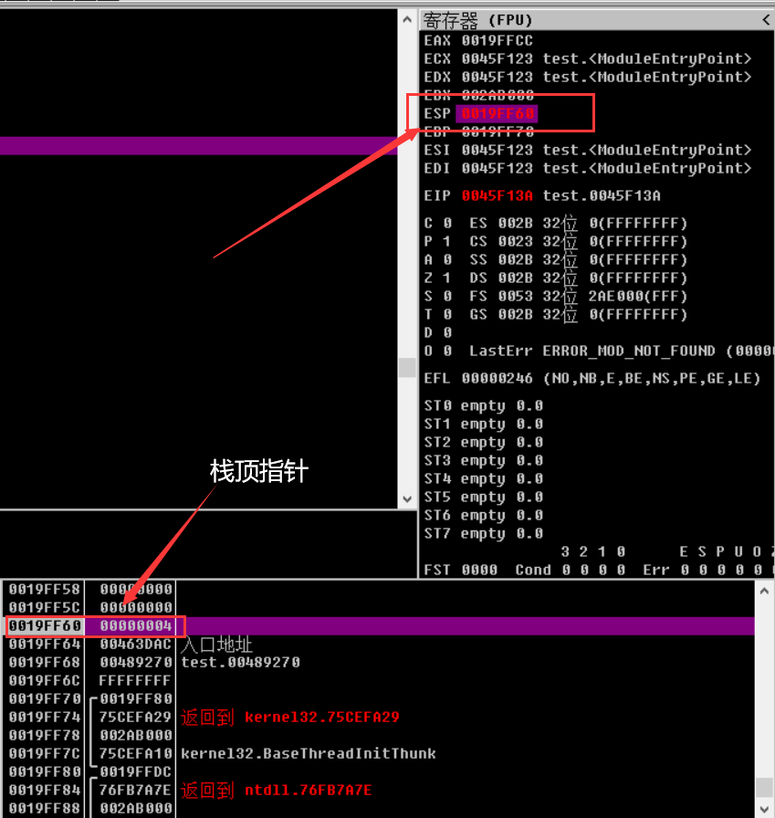	


### 堆栈平衡

如果返回父程序, 当我们在堆栈中进行操作时,要保证在执行ret这条指令前esp所指向的地址是不变的

如果通过堆栈传递参数从而导致的esp变化,在函数执行完毕后要恢复成原先esp的值

要实现堆栈平衡有两种方式, 分别是内平栈和外平栈


### 外平栈

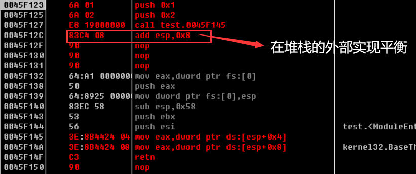	

如上图所示，首先通过push压栈传递了两个参数, 分别是立即数1和立即数2, 因为堆栈压入两个栈, 那么栈顶ESP所指向的值自然也是立即数2

随后执行call指令调用了地址为004F145的函数, 此时堆栈会将call指令地址的下一行地址(即004F12C)压入堆栈, 那么栈顶ESP指向的值变成了004F12C

由于向堆栈传递了参数从而导致了ESP的变化, 那么后面需要恢复成原先的ESP, 在函数内部执行retn指令后会将执行pop EIP(即将ESP指向的值传递给EIP, 然后将ESP+4), 随后在函数外部再通过add指令将ESP+8来恢复到原先的ESP, 以此实现堆栈的外部平衡

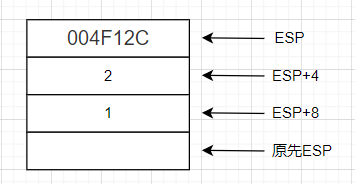	


### 内平栈

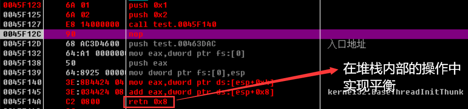	

与外平栈不同的是, 内平栈是在函数内部来实现堆栈平衡, 如上图所示, 通过执行`retn 0x8`指令来恢复至原先ESP, 此条命令相当于`pop EIP`加`add esp,8`


### 通过ebp寻址

上述我们讲到的内平栈和外平栈用到的都是ESP寻址, 但是缺点是esp会随着堆栈的一些操作而发生变化, 因此可以使用ebp寻址的方法去弥补这种缺点

如下图所示, 是通过ebp寻址的一种方法, 下面我会详细描述ebp寻址的流程

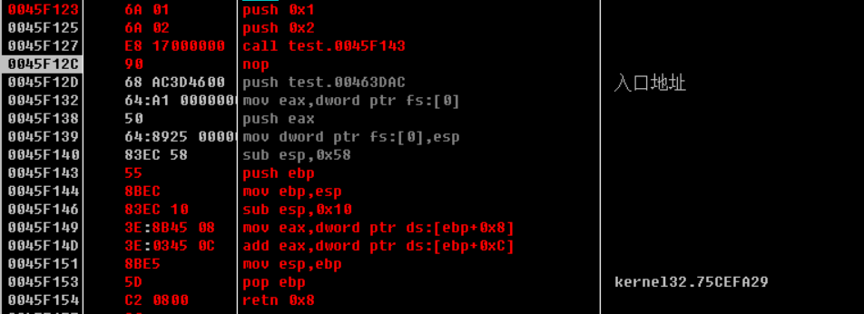	


在函数内部, 首先push ebp向堆栈压入个ebp, 然后让ebp=esp, 此时EBP和ESP都指向同一个值, 这个值是原先EBP的值

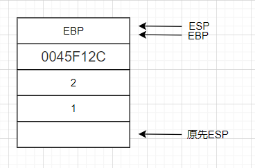	


执行`sub esp,0x10`指令来扩大堆栈的存储空间, 可以通过[ebp+?]来表示堆栈的参数, 例如立即数2即可用[EBP+8]来表示

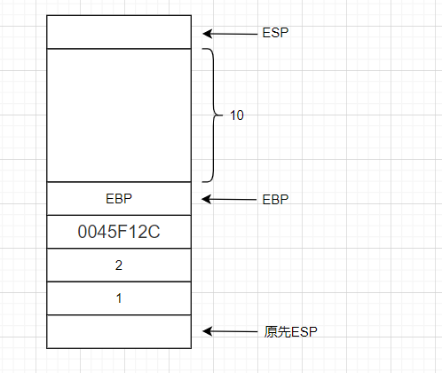		


函数操作结束后执行`mov esp,ebp`指令让esp=ebp, 此时esp和ebp再次指向一个同一个值

最后, 执行`pop ebp`和`retn 0x8`指令来恢复原先ESP, 以此实现堆栈平衡

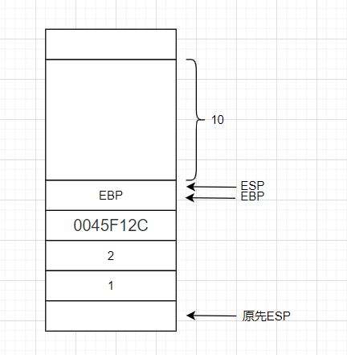	


## 标志寄存器

### 什么是标志寄存器

标志寄存器是一个特殊的寄存器，用于存储当前状态（特别是在执行算术和逻辑运算时）。标志寄存器通常包括一些标志位，用于指示运算的结果，例如溢出（OVERFLOW）、等于零（ZERO）、小于零（NEGATIVE）等。程序执行完一个运算后，标志寄存器会更新相应的标志位，以指示运算结果。程序可以根据标志寄存器中的标志位执行不同的操作，从而达到条件判断的效果

如下表格是常见的标志寄存器：

| 标志寄存器 | 描述                                                         |
| ---------- | ------------------------------------------------------------ |
| CF         | 用于判断无符号整数运算是否溢出。如果算术操作导致最高有效位产生进位，则置1，否则为0。 |
| OF         | 用于判断有符号整数运算是否溢出。如果溢出，则置1，否则为0。   |
| PF         | 如果运算结果的最低有效字节包含偶数个1位，则置1，否则为0。    |
| AF         | 如果第3位产生了进位，则置1，否则为0。                        |
| ZF         | 如果运算结果为0，则置1，否则为0。                            |
| SF         | 记录有符号整数的最高有效位。0表示正数，1表示负数。           |
| DF         | 用于控制串指令（例如MOVS、CMPS、SCAS、LODS和STOS）。如果置为0，则串指令自动递增；如果置为1，则串指令自动递减。 |


### 使用实例

**1.通过判断ZF是否为1来确定两个值是否相等**

使用`sub`指令有一个弊端, 即会修改eax的值

```assembly
mov eax,100
mov ecx,100
sub eax,ecx  
```

`cmp`和`sub`指令相似,但是不会修改eax的值

```assembly
mov eax,100
mov ecx,100
cmp eax,ecx  
```


**2.通过判断ZF是否为1来确定值是否为0**

如下所示给eax赋值0, 然后通过`AND`指令让eax与自己进行与运算, 执行结果为0, 则ZF位为1

但这种方式有一个弊端，与运算后的执行结果会返回给eax，也就是说会修改eax的值

```assembly
mov eax,0
AND EAX,EAX
```


TEST与AND指令不同的是，执行结果不会返回给eax

```assembly
mov eax,0         
TEST EAX,EAX   
```


## OD中不同的断点

### INT3断点

INT3断点也被称为CC断点, 它在程序的代码流中设置了`INT 3`指令，当执行到该指令时，CPU会中断执行并传递给调试器。调试器可以捕获这个中断，并对程序进行调试, 此类断点有一个弊端, 容易被软件内的程序检测到, 从而失效

在Ollydbg调试中可直接按F2进行设置

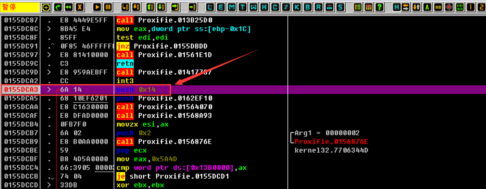	


### 硬件断点

硬件断点是在硬件层次上实现的断点。它通过在处理器的debug registers（DR0` 到 `DR7）上设置断点，从而捕获程序的某个特定点的执行

硬件断点通常比软件断点更快, 不会被程序代码覆盖, 且不容易被检测到, 由于需要使用处理器的特殊功能，硬件断点的数量通常有限，因此不能随意使用


### 内存断点

内存断点是在调试过程中用于监控内存数据的一种断点，也称作内存观察断点, 且不容易被检测到

内存断点可以被设置在内存访问断点或内存写入断点上，其工作原理是通过将所设地址的访问或写入权限设置为不可访问/不可写，当试图访问或写入该地址时，就会产生异常，OllyDbg软件可以捕获此异常，并通过比较异常地址是否与断点地址相同来判断是否到达了断点，如果是，则软件会停止执行

由于每次出现异常Ollydbg都要判断是否是断点, 这影响到了OD的工作效率, 因此在OD中内存断点只能设置一个


### 消息断点

消息断点是OllyDbg中的一种断点，它主要用于调试Windows程序的消息循环。消息断点通过在程序处理消息时产生中断来实现。例如，可以设置在窗口创建时或在处理WM_PAINT消息时产生中断，从而调试窗口的绘制过程

> Windows程序的消息循环是指窗口程序运行的核心部分。它负责处理程序所有的输入消息，例如鼠标点击和键盘输入，以及窗口重绘和其他系统消息。消息循环在程序启动时开始，并不断运行，直到程序退出。消息循环通过不断调用GetMessage函数获取消息，并通过DispatchMessage函数将消息发送到程序的消息处理程序中

消息断点与INT3断点不同的是, INT3断点可以在程序启动之前设置, 而消息断点只能在窗口创建后设置


### 条件断点

条件断点是一种特殊的断点，它允许用户设置断点在特定条件下才被触发。例如，如果一个寄存器的值等于某个特定值，或者一个内存地址的值等于另一个特定值，断点就会被触发。在调试中，这种断点可以用来在特定条件下停止程序并对代码进行分析，以找出问题

在OllyDBG中可通过按快捷键`shift+F2`来设置条件断点

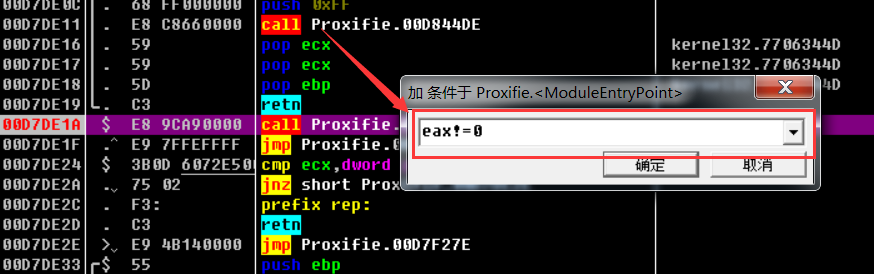	


## OD内存窗口的指令

单字节查看内存的数据

```assembly
db 0019FF74  
```

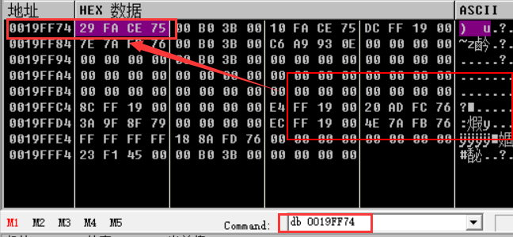	


双字节查看内存的数据

```assembly
dw 0019FF74  
```

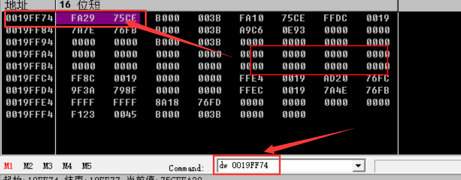	


四字节查看内存的数据

```assembly
dd 0019FF74  
```

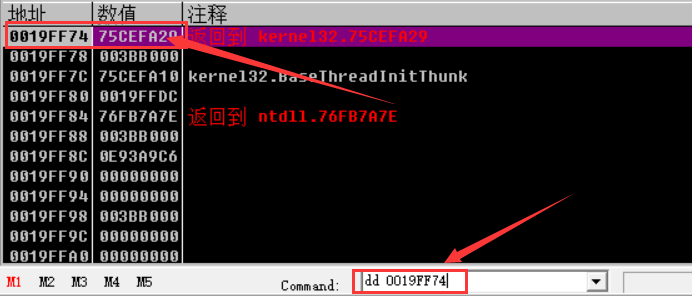	


## 调用约定

### 什么是调用约定

调用约定是指在程序中定义函数时，所采用的一种规则，用于规定函数参数的传递方式、堆栈的管理方式、返回值的传递方式等等。在不同的编译器和操作系统中，可能会采用不同的调用约定。常见的调用约定包括`__cdecl`、`__stdcall`、`__fastcall`等等。选择合适的调用约定可以提高程序的执行效率和兼容性


### 常见的调用约定

| 调用约定     | 描述                                                         |
| ------------ | ------------------------------------------------------------ |
| `__cdecll`   | `__cdecl`是默认的调用约定，在这种约定下，调用者负责清理堆栈。函数参数从右到左依次压入堆栈，由调用者按照从右到左的顺序依次清理。因为调用者负责清理堆栈，所以函数的参数个数是可变的。 |
| `__stdcall`  | `__stdcall`是一种常用的调用约定，在这种约定下，被调用者负责清理堆栈。函数参数从右到左依次压入堆栈，由被调用者按照从右到左的顺序依次清理。返回值通常存储在 EAX 中。 |
| `__fastcall` | `__fastcall`是一种使用寄存器来传递函数参数的调用约定。函数前两个参数使用 ECX 和 EDX 寄存器传递，其余参数从右到左依次压入堆栈。函数自己负责清理堆栈，返回值通常存储在 EAX 中。 |
| `naked`      | `naked`是一种不常用的调用约定，它允许程序员使用汇编代码实现函数的主体部分，并且不会为函数生成初始化和清理代码。函数的返回值需要使用汇编代码实现，而不是使用 `return` 语句。 |
| `__pascal`   | `__pascal`是一种过时的调用约定，它是 Pascal 语言使用的约定，被称为 "pascal" 约定。参数从右到左依次压入堆栈，函数自己负责清理堆栈，返回值通常存储在 EAX 中。在编写 VC 程序时，建议使用 `__stdcall` 代替。 |
| `__thiscall` | `__thiscall`是一种用于 C++ 类成员函数的调用约定，它将 `this` 指针作为一个隐藏参数传递。如果函数的参数个数确定，`this` 指针将传递到 `ECX` 寄存器中，函数自己负责清理堆栈；如果函数的参数个数不确定，`this` 指针将在所有参数被压入堆栈后压入堆栈，由调用者负责清理堆栈。 |


关于“调用者负责清理堆栈”和“被调用者负责清理堆栈”这两句话的理解：

- 对于调用约定中的“调用者负责清理堆栈”，意味着在函数调用结束后，函数调用者负责将调用时压入栈中的参数弹出。这意味着，被调用函数不会在返回时对堆栈进行修改，因为这会影响到调用者的堆栈

- 而“被调用者负责清理堆栈”则是指被调用的函数在返回时负责将调用时压入栈中的参数弹出，这意味着，调用者不需要自己来弹出参数。


# 常用汇编指令

## 算数指令

### ADD

将ecx与eax相加后返回给eax

```assembly
ADD eax,ecx 
```


### SUB

eax减去ecx后返回给eax

```assembly
SUB eax,ecx 
```


### inc

inc指令可以对寄存器和内存操作数执行加1操作

```assembly
mov eax,1
inc eax  #将eax寄存器中的值加上1,eax的值为2
```

```assembly
inc dword ptr [ebx]  #将ebx指向的双字内存中的值加上1
```


### dec

与inc指令相似, 不过dec指令是对寄存器和内存操作数执行减1操作


### idiv

idiv指令用于有符号整数除法的指令(i表示有符号), 它将被除数存储在eax里, 并将运算后的结果返回给eax

```assembly
mov eax,4 ;被除数
mov ebx,2 ;除数
cdq ;将被除数扩展成 64 位有符号数,因为 idiv 指令只能对 64 位有符号数进行除法运算,如果不扩展到 EDX 中，那么被除数只有 32 位，无法进行正确的除法运算
idiv ebx ;执行后eax的值为2
```


### imul

imul指令用于有符号整数乘法的指令(i表示有符号), 它将被乘数存储在eax里, 并将运算后的结果返回给eax

```assembly
mov eax,5;被乘数
mov ebx,3;乘数
imul ebx ;运行后eax的值为15
```


### AND

将eax与ecx进行与运算后返回给eax

```assembly
AND eax,ecx 
```


### OR

将eax与ecx进行或运算后返回给eax

```assembly
OR eax,ecx 
```


### XOR

将eax与ecx进行异或运算后返回给eax

```assembly
XOR eax,ecx
```


### NOT

将eax与ecx进行非运算后返回给eax

```assembly
NOT eax,ecx 
```


## 数据传输指令

### MOV

`MOV` 指令是将一个源数据移动到一个目的数据位置。它是一条单纯的数据传送指令，不执行任何其他操作


**如下为`MOV`指令常用操作:**

1.立即数到内存

```assembly
mov byte ptr ds:[内存编号],1
```


2.立即数到寄存器

```assembly
mov eax,1
```


3.寄存器到寄存器(需要相同位数)

```assembly
mov eax,ecx  #将ecx的值存到eax里
```


4.寄存器存到内存,又称"向内存中写入数据"

```assembly
mov dword ptr ds:[内存地址],eax 
```

```assembly
mov byte ptr ds:[内存地址],al 
```

```assembly
mov byte ptr ds:[ecx],0x12345678  
```


5.内存存到寄存器中,又称"读取内存数据"

```assembly
mov eax,dword ptr ds:[内存地址] 
```

```assembly
mov eax,dword ptr ds:[ecx] 
```


### MOVS

`MOVS` 指令也是将一个源数据移动到一个目的数据位置，但是它是一条字符串操作指令，可以连续地将多个数据从一个地址移动到另一个地址。它会自动递增源和目的地址的指针，以支持字符串的处理

**MOVS和MOV的区别**: `MOV` 指令是一条单纯的数据传送指令，而 `MOVS` 指令是一条字符串操作指令，支持字符串的处理


MOVS指令只能将内存的数据移动到另一个内存中, 且编写格式只能如下所示:

```assembly
movs byte ptr es:[edi],byte ptr ds:[esi] #可简写成MOVSB 
```

```assembly
movs word ptr es:[edi],word ptr ds:[esi] #可简写成MOVSW 
```

```assembly
movs dword ptr es:[edi],dword ptr ds:[esi] #可简写成MOVSD 
```


每次执行movs命令后,edi和esi的值都会发生变化,变化取决于DF位的值,若D为的值为0,那么执行movsb命令后就会加1,执行movd命令后就会加4;D位的值为1时则会减去

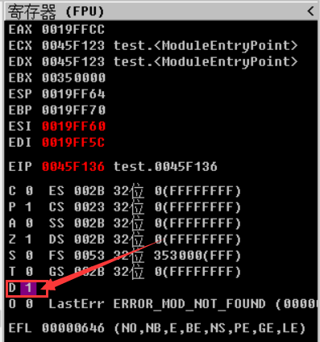	


### STOS

`STOS` 指令是一种 x86 指令，它通过使用内存操作将存储在 EAX 中的值复制到 ES:(E)DI 指向的内存单元中, 并且增加DI的值。 `STOS` 指令通常用于字符串操作和数据初始化


将AI/AX/EAX的值存储到[EDI]指定的存储单元中

```assembly
stos byte ptr es:[edi] #简写成stosb
```

```assembly
stos word ptr es:[edi] #简写成stosw
```

```assembly
stos dword ptr es:[edi] #简写成stosd
```


### LEA

lea指令的作用是将源操作数的地址加载到目的操作数中。

**Lea指令与mov指令的区别：**

lea指令对于寄存器来说：第二个操作数是寄存器必须要加[],不然报错,这里lea就是取寄存器的值, 如下所示:

```assembly
mov eax,2
lea ebx,[eax];执行后ebx=2
mov ebx,eax;等同于上句
```

lea指令对于变量来说：加不加[]都是一样的效果,都是取变量的地址,相当于指针, 如下所示:

```assembly
num dword 2
lea ebx,num   ;ebx为num的地址,
lea eax,[num] ;eax为num的地址,此时eax==ebx
```


mov指令对于变量来说,有没有[]是无所谓的，其结果都是取值

```assembly
num dword 2
mov eax,2
mov ebx,num
mov ecx,[num] ;执行完ebx==ecx==2
```

mov指令对于寄存器来说, 有[]表示取寄存器所指向的地址的值, 没[]表示取值

```assembly
mov eax,2
mov ebx,eax ;ebx==2
mov ecx,[eax]  ;因为eax中的值为2,所以会读取地址2开始处的四个字节,并将这4个字节中的值存储在ecx中,由于该地址处未定义任何值，所以该操作的结果是不确定的
```


### XCHG

xchg指令用于交换寄存器与寄存器、内存与寄存器、以及内存与内存之间的值

```assembly
mov eax，1
mov ebx，2
xchg eax，ebx #eax与ebx的值互换,此时eax=2,ebx=1
```


## 栈操作指令

### PUSH

PUSH指令用于向栈顶压入数据, 它会把操作数压入栈顶，并且让栈顶指针(SP)向下移动相应的数据大小（如：操作数为32位整数，则SP向下移动4个字节）


将立即数3压栈到栈顶指针处,随后栈顶指针减4

```assembly
push 3 
```


将内存数据压栈到栈顶指针处

```assembly
push ptr ds:[内存地址]
```


### POP

POP指令的作用是从栈顶弹出一个数据，并将其存储在指定的寄存器或内存位置中。


将堆栈中栈顶指针所指向的值出栈给eax寄存器,随后栈顶指针加4

```assembly
pop eax 
```


将堆栈中栈顶指针所指向的值出栈给内存, 随后栈顶指针加4

```assembly
pop ptr ds:[内存地址] 
```


## 控制指令

### REP

rep指令按计数寄存器(ECX)中指定的次数重复执行汇编指令,执行完后ecx的值归0

REP前缀可以和某些字符串指令（例如MOVS，STOS，CMPS等）配合使用，以实现多次执行相同的操作，减少代码的冗长度

```assembly
mov ecx,10  #设置ecx为十六进制的10,即执行次数为16次
rep movsd
```


### CALL

修改EIP寄存器的值,并且push下一行地址(即将下一行的值赋给esp)

```assembly
call 立即数/内存/寄存器  
```


### RET

retn指令用于从子程序中返回到调用它的程序, 它将栈指针移回到调用前的位置

retn指令可以包含一个可选参数，用于指定从堆栈中弹出的字节数，以便正确恢复堆栈的状态。如果省略了这个参数，retn指令将默认从堆栈中弹出4个字节

```assembly
retn ;相当于pop eip加add esp,4
```

```assembly
retn 0x8 ;相当于pop eip加add esp,8
```


## 转移指令

### JMP

JMP指令会修改EIP寄存器的值,EIP寄存器的值表示cpu下一次要执行的地址, 也可以理解成跳到指定地址

```assembly
jmp 立即数/内存/寄存器  
```


### JCC指令

JCC指令是"jump conditional code"的缩写，是一类条件转移指令，它在特定条件下跳转到指定的地址

JCC指令需要根据标志位的值判断是否执行跳转操作，因此它是汇编程序员编写程序的常用指令之一

| jcc指令                                                      | 描述                                                       | 检查符号位   | 对应的C语言                    |
| ------------------------------------------------------------ | ---------------------------------------------------------- | ------------ | ------------------------------ |
| `JZ`(jump if zero)<br />`JE`(jump if equal)                  | 结果为0或结果相等则跳转                                    | ZF=1         | if (i == 0);<br />if (i == j); |
| `JNZ`(jump if not zero)<br />`JNE`(jump if equal)            | 结果不等于0或结果不相等则跳转                              | ZF=0         | if (i != 0);<br />if (i != j); |
| `JS`(jump if sign)                                           | 结果为负则跳转                                             | SF=1         | if (i < 0);                    |
| `JNS`(jump if not sign)                                      | 结果为正则跳转                                             | SF=0         | if (i > 0);                    |
| `JP`(jump if Parity)<br />`JPE`(jump if Parity Even)         | 若1出现次数为偶数则跳转                                    | PF=1         | 无                             |
| `JNP`(jump if not Parity)<br />`JPO`(jump if Parity Odd)     | 若1出现次数为奇数则跳转                                    | PF=0         | 无                             |
| `JO`(jump if overflow)                                       | 溢出则跳转                                                 | OF=1         | 无                             |
| `JNO`(jump if not overflow)                                  | 无溢出则跳转                                               | OF=0         | 无                             |
| `JC`(jump if carry)<br />`JB`(jump if below)<br />`JNAE`(jump if not above equal) | 若进位则跳转;<br />若低于则跳转;<br />若不高于等于则跳转   | CF=1         | if (i < j);                    |
| `JBE`(jump if below equal)<br />`JNA`(jump if not above)     | 若低于等于则跳转;<br />若不高于则跳转;                     | ZF=1或CF=1   | if (i <= j);                   |
| `JA`(jump if above)<br />`JNBE`(jump if not below equal)     | 若高于则跳转;<br />若不低于等于则跳转                      | ZF=0而且CF=0 | if(i>j);                       |
| `JNC`(jump if not carry)<br />`JNB`(jump if not below)<br />`JAE`(jump if above equal) | 若不进位则跳转;<br />若不低于则跳转;<br />若高于等于则跳转 | CF=0         | if (i >= j);                   |


